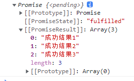
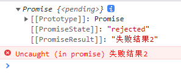
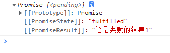
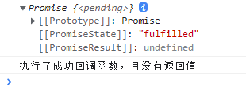
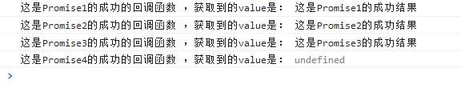

# promise学习笔记


## 简介

- promise对象是ES6（ECMAscript 6 ）引入的用于**异步编程**的**新**解决方案
  - **旧**方法单纯使用回调函数
  - **新**方法使用promise
- 从语法上来说就是一个构造函数，用来封装异步的任务，并能对结果进行处理
- promise在app、web中应用广泛；
- 前端和后端都会用到；
- 也是面试高频题目，进大厂需要掌握其内部原理
- Promise支持链式操作，能够解决**回调地狱问题**
- promise指定回调函数非常灵活，
  - 旧方法必须在启动异步任务前指定回调函数`setTimeout(()=>{},2000)`
  - promise方法可以在启动异步任务后指定回调函数

------------------------------------------------------------------------------------------------------------

**常见异步操作**

- 定时器

    ```js
    //旧方法
    setTimeout(()=>{},2000)
    ```

- ajax

    ```js
    //旧方法
    $.get("./path/to/file",(data)=>{})
    ```

- 数据库操作
- fs文件操作

    ```js
    require("fs").readFile("./file",(error,data)=>{})
    ```

------------------------------------------------------------------------------------------------------------

**回调地狱问题**

- **旧**方法单纯使用回调函数，需反复嵌套，不支持链式操作
- 不利于阅读
- 不便于错误处理

```js
functionA(args,(err,data)=>{
    functionB(args,(err,data)=>{
        functionC(args,(err,data)=>{
            functionE(args,(err,data)=>{
                functionF(args,(err,data)=>{
                })
            })
        })
    })
})

```

------------------------------------------------------------------------------------------------------------

**箭头函数**

- `()=>{}`
- ES6标准
- 箭头函数中形参若只有一个则可以省略小括号
- 箭头函数中的`this`始终指向该函数的创建环境，而不是其调用者
- 箭头函数不能定义构造函数
- 箭头函数显式定义需要变量关键字`var`、`let`、`const`，由于变量提升的特性，所以必须先定义声明再调用该函数

------------------------------------------------------------------------------------------------------------

**关于let**

- `let`命令是ES6 新增的，用来声明变量。
- `let`声明的变量只在局部作用域内有效，可用在`for`循环中
- 不存在变量提升，必须先声明后使用，否则报错

## promise的状态

- promise状态是promise实例对象中的一个属性
- 属性名为PromiseState
- 该属性是一个内置属性，不能直接对其进行操作
- 属性值有三种状态
  - pending 未定义的初始状态
  - resolved、fullfilled 成功的状态
  - rejected 失败的状态
- 属性的三种状态只有两种变化过程
  - pending -> resolved
  - pending -> rejected
  - 不能由失败、成功变为未定义状态
  - 不能由失败变成功，也不能由成功变失败
- 属性的状态只能改变一次

## promise的结果

- promise结果是promise实例对象中的一个属性
- 属性名为`PromiseResult`
- 该属性是一个内置属性，不能直接对其进行操作
- 只有函数`resolve(valure)`、`reject(reason)` 能对其值进行修改
- 属性值有三种状态

## 基本使用

- `new Promise((resolve,reject)=>{})`构造函数的第一个形参是一个函数，该函数又接收了两个参数resolve和reject，这两个参数也是函数
- `resolve()`调用完毕后会将promise对象状态设置为**成功**
- `reject()`调用完毕后会将promise对象状态设置为**失败**
- `promiseObj.then()`函数有两个形式参数，都是函数，
  - 当promise对象状态为成功时执行第一个回调函数，为失败时执行第二个回调函数
  - 第一个函数其形参value为resolve传递过来的参数
  - 第二个函数其形参reason为reject传递过来的参数

**新旧两种解决方案的对比**

<div id="demo23r023jfr02">
    <button>点击抽奖</button>
    <p></p>
</div>
<script>
    var btn = document.querySelector("#demo23r023jfr02>button")
    var p = document.querySelector("#demo23r023jfr02>p")
    btn.addEventListener("click",function(){
        setTimeout(function(){//模拟服务端延迟
                var r = Math.round(Math.random()*100); //获取0-100随机数
                if(r<30)// r落在0~30区间的概率为30%if(accurate(30))
                    p.innerHTML+="恭喜中奖"
                else
                    p.innerHTML+="再接再厉"
        },1000)
    })
</script>

```html
<div id="demo23r023jfr02">
    <button>点击抽奖</button>
    <p></p>
</div>
<script>
    var btn = document.querySelector("#demo23r023jfr02>button")
    var p = document.querySelector("#demo23r023jfr02>p")
    btn.addEventListener("click",function(){
        setTimeout(function(){//模拟服务端延迟
                var r = Math.round(Math.random()*100); //获取0-100随机数 
                if(r<30)// r落在0~30区间的概率为30%if(accurate(30))
                    p.innerHTML+="恭喜中奖"
                else
                    p.innerHTML+="再接再厉"
        },1000)
    })
</script>
```

<div id="demo12312312qq">
    <button>点击抽奖</button>
    <p></p>
</div>
<script>
    var btnn = document.querySelector("#demo12312312qq>button");
    var pp = document.querySelector("#demo12312312qq>p");
    btnn.addEventListener("click",function(){
        //Promise构造函数的第一个形参是一个函数，该函数又接收了两个参数resolve和reject，这两个参数也是函数
        const promise = new Promise((resolve,reject)=>{
            setTimeout(()=>{
                var r = Math.round(Math.random()*100); //获取0-100随机数
                if(r<30){ // r落在0~30区间的概率为30%
                    resolve(r) //调用完毕后会将promise对象状态设置为**成功**
                }else{
                    reject(r) //调用完毕后会将promise对象状态设置为**失败**
                }
            },1000);
        })
        //then函数有两个形式参数，都是函数，
        //当promise对象状态为成功时执行第一个回调函数，为失败时执行第二个回调函数
        //第一个函数其形参value为resolve传递过来的参数
        //第二个函数其形参reason为reject传递过来的参数
        promise.then((value)=>{
            pp.innerHTML+="恭喜中奖"+value
        },(reason)=>{
            pp.innerHTML+="再接再厉"+reason
        });
    });
</script>

```html
<div id="demo12312312qq">
    <button>点击抽奖</button>
    <p></p>
</div>
<script>
    var btnn = document.querySelector("#demo12312312qq>button");
    var pp = document.querySelector("#demo12312312qq>p");
    btnn.addEventListener("click",function(){
        //Promise构造函数的第一个形参是一个函数，该函数又接收了两个参数resolve和reject，这两个参数也是函数
        const promise = new Promise((resolve,reject)=>{
            setTimeout(()=>{
                var r = Math.round(Math.random()*100); //获取0-100随机数 
                if(r<30){ // r落在0~30区间的概率为30%
                    resolve(r) //调用完毕后会将promise对象状态设置为**成功**
                }else{
                    reject(r) //调用完毕后会将promise对象状态设置为**失败**
                }
            },1000);
        })
        //then函数有两个形式参数，都是函数，
        //当promise对象状态为成功时执行第一个回调函数，为失败时执行第二个回调函数
        //第一个函数其形参value为resolve传递过来的参数
        //第二个函数其形参reason为reject传递过来的参数
        promise.then((value)=>{
            pp.innerHTML+="恭喜中奖"+value
        },(reason)=>{
            pp.innerHTML+="再接再厉"+reason
        });
    });
</script>
```

## 用promise封装fs

**promise封装前**

```js
const fs = require("fs");
fs.readFile("./path/to/fileName",(err,data)=>{
    if(err) throw err;//异常处理
    console.log(data.toString());//数据处理
})
```

**promise封装后**

```js
const fs = require("fs");

const p = new Promise((resolve,reject)={
    fs.readFile("./path/to/fileName",(err,data)=>{
        if(err)
            reject(err);
        else
            resolve(data)
    })
})

// 使用
p.then(value=>{// 形式参数只有一个，箭头函数的括号可省略
    console.log(value.toString();//数据处理
},reason=>{
    throw reason;//异常处理
})
```

**手动用promise将fs封装为一个函数**

```js

function myreadFile(path){
    return new Promise((resolve,reject)={
        require("fs").readFile(path,(err,data)=>{
            if(err)
                reject(err);
            else
                resolve(data)
        })
    })
}

// 使用
myreadFile("./path/to/file")
.then(value=>{
    console.log(value.toString());
},reason=>{
    console.log(reason);
})
```

**通过util.promisify获取已经使用promise封装好的fs函数**

```js
const util = require("util")
const fs = require("fs")

function myreadFile = util.promisify(fs.readFile)

// 使用
myreadFile("./path/to/file")
.then(value=>{
    console.log(value.toString());
},reason=>{
    console.log(reason);
})
```

## 用promise封装ajax

**promise封装前**

<div id="demofjwif02">
    <button>获取</button>
    <p></p>
</div>
<script>
    $("#demofjwif02>button").click(function(){
        //创建对象
        const xhr = new XMLHttpRequest();
        // 初始化
        xhr.open("GET","https://api.apiopen.top/api/sentences")
        // 发送
        xhr.send();
        // 处理响应结果
        xhr.onreadystatechange = function(){
            if(xhr.readyState===4){
                // 判断响应状态码
                if(xhr.status>=200&&xhr.status<300){
                    $("#demofjwif02>p").text(xhr.response)
                }else{
                    $("#demofjwif02>p").text(xhr.status)
                }
            }
        }
    })
</script>

```js
<div id="demofjwif02">
    <button>获取</button>
    <p></p>
</div>
<script>
    $("#demofjwif02>button").click(function(){
        //创建对象
        const xhr = new XMLHttpRequest();
        // 初始化
        xhr.open("GET","https://api.apiopen.top/api/sentences")
        // 发送
        xhr.send();
        // 处理响应结果
        xhr.onreadystatechange = function(){
            if(xhr.readyState===4){
                // 判断响应状态码
                if(xhr.status>=200&&xhr.status<300){
                    $("#demofjwif02>p").text(xhr.response)
                }else{
                    $("#demofjwif02>p").text(xhr.status)
                }
            }
        }
    })
</script>

```

**promise封装后**

<div id="demofjwif021231">
    <button>获取</button>
    <p></p>
</div>
<script>
    $("#demofjwif021231>button").click(function(){
        const promise = new Promise((resolve,reject)=>{
            //创建对象
            const xhr = new XMLHttpRequest();
            // 初始化
            xhr.open("GET", "https://api.apiopen.top/api/sentences")
            // 发送
            xhr.send();
            // 处理响应结果
            xhr.onreadystatechange = function () {
                if (xhr.readyState === 4) {
                    // 判断响应状态码
                    if (xhr.status >= 200 && xhr.status < 300) {
                        resolve(xhr.response)
                    } else {
                        reject(xhr.status)
                    }
                }
            }
        })
        promise.then(response=>{
            $("#demofjwif021231>p").text(response)
        },states=>{
            $("#demofjwif021231>p").text(states)
        })
    })
</script>

```js
<div id="demofjwif021231">
    <button>获取</button>
    <p></p>
</div>
<script>
    $("#demofjwif021231>button").click(function(){
        const promise = new Promise((resolve,reject)=>{
            //创建对象
            const xhr = new XMLHttpRequest();
            // 初始化
            xhr.open("GET", "https://api.apiopen.top/api/sentences")
            // 发送
            xhr.send();
            // 处理响应结果
            xhr.onreadystatechange = function () {
                if (xhr.readyState === 4) {
                    // 判断响应状态码
                    if (xhr.status >= 200 && xhr.status < 300) {
                        resolve(xhr.response)
                    } else {
                        reject(xhr.status)
                    }
                }
            }
        })
        promise.then(response=>{
            $("#demofjwif021231>p").text(response)
        },states=>{
            $("#demofjwif021231>p").text(states)
        })
    })
</script>
```

**用promise将ajex封装为一个函数**

```js
function sendAjax(url){
    return new Promise((resolve,reject)=>{
        //创建对象
        const xhr = new XMLHttpRequest();
        // 初始化
        xhr.open("GET", url)
        // 发送
        xhr.send();
        // 处理响应结果
        xhr.onreadystatechange = function () {
            if (xhr.readyState === 4) {
                // 判断响应状态码
                if (xhr.status >= 200 && xhr.status < 300) {
                    resolve(xhr.response)
                } else {
                    reject(xhr.status)
                }
            }
        }
    })
}

// 使用
sendAjax("https://api.apiopen.top/api/sentences")
.then(vaule=>{
    console.log(vaule)
},reason=>{
    console.warm(reason)
})
```

## APIs

**`new Promise(executor);`构造函数**

- 形参`executor`是一个函数， 称为**执行器**，写为`(resolve,reject)=>{}`
- 执行器的形参resolve，是一个函数，写在执行器函数中，执行器执行成功时调用
- 执行器的形参reject，是一个函数，写在执行器函数中，执行器执行失败时调用
- 执行器中的语句是随构造函数同步执行的

    ```js
    // 1111 2222 顺序输出
    let p = new Promise((rosolve,reject)=>{
        console.log("1111")
    })
    console.log("2222")
    ```

------------------------------------------------------------------------------------------------------------

**`Promise.prototype.then(onResolved,onRejected);`方法**

- onResolved 成功的回调函数 写为`(value)=>{}`
- onRejected 失败的回调函数 写为`(reason)=>{}`
- 返回值是一个新的Promise对象

------------------------------------------------------------------------------------------------------------

**`Promise.prototype.cache(onRejected);`方法**

- onRejected 失败的回调函数 写为`(reason)=>{}`
- 该函数内部由then()封装实现

------------------------------------------------------------------------------------------------------------

**`Promise.resolve(value);`方法**

- 该方法是Promise对象的内置方法，不是实例化后的对象的方法
- 该方法用来快速获取一个Promise实例对象，并且给其封装一个值和状态
- 该方法返回值是一个promise实例对象
- 当value值是一个非promise类型的对象时，返回的结果为成功的promise对象
- 当value值是一个promise类型的对象时，返回的promise对象的结果（result、成功与否）与传入的promise对象的结果一致

```js
var p = Promise.resolve(123)
console.log(p)//p是一个promise对象，其结果为成功，值为123

var k = Promise.resolve(new Promise((resolve,reject)=>{
    resolve("成功AAA")
}))

console.log(k) // k是一个promise对象，其结果为成功，值为“成功AAA”

var k = Promise.resolve(new Promise((resolve,reject)=>{
    reject("失败BBB")
}))

console.log(k) // k是一个promise对象，其结果为失败，值为“失败BBB”
//且由于k是一个失败的Promise对象，也没有处理失败的回调，所以会报错
//解决：
k.cach(reason=>{//对失败进行处理
    console.log(reason)
})
```

------------------------------------------------------------------------------------------------------------

**`Promise.reject(value);`方法**

- 和resolve基本一致，
- 但是该函数不论传入的promise对象的状态是成功还是失败，其返回的promise对象的状态是失败，值为传入的promise对象
- 也就是说该函数永远返回一个失败的promise，其值为传入的value值，无论传入的是否为一个Promise对象

```js
var j = new Promise((resolve,reject)=>{
    resolve("成功AAA")
})
var k = Promise.resolve(j)

console.log(k) // k是一个promise对象，其结果为失败，其值为j，也就是为传入的成功的promise对象
```

------------------------------------------------------------------------------------------------------------

**`Promise.all(promises);`方法**

- 基本同上；
- 用于返回一个Promise对象，状态由promises决定
- promises是一个数组，包含多个promise对象，
- 若promises中有一个promise对象为失败，则该函数返回的Promise对象的状态为失败，且该对象的结果为数组中的这个Promise对象本身
- 仅当promises都为成功时，该函数返回的Promise对象的状态为成功，且该对象的结果是由数组中每个Promise对象的结果组成的数组

```js
var p1 = new Promise((resolve,reject)=>{
    resolve("成功结果1")
})
var p2 = Promise.resolve("成功结果2")
var p3 = Promise.resolve("成功结果3")

var pk = Promise.all([p1,p2,p3]);
console.log(pk)
```

结果：  


```js
var p1 = new Promise((resolve,reject)=>{
    resolve("成功结果1")
})
var p2 = Promise.reject("失败结果2")
var p3 = Promise.resolve("成功结果3")

var pk = Promise.all([p1,p2,p3]);
console.log(pk)
```

结果：  


------------------------------------------------------------------------------------------------------------

**`Promise.race(promises);`方法**

- 返回的的是promises中第一个改变状态的promsie

```js
var p1 = new Promise((resolve, reject) => {
    setTimeout(() => {
        resolve("成功结果1")
    }, 1000);
})
var p2 = Promise.resolve("成功结果2")
var p3 = Promise.resolve("成功结果3")
var pk = Promise.race([p1, p2, p3]);
console.log(pk)
```

结果：  


## 关键问题

**修改对象的状态的三种方式**

- 在执行器函数中执行`resolve()` pending -> fulfilled/resolved
- 在执行器函数中执行`reject()` pending -> rejected
- 在执行器函数中抛出错误`throw "字符串或error实例对象";` pending -> rejected

```js
var p1 = new Promise((resolve, reject) => {
    resolve("成功结果1")
    reject("失败结果1")
    throw "失败结果2";
})
console.log(p1)
```


------------------------------------------------------------------------------------------------------------

**指定的多个回调都会执行**

```js
var p1 = new Promise((resolve, reject) => {
    resolve("这是成功的结果")
})
console.log(p1)
p1.then(value => {
    console.log("执行了成功回调函数1,result为：" + value)
})
p1.then(value => {
    console.log("执行了成功回调函数2,result为：" + value)
})
```


------------------------------------------------------------------------------------------------------------

**改变状态和指定回调的then()函数执行顺序的问题**

- 当改变状态的语句在执行器中被**同步**执行时，执行顺序是 改变状态 -> 指定回调函数 -> 执行回调函数
- 当改变状态的语句在执行器中被**异步**执行时，执行顺序是 指定回调函数 -> 改变状态 -> 执行回调函数

```js
var p1 = new Promise((resolve, reject) => {
    console.log("即将执行改变状态的函数resolve()");
    resolve("这是成功的结果")
    console.log("resolve() 执行完毕");
})

console.log("即将执行指定回调函数的函数then()");
p1.then(value => {
    console.log("执行了成功的回调函数，结果为:"+ value)
})
console.log("then() 执行完毕");
```


```js
var p1 = new Promise((resolve, reject) => {
    console.log("即将执行执行器中的代码");
    setTimeout(() => {
        console.log("即将执行改变状态的函数resolve()");
        resolve("这是成功的结果")
        console.log("resolve() 执行完毕");
    }, 1000);
    console.log("执行器中的代码执行完毕");
})
console.log("即将执行指定回调函数的函数then()");
p1.then(value => {
    console.log("执行了成功的回调函数，结果为:"+ value)
})
console.log("then() 执行完毕");
```


------------------------------------------------------------------------------------------------------------

**then()方法的返回值问题**

- 若回调函数抛出了异常，则then的返回值是一个promise对象，状态为失败，result为抛出的异常
- 若回调函数的返回值是非promise对象，则then的返回值是一个promise对象，状态为成功，result为该返回值
- 若回调函数的返回值是promise对象，则then的返回值是一个promise对象，状态为失败，result为该对象的result值
- 若回调函数没有返回值，则then的返回值是一个promise对象，状态为成功，result为undefined

```js
var p1 = new Promise((resolve, reject) => {
    resolve("这是成功的结果")
})
var k = p1.then(value => {
    throw "抛出异常"
})
console.log(k);
```


```js
var p1 = new Promise((resolve, reject) => {
    resolve("这是成功的结果")
})
var k = p1.then(value => {
    return 521;
})
console.log(k);
```


```js
var p1 = new Promise((resolve, reject) => {
    resolve("这是成功的结果1")
})
var k = p1.then(value => {
    return new Promise((resolve,reject)=>{
        resolve("这是成功的结果2")
    })
})
console.log(k);
```


```js
var p1 = new Promise((resolve, reject) => {
    resolve("这是成功的结果1")
})
var k = p1.then(value => {
    return new Promise((resolve,reject)=>{
        resolve("这是失败的结果1")
    })
})
console.log(k);
```



```js
var p1 = new Promise((resolve, reject) => {
    resolve("这是成功的结果1")
})
var k = p1.then(value => {
    console.log("执行了成功回调函数，且没有返回值")
})
console.log(k);
```



------------------------------------------------------------------------------------------------------------

**promise串联多个任务**

- 由于then()的返回值是一个promsie对象，所以可以通过then().then()的方式实现

```js
var p1 = new Promise((resolve, reject) => {
    resolve("这是Promise1的成功结果")
})
p1
.then(value => {
    console.log("这是Promise1的成功的回调函数 ，获取到的value是：", value)
    return new Promise((resolve, reject) => {
        resolve("这是Promise2的成功结果")
    })
}).then(value => {
    console.log("这是Promise2的成功的回调函数 ，获取到的value是：", value)
    return new Promise((resolve, reject) => {
        resolve("这是Promise3的成功结果")
    })
}).then(value => {
    console.log("这是Promise3的成功的回调函数 ，获取到的value是：", value)
}).then(value => {
    console.log("这是Promise4的成功的回调函数 ，获取到的value是：", value)
})
```



------------------------------------------------------------------------------------------------------------

**异常穿透现象(或者说功能)**

- 可以把异常处理的回调函数写在最后，能够对串联的所有回调函数中的异常进行处理

```js
var p1 = new Promise((resolve, reject) => {
    resolve("这是Promise1的成功结果")
})
p1
    .then(value => {
        console.log("这是Promise1的成功的回调函数 ，获取到的value是：", value)
        return new Promise((resolve, reject) => {
            resolve("这是Promise2的成功结果")
        })
    }).then(value => {
        console.log("这是Promise2的成功的回调函数 ，获取到的value是：", value)
        return new Promise((resolve, reject) => {
            // resolve("这是Promise3的成功结果")
            reject("这是Promise3的失败结果")
        })
    }).then(value => {
        console.log("这是Promise3的成功的回调函数 ，获取到的value是：", value)
    }).then(value => {
        console.log("这是Promise4的成功的回调函数 ，获取到的value是：", value)
    }).catch(reason => {
        console.warn("这是串联的所有回调函数的异常处理回调函数，获取到的reason为", reason)
    })
```


------------------------------------------------------------------------------------------------------------

**中断Promise的链式调用**

- 有且只有一种方式，那就是在回调函数中返回一个pending状态的promise实例对象
- 因为then(()=>{})函数中的回调函数无论返回什么都会被封装成一个promise函数，用来交给下一个then来进行处理，若返回的是pending状态的promise对象，那么后续then中的回调函数就不会被触发

```js
var p1 = new Promise((resolve, reject) => {
    console.log("1111111111111111111")
    resolve("这是Promise1的成功结果")
})
p1
    .then(value => {
        console.log("222222222222222222")
        return new Promise((resolve, reject) => {
            resolve("这是Promise2的成功结果")
        })
    }).then(value => {
        console.log("333333333333333333,中断链式调用，返回了一个pending状态的promise")
        return new Promise((resolve, reject) => {})
    }).then(value => {
        console.log("4444444444444444444444")
    }).then(value => {
        console.log("55555555555555555555555")
    }).catch(reason => {
        console.warn("err")
    })
```


## 手写实现promsie全部功能

## async 与 await

**async关键字**

- 经async关键字修饰后的函数的返回值是一个promsie对象
- 该promise对象的状态和结果由该函数的return值决定
  - 若该函数抛出错误已,则该函数返回一个状态为失败的promsie，且其结果为抛出的错误值
  - 若该函数return一个非promise对象,则该函数返回一个状态为成功的promsie，且其结果为return的值
  - 若该函数return一个promise对象
    - 若该对象状态为成功 则返回的promise状态也为成功，且结果为返回的promsie对象的结果
    - 若该对象状态为失败 则返回的promise状态也为失败，且结果为返回的promsie对象的结果
    - 若该对象状态为pending 则返回的promise状态也为pending，且结果为undefined

------------------------------------------------------------------------------------------------------------

**await关键字**

- `await`必须写在经`async`修饰后的函数中，但`async`修饰的函数中可以没有await
- 如果`await`获得的`promsie`**失败**，则**抛出异常**，需`try{}cach{}`捕获
- 如果`await`获得的`promise`**成功**，则返回该**promise成功的结果值**result
- 如果`await`获得的是**非promsie对象**，则返回的就是**该非promise对象**

------------------------------------------------------------------------------------------------------------

**async与await结合的执行顺序问题**

```js
async function main() {
    var promiseA = new Promise((resolve, reject) => {
        console.log("执行器执行");
        setTimeout(() => {
            console.log("执行器中的异步函数执行");
            resolve(123)
        }, 1000);
    })
    try {
        console.log("promiseA状态：");
        console.log(promiseA);
        console.log("await promiseA");
        var result = await promiseA;
        console.log("获取到promiseA的result:");
        console.log(result);
        console.log("执行return");
        return result;
    } catch (e) {
        return e;
    }
}
console.log("调用async修饰的函数");
let result = main()
console.log("调用async修饰的函数结束");
console.log("async修饰的函数结果为");
console.log(result);
```


------------------------------------------------------------------------------------------------------------

**async于await结合案例之文件操作**

回调函数方式文件操作，合并三个文件

```js
const fs = require("fs")
fs.readFile("./path/to/file1",(err,data1)=>{
    if(err) throw err;
    fs.readFile("./path/to/file2",(err,data2)=>{
        if(err) throw err;
        fs.readFile("./path/to/file3",(err,data3)=>{
            if(err) throw err;
            console.log(data1+data2+data3)
        })
    })
})

```

async于await结合方式合并三个文件

```js
const fs = require("fs")
const util = require("util")
const myReadFile = util.promisify(fs.readFile);

(async function{
    try{
      let data1 = await myReadFile("./path/to/file1")
      let data2 = await myReadFile("./path/to/file2")
      let data3 = await myReadFile("./path/to/file3")
      console.log(data1+data2+data3)
    }cache(e){
        console.log("文件打开失败")
    }
})();

```

------------------------------------------------------------------------------------------------------------

**async与await结合案例之发送AJAX**

需要用到之前写的用Promise封装好的sendAjax函数

```js
function sendAjax(url){
    return new Promise((resolve,reject)=>{
        //创建对象
        const xhr = new XMLHttpRequest();
        // 初始化
        xhr.open("GET", url)
        // 发送
        xhr.send();
        // 处理响应结果
        xhr.onreadystatechange = function () {
            if (xhr.readyState === 4) {
                // 判断响应状态码
                if (xhr.status >= 200 && xhr.status < 300) {
                    resolve(xhr.response)
                } else {
                    reject(xhr.status)
                }
            }
        }
    })
}

// 使用
sendAjax("https://api.apiopen.top/api/sentences")
.then(vaule=>{
    console.log(vaule)
},reason=>{
    console.warm(reason)
})
```

有了这个封装好的函数，再结合async与await，就可以实现下列操作

<script src="https://code.jquery.com/jquery-3.6.0.min.js"
    integrity="sha256-/xUj+3OJU5yExlq6GSYGSHk7tPXikynS7ogEvDej/m4=" crossorigin="anonymous"></script>
<div id="demofjwi123131f334">
    <button>获取</button>
    <p></p>
</div>
<script>
    $("#demofjwi123131f334>button").click(async function () {
        var result = await sendAjax("https://api.apiopen.top/api/sentences")
        $("#demofjwi123131f334>p").text(result)
    })
    function sendAjax(url) {
        return new Promise((resolve, reject) => {
            //创建对象
            const xhr = new XMLHttpRequest();
            // 初始化
            xhr.open("GET", url)
            // 发送
            xhr.send();
            // 处理响应结果
            xhr.onreadystatechange = function () {
                if (xhr.readyState === 4) {
                    // 判断响应状态码
                    if (xhr.status >= 200 && xhr.status < 300) {
                        resolve(xhr.response)
                    } else {
                        reject(xhr.status)
                    }
                }
            }
        })
    }
</script>

```js
<div id="demofjwi123131f334">
    <button>获取</button>
    <p></p>
</div>
<script>
    $("#demofjwi123131f334>button").click(async function () {  //async修饰
        var result = await sendAjax("https://api.apiopen.top/api/sentences") //await等待
        $("#demofjwi123131f334>p").text(result)
    })
</script>
```
