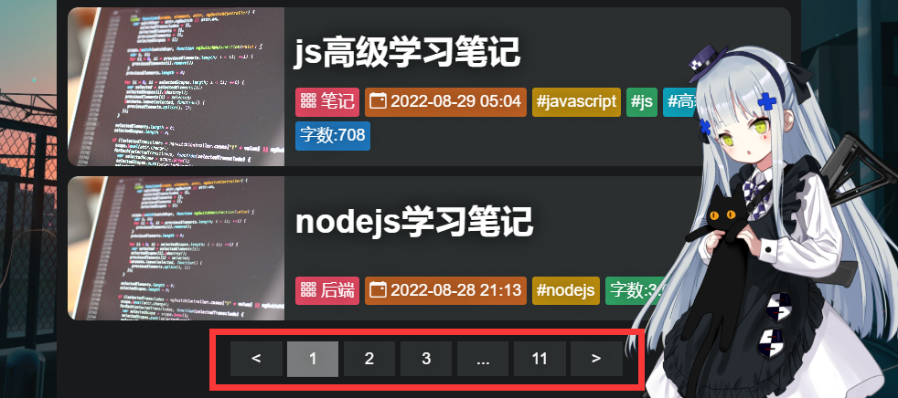
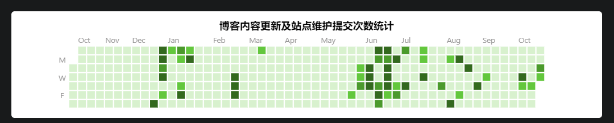

# vue3_blog项目笔记

## 目录

- [vue3\_blog项目笔记](#vue3_blog项目笔记)
  - [目录](#目录)
  - [导航条毛玻璃效果实现](#导航条毛玻璃效果实现)
  - [图片背景实现](#图片背景实现)
  - [封面文字动态输入效果实现](#封面文字动态输入效果实现)
  - [为数字添加单位函数实现](#为数字添加单位函数实现)
  - [分页器实现](#分页器实现)
  - [滚动事件切换类名animate改变封面高度](#滚动事件切换类名animate改变封面高度)
  - [文章页Markdown内容的渲染](#文章页markdown内容的渲染)
  - [filter实现文章页封面效果](#filter实现文章页封面效果)
  - [vue中hash路由与markdown中锚点链接冲突的解决及链接跳转的实现](#vue中hash路由与markdown中锚点链接冲突的解决及链接跳转的实现)
  - [markdown中script标签内代码不执行问题的解决](#markdown中script标签内代码不执行问题的解决)
  - [使markdown中script标签支持jQuery(`$`)语法](#使markdown中script标签支持jquery语法)
  - [使markdown支持渲染KaTex语法数学公式及复制KaTex源代码](#使markdown支持渲染katex语法数学公式及复制katex源代码)
  - [归档页github风格代码贡献统计效果的组件实现](#归档页github风格代码贡献统计效果的组件实现)
  - [将文章标题字符串计算HASH作为ID](#将文章标题字符串计算hash作为id)
  - [通过front-matter将markdown文章首部的yml格式信息获取](#通过front-matter将markdown文章首部的yml格式信息获取)
  - [在ECMAScript标准语法下获取`__filename`及`__dirname`](#在ecmascript标准语法下获取__filename及__dirname)
  - [文件枚举函数的实现和使用](#文件枚举函数的实现和使用)
  - [imagemin图像压缩](#imagemin图像压缩)
  - [通过axios请求拦截器为请求url地址params添加随机数防止浏览器缓存数据](#通过axios请求拦截器为请求url地址params添加随机数防止浏览器缓存数据)

## 导航条毛玻璃效果实现


```less
//contrast对比度
//saturate饱和度
//blur() 模糊(像素)
@backdrop_Filter:saturate(200%) contrast(80%) blur(20px);
.cssName{
    backdrop-filter: @backdrop_Filter;
    -webkit-backdrop-filter: @backdrop_Filter;
}
```

## 图片背景实现


```html
<template>
  
</template>
<script>
export default {
  name: 'BackGround'
}
</script>
<style lang="less" scoped>
.bg_img {
  z-index: -999;//放到最底层
  position: fixed;//相对浏览器窗口定位
  top: 0;
  left: 0;
  width: 100%;//宽为视口宽度的100%
  height: 100vh; //高度为100%视口宽度
  object-fit: cover;//内容以封面方式适应盒子宽高
  object-position: center top;//内容对齐方式，水平方向居中，垂直方向顶部对齐
}
</style>
```

## 封面文字动态输入效果实现


<span id="span" data-value="在绝望中坚持真理,在荒诞中奋起抵抗." ></span><span class="_">_</span>
<br>
<button id="btn">点击此处触发效果</button>
<style>
._{
    display: inline-block;
    margin-left: 5px;
    animation: dash_flash 0.7s ease infinite;
}
@keyframes dash_flash {
    /*定义动画*/
    from{opacity: 0;}
    to{opacity: 1;}
}

# btn{

    padding:5px;
    background-color:white;
    color:black;
}
</style>
<script>
let span = document.querySelector("#span")
let btn = document.querySelector("#btn")
btn.addEventListener('click',async ()=>{
    try{
        await autoTyping(span,'',span.dataset['value'],150)
        await waitMs(2000)
        await autoBackSpacing(span,span.dataset['value'],'',50)
    }catch(e){
        console.log(e);
    }
})
/****
    * @param {DOM元素} DomElement
    * @param {初始字符串} start_TextString
    * @param {目标字符串} ended_TextString
    * @param {字符写入速度} interval
    */
async function autoTyping(DomElement, start_TextString, ended_TextString, interval = 150) {
    return new Promise(async (TypingResolve, TypingReject) => {
        if (DomElement.in_use != true) {//节流阀:判断是否正在使用中
            DomElement.in_use = true;//节流阀:标记为正在使用中
            let index = 0;
            DomElement.innerText = start_TextString //初始化
            function WriteCharOnce() {
                return new Promise((WriteCharOnceResolve, reject) => {
                    setTimeout(() => {
                        if (index < ended_TextString.length) {
                            let char = ended_TextString[index++]
                            DomElement.innerText += (char == ' ') ? '\xa0' : char; //空格无法直接拼接,需要转移
                            WriteCharOnceResolve('isTyping')
                        } else {
                            DomElement.in_use = false;//节流阀:标记为使用完毕
                            WriteCharOnceResolve('done') //WriteCharOnce 的 done
                        }
                    }, interval);
                });
            }
            while (await WriteCharOnce() == 'isTyping');
            TypingResolve('done') //autoTyping 的 done
        } else {
            TypingReject('in_use');
        }
    });
}
/****
    * @param {DOM元素} DomElement
    * @param {初始字符串} start_TextString
    * @param {目标字符串} ended_TextString
    * @param {字符写入速度} interval
    */
async function autoBackSpacing(DomElement, start_TextString, ended_TextString = '', interval = 150) {
    return new Promise(async (BackSpaceResolve, BackSpaceReject) => {
        if (DomElement.in_use != true) {//节流阀:判断是否正在使用中
            DomElement.in_use = true;//节流阀:标记为正在使用中
            let index = 0;
            DomElement.innerText = start_TextString //初始化
            function BackSpaceCharOnce() {
                return new Promise((BackSpaceCharOnceResolve, reject) => {
                    setTimeout(() => {
                        if (DomElement.innerText.length != 0 && DomElement.innerText != ended_TextString) {
                            DomElement.innerText = DomElement.innerText.substring(0, DomElement.innerText.length - 1) //删除最后一个字符
                            BackSpaceCharOnceResolve('isBackSpacing')
                        } else {
                            DomElement.in_use = false;//节流阀:标记为使用完毕
                            BackSpaceCharOnceResolve('done')
                        }
                    }, interval);
                });
            }
            while (await BackSpaceCharOnce() == 'isBackSpacing');
            BackSpaceResolve('done');
        } else {
            BackSpaceReject('in_use');
        }
    });
}
/**
 *
 * @param {延迟时间} timeout 500
 * @returns Promise对象
 */
function waitMs(timeout) {
    return new Promise((resolve) => {
        setTimeout(() => {
            resolve('done');
        }, timeout);
    });
}
</script>

```js
/****
    * @param {DOM元素} DomElement 
    * @param {初始字符串} start_TextString 
    * @param {目标字符串} ended_TextString 
    * @param {字符写入速度} interval 
    */
export const autoTyping = async function (DomElement, start_TextString, ended_TextString, interval = 150) {
    return new Promise(async (TypingResolve, TypingReject) => {
        if (DomElement.in_use != true) {//节流阀:判断是否正在使用中
            DomElement.in_use = true;//节流阀:标记为正在使用中
            let index = 0;
            DomElement.innerText = start_TextString //初始化
            function WriteCharOnce() {
                return new Promise((WriteCharOnceResolve, reject) => {
                    setTimeout(() => {
                        if (index < ended_TextString.length) {
                            let char = ended_TextString[index++]
                            DomElement.innerText += (char == ' ') ? '\xa0' : char; //空格无法直接拼接,需要转移
                            WriteCharOnceResolve('isTyping')
                        } else {
                            DomElement.in_use = false;//节流阀:标记为使用完毕
                            WriteCharOnceResolve('done') //WriteCharOnce 的 done
                        }
                    }, interval);
                });
            }
            while (await WriteCharOnce() == 'isTyping');
            TypingResolve('done') //autoTyping 的 done
        } else {
            TypingReject('in_use');
        }
    });
}


/****
    * @param {DOM元素} DomElement 
    * @param {初始字符串} start_TextString 
    * @param {目标字符串} ended_TextString 
    * @param {字符写入速度} interval 
    */
export const autoBackSpacing = async function (DomElement, start_TextString, ended_TextString = '', interval = 150) {
    return new Promise(async (BackSpaceResolve, BackSpaceReject) => {
        if (DomElement.in_use != true) {//节流阀:判断是否正在使用中
            DomElement.in_use = true;//节流阀:标记为正在使用中
            let index = 0;
            DomElement.innerText = start_TextString //初始化
            function BackSpaceCharOnce() {
                return new Promise((BackSpaceCharOnceResolve, reject) => {
                    setTimeout(() => {
                        if (DomElement.innerText.length != 0 && DomElement.innerText != ended_TextString) {
                            DomElement.innerText = DomElement.innerText.substring(0, DomElement.innerText.length - 1) //删除最后一个字符
                            BackSpaceCharOnceResolve('isBackSpacing')
                        } else {
                            DomElement.in_use = false;//节流阀:标记为使用完毕
                            BackSpaceCharOnceResolve('done')
                        }
                    }, interval);
                });
            }
            while (await BackSpaceCharOnce() == 'isBackSpacing');
            BackSpaceResolve('done');
        } else {
            BackSpaceReject('in_use');
        }
    });
}

/**
 * 
 * @param {延迟时间} timeout 500
 * @returns Promise对象
 */
export const waitMs = function (timeout) {
    return new Promise((resolve) => {
        setTimeout(() => {
            resolve('done');
        }, timeout);
    });
}
```

## 为数字添加单位函数实现


```js
//使用
let result = getNumberWithUnit(12345,2);
console.log(result) // 12.34k
```

```js
/**
 * @param {数字} number 12345
 * @param {保留小数位数} Fixed 2
 * @returns 12.34k
 */
export function getNumberWithUnit(number, Fixed = 1) {
    number = Number(number); //数值化
    if (number == 0) return '0';//处理0
    let sign = number > 0 ? '' : (number = - number, '-') //处理负数

    let units = [//单位和进率 关系
        { char: '' , multiple: 1     },
        { char: 'k', multiple: 1000  },
        { char: 'w', multiple: 10000 },
    ];

    let i = 0 ;
    let unit = units[i];
    for (; i < units.length; i++) {
        if (number / units[i].multiple > 1) {
            unit = units[i]
            continue;
        } else {
            break;
        }
    }

    if (unit == units[0]) {
        return sign + number
    } else {
        return sign + (number / unit.multiple).toFixed(Fixed) + unit.char
    }
}
```

## 分页器实现



```html
<!-- 使用 -->
<Pagination :currentPage="pageRange_current" :totalPage="pageRange_max" :subPaginationSize="5" @gotoPage="gotoPage"></Pagination>
<script>
export default {
    methods: {
        gotoPage(index) {
            this.getHomeArticlesInfo(index);
        }
    },
}
</script>
```

```html
<template>
  <div class="pagination">
    <a class="left" @click="emitPages(currentPage-1)">&lt;</a>
    <a class="firstPage" v-if="SubPagination.start_SubPagination != 1" @click="emitPages(1)">1</a>
    <a class="dots" v-if="SubPagination.start_SubPagination != 1">...</a>
    <a class="subPagination" v-for="index in SubPagination.yieldRange" :key="index" :class="{'currentPage':index==currentPage}" @click="emitPages(index)"
    >{{index}}
    </a>
    <a class="dots" v-if="SubPagination.ended_SubPagination != totalPage">...</a>
    <a class="lastPage" v-if="SubPagination.ended_SubPagination != totalPage" @click="emitPages(totalPage)">{{totalPage}}</a>
    <a class="right" @click="emitPages(currentPage+1)">&gt;</a>
  </div>
</template>

<script>
export default {
    name:'Pagination',
    props:['currentPage','totalPage','subPaginationSize'],
    emits:['gotoPage'],
    methods:{
        yieldRange(start,ended){//生成数组
            let result = [];
            if(start>ended) return result;
            for(let i = start;i<=ended;i++){
                result.push(i)
            }
            return result;
        },
        yieldSubPagination(currentPage){//计算页码
            let start_SubPagination = currentPage - Number.parseInt(this.subPaginationSize/2);
            let ended_SubPagination = currentPage + Number.parseInt(this.subPaginationSize/2);
            if(start_SubPagination<=1) start_SubPagination = 1;
            if(ended_SubPagination>=this.totalPage) ended_SubPagination = this.totalPage;
            return {
                start_SubPagination,
                ended_SubPagination,
                yieldRange:this.yieldRange(start_SubPagination,ended_SubPagination)
            }
        },
        emitPages(newPage){
            console.log("newPage:",newPage);
            console.log("totalPage:",this.totalPage);
            if(newPage>=1 && newPage <= this.totalPage){
                this.$emit('gotoPage',newPage)
            }
        }
    },
    computed:{
        SubPagination(){
            return this.yieldSubPagination(this.currentPage)
        }
    }
}
</script>

<style lang="less" scoped>
.pagination{
    text-align: center;
    margin: 20px;
    a{
        display: inline-block;
        padding: 5px;
        margin-right:5px;
        margin-bottom:5px;
        min-width: 50px;
    }
}
</style>
```

## 滚动事件切换类名animate改变封面高度


```html
<template>
    <div ref="cover" class="cover" :class="{"small":coverSmall}" >
    </div>
</template>

<script>
import { throttle } from 'lodash';
export default {
    name: 'Cover',
    data() {
        return {
            coverSmall:false,
            updataSignThrottle:undefined,
        }
    },
    computed: {
    },
    methods: {
        updataSign_coverSmall(){
            let newVal = window.pageYOffset
            if(newVal>0 && this.coverSmall != true){
                this.coverSmall = true
                window.scroll(0, 0)
            }else if(newVal<=0 && this.coverSmall != false){
                this.coverSmall = false
                window.scroll(0, 0)
            }
        },
    },
    mounted() {
        this.updataSignThrottle = throttle(this.updataSign_coverSmall,50,{leading:true}) //节流,throttle返回一个带有节流功能的事件处理函数
        window.addEventListener('scroll',this.updataSignThrottle)
    },
    beforeUnmount(){
        window.removeEventListener('scroll',this.updataSignThrottle)//移除事件处理函数
        console.log('removeEventListener');
    }
}
</script>

<style lang="less" scoped>
.cover {
    width: 100%;
    height: 75vh;
    transition: height ease 1s ;
    &.small{
        height: 30vh;//改变高度
    }
}
</style>
```

## 文章页Markdown内容的渲染

- Markdown的渲染器marked的配置

- hljs代码高亮配置
- Markdown的样式
- hijs代码高亮样式配置
- 资源相对路径修改


```js
// Create reference instance
import { marked } from 'marked';//markdown的渲染脚本

import hljs from 'highlight.js';//hijs的脚本
import './base16_dracula.min.css' //highlight的某个样式文件
import 'github-markdown-css/github-markdown-dark.css' //github风格的Markdown样式

const options = {
  renderer: new marked.Renderer(),

  langPrefix: 'hljs language-', // highlight.js css expects a top-level 'hljs' class.
  highlight: function (code, lang) {
    // ```lang
    // code
    // code
    // code
    // ```
    const language = hljs.getLanguage(lang) ? lang : 'plaintext';
    return hljs.highlight(code, { language:language }).value;
  },
  // baseUrl: //为所有相对路径添加的前缀
  pedantic: false,// 只解析符合Markdwon定义的，不修正Markdown的错误
  gfm: true,// 启动类似于Github样式的Markdown语法
  breaks: false,
  sanitize: false,//原始输出，忽略HTML标签（关闭后，可直接渲染HTML标签）
  smartypants: false,
  xhtml: false
}

// Set options
marked.setOptions(options);

// export
export const markdownParser = (rawContent,assetsbaseUrl) => marked.parse(rawContent,{baseUrl:assetsbaseUrl})
// export const markdownParser = (rawContent) => marked.parse(rawContent)
```

```less
.markdown-body { //自定义样式： .markdown-body 为 github-markdown-css 中定义的类名
    background-color: unset;

    ul {
        position: relative;

        li {
            position: relative;

            &::before,
            &::after {
                content: '';
                display: inline-block;
                position: absolute;
                box-sizing: border-box;
            }

            &::after {
                left: -1.25em;
                top: 0.75em;
                width: 0.75em;
                height: 0.75em;
                background-color: #58a6ff;
                border: 2px solid white;
                transform: translate(0, -50%);
                border-radius: 50%;
            }

            &::before {
                left: -1em;
                top: 1em;
                width: 0.25em;
                height: 100%;
                background-color: white;
            }

            &:last-child::before {
                content: none;
            }
        }
    }
}
```

## filter实现文章页封面效果


虽呈现效果一般，但已经是一种折中了，封面宽度若和版心宽度一致则会导致封面高度的等比例放大，在pc端浏览效果不佳，封面的高度占用了整个浏览器视口，若用同时指定宽高的方式规定封面的高度则会导致封面的变形或是被封面截取导致封面部分信息丢失。

```html
<template>
  <div class="article_header">
      <div class="cover" v-if="article_Attrs.cover">
          
          
      </div>
  </div>
</template>
<style lang="less">
.article_header {
    text-align: center;

    .cover {
        width: 100%;
        height: 30vh;
        overflow: hidden;
        position: relative;

        .main_Img {
            z-index: 1;
            position: absolute;
            top: 0;
            left: 0;
            width: 100%;
            height: 100%;
            object-fit: scale-down;
            object-position: center center;
        }

        .mask_Img {
            z-index: 0;
            position: absolute;
            top: 0;
            left: 0;
            width: 100%;
            height: 100%;
            filter: contrast(200%) blur(50px);
            // object-fit:  scale-down;
            // object-position: center center;
        }
    }
  }
</style>
```

## vue中hash路由与markdown中锚点链接冲突的解决及链接跳转的实现


```html
<template>
    <div ref="markdown_body" v-html="article_HTML" @click="clickHandle"></div>
</template>

<script>
import { mapActions, mapGetters } from 'vuex'
export default {
    computed: {
      ...mapGetters('article', ['article_HTML']),
    },
    methods: {
        ...mapActions('article', ['getArticleById']),
        clickHandle(event){
            let address = event.target.getAttribute("href")
            if (address) {//有address
                if(address[0] == '#') {//判断是否为锚点
                    this.goToElementById(address);
                }else if(address[0] == '/') {//绝对地址
                    window.location.replace(address)
                }else{//url地址
                    window.location.replace(address)
                }
                event.preventDefault() //有address则禁止默认事件的触发
            } else {
                //不禁止
            }
        },
        goToElementById(id) {//滚动到指定元素
            document.querySelector( decodeURI(id) ).scrollIntoView({
                behavior: "smooth", // 定义动画过渡效果， "auto"或 "smooth" 之一。默认为 "auto"
                block: "center",// 定义垂直方向的对齐， "start", "center", "end", 或 "nearest"之一。默认为 "start"
                inline: "nearest" // 定义水平方向的对齐， "start", "center", "end", 或 "nearest"之一。默认为 "nearest"
            })
        },
    },
    watch:{
      "$route.params":{//监听路由变化请求文章内容
          deep:true,
          immediate:true,
          handler(){
              this.getArticleById(this.$route.params.id);
          }
      },
    }
}
</script>
```

## markdown中script标签内代码不执行问题的解决

- script只会在DOM第一次加载的时候执行，
- 通过innerHTML方式插入的script标签不会执行，
- 通过createElement(script);appendChild()附加的标签会执行

```html
<template>
    <div ref="markdown_body" v-html="article_HTML" @click="clickHandle"></div>
</template>

<script>
import { mapActions, mapGetters } from 'vuex'
export default {
    computed: {
        ...mapGetters('article', ['article_HTML']),
    },
    methods: {
        ...mapActions('article', ['getArticleById']),
    },
    watch:{
        "$route.params":{//监听路由变化请求文章内容
            deep:true,
            immediate:true,
            handler(){
                this.getArticleById(this.$route.params.id);
            }
        },
        article_HTML:{//监听article_HTML的更新
            handler(){
                nextTick(()=>{//nextTick是为了等待Dom元素渲染完毕，因为应当等DOM元素渲染完毕后执行script脚本
                    //附加文章中的script脚本
                    //script只会在DOM第一次加载的时候执行，通过innerHTML方式插入的script标签不会执行，通过createElement(script);appendChild()附加的标签会执行
                    this.$refs.markdown_body.querySelectorAll("script").forEach(element => {
                        var script = document.createElement("script")
                        if(element.src)//外链式
                            script.src = element.src
                        if(element.innerHTML)//内联代码
                            script.innerHTML = element.innerHTML
                        this.$refs.markdown_body.appendChild(script)
                    });
                })
            }
        }
    }
}
</script>
```

## 使markdown中script标签支持jQuery(`$`)语法

```html
<template>
    <div ref="markdown_body" v-html="article_HTML" @click="clickHandle"></div>
</template>

<script>
import jQuery from "jQuery" //jQuery
import { mapActions, mapGetters } from 'vuex'
export default {
    computed: {
        ...mapGetters('article', ['article_HTML']),
    },
    methods: {
        ...mapActions('article', ['getArticleById']),
    },
    watch:{
        "$route.params":{//监听路由变化请求文章内容
            deep:true,
            immediate:true,
            handler(){
                this.getArticleById(this.$route.params.id);
            }
        },
        article_HTML:{//监听article_HTML的更新
            handler(){
                nextTick(()=>{//nextTick是为了等待Dom元素渲染完毕，因为应当等DOM元素渲染完毕后执行script脚本
                    //附加文章中的script脚本
                    //script只会在DOM第一次加载的时候执行，通过innerHTML方式插入的script标签不会执行，通过createElement(script);appendChild()附加的标签会执行
                    this.$refs.markdown_body.querySelectorAll("script").forEach(element => {
                        var script = document.createElement("script")
                        if(element.src)//外链式
                            script.src = element.src
                        if(element.innerHTML)//内联代码
                            script.innerHTML = element.innerHTML
                        this.$refs.markdown_body.appendChild(script)
                    });
                })
            }
        }
    },
    created(){
        window.$ = jQuery  //for jquery 
    }
}
</script>
```

## 使markdown支持渲染KaTex语法数学公式及复制KaTex源代码

渲染前后效果


```html
<template>
    <div ref="markdown_body" v-html="article_HTML" @click="clickHandle"></div>
</template>

<script>
//katex
import "katex/dist/katex.css" //katex样式
import "katex/dist/katex.js" //katex核心库
import renderMathInElement from "katex/contrib/auto-render/auto-render" //自动渲染扩展库
import "katex/contrib/copy-tex" //copy-tex扩展库 使得复制katex公式将得到katex源代码 $\log_2{N}$

import { mapActions, mapGetters } from 'vuex'
export default {
    computed: {
        ...mapGetters('article', ['article_HTML']),
    },
    methods: {
        ...mapActions('article', ['getArticleById']),
    },
    watch:{
        "$route.params":{//监听路由变化请求文章内容
            deep:true,
            immediate:true,
            handler(){
                this.getArticleById(this.$route.params.id);
            }
        },
        article_HTML:{//监听article_HTML的更新
            handler(){
                nextTick(()=>{//nextTick是为了等待Dom元素渲染完毕
                    //自动渲染katex
                    renderMathInElement(
                        this.$refs.markdown_body,
                        {
                            delimiters: [
                                {left: "$$", right: "$$", display: true},
                                {left: "$", right: "$", display: false},
                                {left: "\\begin{equation}", right: "\\end{equation}", display: true},
                                {left: "\\begin{align}", right: "\\end{align}", display: true},
                                {left: "\\begin{alignat}", right: "\\end{alignat}", display: true},
                                {left: "\\begin{gather}", right: "\\end{gather}", display: true},
                                {left: "\\(", right: "\\)", display: false},
                                {left: "\\[", right: "\\]", display: true}
                            ]
                        }
                    );
                })
            }
        }
    },
}
</script>
```

## 归档页github风格代码贡献统计效果的组件实现



```html
<template>
    <div id="GitCalendar_bg">
        <h2 class="title">博客内容更新及站点维护提交次数统计</h2>
        <div class="_container">
            <div ref="GitCalendar"></div>
        </div>
        <div id="tooltip"></div>
    </div>
</template>
<script>
import { SVGGraph } from 'calendar-graph/es/index.js';
import moment from 'moment';
import { mapActions, mapState } from 'vuex';
export default {
    name: 'GitCalendar',
    methods: {
        SVGGraph,
        ...mapActions('commit', ['getCommitData']),
        tooltipInit() {
            const tip = document.getElementById('tooltip');
            let elems = document.getElementsByClassName('cg-day');
            const mouseOver = function (e) {
                e = e || window.event;
                const elem = e.target || e.srcElement;
                const rect = elem.getBoundingClientRect();
                const count = elem.getAttribute('data-count');
                const date = elem.getAttribute('data-date');
                tip.style.display = 'block';
                tip.textContent = `${count} contributions on ${date}`;
                const w = tip.getBoundingClientRect().width;
                tip.style.left = `${rect.left - (w / 2) + 6}px`;
                tip.style.top = `${rect.top - 35}px`;
            };
            const mouseOut = function (e) {
                e = e || window.event;
                tip.style.display = 'none';
            };
            for (let i = 0; i < elems.length; i++) {
                if (document.body.addEventListener) {
                    elems[i].addEventListener('mouseover', mouseOver, false);
                    elems[i].addEventListener('mouseout', mouseOut, false);
                } else {
                    elems[i].attachEvent('onmouseover', mouseOver);
                    elems[i].attachEvent('onmouseout', mouseOut);
                }
            }
        }
    },
    computed: {
        ...mapState('commit', ['CommitData'])
    },
    watch: {
        CommitData(newVal, oldVal) {
            // const newVal = [ //数据格式
            //   { date: '2016-01-01', count: 1 },
            //   { date: '2016-01-03', count: 4 },
            //   { date: '2016-01-06', count: 2 },
            //   // ...and so on
            // ];
            let mySVGGraph = new this.SVGGraph(this.$refs.GitCalendar, newVal, {
                startDate: new Date(moment().add(-1, 'years')),//开始日期为去年的今日
                endDate: new Date(moment()),//结束时间为今日
                colorFun: (v) => {
                    let colors = [ // https://colordesigner.io/
                        '#d8f1ce',
                        // '#b1e39e',
                        // '#8ad56d',
                        '#63c73d',
                        '#4b9a2c',
                        '#33691E',
                    ];
                    let count = v.count < colors.length ? v.count : colors.length - 1
                    let result = colors[count]
                    return result;
                },
                onClick: v => {
                    // console.log('12312321');
                },
                size: 12,
                space: 1,
                padX: 20,
                padY: 20,
            })
            this.tooltipInit();
        }
    },
    mounted() {
        this.getCommitData();
    }
}

</script>
<style lang="less">
#GitCalendar_bg {
    width: 100%;
    text-align: center;
    background-color: white;
    border-radius: 5px;
    font-family: -apple-system, BlinkMacSystemFont, "Segoe UI", Roboto, "Helvetica Neue", Arial, sans-serif;
    padding-top: 10px;
    .title {
        color: black;
        font-size: medium;
    }

    ._container {
        overflow: auto;

        &::-webkit-scrollbar {
            display: none; // 清除滚动条
        }
    }
}

#tooltip {
    display: none;
    position: fixed;
    left: 0;
    top: 0;
    height: 20px;
    background-color: rgba(0, 0, 0, .8);
    color: #fff;
    padding: 0px 10px;
    border-radius: 3px;
}

#tooltip:after {
    display: block;
    position: absolute;
    content: '';
    bottom: -6px;
    left: 50%;
    margin-left: -6px;
    width: 0;
    height: 0;
    border-left: 6px solid transparent;
    border-right: 6px solid transparent;
    border-top: 6px solid rgba(0, 0, 0, .8);
}
</style>
```

```js
// 数据的生成
const counts = (arr, value) => arr.reduce((a, v) => v === value ? a + 1 : a + 0, 0)
import { execSync } from 'child_process'
import { log } from 'console'
function getCommitData(weeks = '55') {
  const _cmd = `git log --all --since="${weeks}.weeks" --date=iso --pretty=format:"%ad"`//git log --all --since="40.weeks" --date=iso --pretty=format:"%ad"
  const _gitLog = execSync(_cmd).toString()
  const gitlogData = _gitLog.split('\n').map(e => {
    return e.split(' ')[0]
  })
  // console.log(gitlogData);
  const uniaueDate = [...new Set(gitlogData)]
  const commitData = []
  for (const e of uniaueDate) {
    commitData.push({
      date: e,
      count: counts(gitlogData, e)
    })
  }
  return commitData
}
await fs.writeFile(path.join(webSiteRootDir, './api/archive_commitData.json'), JSON.stringify(getCommitData())) //写入新文件名
```

## 将文章标题字符串计算HASH作为ID

```js
import stringHash from 'string-hash'
let id = stringHash(article_title)//给文章生成id
```

## 通过front-matter将markdown文章首部的yml格式信息获取

```js
import FM from 'front-matter'
let fm = FM(articleTEXT);
```

## 在ECMAScript标准语法下获取`__filename`及`__dirname`

```js
import { fileURLToPath } from 'url';
import { dirname } from 'path';
const __filename = fileURLToPath(import.meta.url);
const __dirname = dirname(__filename);
console.log(__filename);
console.log(__dirname);
```

## 文件枚举函数的实现和使用

```js
// 调用
await fileEnum(searchRoot, searchDir, relativeDir,async (fileInfo)=>{
    return new Promise((resolve,reject)=>{
        console.log(fileInfo);
        resolve();
    })
})
```

```js
import fs from 'fs/promises'
import path from 'path'
/**
 * 文件枚举方法
 * @param searchRoot 需要遍历的文件夹的所在路径
 * @param searchDir 需要遍历的文件夹名
 * @param relativeDir 需要遍历的文件夹名
 * @param callback 回调函数,接收一个文件路径
 * @return 
 */
export const fileEnum = (searchRoot, searchDir, relativeDir, callback) => {
  return new Promise(async (resolve) => {
    let fullDirPath = path.join(searchRoot, searchDir, relativeDir);//拼接路径
    let fileNameList = await fs.readdir(fullDirPath)//根据文件路径读取文件，返回文件列表
    for (let index = 0; index < fileNameList.length; index++) {//遍历读取到的文件名列表
      const filename = fileNameList[index];
      var fullFilePath = path.join(fullDirPath, filename);//拼接路径 //获取当前文件的绝对路径
      try {
        let stats = await fs.stat(fullFilePath)//根据文件路径获取文件信息，返回一个fs.Stats对象
        if (stats.isFile()) {//是文件
          let fileNameWithExt = filename //带后缀的文件名
          let fileNameWithoutExt = path.basename(fullFilePath, path.extname(fullFilePath))//不带后缀文件名
          let extname = path.extname(fullFilePath)//后缀名
          await callback({
            searchRoot,
            searchDir,
            relativeDir,
            fileNameWithExt,
            fileNameWithoutExt,
            extname,
            fullFilePath, //文件的绝对路径 
            fullDirPath, //文件的绝对路径 
            stats //stats 包含创建时间
          })
        } else if (stats.isDirectory()) { //是文件夹
          let newRelativeDir = path.join(relativeDir, filename)//拼接新相对路径
          await fileEnum(
            searchRoot,
            searchDir,
            newRelativeDir,
            callback
          )
        }
      } catch (err) {
        console.warn(err);
      }
    }
    resolve('done')
  })
}
```

## imagemin图像压缩

```js
//图像压缩
import imagemin from 'imagemin';
// import imagemin_mozjpeg from 'imagemin-mozjpeg'; //JPEG有损压缩
import imagemin_jpegtran from 'imagemin-jpegtran'; //JPEG无损压缩
import imagemin_pngquant from 'imagemin-pngquant'; //PNG有损压缩
// import imagemin_optipng from 'imagemin-optipng'; //PNG无损压缩
// import imagemin_giflossy from 'imagemin-giflossy'; //GIF有损压缩 @forked from imagemin/imagemin-gifsicle
import imagemin_gifsicle from 'imagemin-gifsicle'; //GIF无损压缩


async function markdownAssetsProcesser(//把某个文件夹下的所有文件(除markdown文件) 全部复制到指定目录
  targetDir,//目标文件夹
  excludeFilePath,//不包含的文件
  destinationDirPath,//保存到的目标文件夹
  requireImagemin,//是否需要对图片压缩
) {
  return await fileEnum(targetDir, './', './', async ({
    relativeDir,
    fileNameWithExt,
    extname,//扩展名
    fullDirPath,//文件原所在目录路径
    fullFilePath, //文件的绝对路径 
  }) => {
    if (fullFilePath != excludeFilePath) {//
      let saveTo_DirPath = path.join(destinationDirPath, relativeDir) // 拼接 存储路径 
      await fs.mkdir(saveTo_DirPath, { recursive: true /* 递归 */ }) //递归创建输出目录

      let saveTo_FilePath = path.join(saveTo_DirPath, fileNameWithExt) // 拼接 文件存储路径

      //图像压缩
      if(requireImagemin && (extname == ".png" || extname == ".PNG" || extname == ".jpg" || extname == ".JPG" || extname == ".gif" || extname == ".GIF")){
        console.log(`当前压缩文件所在路径:${fullFilePath}`);
        console.log(`压缩完毕后的保存路径：${saveTo_FilePath}`);
        try{
            const files = await imagemin.buffer(
              await fs.readFile(fullFilePath),
              {
                plugins: [
                  //jpg/jpeg无损压缩
                  imagemin_jpegtran(),

                  //jpg/jpeg有损压缩
                  // imagemin_mozjpeg({quality: 0.8}),

                  //png有损压缩
                  imagemin_pngquant({speed:5,quality: [0.5,0.8]}),

                  //GIF无损压缩
                  imagemin_gifsicle(),
                ]
              }
            );
            await fs.writeFile(saveTo_FilePath, files) //写入新文件名
          }catch(error){
            console.log(error);
            console.warn(`压缩图片失败(${fileNameWithExt})`);
            console.log("尝试直接复制");
            await fs.copyFile(fullFilePath, saveTo_FilePath)//复制 目标文件 到 指定文件路径
          }
      }else{
        await fs.copyFile(fullFilePath, saveTo_FilePath)//复制 目标文件 到 指定文件路径
      }
    }
  })
}
```

## 通过axios请求拦截器为请求url地址params添加随机数防止浏览器缓存数据

```js
import Axios from 'axios'
import nprogress from 'nprogress'//进度条
import 'nprogress/nprogress.css'//加载的进度条样式
import moment from 'moment'

const axios = Axios.create({
    baseURL:'/self_server/api',
})
//请求拦截器
axios.interceptors.request.use((config) => {
    //进度条开始
    nprogress.start()
    config.params ={
        t:moment().valueOf(),//添加时间戳，防止浏览器缓存数据
        ...config.params
    }
    return config
})
//响应拦截器
axios.interceptors.response.use(
    (response) => {
        //进度条结束
        nprogress.done()
        return response
    },
    (err) => {
        return Promise.reject(new Error('faile'))
    }
)
export default axios
```
