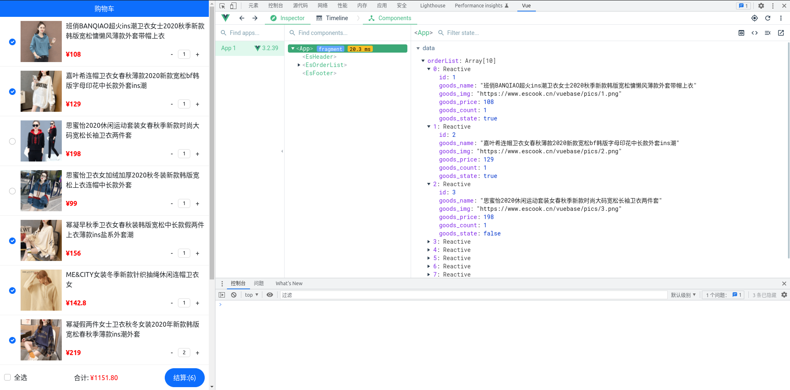

# vue3学习笔记


## 目录

- [vue3学习笔记](#vue3学习笔记)
  - [目录](#目录)
  - [简介](#简介)
  - [基本用法](#基本用法)
  - [指令](#指令)
    - [内容渲染指令](#内容渲染指令)
    - [属性绑定指令](#属性绑定指令)
    - [事件绑定指令](#事件绑定指令)
    - [双向绑定指令](#双向绑定指令)
    - [条件渲染指令](#条件渲染指令)
    - [列表渲染指令](#列表渲染指令)
    - [vue2过滤器](#vue2过滤器)
    - [综合案例实现](#综合案例实现)
  - [组件](#组件)
    - [SPA概念](#spa概念)
    - [Vite构建工具](#vite构建工具)
    - [Vite基本使用](#vite基本使用)
    - [注册全局组件](#注册全局组件)
    - [注册局部组件](#注册局部组件)
    - [组件案例](#组件案例)
  - [computed属性](#computed属性)
  - [触发自定义事件](#触发自定义事件)
  - [父子组件间数据传递-props属性](#父子组件间数据传递-props属性)
    - [props基本使用](#props基本使用)
    - [数据合法性验证](#数据合法性验证)
  - [父子组件间数据的双向同步](#父子组件间数据的双向同步)
    - [v-bind:单向绑定数据](#v-bind单向绑定数据)
    - [v-model双向绑定父子组件间数据](#v-model双向绑定父子组件间数据)
  - [`todoList案例实现`](#todolist案例实现)
  - [watch监听器](#watch监听器)
  - [生命周期钩子函数](#生命周期钩子函数)
  - [组件间数据共享](#组件间数据共享)
    - [父子关系组件间数据共享](#父子关系组件间数据共享)
    - [后代关系组件间数据共享](#后代关系组件间数据共享)
    - [兄弟关系组件间数据共享](#兄弟关系组件间数据共享)
    - [VueX全局数据共享](#vuex全局数据共享)
      - [概念](#概念)
      - [vuex原理](#vuex原理)
      - [基本使用](#基本使用)
      - [vueX的模块化](#vuex的模块化)
    - [Pinia](#pinia)
      - [1、简单例子](#1简单例子)
      - [2、购物车案例](#2购物车案例)
    - [总结](#总结)
  - [lodash节流防抖:throttle()](#lodash节流防抖throttle)
  - [axios](#axios)
    - [全局配置axios](#全局配置axios)
    - [axios的拦截器](#axios的拦截器)
    - [axios配置nprogress进度条](#axios配置nprogress进度条)
  - [`购物车案例实现`](#购物车案例实现)
  - [DOM的引用---ref属性](#dom的引用---ref属性)
  - [DOM更新时机及nextTick()](#dom更新时机及nexttick)
  - [动态组件component](#动态组件component)
  - [插槽Slot](#插槽slot)
  - [自定义的指令Directives](#自定义的指令directives)
  - [表格案例实现](#表格案例实现)
  - [路由](#路由)
    - [路由原理](#路由原理)
    - [基本使用:声明式导航](#基本使用声明式导航)
    - [基本使用:编程式导航](#基本使用编程式导航)
    - [导航守卫](#导航守卫)
  - [登陆案例实现](#登陆案例实现)
  - [vue-cli脚手架](#vue-cli脚手架)
  - [vue组件库](#vue组件库)
    - [element UI](#element-ui)
  - [vue-cli的proxy代理服务](#vue-cli的proxy代理服务)
  - [transition动画组件](#transition动画组件)
  - [swiper在vue中的使用](#swiper在vue中的使用)
  - [根据页面滚动位置改变盒子高度(存在兼容性问题)](#根据页面滚动位置改变盒子高度存在兼容性问题)

------------------------------------------------------------------------------------------

## 简介

vue是一套用于**构建用户界面**的**前端框架**
**vue全家桶**

- vue 核心库
- vue-router 路由方案
- vuex 状态管理方案
- vue组件库 快速搭建页面UI效果的方案
**vue辅助开发工具**
- vue-cli (npm全局包,一键生成工程化vue项目-基于webpack,大而全)
- vite (npm全局包,一键生成工程化vue项目,小而巧)
- vue-devtools 浏览器插件:辅助调试工具
- vetur VScode插件:语法高亮和智能提示

------------------------------------------------------------------------------------------

## 基本用法

**vue3基本使用**

```js
<script src="https://unpkg.com/vue@next"></script>
<div id="demo_1">{{ test1 }}</div>
<script>
    const test1 = {
        data() {
            return {
                test1 : "hello world!!!"
            }
        }
    }
    Vue.createApp(test1).mount('#demo_1')
</script>
```

**Vue2基本使用**

```js
<script src="https://unpkg.com/vue@2.6.14/dist/vue.min.js"></script>
<div id="demo_1">{{ test1 }}</div>
<script>
    const vm = new Vue({
        el:"#demo_1",
        data:{
            test1:"hello world!!!",
            count:123
            methods:{
                addAcount(){
                    //this指向vm,可以访问到data中的属性
                    this.count+=1;
                }
            }
        }
    })
</script>
```

------------------------------------------------------------------------------------------

## 指令

**分类**

- 内容渲染指令
- 属性绑定指令
- 事件绑定指令
- 双向绑定指令
- 条件渲染指令
- 列表渲染指令

### 内容渲染指令

```html
语法格式: 
    {{ 变量名 }}        插值表达式
    v-text="变量名"     内容渲染指令(纯文本)
    v-html="变量名"     内容渲染指令(html)
示例:
<p >用户名: {{ username }}</p>
<p v-text="test1">原内容将被覆盖</p>
<p v-html="test2">原内容将被覆盖</p>

<!-- 支持js表达式 -->
<p>{{ number + 1 }}</p>
<p>{{ ok ? 'YES' : 'NO' }}</p>
<p>{{ message.split('').reverse().join('') }}</p>
<div :id="`list-${id}`"></div>
<p>{{user.name}}</p>
```

### 属性绑定指令

```html
语法格式:   v-bind:属性名="变量名"
简写:       :属性名="变量名"
示例:
    
```

`v-bind:class` 和 `v-bind:style` 的绑定

```html
<template>
  
  <div class="defalutClassName" :class="isClssNameA ? 'ClssNameA' : '' ">测试文字</div>
  <div class="defalutClassName" :class="[isClssNameA ? 'ClssNameA' : '' ,isClssNameB ? 'ClssNameB' : '' ]">测试文字</div>
  <div class="defalutClassName" :class="classList">测试文字</div>
  <div class="defalutClassName" :style="'color:' + isActive">测试文字</div>
  <div class="defalutClassName" :style="{color:isActive,fontSize:fSize + 'px','background-color':bgcolor}">测试文字</div><!-- fontSize和‘font-size‘等效 ‘background-color’和backgroundColor等效 -->
  <div class="defalutClassName" :style="styleObj">测试文字</div>
</template>


<script>
export default {
  data() {
    return {
      isClssNameA: true,
      isClssNameB: true,
      isActive: "skyblue",
      fSize: 15,
      bgcolor: "pink",
      classList: [
        "ClssNameA",
        "ClssNameB",
      ],
      styleObj: {
        color: "red",
        fontSize: "15px",           //fontSize和'font-size'等效
        'background-color': 'pink'
      }
    }
  },
}
</script>
<style>
.defalutClassName {
  color: red;
}
.ClssNameA {
  font-size: 15px;
}
.ClssNameB {
  background-color: pink;
}
</style>
```

### 事件绑定指令

```html
语法格式:   v-on:事件名称.事件修饰符号="事件处理函数名 或 js表达式"
简写:       @事件名称.事件修饰符号="事件处理函数名 或 js表达式"
事件修饰符号
    .prevent    阻止默认行为,如阻止点击超链接跳转
    .stop       阻止事件冒泡
    .capture    以捕获方式(从外到内)触发当前事件,浏览器默认以冒泡方式(从内到外)触发事件
    .once       绑定的事件只触发一次
    .self       只在event.target==this时触发
按键事件修饰符
    .enter      示例: @keyup.enter="事件处理函数名"
    .esc      
示例:
    <button v-on:click.self="addCount"> +1 </button>
    <button @click.self="count += 1"> +1 </button>
    <button @click.self="addCountA()"> +1 </button> <!-- 事件处理函数的第一个形参默认是事件对象 -->
    <button @click.self="addCountB(5,$event)"> +1 </button> <!-- 若第一个形式参数的位置被占用,可手动传入事件对象$event -->

```

### 双向绑定指令

```html
语法格式:   v-model.修饰符="变量名"
修饰符:
    .number     自动将输入表单的数据转换为数字
    .trim       自动过滤输入数据的字符串首尾的空格
    .lazy       仅在"change"事件触发时(失去焦点)写入用户输入的数据,而非"input"事件触发时
注意:   双向绑定指令只能配合html的表单元素使用
示例:
    <input v-model="username">
    <input v-model.number="age">
```

### 条件渲染指令

```html
语法格式:
    v-if="布尔值 或 变量名"
        v-else-if="布尔值 或 变量名"
        v-else
    v-show="布尔值 或 变量名"
区别:
    原理区别
        v-if是动态的添加和删除DOM元素
        v-show是动态的修改DOM元素的CSS的display:none;属性
    性能区别
        在两者都在初始时不渲染,需要频繁切换是否渲染时,
        v-show具有更高初始渲染开销,
        v-if具有更高的切换开销,
示例:
    <button @click="flag=!flag">change flag</button>
    <div v-if="flag">div1</div>
    <div v-show="!flag">div2</div>
```

### 列表渲染指令

```html
语法格式:
    v-for="item in items"
    v-for="(item,index) in items"
示例:
    <li v-for="userName in userNameS">{{userName}}</li>
    <li v-for="(userName,i) in userNameS">索引号是:{{i}},用户名是:{{userName}}</li>
注意:
    在vue2中,可以使用  :id="字符串 或 数值 的变量名"   属性防止列表渲染内容紊乱
    <li v-for="(userInfo,i) in userInfoS" :id="userInfo.userId">索引号是:{{i}},用户名是:{{userInfo}}</li>
```

### vue2过滤器

过滤器仅在vue1 vue2中支持,vue3中建议使用`计算属性`或`方法`来代替

```html
<script src="https://unpkg.com/vue@2.6.14/dist/vue.min.js"></script>
<div id="demo_1">
    <p>{{text | capitalize | maxLength }}</p>
    <p>{{text | capitalize | maxLength(20) }}</p>
</div>
<script>
//定义全局过滤器(公有过滤器)
    Vue.filter("maxLength", (data, maxLength = 10) => { //第一个默认为接收到的参数,之后的参数为可选参数,可以接收到
        if (data.length <= maxLength) return data
        else return data.slice(0, maxLength) + "......"
    })
    const vm = new Vue({
        el: "#demo_1",
        data: {
            text: "dingyiguidingyiguidingyiguidingyigui"
        },
//定义局部过滤器(私有过滤器)
        filters: {
            capitalize(data) {
                return data.charAt(0).toUpperCase() + data.slice(1)
            }
        }
    })
</script>
```

### 综合案例实现

**实现效果**
  
**源代码**

```html
<!-- <script src="./lib/vue@2.6.14.min.js"></script> -->
<link href="https://cdn.bootcdn.net/ajax/libs/twitter-bootstrap/5.1.0/css/bootstrap.css" rel="stylesheet">
<script src="https://unpkg.com/vue@2.6.14/dist/vue.js"></script>
<div id="app" class="container container-fluid">
    <div class="card">
        <div class="card-header">添加品牌</div>
        <div class="card-body row">
            <div class="input-group col">
                <span class="input-group-text">品牌名称</span>
                <!-- v-model.trim="tempBrand.name" 双向绑定 -->
                <!-- @keyup.esc="tempBrand.name=``"键盘esc弹出事件发生后执行 tempBrand.name=`` -->
                <!-- @keyup.enter="addItem"     键盘enter弹出事件事件发生后调用addItem() -->
                <input type="text" class="form-control" placeholder="请输入品牌名称" v-model.trim="tempBrand.name"
                    @keyup.esc="tempBrand.name=``" @keyup.enter="addItem">
                <!-- @click="addItem"点击事件发生后调用addItem() -->
                <button class="btn btn-outline-secondary" type="button" @click="addItem">添加</button>
            </div>
        </div>
    </div>
    <table class="table table-striped">
        <thead>
            <tr>
                <th scope="col">#</th>
                <th scope="col">品牌名称</th>
                <th scope="col">状态</th>
                <th scope="col">创建时间</th>
                <th scope="col">操作</th>
            </tr>
        </thead>
        <tbody>
            <!-- :id="`item_${item.id}`" 控制防止vue2中列表顺序渲染紊乱 -->
            <tr v-for="item in brandList" :id="`item_${item.id}`">
                <th scope="row">{{item.id}}</th>
                <th>{{item.name}}</th>
                <th>
                    <div class="form-check form-switch">
                        <!-- v-model控制双向绑定更新数据 -->
                        <input class="form-check-input" :id="`item_check_${item.id}`" type="checkbox" role="switch"
                            v-model="item.status">
                        <!-- v-if="item.status"控制是否显示 -->
                        <!-- :for="`item_check_${item.id}`" 绑定到指定id,表示点击该元素就相当于点击带有#id的元素 -->
                        <label v-if="item.status" class="form-check-label"
                            :for="`item_check_${item.id}`">已启用</label>
                        <label v-else class="form-check-label" :for="`item_check_${item.id}`">已禁用</label>
                    </div>
                </th>
                <th>{{item.time}}</th>
                <!-- removeItemById(item.id)控制删除项目 -->
                <th><a href="" @click.prevent="removeItemById(item.id)">删除</a></th>
            </tr>
        </tbody>
    </table>
</div>
<script>
    const vm = new Vue({
        el: "#app",
        data: {
            tempBrand: { name: "" },//用于临时存储数据
            nextId: 4,
            brandList: [
                { id: 1, name: "华为", status: true, time: new Date() },
                { id: 2, name: "小米", status: false, time: new Date() },
                { id: 3, name: "苹果", status: true, time: new Date() },
            ]
        },
        methods: {
            removeItemById(targetId) {//根据id删除数据
                this.brandList.splice(this.brandList.findIndex((item) => item.id == targetId), 1)
            },
            addItem() {
                if (!this.tempBrand.name) return alert("名称不能为空!!!")
                this.brandList.push({
                    id: this.nextId,
                    name: this.tempBrand.name,
                    status: true,
                    time: new Date()
                })
                this.tempBrand = { name: "" }//清空
                this.nextId++       //自增id
            }
        }
    })
</script>
```

--------------------------------------------------------------------

## 组件

### SPA概念

```markdown
# SPA概念
SPA(single Page Application)单页面应用程序,指一个web网站只有唯一的HTML页面,所有功能与交互仅在一个页面完成.
# 特点
仅在页面初始化时加载相关资源,加载完毕后单页面应用不会因用户操作而重新加载页面或跳转页面,而是利用js动态改变内容
# 优缺点
* 交互体验好
* 前后端分离,提升开发效率
* 减轻服务器压力
* 首页加载慢
    * 解决方案: 路由懒加载、
    * 代码压缩、
    * CDN加速、
    * 网络传输压缩、
* 不利于SEO
    * 解决方案: SSR服务器渲染
```

-------------------------------------------------------

### Vite构建工具

**概念**
Vite是Vue官方构建工具之一,用于构建SPA单网页应用
  
**Vite使用**

```bash
# 使用
npm create vite@latest
cd ???
npm install
npm run dev
```

-------------------------------------------------------
**Vite项目目录结构**  

- `public/` 公共静态资源
- `src/`   项目源代码
  - `assets/` 编写的静态资源文件(css fonts)
  - `components/` 编写的自定义组件
  - `App.vue` 项目根组件
  - `index.css` 全局样式表文件
  - `main.js` 整个项目的打包入口
- `index.html` SPA页面
  

-------------------------------------------------------
**Vite运行流程**  
通过 `main.js` 把 `App.vue` 渲染到 `index.html`

- `App.vue` 写待渲染的模板结构
- `index.html` 需预留el区域
- `main.js` 把 `App.vue` 渲染到 `index.html` 所预留的区域中

### Vite基本使用

**App.vue**

```html
<!-- ./src/App.vue -->
<template>
<h1>vue根组件</h1>
<p>{{count}}</p>
<button @click="addCount">addCount</button>
</template>

<script>
export default{
  name:"AppIndex",//组件名称
  data(){
    return{
      count:0
    }
  },
  methods:{
    addCount(){
      this.count++
    }
  }
}
</script>

<style scoped lang="less">
  /* scoped属性 */
        /* scoped属性表示css的作用域为局部,可以防止样式冲突 */
        /* 
            原理是自动给所有标签添加随机属性 <h1 data-v-dwed929>vue根组件</h1>
            然后利用css属性选择器:
            h1[data-v-dwed929]{
                color: red;
            }
        */
  /* lang="less"属性 */
        /* slang="less"属性表示使用的css的语言为less,默认为css */
        /* (需要安装 npm install less -d) */
h1{
  color: red;
}
:deep() h1{
/* h1:deep {vue3写法}  */
  color: red;
/* 
    :deep() 称为样式穿透,
    style标签添加了scoped属性后,其样式无法应用于子组件,
    通过样式穿透可以使得样式对子组件生效
    原理是将css选择器修改为
        原 h1[data-v-dwed929]{
                color: red;
            }
        修改后
            [data-v-dwed929] h1{
                color: red;
            }
        也就是自动将交集选择器 修改为子代选择器
*/
}
</style>
```

### 注册全局组件

```js
// ./src/main.js
import { createApp } from 'vue'
import './style.css'
import App from './App.vue'
const app = createApp(App)
//1.导入待注册的组件
import demo1 from "./components/demo1.vue"
//2.使用app.component()注册为全局组件
// app.component(demo1.name,demo1)//可以直接使用组件的name属性作为注册的组件名称
app.component("my-global-comp-demo1",demo1)
//3.在 *.vue 中 通过 <my-global-comp-demo1></my-global-comp-demo1> 的方式使用全局组件

app.mount('#app')
```

### 注册局部组件

```html
<template>
......
<my-global-comp-demo1></my-global-comp-demo1>
<!-- 3.使用注册的局部组件 -->
<my-local-comp-demo2></my-local-comp-demo2>
</template>

<script>
//1.导入待注册的组件
import demo2 from "./components/demo2.vue"
export default{
//2.使用components属性将其注册为局部组件
    components:{
      "my-local-comp-demo2": demo2
    }
}
</script>
```

**注册组件名称命名格式**

```html
pascalCase命名法 帕斯卡命名法 驼峰命名法    
    用驼峰命名法注册的组件在使用时,可以使用两种格式     (适用性强)
        * <pascalCase></pascalCase>
        * <pascal-case></pascal-case>
kebab-case命名法 短横线命名法
    用短横线命名法注册的组件在使用时,仅可以使用一种格式
        * <pascal-case></pascal-case>
```

### 组件案例

**`./src/components/msgBox.vue`**

```html
<template>
    <div class="main" :style="{color:color || 'white',backgroundColor:bgcolor || 'skyblue'}">
        {{msg}}
    </div>
</template>
  
<script>
export default {
    data() {
        return {
        }
    },
    //props属性概念相当于函数的形式参数列表
    // 此处相当于是组件的形式参数列表
    props: ["msg", "color", "bgcolor"]
}
</script>
<style lang="less" scoped>
.main {
    text-align: center;
    font-size: 20px;
    height: 200px;
    width: 400px;
    margin: 0 auto;
    box-shadow: 10px 10px gray;
    padding: 10px;
}
</style>
```

**`./src/app.vue`**

```html
<template>
<msgBox :msg="msg" :color="color" :bgcolor="bgcolor"></msgBox>
</template>
<script>
import msgBox from "./components/msgBox.vue"
export default {
  data() {
    return {
      msg:"消息XXXXXXXXXXXXX",
      // color:"skyblue",
      // bgcolor:"pink"
    }
  },
  components:{
    msgBox
  }
}
</script>
<style lang="less" scoped>
</style>
```

## computed属性

优点:
计算属性会缓存结果值,节省了计算开销,只有依赖的数据源数据值发生改变时才会重新计算计算属性的结果,

```js
<template>
    <p>名:{{firstName}}</p>
    <p>姓:{{secondName}}</p>
    <p>全名:{{fullName}}</p>
</template>
<script>
    export default{
        data(){
            return{
                firstName:"Yigui",
                secondName:"Ding",
            }
        },
        computed:{
            fullName() {
                return this.firstName + this.secondName
            }
        }
    }
</script>
```

## 触发自定义事件

```html
<template>
  <p>{{count}}</p>
  <button @click="addCount">count++</button>
</template>
<script>
export default {
  data() {
    return {
      count: 0,
    }
  },
  //1.注册事件
  emits: ["countChanged"],
  methods: {
    addCount() {
      this.count++
      //2.触发事件,可选参数传递值
      this.$emit("countChanged",this.count)
      //3.在组件外部监听该事件
    },
  }
}
</script>
```

```html
<template>
    <!-- 3.在组件的根标签上监听事件(经测试,仅能在根标签上监听到) -->
    <testEmits @countChanged="callbackA" ></testEmits>
</template>
<script>
import testEmits from "./components/testEmits.vue"
export default {
  data() {
    return {
      count: 0,
    }
  },
  components:{
    testEmits
  },
  methods:{
    callbackA(value){
      alert('自定义事件countChanged事件触发了,接受到数据:' + value )
    }
  }
}
</script>
```

## 父子组件间数据传递-props属性

- props属性概念相当于函数的形式参数列表,调用函数者可以向其中传入参数

- 此处props就是是组件的形式参数列表,调用该组件时可以通过这个传入参数

### props基本使用

```html
<template>
    <!-- demo3为子组件 通过data1=""属性传递值 -->
    <demo3 :data1="title" :this-is-data="context" ></demo3>
    <!-- 
    若thisIsData使用驼峰命名法,则此处属性名可以使用 驼峰命名法 或 短横线命名法
    经测试
        短横线命名法必须全小写
        仅测试驼峰命名法首字母必须小写
        若 props:["ThisIsData"]     则可使用 ThisIsData="" 或 This-Is-Data=""
        若 props:["thisIsData"]     则可使用 this-is-data="" 或 this-Is-Data=""
     -->
</template>
<script>
import demo3 from "./components/demo3.vue"
export default{
  data(){
    return{
      title:"由父组件传给子组件的标题",
      context:"由父组件传给子组件的内容",
    }
  },
  components:{
    demo3
  }
}
</script>
```

```html
<template>
    <h2>标题:{{data1}}</h2>
    <p>内容:{{thisIsData}}</p>
</template>
<script>
    export default{
        data(){
            return{
            }
        },
        // props指定要传入的数据
        props:["data1","thisIsData"], //此处可以使用驼峰命名法,不能使用短横线命名法
    }
</script>
```

### 数据合法性验证

```js
//一般写法
props:["data1","thisIsData"]
//类型验证
props:{
    //props支持8种数据类型
    "data1": String,        //指定数据的类型,否则报错
    "data2": Number,
    "data3": Boolean,
    "data4": Array,
    "data5": Object,
    "data6": Date,
    "data7": Function,
    "data8": Symbol,
}

//多类型验证
props:{
    "data1": [String,Number,Array],
    "data2": Number,
}

// 必填项校验
props:{
    "id": {
        type:[Number,String],
        required:true                   //id为必填属性
    },
    "data1": [String,Number,Array],
}
//默认值
props:{
    "id": {
        type:[Number,String],
        default:0                   //id默认值为default
    },
    "data1": [String,Number,Array],
}
//用自定义函数验证传入值的合法性
props:{
    "msgType": {
        type:String,
        validator(value){//validator函数用于验证合法性,返回值为布尔值
            return ["success","warning","danger"].includes(value)
        }        
    },
    "data1": [String,Number,Array],
}
```

## 父子组件间数据的双向同步

### v-bind:单向绑定数据

父子组件数据 --> 子组件数据

```html
<template>
  <div>
    <p>子组件的count:{{count}}</p>
  <button @click="addCount">count++</button>
  </div>
</template>
<script>
export default {
  data() {
    return {
    }
  },
  props:["count"],//接受参数
  methods: {
    addCount() {
    //   this.count++ //props只读属性无法修改
    },
  }
}
</script>
<style lang="less" scoped>
div{
  border: 1px solid gray;
  padding: 20px;
}
</style>
```

```html
<template>
  <div>
    <p>父组件的count:{{count}}</p>
    <button @click="addCount">count++</button>
    <hr>
    <!-- v-bind:count="count" 传递参数 -->
    <updateCount v-bind:count="count"></updateCount>
  </div>
</template>
<script>
import updateCount from "./components/updateCount.vue"
export default {
  data() {
    return {
      count: 0,
    }
  },
  components: {
    updateCount
  },
  methods: {
    addCount() {
      this.count++
    },
  }
}
</script>
<style lang="less" scoped>
  div{
    border: 1px solid gray;
    padding: 20px;
  }
</style>
```

### v-model双向绑定父子组件间数据

父子组件数据 `<-->` 子组件数据

```html
<template>
  <div>
    <p>父组件的count:{{count}}</p>
    <button @click="addCount">count++</button>
    <hr>
    <!-- 3.使用 v-model 绑定数据 -->
    <updateCount v-model:count="count"></updateCount>
  </div>
</template>
<script>
import updateCount from "./components/updateCount.vue"
export default {
  data() {
    return {
      count: 0,
    }
  },
  components: {
    updateCount
  },
  methods: {
    addCount() {
      this.count++
    },
  }
}
</script>
<style lang="less" scoped>
  div{
    border: 1px solid gray;
    padding: 20px;
  }
  </style>
```

```html
<template>
  <div>
    <p>子组件的count:{{count}}</p>
  <button @click="addCount">count++</button>
  </div>
</template>
<script>
export default {
  data() {
    return {
    }
  },
  // 0. props接受参数
  props:["count"],
  //1.注册事件      注意:若props的是一个`v-model:对象`,则传入的是一个`引用`,则可直接修改引用的`对象.属性名`,无需注册事件和触发事件
  emits: ["update:count"],
  methods: {
    addCount() {
      // this.count+=1 //无法修改,因为是只读属性
      //2. 触发 update:count 事件 并传递 更新后的值
      this.$emit("update:count",this.count+1)

      //3. 如果count是一个数组且watch的deep:false,则更新数据时不能这样写,
            // this.count.push("测试数据")
            // this.$emit("update:count",this.count)
      //4. 如果count是一个数组且watch的deep:false,则更新数据时应该写:
            // this.count.push("测试数据")
            // this.$emit("update:count",[...this.count])
    },
  }
}
</script>
<style lang="less" scoped>
div{
  border: 1px solid gray;
  padding: 20px;
}
</style>
```

## `todoList案例实现`

**实现效果**
  
**实现代码**  
`App.vue`

```html
<template>
  <div class="todolist_main">
    <todoListInput @addTask="addTask"></todoListInput>
    <todoListList v-bind:todoListData=" btnStatus==1?  allTodoListData : btnStatus==2? doneTodoListData : notDoneTodoListData "></todoListList>
    <toDoListBtns v-model:btnStatus="btnStatus"></toDoListBtns>
  </div>
</template>
<script>
import todoListInput from "./components/todoListInput.vue"
import todoListList from "./components/todoListList.vue"
import toDoListBtns from "./components/toDoListBtns.vue"
export default {
  components: {//注册子组件
    todoListInput,
    todoListList,
    toDoListBtns
  },
  data() {
    return {//数据
      nextId: 5,//用于创建新任务
      btnStatus: 1, //变化范围:[1,2,3],用于记录按钮状态
      todoList: [
        { id: 0, task: "测试文字0", done: true },
        { id: 1, task: "测试文字1", done: true },
        { id: 2, task: "测试文字2", done: false },
        { id: 3, task: "测试文字3", done: true },
        { id: 4, task: "测试文字4", done: true },
      ]
    }
  },
  methods: {
    addTask(task) {
      if(!task) return alert("任务名称不能为空......")
      this.todoList.push({
          id: this.nextId++,
          task: task,
          done: false,
      })
    },
  },
  computed: {//计算属性
    allTodoListData() {
      return this.todoList
    },
    doneTodoListData() {
      return this.todoList.filter(item => item.done)
    },
    notDoneTodoListData() {
      return this.todoList.filter(item => !item.done)
    }
  }
}
</script>
<style lang="less" scoped>
.todolist_main {
  margin: 10px auto;
  width: 600px;
}
</style>
```

`./components/todoListInput.vue`

```html
<template>
      <div class="input-group ">
      <span class="input-group-text" >任务</span>
      <input type="text" class="form-control" placeholder="请填写任务信息" v-model="taskName">
      <button class="btn btn-primary" type="button" @click="addTask">添加新任务</button>
    </div>
</template>
<script>
export default {
  emits:["addTask"],//注册事件
  data(){
    return{
      taskName:""
    }
  },
  methods:{
    addTask(){
      this.$emit("addTask",this.taskName)//触发事件,向外部传递任务名称
      this.taskName=""//清空任务名称
    }
  }
}
</script>
```

`./components/todoListList.vue`

```html
<template>
  <ul class="list-group">
    <li v-for="item in todoListData" :key="item.id"
      class="list-group-item d-flex justify-content-between align-items-center">
      <input class="form-check-input tick" type="checkbox" v-model="item.done">
      <span class="context" :class="item.done ? 'ticked':''" >{{item.task}}</span>
      <span v-if="item.done" class="badge bg-success rounded-pill status">已完成</span>
      <span v-else class="badge bg-warning rounded-pill status">未完成</span>
      <span class="badge bg-danger del" @click="del(item.id)">删除</span>
    </li>
  </ul>
</template>
<script>
export default {
  props: {
    'todoListData': {//接受待渲染的数据
      type: Array,
      required: true,
      defult: []
    }
  },
  methods: {
    del(id) {//根据id删除数据
      this.todoListData.splice(this.todoListData.filter(item => item.id == id), 1)
    }
  }
}
</script>
<style lang="less" scoped>
ul li {
  display: flex;
  justify-content:flex-between;
  .tick {
    margin-right: 10px;
  }
  .context {
    flex:1;
    overflow: hidden;
    text-overflow: ellipsis; /* 省略号 */
    &.ticked{
      text-decoration: line-through green ;
      font-style:italic;/* 倾斜字体 */
      color: gray;
    }
  }
  .status {
    margin-left: 10px;
  }
  .del {
    margin-left: 10px;
    cursor: pointer;
  }
}
</style>
```

`./components/toDoListBtns.vue`

```html
<template>
    <div class="btn-group btns" role="group">
        <button type="button" class="btn" :class="btnStatus==1? 'btn-primary':'btn-secondary'" @click="changeBtnStatus(1)">全部</button>
        <button type="button" class="btn" :class="btnStatus==2? 'btn-primary':'btn-secondary'" @click="changeBtnStatus(2)">已完成</button>
        <button type="button" class="btn" :class="btnStatus==3? 'btn-primary':'btn-secondary'" @click="changeBtnStatus(3)">未完成</button>
    </div>
</template>
<script>
export default {
    emits:["update:btnStatus"],
    props: {
        'btnStatus': {
            type: Number,
            required: true,
            defult: 0
        }
    },
    methods:{
        changeBtnStatus(status){
            this.$emit("update:btnStatus",status)//触发事件,向外传递更新被双向绑定的数据
        }
    }
}
</script>
<style lang="less" scoped>
.btns {
    width: 100%;
    display: flex;
    button {
        flex: 1;
    }
}
</style>
```

## watch监听器

**语法格式**

```js
// 基本语法
watch:{
    变量名(newValue,oldValue){
    }
}
// immediate 选项:渲染页面完毕后便执行
watch:{
    变量名:{
        handler(newValue,oldValue){
            //do something
       },
        immediate:true
}
// deep选项: 监听对象的属性值的变化
watch:{
    对象变量名:{
        handler(newValue,oldValue){
            //do something
       },
        immediate:true,
        deep:true
}
//监听对象中单个属性值的变化
watch:{
    '对象变量名.属性名':{
        handler(newValue,oldValue){
            //do something
       },
}
```

**基本使用**

```html
<template>
<input type="text" v-model="username">
<input type="text" v-model="email">
</template>
<script>
  import axios from "axios"
export default{
  data(){
    return{
      username:"DingYigui",
      email:""
    }
  },
  watch:{
    async username(newValue,oldValue){//监听username变量值的修改
      console.log(oldValue);
      console.log(newValue);
      var {data:reqBody} = await axios.get("https://www.domain.cn/api/finduser/" + newValue )
      console.log(reqBody);
    },
    email(newValue,oldValue){
      console.log(newValue);
    }
  }
}
</script>
```

## 生命周期钩子函数

**组件生命周期**  
**在内存中创建示例对象** ---> **将实例对象渲染到页面** ---> **根据需求销毁示例对象**
**生命周期函数**  
最常用的是 `mounted` 、 `updated` 和 `unmounted`
  
**官方文档生命周期图示**
  

## 组件间数据共享

**组件间关系**

- 父子关系
- 后代关系
- 兄弟关系

### 父子关系组件间数据共享

**`父组件 ---> 子组件 :`**
父组件通过`v-bind:`向子组件绑定待共享的数据,子组件通过`props属性`接收数据

```html
<template>
  <div>
    <p>子组件的count:{{count}}</p>
  </div>
</template>
<script>
export default {
  props:["count"],//接受参数
}
```

```html
<template>
  <div>
    <button @click="count++"></button>
    <!-- v-bind:count="count" 传递参数 -->
    <subComponent v-bind:count="count"></subComponent>
  </div>
</template>
<script>
import subComponent from "./components/subComponent.vue"//导入子组件
export default {
  data() {
    return {
      count: 0,
    }
  },
  components: {
    subComponent
  },
}
</script>
```

**`父组件 <--- 子组件 :`**
子组件通过`emits["事件名"]`注册自定义事件,并通过`this.emit("事件名",传递数据)`触发事件,父组件通过`v-on:事件名="处理函数"`来监听事件,其中处理函数的形式参数为接收到的数据

```html
<template>
  <div>
    <button @click="addCount"></button>
  </div>
</template>
<script>
export default {
    data(){
        return{
            count:0
        }
    },
  emits:["countUpdate"],//注册事件
  methods:{
    addCount(){
        this.count++
        this.emit("countUpdate",this.count)//触发事件,向外传递数据
    }
  }
}
```

```html
<template>
  <div>
      <subComponent @countUpdate="getCount"></subComponent>//监听事件,指定处理函数
        <p>从子组件获取到的gettedCount:{{gettedCount}}</p>
  </div>
</template>
<script>
import subComponent from "./components/subComponent.vue"//导入子组件
export default {
  data() {
    return {
      gettedCount: 0,
    }
  },
  components: {
    subComponent
  },
  methods:{
    getCount(value){
      this.gettedCount=value
    }
  }
}
</script>
```

**`父组件 <--> 子组件 :`**  
父组件通过`v-model="变量名"`向子组件绑定待共享的数据,子组件通过`emits["update:变量名"]`注册数据更新事件,并通过`this.emit("update:变量名",传递数据)`触发事件,父组件的变量便能自动接收到更新的数据

```html
<template>
  <div>
    <p>父组件的count:{{count}}</p>
    <button @click="addCount">count++</button>
    <hr>
    <!-- 3.使用 v-model 绑定数据 -->
    <subComponent v-model:count="count"></subComponent>
  </div>
</template>
<script>
import subComponent from "./components/subComponent.vue"
export default {
  data() {
    return {
      count: 0,
    }
  },
  components: {
    subComponent
  },
  methods: {
    addCount() {
      this.count++
    },
  }
}
</script>
```

```html
<template>
  <div>
    <p>子组件的count:{{count}}</p>
  <button @click="addCount">addCount</button>
  </div>
</template>
<script>
export default {
  props:["count"],
  emits: ["update:count"],
  methods: {
    addCount() {
      this.$emit("update:count",this.count+1)//触发 update:count 事件 并传递 更新后的值
    },
  }
}
</script>
```

### 后代关系组件间数据共享

**`父组件数据 ---> 子组件数据`**  

```html
<template>
  <p>{{count}}</p>
</template>
<script>
export default {
    inject:["count"]
}
</script>
```

```html
<template>
  <p>{{count}}</p>
  <button @click="count++">count++</button>
<subTempVue></subTempVue>
</template>
<script>
  import {computed} from "vue"
  import subTempVue from "./components/subTemp.vue"
export default{
  data(){
    return{
      count:0,
    }
  },
  components:{
    subTempVue
  },
  provide(){
    return{
    //   count:this.count,  //这种方式共享的数据 当this.cout数据更新时,子组件接收到的数据将不会更新
      count:computed(()=>this.count), // 这种方式能够更新
    }
  }
}
</script>
```

### 兄弟关系组件间数据共享

**`父组件数据 <---> 子组件数据`**  
mitt
**安装mitt**

```
npm i mitt
```

`mittEventBus.js`

```js
import mitt from "mitt"
const bus = mitt()
export default bus
```

`subTemp.vue 和 subTemp2.vue`

```html
<template>
  <p>{{count}}</p>
  <button @click="count++">count++</button>
</template>
<script>
import bus from "./mittEventBus"
export default{
    data(){
        return{
            count:0
        }
    },
    created(){
        bus.on("countUpdate",(value)=>{//监听事件
          this.count = value
        })
    },
    updated(){
        bus.emit("countUpdate",this.count)//触发事件
    },
}
</script>
```

`App.vue`

```html
<template>
<subTempVue></subTempVue>
<subTemp2Vue></subTemp2Vue>
</template>
<script>
  import subTempVue from "./components/subTemp.vue"
  import subTemp2Vue from "./components/subTemp2.vue"
export default{
  components:{
    subTempVue,
    subTemp2Vue
  },
}
</script>
```

### VueX全局数据共享

#### 概念

vueX 可以让组件间数据共享高效清晰易维护
传统共享数据方式 和 vuex共享数据方式 区别
  

#### vuex原理

  

#### 基本使用

`store/index.js`

```js
import { createStore } from 'vuex'
const state =function () {//state用于存储数据,在vueX4中是一个函数,在VueX3值中是一个对象
    return {
      count: 0 ;
    }
}
const actions = {//用于响应组件中的动作
  // add(miniStore,value){ //第一个参数是一个阉割版的store 可认为是miniStore 也可认为是context
  add({dispatch,commit,state},value){ //
    commit('ADD',value)
  }
}
const mutations = {//用于操作数据
  ADD(state,value){
    state.count += value
  }
}
const getters = {//非必要的属性,相当于组件的计算属性
  bigCount(state){
    return state.count * 5.123 
  }
}
// 创建一个新的 store 实例
const store = createStore({
  actions,
  mutations,
  state,
  getters
})
// 将 store 实例作为插件安装
export default store
```

`main.js`

```js
import { createApp } from 'vue'
const app = createApp(App)
app.use(store)//注册store
app.mount('#app')
```

**组件中操作store**
`someCompoment.vue`

```js
//修改数据
this.$store.state.dispatch('add',15)
$store.state.dispatch('add',15)
$store.state.commit('ADD',15)
//展示数据
this.$store.state.count
$store.state.count
{{this.$store.state.count}}
$store.getters.bigCount
```

**利用 `mapState` `mapGatters` 在组件中简洁的使用数据**

```js
import {mapState,mapGatters} from 'vuex'
computed:{//组件的计算属性
  // 手动写计算属性
  // countA : ()=>{return this.$store.state.count}, //使用: {{countA}}
  // 利用mapState自动生成计算属性
  ...mapState({'countA':'count', ... }),// 等效于 countA : ()=>{return this.$store.state.count}, //使用: {{countA}}
  ...mapmapState(['count', ... ]), // 等效于 count : ()=>{return this.$store.state.count}         //使用: {{count}}
  
  // 利用mapGatters自动生成计算属性
  ...mapGatters({'bigsum':'sum', ... }),// 等效于 bigsum : ()=>{return this.$store.getters.sum}  //使用: {{bigsum}}
  ...mapGatters(['sum', ... ]),// 等效于 sum : ()=>{return this.$store.getters.sum}             //使用: {{sum}}
}
```

**利用 `mapMutations` `mapActions` 在组件中简洁的使用数据**

```js
import {mapActions,mapMutationss} from 'vuex'
methods:{
  //派发行为 dispatch
  ...mapActions({'addCount': "add", ... }), //等效于  addCount(value){ this.$store.dispatch('add',value) }   //使用: @click="addCount(value)"
  ...mapActions(["add", ... ]), //等效于  add(value){ this.$store.dispatch('add',value) }                     //使用: @click="add(value)"
  //Mutation  直接发送commit
  ...mapMutations({'ADDCount':"ADD", ... }), //等效于  addCount(value){ this.$store.commit('ADD',value) }    //使用: @click="ADDCount(value)"
  ...mapMutations(['ADD', ... ]), //等效于  ADD(value){ this.$store.commit('ADD',value) }                   //使用: @click="ADD(value)"
}
```

#### vueX的模块化

`countAbout.js`子模块

```js
const state =function () {
    return {
      count: 0 ;
    }
}
const actions = {
  add({dispatch,commit,state},value){
    commit('ADD',value)
  }
}
const mutations = {
  ADD(state,value){
    state.count += value
  }
}
const getters = {
  bigCount(state){
    return state.count * 5.123 
  }
}
const countAbout = { //子模块对象
  namespaced:true,//启用命名空间 启用后可以使用这种格式的mapState :    `...mapState('countAbout',['count', ... ])`
  state,
  actions,
  mutations,
  getters,
}
export default countAbout //导出vuex子模块
```

`store.js`

```js
import countAbout from 'countAbout.js'
import { createStore } from 'vuex'
// 创建一个新的 store 实例
const store = createStore({
  modules:{
    countAbout,
    //其他子模块...
    anotherSubStore,//另一个子store
  }
})
// 导出store
export default store
```

`main.js`入口文件

```js
import store from 'store.js'
app.use(store)
```

在组件中使用 `mapState` `mapGatters` `mapMutations` `mapActions`

```js
import {mapState,mapGatters,mapActions,mapMutations} from 'vuex'
{
  computed:{//组件的计算属性
    //vueX没模块化后没有启用命名空间的原始写法:
    ...mapState({'countAbout':'countAbout', ... }), // 等效于 countAbout : ()=>{return this.$store.state.countAbout}, //使用: {{countAbout.count}}
    ...mapState(['countAbout', ... ]),              // 等效于 countAbout : ()=>{return this.$store.state.countAbout}, //使用: {{countAbout.count}}
    ...mapState({'count':state=>state.countAbout.count, ... }), // 等效于 countAbout : ()=>{return this.$store.state.countAbout}, //使用: {{count}}
    //模块化后并启用命名空间后写法:
    // 利用mapState自动生成计算属性
    ...mapState('countAbout',{'countA':'count', ... }), // 等效于 countA : ()=>{return this.$store.state.countAbout.count}, //使用: {{countA}}
    ...mapState('countAbout',['count', ... ]),          // 等效于 count : ()=>{return this.$store.state.countAbout.count}   //使用: {{count}}
    // 利用mapGatters自动生成计算属性
    ...mapGatters('countAbout',{'bigsum':'sum', ... }), // 等效于 bigsum : ()=>{return this.$store.getters['countAbout/sum']}  //使用: {{bigsum}}
    ...mapGatters('countAbout',['sum', ... ]),          // 等效于 sum : ()=>{return this.$store.getters['countAbout/sum']}     //使用: {{sum}}
  }
  methods:{
    //派发行为 dispatch
    ...mapActions('countAbout',{'addCount': "add", ... }),  //等效于  addCount(value){ this.$store.dispatch('countAbout/add',value) }   //使用: @click="addCount(value)"
    ...mapActions('countAbout',["add", ... ]),              //等效于  add(value){ this.$store.dispatch('countAbout/add',value) }        //使用: @click="add(value)"
    //Mutation  直接发送commit
    ...mapMutations('countAbout',{'ADDCount':"ADD", ... }), //等效于  addCount(value){ this.$store.commit('countAbout/ADD',value) }    //使用: @click="ADDCount(value)"
    ...mapMutations('countAbout',['ADD', ... ]),            //等效于  ADD(value){ this.$store.commit('countAbout/ADD',value) }         //使用: @click="ADD(value)"
  }
}
```

### Pinia


pinia 中文文档：<https://pinia.web3doc.top/>

#### 1、简单例子

**注册Pinia**

```js
import { createPinia } from 'pinia'
app.use(createPinia())
```

**定义`Pinia`的`state`、`actions`、`getters`、`Setters`**

```js
// stores/counterStore.js
import { defineStore } from 'pinia'
// defineStore 函数返回值本质是一个Hooks
export const useCounterStore = defineStore('counter', {
  state: () => ({
    count: 0
  }),
  actions: {
    increment() {
      this.count++
      // console.log(0)
    }
  },
  getters: {
    doubleCount() {
      return this.count*2
    }
  }
})
export const counterStore = useCounterStore() // 导出CounterStore实例
```

```vue
<script setup>
  import { storeToRefs } from 'pinia'
  import { counterStore } from '@/stores/counterStore'
  // const couterStore = useCounterStore()
  
  //从 Store 中提取属性同时保持其响应式，您需要使用storeToRefs()。 
  //它将为任何响应式属性创建 refs。 当您仅使用 store 中的状态但不调用任何操作时，
  const { count, doubleCount } = storeToRefs(counterStore)
</script>
<template>
  <div>
    {{ count }} 
    {{ doubleCount }}
    <button @click="couterStore.increment">+</button>
  </div>
</template>
<style lang="css">
/* css 代码 */
</style>
 ```

#### 2、购物车案例

```js
// data/api.js
function catchDataApi() {// 模拟服务端发来的数据，用promise实现
  return new Promise((resolve, reject) => {
    setTimeout(() => {
      resolve([
        {
          id: 1,
          name: 'iphone12',
          price: 3000,
          inventory: 3
        },
        {
          id: 2,
          name: 'iphone13',
          price: 8000,
          inventory: 3
        },
        {
          id: 3,
          name: 'iphone14',
          price: 13000,
          inventory: 2
        }
      ])
    }, 1000)
  })
}
export default catchDataApi
```

```js
// store/productStore.js
import { defineStore } from 'pinia'
import catchDataApi from '../data/api'
export const useProductStore = defineStore({
  id: 'productStore',
  state: () => ({
    products: []
  }),
  actions: {
    async loadData() {
      try {
        const data = await catchDataApi()
        this.products = data
      } catch (error) {
      }
    }
  }
})
```

```js
// store/cartStore.js
import { defineStore, storeToRefs } from 'pinia'
import { useProductStore } from './productStore'
export const useCartStore = defineStore({
  id: 'cartStore',
  state: () => ({
    cartList: []
  }),
  // cartList = [
  //   {
  //     id: 1,
  //     name: 'iphone12',
  //     price: 10000,
  //     quantity: 1
  //   }
  // ]
  actions: {
    addToCart(product) {
      // 在购物车里查找是否有这个商品
      const p = this.cartList.find((item) => {
        return item.id === product.id
      })
      // 如果找到了，购物车里的这个商品的数量加 1
      // 如果没有没有找到，添加这个商品到购物车
      if (!!p) {
        p.quantity++
      } else {
        this.cartList.push({
          ...product,
          quantity: 1
        })
      }
      // 当点击放入购物车，这个商品的库存需要减少一个
      const productStore = useProductStore()
      const { products } = storeToRefs(productStore)
      const p2 = products.value.find((item) => {
        return item.id === product.id
      })
      p2.inventory--
    }
  },
  getters: {
    totalPrice() {
      return this.cartList.reduce((sum, item) => {
        return sum + item.price * item.quantity
      }, 0)
    }
  }
})
```

```vue
// views/Product.vue
<script setup>
import { storeToRefs } from 'pinia'
import { useProductStore } from '@/stores/productStore'
import { useCartStore } from '@/stores/cartStore'
const productStore = useProductStore()
const cartStore = useCartStore()
const { products } = storeToRefs(productStore)
const { addToCart } = cartStore
productStore.loadData()
</script>
<template>
  <h1>产品列表</h1>
  <hr>
  <ul>
    <li
      v-for="product in products"
    >
      {{product.name}} - ￥{{product.price}}
      <button 
        @click="addToCart(product)"
        :disabled="product.inventory <= 0"
      >放入购物车</button>
    </li>
  </ul>
</template>
<style lang="css">
/* css 代码 */
</style>
```

```vue
// views/Cart.vue
<script setup>
import { storeToRefs } from 'pinia'
import { useCartStore } from '@/stores/cartStore'
const cartStore = useCartStore()
const { cartList, totalPrice } = storeToRefs(cartStore)
</script>
<template>
  <h1>购物车</h1>
  <hr>
  <ul>
    <li v-for="product in cartList">
      {{product.name}} : {{product.quantity}} x ￥{{product.price}} = ￥{{product.quantity * product.price}}
    </li>
  </ul>
  <div>
    总价：￥{{totalPrice}}
  </div>
</template>
<style lang="css">
/* css 代码 */
</style>
```

```vue
// App.vue
<script setup>
import Product from '@/views/Product.vue'
import Cart from '@/views/Cart.vue'
</script>
<template>
  <Product></Product>
  <Cart></Cart>
</template>
<style lang="css">
/* css 代码 */
</style>
```

### 总结

- 父子关系组件间数据共享
  - 父`--->`子 属性绑定
  - 父`<---`子 事件绑定
  - 父`<-->`子 v-model

- 后代关系组件间数据共享
  - provide & inject    (父--->后代)
- 兄弟关系组件间数据共享
  - mitt (EventBus)
- 全局数据共享
  - vuex

## lodash节流防抖:throttle()

```js
import {throttle} from 'lodash' //节流防抖
    methods: {
        ...mapActions('home',['getCategoryList']),
        changeIndex:throttle(
            function(index){
                this.currentIndex = index;
                console.log(this);
            },
            200,
        ),
        // 错误写法
        // changeIndex(index){
        //     throttle(
        //         function(index){
        //             this.currentIndex = index;
        //             console.log(this);
        //         },
        //         200,
        //     )
        // },
    }
```

## axios

### 全局配置axios

`./src/main.js`

```js
import { createApp } from 'vue'
import axios from 'axios'
import './style.css'
import App from './App.vue'

axios.defaults.baseURL="htts://api.com"     //配置axios,设置baseURL,以后每次发送请求便不必写完整URL,请求只需要写 axios.get("/userinfo") 
const app = createApp(App)
app.config.globalProperties.$http = axios //将axios挂载为app的全局自定义属性,从此每个组件的this上都可以直接访问到axios
app.mount('#app')
```

### axios的拦截器

**概念**

- 请求拦截器,从axios发出给API接口服务器的请求将经过请求拦截器
- 响应拦截器,从API接口服务器发回axios的响应将经过响应拦截器
**请求拦截器**

```js
  // ......
axios.interceptors.request.use(成功回调[,失败回调])
axios.interceptors.response.use(成功回调[,失败回调])
//示例
axios.interceptors.request.use(config => {
  //修改config
  // ......
  
  //返回config
  return config
},error => {
  return Promise.reject(error)
})
```

**为请求头添加token认证**
axios.js

```js
import axios from 'axios'
axios.defaults.baseURL = 'https://hostname.ltd'
axios.interceptors.request.use(config => {
  //修改config
  config.headers.Authorization = 'Bearer XXX'  
  //返回config
  return config
},error => {//
  return Promise.reject(error)
})
export default axios
```

**loading效果**

```js
// 1.按需导入
import {Loading} from 'element-ui' //vue2
//声明用于存储Loading实例的变量
let LoadingInstance = null
axios.interceptors.request.use(config => {
  //修改config
  config.headers.Authorization = 'Bearer XXX'
  //创建Loading实例
  LoadingInstance = Loading.service({fullscreen:true})
  //返回config
  return config
});
axios.interceptors.response.use(response => {
  //关闭Loading的实例对象
  LoadingInstance.close()
  return response
});
export default axios
```

### axios配置nprogress进度条

```js
import axios from 'axios'
import nprogress from 'nprogress'//进度条
import 'nprogress/nprogress.css'//加载的进度条样式
// axios.defaults.baseURL = ''
let http = axios.create({
    baseURL: ' http://????/api',
    timeout: 5000,//5s为超时
    //配置 ... 
})
//请求拦截器
http.interceptors.request.use((config) => {
    // config.headers
    //进度条开始
    nprogress.start()
    return config
})
//响应拦截器
http.interceptors.response.use(
    (response) => {
        //进度条结束
        nprogress.done()
        return response
    },
    (err) => {
        return Promise.reject(new Error('faile'))
    }
)
export default http
```

## `购物车案例实现`

实现效果
  
代码
`main.js`

```js
import { createApp } from 'vue'
import axios from 'axios'
import 'bootstrap'
import './style.css'
import App from './App.vue'
axios.defaults.baseURL='https://escook.cn' //配置axios
let app = createApp(App)
app.config.globalProperties.$http=axios //在this上全局挂载axios
app.mount('#app')
```

`App.vue`

```html
<template>
  <esHeaderVue 
  headerName="购物车" 
  :height="40+'px'"
  ></esHeaderVue>
  <esOrderListVue
  :orderList="orderList" 
  :paddingTop="40+'px'" 
  :paddingBottom="60+'px'"
  ></esOrderListVue>
  <esFooterVue 
  :height="60+'px'" 
  @checkboxChanged="changeAllBeSelecttedStatus"
  :allIsSelectted="allIsSelectted"
  :totalPrice="totalPrice" 
  :countSelectted="countSelectted"
  ></esFooterVue>
</template>
<script>
import esHeaderVue from './components/esHeader.vue';
import esOrderListVue from './components/esOrderList.vue';
import esFooterVue from './components/esFooter.vue'
export default
  {
    components:
    {
      esHeaderVue,
      esOrderListVue,
      esFooterVue
    },
    data() {
      return {
        orderList: 
        [
          //测试数据
          { "id": 1, "goods_name": "班俏BANQIAO超火ins潮卫衣女士2020秋季新款韩版宽松慵懒风薄款外套带帽上衣", "goods_img": "https://www.escook.cn/vuebase/pics/1.png", "goods_price": 108, "goods_count": 1, "goods_state": true },
          { "id": 2, "goods_name": "嘉叶希连帽卫衣女春秋薄款2020新款宽松bf韩版字母印花中长款外套ins潮", "goods_img": "https://www.escook.cn/vuebase/pics/2.png", "goods_price": 129, "goods_count": 1, "goods_state": true },
          { "id": 3, "goods_name": "思蜜怡2020休闲运动套装女春秋季新款时尚大码宽松长袖卫衣两件套", "goods_img": "https://www.escook.cn/vuebase/pics/3.png", "goods_price": 198, "goods_count": 1, "goods_state": false },
          { "id": 4, "goods_name": "思蜜怡卫衣女加绒加厚2020秋冬装新款韩版宽松上衣连帽中长款外套", "goods_img": "https://www.escook.cn/vuebase/pics/4.png", "goods_price": 99, "goods_count": 1, "goods_state": false },
          { "id": 5, "goods_name": "幂凝早秋季卫衣女春秋装韩版宽松中长款假两件上衣薄款ins盐系外套潮", "goods_img": "https://www.escook.cn/vuebase/pics/5.png", "goods_price": 156, "goods_count": 1, "goods_state": true },
          { "id": 6, "goods_name": "ME&CITY女装冬季新款针织抽绳休闲连帽卫衣女", "goods_img": "https://www.escook.cn/vuebase/pics/6.png", "goods_price": 142.8, "goods_count": 1, "goods_state": true },
          { "id": 7, "goods_name": "幂凝假两件女士卫衣秋冬女装2020年新款韩版宽松春秋季薄款ins潮外套", "goods_img": "https://www.escook.cn/vuebase/pics/7.png", "goods_price": 219, "goods_count": 2, "goods_state": true },
          { "id": 8, "goods_name": "依魅人2020休闲运动衣套装女秋季新款秋季韩版宽松卫衣 时尚两件套", "goods_img": "https://www.escook.cn/vuebase/pics/8.png", "goods_price": 178, "goods_count": 1, "goods_state": true },
          { "id": 9, "goods_name": "芷臻(zhizhen)加厚卫衣2020春秋季女长袖韩版宽松短款加绒春秋装连帽开衫外套冬", "goods_img": "https://www.escook.cn/vuebase/pics/9.png", "goods_price": 128, "goods_count": 1, "goods_state": false },
          { "id": 10, "goods_name": "Semir森马卫衣女冬装2019新款可爱甜美大撞色小清新连帽薄绒女士套头衫", "goods_img": "https://www.escook.cn/vuebase/pics/10.png", "goods_price": 153, "goods_count": 1, "goods_state": false }
        ]
      }
    },
    created() {//created生命周期函数,创建完毕后便调用
      this.getOrderList()
    },
    computed: {
        selectted(){//筛选出选中的项
            return this.orderList.filter(item => item.goods_state)
        },
        totalPrice() {//计算总价
            let totalPrice = 0
            this.selectted.forEach(element => {
                totalPrice += element.goods_price * element.goods_count
            });
            return totalPrice.toFixed(2);//保留两位小数
        },
        countSelectted(){//选中商品数
            return this.selectted.length
        },
        allIsSelectted(){//计算是否全部被选中
            for (let index = 0; index < this.orderList.length; index++) {
                const element = this.orderList[index];
                if(!element.goods_state)
                    return false
                else
                    continue
            }
            return true
        },
    },
    methods:{
      async getOrderList() {//获取订单列表
        let { data: reqBody } = await this.$http.get("/api/cart")
        // this.orderList = reqBody.list
      },
        changeAllBeSelecttedStatus(){//选中全部 或 全部取消选中
            let nowStates = this.allIsSelectted
            this.orderList.forEach(element=>{
                element.goods_state= !nowStates
            })
        }
    }
  }
</script>
<style scoped>
</style>
```

`esHeader.vue`

```html
<template>
  <div class="esHeaderBox" :style="{'color':color,'background-color': bgcolor,'height':height}">
  {{headerName}}
  </div>
</template>
<script>
export default {
    props:{
        'headerName':{
            type:String,
            required:true,
            default:"默认标题",
        },
        'color':{
            type:String,
            default:"white",
        },
        'bgcolor':{
            type:String,
            default:"#0d6efd",
        },
        'height':{
            type:String,
            default:"40px"
        }
    }
}
</script>
<style lang="less" scoped>
    .esHeaderBox{
        height: 40px;
        width: 100%;
        display: flex;
        justify-content: center;/*左右居中*/
        align-items: center;/*上下居中*/
        position: fixed;
        top: 0;
        left: 0;
        z-index: 9999;
    }
</style>
```

`esOrderList.vue`

```html
<template>
    <div class="orderListBox" :style="{'padding-top': paddingTop,'padding-bottom': paddingBottom}">
        <ul>
            <li v-for="item in orderList" :key="item.id">
                <div class="form-check checkbox">
                    <input class="form-check-input" type="checkbox" v-model="item.goods_state">
                </div>
                
                <div class="orderInfo">
                    <div class="goods_name">{{item.goods_name}}</div>
                    <div class="goods_price_info">
                        <span class="goods_price">¥{{item.goods_price}}</span>
                        <esCounterVue v-model:count="item.goods_count" :min="1"></esCounterVue>
                    </div>
                </div>
            </li>
        </ul>
    </div>
</template>
<script>
import esCounterVue from './esCounter.vue';
export default {
    props: {
        orderList: {
            type: Array,
            require: true,
        },
        paddingTop:{
            type:String,
            default:"40px"
        },
        paddingBottom:{
            type:String,
            default:"40px"
        },
    },
    components: {
        esCounterVue
    }
}
</script>
<style lang="less" scoped>
.orderListBox {
    ul,
    li {
        list-style: none;
        padding: 0;
        margin: 0;
    }
    li {
        display: flex;
        padding: 10px;
        border-bottom: 1px solid rgb(240, 240, 240);
        .checkbox {
            display: flex;
            align-items: center;
            justify-content: center;
            /*左右居中*/
            width: 40px;
            input {
                border-radius: 50%;
            }
        }
        img {
            height: 100px;
            width: 100px;
        }
        .orderInfo {
            flex: 1;
            display: flex;
            flex-direction: column;
            justify-content: space-between;
            margin-left: 10px;
            .goods_price_info {
                display: flex;
                justify-content: space-between;
                /*上下居中*/
                align-items: center;
                .goods_price {
                    color: red;
                    font-weight: bold;
                }
            }
        }
    }
}
</style>
```

`esCounter.vue`

```html
<template>
    <div class="counterBox">
        <button class="btn" @click="myCount--">-</button>
        <!-- @keyup.enter="event=>event.target.value=myCount"表示当enter键抬起事件发生后重新更新input的value,否则当在结合[ v-model.lazy]使用时不会自动更新,显示错误值 -->
        <!-- <input class="" type="text" v-model.lazy="myCount" @keyup.enter="event=>event.target.value=myCount"> -->
        <!-- 下面一行代码完美解决了上述问题 -->
        <input class="" type="text" :value="myCount" @focusout="myCount = $event.target.value">
        <button class="btn" @click="myCount++">+</button>
    </div>
</template>
<script>
export default {
    props: {
        count:{
            type:Number,
            require: true
        },
        min:{
            type:Number,
            default: NaN //默认值表示不进行最小值检查
        }
    },
    emits: ["update:count"],
    data(){
        return{
            //本地数据 myCount
            myCount:this.count
        }
    },
    methods: {
        setCount(newValue){//设置外部数据 count
            this.$emit("update:count",newValue)
        }
    },
    watch:{
        // 监听 外部数据 count 的改变 和本地数据 myCount 的改变 
        // 使得 myCount ----> `myCount++ 或 myCount-- 或 从input标签输入myCount` ---->  数据合法性检测 ----> count
        // 使得 myCount <------------------------------------------------------------------------------ count
        
        count(newVal){//监听 外部数据 count 的改变,然使其更新到myCount
            this.myCount = newVal
        },
        myCount(newVal,oldVal){//监听 本地数据 myCount 的改变,然使其更新到 外部数据 count
            newVal = parseInt(newVal)
            oldVal = parseInt(oldVal)
            if(typeof newVal == 'number' &&  (this.min == NaN ||  newVal >= this.min) )//判断是否合法
            {
                this.setCount(newVal) //数据合法,则向外部更新新值
            }
            else{
                this.myCount=oldVal //保持原值
            }
        }
    }
}
</script>
<style lang="less" scoped>
.counterBox {
    display: flex;
    // 水平
    justify-content: space-between;
    // 垂直居中
    align-items: center;
    button{
        // height: 1em;
        padding-top: 0;
        padding-bottom: 0;
    }
    input,p{
        max-width: 3em;
        text-align: center;
        padding: 0 10px;
        border: 1px solid rgb(220, 220, 220);
        border-radius: 5px;
        font-size: smaller;
    }
}
</style>
```

`esFooter.vue`

```html
<template>
    <div class="esFooterBox" :style="{'height':height}">
        <div class="form-check">
            <input class="form-check-input" type="checkbox" :checked="allIsSelectted" @change="checkboxChanged" id="esFooterBox_selecttedAll">
            <label class="form-check-label" for="esFooterBox_selecttedAll">全选</label>
        </div>
        <div class="totalPrice">
            合计: <span>¥{{totalPrice}}</span> 
        </div>
        <button class="btn btn-primary checkOut">
            结算:({{countSelectted}})
        </button>
    </div>
</template>
<script>
export default {
    emits: ["checkboxChanged"],
    props: {
        'height': {
            type: String,
            default: "60px"
        },
        'allIsSelectted':{
            type:Boolean,
            require:true
        },
        'totalPrice':{
            type:[Number,String],
            require:true
        },
        'countSelectted':{
            type:Number,
            require:true
        }
    },
    methods:{
        checkboxChanged(){
            this.$emit('checkboxChanged')
        }
    }
}
</script>
<style lang="less" scoped>
.esFooterBox {
    display: flex;
    justify-content:space-between;/*左右居中*/
    align-items: center;/*上下居中*/
    position: fixed;
    bottom: 0;
    left: 0;
    z-index: 9999;
    width: 100%;
    padding:0 10px;
    background-color: white;
    .totalPrice{
        span{
            color: red;
        }
    }
    .checkOut{
        padding: 10px 20px;
        border-radius:99999px;
    }
}
</style>
```

## DOM的引用---ref属性

```html
<template>
  <!-- 使用ref为 `html元素` 的DOM设置引用名称 -->
  <p ref="refName1">test</p>
  <!-- 使用ref为 `组件` 的DOM设置引用名称 -->
  <myComponents ref="refName2"></myComponents>
</template>
<script>
  export default{
    mounted(){
      //根据 `ref引用名称` 输出 `html元素` 的DOM实例
      console.log(this.$refs.refName1);
      //根据 `ref引用名称` 输出 `组件` 的DOM实例
      console.log(this.$refs.refName2);
      //根据 `ref引用名称` 访问 `组件` 上的数据和方法
      console.log(this.$refs.refName2.数据或方法名);
    },
  }
</script>
```

## DOM更新时机及nextTick()

`DOM 的更新并不是同步的  更改响应式状态时 Vue 将它们缓存在一个队列中，直到下一个“tick”才一起执行。`

```html
<template>
  <input v-if="inputVisible" type="text" ref="inputRef" >
  <button @click="changeInputVisible">显示/隐藏输入框</button>
</template>
<script>
  export default{
    data(){
      return{
        inputVisible:false
      }
    },
    methods:{
      changeInputVisible(){
        this.inputVisible=!this.inputVisible //切换输入框可见性
        if(this.inputVisible){  //如果切换为可见
          //当切换输入框可见性后,输入框还未更新DOM,所以 `<input>` 元素并不存在,所以以下代码将因无法获取到DOM对象而报错
          this.$refs.inputRef.focus()  //获取输入框焦点
        }
      }
    }
  }
</script>
```

`nextTick()`

```html
<template>
  <input v-if="inputVisible" type="text" ref="inputRef" >
  <button @click="changeInputVisible">显示/隐藏输入框</button>
</template>
<script>
import { nextTick } from '@vue/runtime-core'
  export default{
    data(){
      return{
        inputVisible:false
      }
    },
    methods:{
      changeInputVisible(){
        this.inputVisible=!this.inputVisible //切换输入框可见性
        if(this.inputVisible){  //如果切换为可见
          //等待一个状态改变后的 DOM 更新完成
          nextTick(()=>{
            this.$refs.inputRef.focus()  //获取输入框焦点
          })
        }
      }
    }
  }
</script>
```

## 动态组件component

**动态组件**

- 动态组件用于动态切换组件的显示和隐藏
- `<component>`是组件占位符
- 通过`is`属性动态指定要渲染的组件名称`<component is="组件名称"></component>`
- `<keep-alive>`标签作用是切换动态组件时保持组件的状态,使得其内容变量不会被销毁
**基本使用**

```html
<template>
  <!-- component绑定字符串变量`comNameVal` -->
  <component :is="comNameVal"></component>
  <!-- button切换遍历`comNameVal`的值 -->
  <button @click="comNameVal='ComponentA'">显示ComponentA</button>
  <button @click="comNameVal='ComponentB'">显示ComponentB</button>
</template>
<script>
  //导入子组件
  import ComponentA from './components/componentA.vue'
  import ComponentB from './components/componentB.vue'
  export default{
    components:{
      //注册子组件
      ComponentA,
      ComponentB
    },
    data(){
      return{
        //定义变量数据
        comNameVal:'ComponentA'
      }
    },
    methods:{
    }
  }
</script>
```

`<keep-alive>`标签作用是切换动态组件时保持组件的状态,使得其内容变量不会被销毁

```html
  <keep-alive>
    <component :is="comNameVal"></component>
  </keep-alive>
```

## 插槽Slot

**基本写法:插入到默认插槽**

```html
<!-- 子组件 -->
<template>
  <p>组件的第一个标签</p>
  <!-- slot预留占位标签 -->
  <slot>
    这里是后备(默认)内容(可以不填后备内容),当父组件未提供任何内容则显示后备内容
  </slot>
  <p>组件的最后一个标签</p>
</template>

<!-- -------------------------------------------------------- -->
<!-- 父组件 -->
<template>
  <!-- 引入子组件 -->
  <subComponent>
    <p>该标签会插入到子组件subComponent的slot标签处</p>
  </subComponent>
</template>
```

**具名插槽:分别插入到不同的插槽**

```html
<!-- 子组件 -->
<template>
  <header>
    <slot name='header'></slot>
  </header>
  <main>
    <!-- 
      <slot name='default'></slot>
      name='default'可以省略
    -->
    <slot></slot>
  </main>
  
  <footer>
      <slot name='footer'></slot>
  </footer>
</template>

<!-- -------------------------------------------------------- -->
<!-- 父组件 -->
<template>
  <!-- 引入子组件 -->
  <subComponent>
    <template v-slot:header>
      <h1>滕王阁序</h1>
    </template>
    <template v-slot:default><!-- 该标签内容将插入到默认插槽 所以该标签 可省略 -->
      <p>滕王高阁临江渚，佩玉鸣鸾罢歌舞。</p>
      <p>画栋朝飞南浦云，珠帘暮卷西山雨。</p>
      <p>闲云潭影日悠悠，物换星移几度秋。</p>
      <p>阁中帝子今何在？槛外长江空自流。</p>
    </template>
    <template v-slot:footer><!-- #footer为v-slot:footer的简写 -->
      <p>落款：王勃</p>
    </template>
  </subComponent>
</template>
```

**作用域插槽**

```html
<!-- 子组件 -->
<template>
  <h2>这是一个子组件</h2>
  <slot :msgA='msg1' :msgB='msg2' >
  //作用：以何种方式渲染数据，交给父组件处理，所以通过插槽的方式向外部提供一个插入位置和数据
  </slot>
</template>
<script>
  export default{
    data(){
      return{
        msg1:"内容1"
        msg2:"内容2"
      }
    }
  }
</script>

<!-- -------------------------------------------------------- -->
<!-- 父组件 -->
<template>
  <h1>这是一个父组件</h1>
  <subComponent v-slot:default="gettedData"><!-- gettedData是变量名，可以任意 -->
    <p>这是接收到的子组件绑定给插槽的数据msgA: {{gettedData.msgA}}</p>
    <p>这是接收到的子组件绑定给插槽的数据msgB: {{gettedData.msgB}}</p>
  </subComponent>
  <subComponent v-slot:default="{msgA:msgA,msgB:msgB}"><!-- 由于获取到的数据是一个对象，所以可以解构赋值为{msgA:msgA,msgB:msgB} 或 {msgA,msgB} -->
    <p>这是接收到的子组件绑定给插槽的数据msgA: {{msgA}}</p>
    <p>这是接收到的子组件绑定给插槽的数据msgB: {{msgB}}</p>
  </subComponent>
</template>
```

## 自定义的指令Directives

**局部自定义指令**

```html
<template>
<input v-focus />
</template>
<script>
  const focus = {
    
}
export default {
  directives: {
    // 在模板中启用 v-focus
    focus:{
      mounted: (el) => el.focus(),//vue2中函数名为bind
      updated: (el) => el.focus()//vue2中函数名为update
    }
  }
}
</script>
```

**全局自定义指令**
`main.js`

```js
const app = createApp({})
// 使 v-focus 在所有组件中都可用
app.directive('focus', {
    mounted: (el) => el.focus(),//vue2中函数名为bind
    updated: (el) => el.focus()//vue2中函数名为update
}

)
// 上述mounted updated 函数内容一致 可以简写为
app.directive('focus',(element)=>{
      el.focus()
}

```

**值令钩子**

```js
export default {
  directives: {
    // 在模板中启用 v-focus
    focus:{
        // 在绑定元素的 attribute 前 或 事件监听器应用前调用
        created(element, binding, vnode, prevVnode) {},
        // 在元素被插入到 DOM 前调用
        beforeMount(el, binding, vnode, prevVnode) {},
        // 在绑定元素的父组件
        // 及他自己的所有子节点都挂载完成后调用
        mounted(el, binding, vnode, prevVnode) {},
        // 绑定元素的父组件更新前调用
        beforeUpdate(el, binding, vnode, prevVnode) {},
        // 在绑定元素的父组件
        // 及他自己的所有子节点都更新后调用
        updated(el, binding, vnode, prevVnode) {},
        // 绑定元素的父组件卸载前调用
        beforeUnmount(el, binding, vnode, prevVnode) {},
        // 绑定元素的父组件卸载后调用
        unmounted(el, binding, vnode, prevVnode) {}
    }
  }
}
```

**值令钩子形式参数**

```js
created(element, binding, vnode, prevVnode) {
  // element :DOM元素
  // binding :
              // 若:
              // let 变量名valueName = 123
              // v-focus.修饰符AAA="变量名valueName"
              // 或:
              // v-focus.修饰符AAA:变量名valueName="123"
              //
              // 则:
              // binding的值为:{
              //      arg: '变量名valueName',
              //      value: 变量名valueName的值 123,
              //      oldValue: 上一次`变量名valueName`的值
              //      modifiers: { 修饰符AAA: true },
              // }
}
```

## 表格案例实现

**效果**
  
**代码**
`main.js`

```js
import { createApp } from 'vue'
import './style.css'
import './assets/bootstrap5.css'
import App from './App.vue'
createApp(App).mount('#app')
```

`App.vue`

```html
<template>
  <myTable :data="goodsList">
    <template v-slot:header>
      <td>序号</td>
      <td>商品名称</td>
      <td>价格</td>
      <td>标签</td>
      <td>操作</td>
    </template>
    <template v-slot:item="{row}">
      <td>{{row.id}}</td>
      <td>{{row.name}}</td>
      <td>{{row.price}}</td>
      <td>
        <span
        v-for="tag in row.tags" :key="tag" 
        class="badge bg-warning text-dark" 
        style="margin:0 5px;cursor: pointer;"
        @click="row.tags.splice(row.tags.findIndex(item => item == tag),1)"
        >{{tag}}</span>
        <input
        type="text" 
        class="form-control"
        style="display: inline;width: 100px; float: right;"
        v-if="row.inputVisible" 
        v-model.trim="row.inputValue" 
        @blur="addTag(row),row.inputValue=''"
        @keyup.enter="addTag(row),row.inputValue=''"
        @keyup.esc="row.inputValue=''"
        v-focus
        >
        <button 
        v-if="!row.inputVisible" 
        type="button"
        class="btn btn-primary" 
        style="padding:2px auto;float: right;" 
        @click="row.inputVisible = true"
        >+Tag
      </button>
      </td>
      <td>
        <button type="button"  class="btn btn-danger">删除</button>
      </td>
    </template>
  </myTable>
</template>

<script>
  import myTable from './components/myTable.vue'
  export default {
    components: {
      myTable
    },
    data() {
      return {
        goodsList: [
          { id: 1, name: "test test test test test test test", price: 100, inputVisible:false, tags: ['tag1', 'tag2'] },
          { id: 2, name: "test test test test test test test", price: 100, inputVisible:false, tags: ['tag1', 'tag2'] },
          { id: 3, name: "test test test test test test test", price: 100, inputVisible:false, tags: ['tag1', 'tag2'] },
          { id: 4, name: "test test test test test test test", price: 100, inputVisible:false, tags: ['tag1', 'tag2'] },
          { id: 5, name: "test test test test test test test", price: 100, inputVisible:false, tags: ['tag1', 'tag2'] },
          { id: 6, name: "test test test test test test test", price: 100, inputVisible:false, tags: ['tag1', 'tag2'] },
        ]
      }
    },
    methods:{
      addTag(row){
        let value =  row.inputValue//获取文本框内容
        row.inputVisible = false//隐藏文本框
        if(value || !row.tags.includes(value)){//判断是否为空 是否已经存在标签
          row.tags.push(value)//添加标签
        }
      },
    },
    directives:{
        focus:{
          mounted(el){
            console.log(el);
            el.focus()
          }
        }
      }
  }
</script>
<style scoped>
</style>
```

`myTable.vue`

```html
<template>
  <table class="table table-striped table-bordered">
    <thead>
        <tr>
            <slot name="header">
            </slot>
        </tr>
    </thead>
    <tbody>
        <tr v-for="item in data" :key="item.id">
                <slot name="item" :row="item">
                </slot>
        </tr>
    </tbody>
  </table>
</template>
<script>
export default {
    props:{
        data:{
            type:Array,
            require:true,
            default:[]
        }
    }
}
</script>
<style>
</style>
```

## 路由

### 路由原理

```html
<template>
  <a href="#/home"></a>
  <a href="#/about"></a>
  <component :is="comNameVal"></component>
</template>
<script>
  import homeVue from "./component/home.vue"
  import aboutVue from "./component/about.vue"
  export default{
    components:{
      homeVue,
      aboutVue,
    },
    data(){
      return{
        comNameVal:'homeVue'
      }
    },
    created(){
      //监听url中hash改变的事件 
      window.onhashchange = ()=>{//回调函数
        switch(window.location.hash){
          case `#/home`:
            this.comNameVal = 'homeVue'
            break;
          case `#/about`:
            this.comNameVal = 'aboutVue'
            break;
        }
      }
    }
  }
</script>
```

### 基本使用:声明式导航

**声明式导航概念**

- 点击`<a>`标签
- 点击`<<router-link>`标签
`安装`

```bash
# 安装
# vue2 只能使用vue-router 3
# vue3 只能使用vue-router 4
npm install vue-router@4 
```

`router.js`

```js
import homeVue from "./component/home.vue"
import movieVue from "./component/movie.vue"
import aboutVue from "./component/about.vue"
import {createRouter,createWebHashHistory} from 'vue-router'
const router = createRouter({//创建路由实例
    history:createWebHashHistory(),//指定路由工作模式
    linkActiveClass:'actived_by_Router',//指定被点击后的链接会被添加上类名,默认为`router-link-active`
    routes:[//指定路由规则
        {path:'/',redirect:'/home'},//重定向路由
        {path:'/home',component:homeVue},
        {
          path: '/search/:someSearchKeywords?',//?表示someSearchKeywords可以传递也可不传递,当不加?且不传递someSearchKeywords参数时,url中的`/search/`路径会没有,这会导致路由错误
          name:'search',  // this.$router.push({ name:'search',query:{categoryid,categoryleve,categoryname}})
          component: Search,
          meta:{showFooter:true}//如此组件中便可以使用该变量: `<Footer v-if="$route.meta.showFooter"></Footer>`
        },
        {
            path:'/movie/:movieId',//`:movieId`是动态路由,使得组件中能通过`{{$route.params.movieId}}`访问属性值
            component:() => import '"./component/movie.vue"' , //路由懒加载
            name:'mov',//可以给路由命名,但不能重复
            props:true,//使得组件中可以通过:`props:[movieId]` `{{movieId}}` 获取属性值
        },
        {path:'/about',component:aboutVue,redirect:'/about/tab1',children:[//嵌套路由
            {path:'tab1',component:tab1Vue},
            {path:'tab2',component:tab2Vue},
        ]},
    ]
})
export default router//导出实例对象
```

`main.js`

```js
import App from './App.vue'
const app = createApp(App)
import router from "./router.js";
app.use(router)
app.mount('#app')
```

`App.vue`

```html
<template>
  <router-link to='/home' >主页<router-link>
  <router-link to='/movie' >电影<router-link>
  <router-link to='/movie/123' >电影<router-link>
  <router-link :to="{name:'mov',params:{id:123}}" >电影<router-link>
  <router-link to='/about' >关于<router-link>
  <router-view></router-view>
</template>
<script>
  export default{
  }
</script>
```

### 基本使用:编程式导航

**编程式导航概念**

- 修改`window.location.herf`使之跳转页面
- 调用vueAPI

```html
<button @click="$router.push('/home')">首页</button>
<button @click="$router.push({name:'mov',params:{id:123}})">首页</button>
<button @click="$router.go(-1)">返回</button>
```

### 导航守卫

```js
import homeVue from "./component/home.vue"
import movieVue from "./component/movie.vue"
import aboutVue from "./component/about.vue"
import {createRouter,createWebHashHistory} from 'vue-router'
const router = createRouter({
  // 略......
    routes:[
        // 略......
        {
          path: '/search/:someSearchKeywords?',//作用: `?`表示`someSearchKeywords`可以传递也可不传递,当不加?且不传递`someSearchKeywords`参数时,`url`中的`/search/`路径会没有,这会导致路由错误
          name:'search',  // 作用:  this.$router.push({ name:'search',params:{key:value,...},query:{categoryid,categoryleve,categoryname}})
          component: Search,
          meta:{showFooter:true}//作用: 如此编写组件中便可以使用该变量: `<Footer v-if="$route.meta.showFooter"></Footer>`
        }
    ]
})
//全局导航守卫
router.beforeEach((to,from,next)=>{
  //to 目标路由对象
  //from 来源路由对象
  //next() 调用后将放行路由 若不接收该参数则自动放行;
    // next('/path') 跳转到指定路径
    // next(false) 强制停留在当前页面
  if(to.path == '/user' && ! localStorage.getItem('token'))//访问user页面,但没有登陆,则跳转到登陆页面
  {
    next('/login')//路由到登陆页面
  }else{
    next() //放行
  }
})
export default router//导出实例对象
```

## 登陆案例实现

main.js

```js
import { createApp } from 'vue'
import './style.css'
import App from './App.vue'
import router from './router'
const app = createApp(App)
app.use(router)
app.mount('#app')
```

router.js

```js
import {createRouter,createWebHashHistory} from 'vue-router'
import loginVue from './components/login.vue'
import userVue from './components/user.vue'
import userInfoVue from './components/userInfo.vue'
import userRightVue from './components/userRight.vue'
import userDetailVue from './components/userDetail.vue'
const router = createRouter({
    history:createWebHashHistory(),
    linkActiveClass:'actived_by_router',
    routes:[
        {path:'/',redirect:'/login'},
        {path:'/login',component:loginVue},
        {path:'/user',redirect:'/user/info',component:userVue ,children:[
            {path:'info',component:userInfoVue},
            {path:'right',component:userRightVue},
            {path:'detail/:userId',component:userDetailVue,props:true},
        ]},
    ]
})
router.beforeEach((to,before,next)=>{
    if(to.path != '/login' && !localStorage.getItem("token"))//若不是访问/login 且没有登陆token 则重定向到/login
    {
        next('/login')
    }else{
        next()//其他页面则允许访问(其实应当需要更复杂的判断)
    }
})
export default router
```

App.vue

```html
<template>
    <router-view></router-view>
</template>
```

login.vue

```html
<template>
    <div class="loginBox">
        username:<input type="text" v-model="username"><br>
        password:<input type="password" v-model="password"><br>
        <button @click="login">submit</button>
    </div>
</template>
<script>
import {} from "vue-router"
export default {
    data(){
        return{
            username:'',
            password:''
        }
    },
    methods:{
        login(){
            localStorage.setItem("token","")
            if(this.username=='admin' && this.password=='admin')//模拟判断是否登陆成功
            {
                this.$router.push('/user')
                localStorage.setItem("token","XXXXXXXX")//模拟存储token
            }else{
                alert('用户名或密码错误')
            }
        }
    }
}
</script>
<style>
.loginBox{
    width: 400px;
    height: 400px;
    background-color: #fff;
}
</style>
```

user.vue

```html
<template>
  <div class="userInfoBox">
    <div class="left">
      <button @click="logout">登出</button><br>
      <router-link to="/user/info">用户信息</router-link><br>
      <router-link to="/user/right">用户权利</router-link>
    </div>
    <div class="right">
      <router-view></router-view>
    </div>
  </div>
</template>
<script>
export default {
  methods:{
    logout(){
      localStorage.setItem("token",'')
      this.$router.push('/')
    }
  }
}
</script>
<style lang="less">
.userInfoBox{
  display: flex;
  .left{
    width: 200px;
    background-color: skyblue;
  }
  .right{
    flex: 1;
    background-color: pink;
  }
}
.actived_by_router{
  background-color: red;
}
</style>
```

userInfo.vue

```html
<template>
  <p>用户信息..................................</p>
  <p>用户1:<router-link :to="'/user/detail/'+1">张三</router-link> <button @click="$router.push('/user/detail/'+1)">张三</button></p>
  <p>用户2:<router-link :to="'/user/detail/'+2">张四</router-link> <button @click="$router.push('/user/detail/'+2)">张四</button></p>
</template>
```

userRight.vue

```html
<template>
  <p>用户权限..................................</p>
</template>
```

userDetail.vue

```html
<template>
  <div class="userDetailBox">
    <button @click="$router.go(-1)">返回上一级</button>
    <h2>用户详细信息</h2>
    <p>userId:{{userId}}</p>
    <p>$route.params.userId:{{$route.params.userId}}</p>
  </div>
</template>
<script>
export default {
    props:['userId']
}
</script>
```

## vue-cli脚手架

**安装**

```bash
npm install -g @vue/cli
vue --version
```

**创建项目**

```bash
# 命令行方式创建
npm create project-Name
# 图形界面创建
vue ui
```

**建议手动勾选配置的功能**

- [*] 使用设置档案`.babelrc`
- [*] babel
- [*] css预处理器(less Sass stylus)

## vue组件库

**PC端组件库**

- Element-UI 饿了吗团队开发的组件库
- View UI
**移动端组件库**
- mintUI
- Vant

### element UI

- Element-UI --> **vue2**

- Element Plus --> **vue3**
**安装**

```bash
npm i element-ui -S
```

**完整引入Element-UI**

```js
// 完整引入
import Vue from 'vue';
import ElementUI from 'element-ui'
import 'element-ui/lib/theme-chalk/index.css'
Vue.use(ElementUI)

```

**按需引入Element-UI:可减小项目体积**

```js
// 1.安装   npm install babel-plugin-component -D
// 2.修改   .babelrc 
"plugins": [
    [
      "component",
      {
        "libraryName": "element-ui",
        "styleLibraryName": "theme-chalk"
      }
    ]
  ]
// 3.修改main.js
import Vue from 'vue';
import { Button, Select } from 'element-ui';
import App from './App.vue';
Vue.component(Button.name, Button);
Vue.component(Select.name, Select);
/*
 * 或写为
 * Vue.use(Button)
 * Vue.use(Select)
*/
```

## vue-cli的proxy代理服务

用于处理跨域的问题
**示例**

```js
// 1.配置axios
axios.defaults.baseURL = 'https://localhost:8080'
// 2.在vue.config.js中配置proxy代理
module.exports = {
  devServer:{
    proxy:'http://www.???.???',
    open:true,//自动打开浏览器
    // port:80
  }
}
// 3.发送请求
this.$http.get('/api/users')
// 4.vue发现接口不存在,于是将请求转交给proxy代理
// 5.proxy代理把请求地址的baseURL替换为devServer.proxy的值,并发起真正的请求
// 6.proxy代理把请求到的数据转发给axios
```

## transition动画组件

**基本使用**

```vue
<button @click="shouldShow = !shouldShow">切换组件显示</button>
<transition name="transitionName">
    <div v-if="shouldShow">     1. v-if   </div>
    <div v-show="shouldShow">   2. v-show   </div>
    <component is="组件名称">    3. 动态组件    </component>
</transition>
<style>
        /* // 进入前 */
        .transitionName-enter-from {
            height: 0;
        }
        /* // 进入中 */
        .transitionName-enter-active {
            transition: all 0.2s linear;
        }
        /* // 进入后 */
        .transitionName-enter-to {
            height: 461px;
        }
        /* // 离开前 */
        .transitionName-leave-from {
            height: 461px;
        }
        /* // 离开中 */
        .transitionName-leave-active {
            transition: all 0.2s linear;
        }
        /* // 离开后 */
        .transitionName-leave-to {
            height: 0;
        }
</style>
```

## swiper在vue中的使用

**安装**

```bash
npm i swiper
```

**引入**
根据 `swiper` 的`package.json`的 `exports` 属性可知应当引入 `./bundle` `./css/bundle`

```js
//package.json 
"exports": {
    ".": "./swiper.esm.js",
    "./core": "./swiper.esm.js",
    "./bundle": "./swiper-bundle.esm.js",
    "./css": "./swiper.min.css",
    "./css/bundle": "./swiper-bundle.min.css",
    "./css/a11y": "./modules/a11y/a11y.min.css",
    "./css/autoplay": "./modules/autoplay/autoplay.min.css",
    "./css/controller": "./modules/controller/controller.min.css",
    "./css/effect-coverflow": "./modules/effect-coverflow/effect-coverflow.min.css",
    "./css/effect-cube": "./modules/effect-cube/effect-cube.min.css",
    "./css/effect-fade": "./modules/effect-fade/effect-fade.min.css",
    "./css/effect-flip": "./modules/effect-flip/effect-flip.min.css",
}
```

```js
import 'swiper/css/bundle'
import Swiper from 'swiper/bundle'
   import { mapState } from 'vuex';
    import { nextTick } from 'vue'
export default {
    mounted(){
      this.$store.dispatch('home/getBannerList')//向服务端发送请求获取数据
      nextTick(()=>{
        // 不应在此处执行 new Swiper 因为此时的nextTick并不是由于`bannerList`更新导致的页面更新 且其不能处理数据后续更新导致的页面更新
      })
    },
    computed:{
      ...mapState('home',['bannerList'])//映射bannerList
    },
    watch:{//监听器
        bannerList:{//bannerList监听器
            immediate:true,
            deep:true,
            handler(newValue,oldValue){
                nextTick(()=>{//监听到数据改变后,等待页面的` v-for="item in bannerList" `渲染完毕后再执行回调,否则swiper功能异常
                    var swiper = new Swiper(
                      // "#swiper_banner", //css选择器或DOM对象
                      this.$refs.swiper_banner,//vue的ref引用
                      {
                        autoplay:true,
                        loop:true,
                        navigation: {
                          nextEl: ".swiper-button-next" ,
                          prevEl: ".swiper-button-prev" ,
                        },
                        pagination: {
                            el: ".swiper-pagination" ,
                            clickable: true
                        },
                    });
                    console.log('nextTick执行完毕');
                })
                console.log('watch的回调执行完毕');
            },
        }
    }
}
```

```vue
<!--banner轮播-->
<!-- swiper-container是旧版类名 swiper是新版类名 实际上只需要写一个,携带了一些样式,并用于保证其子代的类名能够应用相关css属性 -->
<div class="swiper swiper-container" id="swiper_banner" ref="swiper_banner">
    <div class="swiper-wrapper">
        <div class="swiper-slide" v-for="item in bannerList" :key="item.id">
            
        </div>
    </div>
    <!-- 如果需要分页器 -->
    <div class="swiper-pagination Pagi_banner"></div>
    <!-- 如果需要导航按钮 -->
    <div class="swiper-button-prev btnPrev_banner"></div>
    <div class="swiper-button-next btnNext_banner"></div>
</div>
```

## 根据页面滚动位置改变盒子高度(存在兼容性问题)

```vue
<template>
    <div ref="cover" class="cover">
    </div>
</template>
<script>
export default {
    data() {
        return {
        }
    },
    mounted() {
        document.addEventListener('scroll', () => {//根据页面滚动改变div高度
            /* css
                min-height: 20vh;
                height: 80vh;
                max-height: 80vh;
            */
            let px_100vh = window.innerHeight; //px单位的100vh
            let px_scrolled_height = window.pageYOffset; //px单位的滚动内容的高度
            let vh_scrolled_height = px_scrolled_height / px_100vh * 100; //vh单位的滚动内容的高度
            let vh_min_height = 20;
            let vh_max_height = 80;
            let px_current_height = this.$refs.cover.clientHeight;
            let vh_current_height = px_current_height / px_100vh * 100;
            let new_vh_current_height = vh_current_height - vh_scrolled_height
            console.log(new_vh_current_height);
            if (vh_min_height <= new_vh_current_height && new_vh_current_height <= vh_max_height) {
                this.$refs.cover.style.height = new_vh_current_height + 'vh';
                window.scroll(0, 0)
            }
        })
    }
}
</script>
<style lang="less" scoped>
.cover {
    width: 100%;
    min-height: 20vh;
    height: 80vh;
    max-height: 80vh;
    background-color:red;
}
</style>
```
