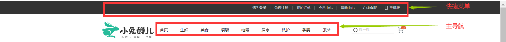

# 前端项目笔记

## 更新日志

- `2022.06.09`：v1.0
- `2022.06.11`: 原生进度条，自定义进度条实现
- `2022.06.12`: 精灵图、一般的网站项目目录结构
- `2022.06.16`: logo图的SEO、惯用类名、网页部分内容名称
- `2022.06.19`: html的默认高度

## 目录

- [前端项目笔记](#前端项目笔记)
  - [更新日志](#更新日志)
  - [目录](#目录)
  - [版心居中](#版心居中)
  - [网页logo结构](#网页logo结构)
  - [记得设置宽高](#记得设置宽高)
  - [清除浏览器默认样式](#清除浏览器默认样式)
    - [清除超链接下划线](#清除超链接下划线)
    - [清除列表的标号](#清除列表的标号)
    - [去除浮动元素对父元素的影响](#去除浮动元素对父元素的影响)
  - [html5原生进度条](#html5原生进度条)
    - [meter](#meter)
    - [progress](#progress)
  - [自定义进度条](#自定义进度条)
  - [css单标签进度条动态效果](#css单标签进度条动态效果)
  - [非阻塞的指定时间后执行代码](#非阻塞的指定时间后执行代码)
  - [精灵图](#精灵图)
  - [logo图SEO搜索引擎优化写法](#logo图seo搜索引擎优化写法)
  - [一些惯用类名](#一些惯用类名)
  - [一些名词](#一些名词)
  - [一般的项目结构](#一般的项目结构)
    - [base.css代码示例](#basecss代码示例)
  - [html的默认高度](#html的默认高度)
  - [移动端主体部分的下边距问题](#移动端主体部分的下边距问题)
  - [设计图中的虚线框](#设计图中的虚线框)
  - [flex布局滚动条](#flex布局滚动条)
    - [清除滚动条样式](#清除滚动条样式)
  - [文字溢出省略](#文字溢出省略)

## 版心居中

- 版心居中效果实际工作中一般写在一个名为`.wrapper{};`的css类选择器中
- 有元素需要版心居中效果，就给这个元素**附加**这个类名
- 版心常见的宽度值为960px、980px、1000px、1200px等

```html
<style>
    /* 版心居中 */
    .wrapper{
        width: 1200px;
        margin: 0 auto;
    }
</style>
<div class="otherClassName wrapper">导航条</div>
```

## 网页logo结构

- 网页logo应该使用的标签结构 h1>a>img

## 记得设置宽高

- `box-sizing:border-box;`属性生效必须设置宽或高

## 清除浏览器默认样式

### 清除超链接下划线

```css
a{
    text-decoration:none;
}
```

### 清除列表的标号

```css
li{
    list-style:none;
}
```

### 去除浮动元素对父元素的影响

```css
.clearfix:before,
.clearfix:after{
    content:'';
    display:table;
}
.clearfix:after{
    clear:both;
}
```

## html5原生进度条

- 无法有效的修改标签的样式,背景色，进度前景色等。
- 浏览器默认样式的表现在不同浏览器之间并不一致
- 无法添加动画效果、交互效果
- 生产环境，几乎是不会看到 `<meter>` 和 `<progress>` 标签

### meter

```html
<!-- min、max、value 分别表示最大值，最小值与当前值。 -->
<meter min="0" max="500" value="350">350 degrees</meter> 
<style>
meter { 
    width: 200px; 
} 
</style>
```

效果：
<meter min="0" max="500" value="350">350 degrees</meter>
<style>
meter {
    width: 200px;
}
</style>

### progress

```html
<!-- max 属性描述这个 progress 元素所表示的任务一共需要完成多少工作量，value 属性用来指定该进度条已完成的工作量。 -->
<progress max="100" value="70"> 70% </progress> 
<style>
progress { 
    width: 200px; 
} 
</style>
```

效果：

<progress max="100" value="70"> 70% </progress>
<style>
progress {
    width: 200px;
}
</style>

## 自定义进度条

```html
<div class="progress-container"><div class="process" style="width:80%;"></div></div>
<style>
.progress-container{
    /* position:absolute;
    right: 0px;
    z-index: 1; */
    display: inline-block;
    width: 200px;
    height: 1em;
    background-color: #fff;
    border-radius: 0.5em;
    vertical-align: middle;
}
.process{
    height: 1em;
    /* background-color: #0f0; */
    background: linear-gradient(90deg, #0f0, #0ff);
    border-radius: 0.5em;
}
</style>
```

效果：

<div class="progress-container"><div class="process" style="width:80%;"></div></div>
<style>
.progress-container{
    /*position:absolute;
    right: 0px;
    z-index: 1; */
    display: inline-block;
    width: 200px;
    height: 1em;
    background-color: #fff;
    border-radius: 0.5em;
    vertical-align: middle;
}
.process{
    height: 1em;
    /* background-color: #0f0;*/
    background: linear-gradient(90deg, #0f0, #0ff);
    border-radius: 0.5em;
}
</style>

## css单标签进度条动态效果

- 动态是指在修改`--progress: 20%`属性值时会有动态效果

```html
<div class="g-progress" style="--progress: 70%"></div> 
<style>
@property --progress { 
  syntax: '<percentage>'; 
  inherits: false; 
  initial-value: 0%; 
} 
.g-progress { 
    margin: auto; 
    width: 240px; 
    height: 25px; 
    border-radius: 25px; 
    background: linear-gradient(90deg, #0f0, #0ff var(--progress), transparent 0); 
    border: 1px solid #eee; 
    transition: .3s --progress; 
} 
</style>
```

效果：
<div class="g-progress" style="--progress: 20%"></div>
<style>
@property --progress {
  syntax: '<percentage>';
  inherits: false;
  initial-value: 0%;
}
.g-progress {
    margin: auto;
    width: 240px;
    height: 25px;
    border-radius: 25px;
    background: linear-gradient(90deg, #0f0, #0ff var(--progress), transparent 0);
    border: 1px solid #eee;
    transition: .3s --progress;
}
</style>

## 非阻塞的指定时间后执行代码

```js
    <script >
        setTimeout("func()",0 );  
        function func(){  
            do
            {
                执行语句;
            }while(结束条件)
        }  
    </script>
```

## 精灵图

- 将项目中多个小图合并成一张大图，这张大图称为精灵图
- 优点，减少服务器发送图片次数，减轻服务器压力，提高页面加载速度
- 步骤
  - 设置盒子的**宽高**为**小图的宽高**
  - 设置盒子的**背景**为**大图的url()**
  - 设置背景图的**起始绘制位置**为所需**小图左上角的坐标**
- 注意
  - 精灵图一般使用行内/行内块标签
  - 属性名：`background-position:水平方向位置 垂直方向位置;`
    - 水平方向正数表示背景图右移，负数表示左移
    - 水平方向正数表示背景图下移，负数表示上移
  - 具体位置偏移量要用像素大厨软件测量，然后取负数

- 实例

## logo图SEO搜索引擎优化写法

1. 标签结构`<h1><a href="#">网站名</a></h1>`
2. 将网站logo设置为a的背景图
3. 设置`background-size:contain;`
4. 将文字大小设置为0，`font-size:0;`

## 一些惯用类名


## 一些名词

- 快捷菜单和主导航

## 一般的项目结构

- 项目文件夹不建议包含中文
- favicon.ico一般放项目根目录
- 根目录的images文件夹放网站固定使用的图片素材，如logo，样式修饰图
- 根目录的uploads文件夹存放网站非固定使用的图片，如商品图片，宣传图片
- 根目录的lib文件夹存放网站所引用的一些库文件、框架文件的文件夹
- index.html放根目录
- 根目录下css文件夹保存网页样式
  - base.css 基础公共样式，如默认样式的清除，列表符号清除 超链接下划线清除
  - common.css 网页中多个网页相同模板的重复样式，如头部，底部
  - index.css 首页样式
  - 注意三个文件的引入顺序，后引入的覆盖先引入的


### base.css代码示例

```css
/* 清除默认样式的代码 */
/* 去除常见标签默认的 margin 和 padding */
body,
h1,
h2,
h3,
h4,
h5,
h6,
p,
ul,
ol,
li,
dl,
dt,
dd,
input {
  margin: 0;
  padding: 0;
}

/* 內减模式 */
* {
    box-sizing: border-box;
}

/* 设置网页统一的字体大小、行高、字体系列相关属性 */
body {
  font: 16px/1.5 "Helvetica Neue", Helvetica, Arial, "Microsoft Yahei",
    "Hiragino Sans GB", "Heiti SC", "WenQuanYi Micro Hei", sans-serif;
  color: #333;
}

/* 去除列表默认样式 */
ul,
ol {
  list-style: none;
}

/* 去除默认的倾斜效果 */
em,
i {
  font-style: normal;
}

/* 去除a标签默认下划线，并设置默认文字颜色 */
a {
  text-decoration: none;
  color: #333;
}

/* 设置img的垂直对齐方式为居中对齐，去除img默认下间隙 */
img {
  vertical-align: middle;
}

/* 去除input默认样式 */
input {
  border: none;
  outline: none;
  color: #333;
}

/* 左浮动 */
.fl {
  float: left;
}

/* 右浮动 */
.fr {
  float: right;
}

/* 双伪元素清除法 */
.clearfix::before,
.clearfix::after {
  content: "";
  display: table;
}
.clearfix::after {
  clear: both;
}

```

<br>
<br>
<br>
<br>

## html的默认高度

当要给body标签添加背景图时可能会遇到图片不显示的问题，原因是因为body的高度默认靠内容撑开，其高度为0，但当设置body高度为100%会发现仍然不解决问题，原因是body标签的父级标签html的高度是0，所以还应该设置html高度为100%

```css
html{
  height:100%
}
body{
  height:100%
  background-image:url();
}

```

## 移动端主体部分的下边距问题

由于最底部的导航条是固定定位，会脱离标准流，如果主体部分的内容的底部没有外边距或内边距，版权信息就会被遮挡，正确的做法是应该添加一个边距


## 设计图中的虚线框

- 意思是这些地方是能点击的
- 整个虚线框都是点击范围
- 这个范围的宽高一般多为44这样的偶数


## flex布局滚动条

当手机端排版时，如果 ul 中 li 过多，一行装不下时，希望显示水平滚动条，而不是折行。

flex 实现：

ul

```css
display: flex;
overflow-x: auto;
```

li

```css
flex: none;
```


### 清除滚动条样式

仅在支持WebKit的浏览器 (例如, 谷歌Chrome, 苹果Safari)可以使用.

滚动条相关伪元素名

- ::-webkit-scrollbar — 整个滚动条.
- ::-webkit-scrollbar-button — 滚动条上的按钮 (上下箭头).
- ::-webkit-scrollbar-thumb — 滚动条上的滚动滑块.
- ::-webkit-scrollbar-track — 滚动条轨道.
- ::-webkit-scrollbar-track-piece — 滚动条没有滑块的轨道部分.
- ::-webkit-scrollbar-corner — 当同时有垂直滚动条和水平滚动条时交汇的部分.
- ::-webkit-resizer — 某些元素的corner部分的部分样式(例:textarea的可拖动按钮).

示例

```less
&::-webkit-scrollbar{
    // 清除滚动条
    display: none;
}
```

## 文字溢出省略

```css
/* 溢出隐藏 */
overflow: hidden;
/* 文字溢出显示省略号 */
text-overflow: ellipsis;
/* 强制在同一行内显示所有文本，直到文本结束或者遭遇 br 对象 */
white-space: nowrap;
```
