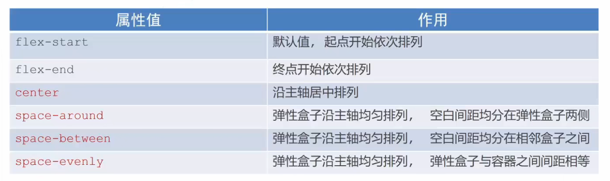

# 移动端布局及Flex布局模型

## 目录

- [移动端布局及Flex布局模型](#移动端布局及flex布局模型)
  - [目录](#目录)
  - [pc端和移动端分辨率](#pc端和移动端分辨率)
    - [pc端分辨率物理分辨率和逻辑分辨率](#pc端分辨率物理分辨率和逻辑分辨率)
    - [手机端物理分辨率和逻辑分辨率](#手机端物理分辨率和逻辑分辨率)
  - [视口](#视口)
  - [二倍图](#二倍图)
  - [百分比布局](#百分比布局)
  - [flex布局](#flex布局)
    - [flex布局的构成](#flex布局的构成)
    - [主轴对齐方式](#主轴对齐方式)
      - [主轴对齐方式测试](#主轴对齐方式测试)
    - [侧轴对齐方式](#侧轴对齐方式)
      - [侧轴对齐方式测试](#侧轴对齐方式测试)
      - [控制单个盒子的侧轴对齐方式](#控制单个盒子的侧轴对齐方式)
    - [flex伸缩比](#flex伸缩比)
    - [修改主轴方向](#修改主轴方向)
      - [修改主轴方向后修改主轴的对齐方式](#修改主轴方向后修改主轴的对齐方式)
      - [使用示例](#使用示例)
    - [弹性盒子的换行](#弹性盒子的换行)
    - [弹性盒子的侧轴对齐方式](#弹性盒子的侧轴对齐方式)
      - [效果测试](#效果测试)
      - [问题](#问题)

## pc端和移动端分辨率

### pc端分辨率物理分辨率和逻辑分辨率

- pc端常见分辨率-**物理分辨率**
  - 1920x1080
  - 1366x760
- pc端设置按比例缩放后的分辨率-**逻辑分辨率**
  - 缩放150%后的分辨率：(1920/150%)x(1080/150%)


- 写html时应该参考**逻辑**分辨率

### 手机端物理分辨率和逻辑分辨率


## 视口

- 一些概念

    ```
    1.什么是视口?
        视口简单理解就是可视区域大小我们称之为视口
        在PC端，视口大小就是浏览器窗口可视区域的大小
        在移动端, 视口大小并不等于窗口大小, 移动端视口宽度被人为定义为了980

    2.为什么是980而不是其他的值?
        **因为过去网页的版心都是980**
        乔老爷子为了能够让网页在移动端完美的展示, 所以将iOS手机视口的大小定义为了980
        后来谷歌也觉得这是一个非常牛X的方案, 所以Android手机的视口也定义为了980

    3.移动端自动将视口宽度设置为980带来的问题
        虽然移动端自动将视口宽度设置为980之后让我们可以很完美的看到整个网页
        但是由于移动端的物理尺寸(设备宽度)是远远小于视口宽度的
        所以为了能够在较小的范围内看到视口中所有的内容, 那么就必须将内容缩小
        (和前面讲解Canvas时讲解的viewbox一样, 近大远小原理)

    4.如何保证在移动端不自动缩放网页的尺寸?
        通过meta设置视口大小
        <meta name="viewport" content="width=device-width, initial-scale=1.0">
        width=device-width 设置视口宽度等于设备的宽度
        initial-scale=1.0 初始缩放比例, 1不缩放
        maximum-scale：允许用户缩放到的最大比例
        minimum-scale：允许用户缩放到的最小比例
        user-scalable：用户是否可以手动缩放
    ```

- **移动端**网页视口默认的宽是**980px**
- **PC端**网页视口默认的宽和**电脑逻辑分辨率的宽度**一致


- 使用`meta`标签设置**视口**，可以使**网页宽度**和设备的**逻辑宽度**一致

    ```html
    <meta name="viewport" content="width=device-width, initial-scale=1.0">
    ```

    

## 二倍图

- 当前移动端网页一般参考iPhone6、7、8出设计稿，然后再想办法适配其他机型
- 但由于分辨率的原因，设计稿将会按照物理分辨率设计，因为如果按照逻辑分辨率设计，一张低分辨率的图到了高分辨率的屏幕将会变得模糊不清，所以往往是设计稿用高分辨率的图，但用低分辨率的尺寸，这样经过移动端浏览器的放大，图片的尺寸被放大后依然是清晰的，又由于其物理分辨率和逻辑分辨率**往往是**二倍的关系，所以这样的设计稿的图称为**二倍图**
- 所以结论就是当设计稿中页面宽度为750px时,其实际尺寸应该写375px

- 需要注意的是，pc端的设计图也存在二倍图，如果设计图标识网页宽度为3840px，则其实际宽度很可能是1920px

## 百分比布局

- 过去普遍使用的一种布局
- 百分比布局也叫流式布局
- 具体就是盒子的宽度取百分比，高度取固定值
- 效果：宽度自适应，高度固定


## flex布局

- flex布局也叫弹性布局
- 是一种**浏览器提倡**的**布局模型**
- 非常适合结构化的布局模型
- 布局网页更简单、灵活
- 能够避免浮动脱标的问题
- flex是专门用来布局的模型
- 而浮动一开始只是为了文字环绕效果而开发的，并不是专门用来做布局的
- 对于ie浏览器不兼容
- 查看是否兼容[caniuse.com](https://caniuse.com)

### flex布局的构成


- 设置方式：父元素添加`display:flex`
- 作用：设置后子元素可以自动的挤压或拉伸
- 各组成部分的名称
  - **弹性容器** ：显示模式为flex的父元素
  - **弹性盒子** ：子元素
  - **主轴** ： **默认** 在水平方向
  - **侧轴/交叉轴** ： **默认** 在垂直方向

### 主轴对齐方式

- 在flex布局模型中，调节主轴或侧轴的对齐方式可以设置盒子之间的间距
- 属性名：`justify-content`
- 属性值：
- **当主轴方向为默认方向时，`justify-content`控制水平方向对齐方式**

#### 主轴对齐方式测试

- 主轴对齐方式justify-content:flex-start 左对齐

<div id="textFlex1">
    <div>flex-start</div>
    <div>flex-start</div>
    <div>flex-start</div>
    <div>flex-start</div>
</div>
<style>
    #textFlex1{
        display: flex;
        background-color:gray;
        justify-content: flex-start;
    }
    #textFlex1 div{
        width: 100px;
        height: 100px;
        /*line-height: 100px;*/
        background-color:green;
        border: 1px solid white;
    }
</style>

- 主轴对齐方式justify-content:flex-end 右对齐

<div id="textFlex2">
    <div>flex-end</div>
    <div>flex-end</div>
    <div>flex-end</div>
    <div>flex-end</div>
</div>
<style>
    #textFlex2{
        display: flex;
        background-color:gray;
        justify-content:flex-end;
    }
    #textFlex2 div{
        width: 100px;
        height: 100px;
        /*line-height: 100px;*/
        background-color:green;
        border: 1px solid white;
    }
</style>
* 主轴对齐方式justify-content:flex-center 弹性盒子居中 两边留白
<div id="textFlex3">
    <div>center</div>
    <div>center</div>
    <div>center</div>
    <div>center</div>
</div>
<style>
    #textFlex3{
        display: flex;
        background-color:gray;
        justify-content:center;
    }
    #textFlex3 div{
        width: 100px;
        height: 100px;
        /*line-height: 100px;*/
        background-color:green;
        border: 1px solid white;
    }
</style>

- 主轴对齐方式justify-content:flex-around 弹性盒子的周围留白

<div id="textFlex4">
    <div>space-around</div>
    <div>space-around</div>
    <div>space-around</div>
    <div>space-around</div>
</div>
<style>
    #textFlex4{
        display: flex;
        background-color:gray;
        justify-content:space-around;
    }
    #textFlex4 div{
        width: 100px;
        height: 100px;
        /*line-height: 100px;*/
        background-color:green;
        border: 1px solid white;
    }
</style>

- 主轴对齐方式justify-content:flex-between 弹性盒子的之间留白

<div id="textFlex5">
    <div>space-between</div>
    <div>space-between</div>
    <div>space-between</div>
    <div>space-between</div>
</div>
<style>
    #textFlex5{
        display: flex;
        background-color:gray;
        justify-content:space-between;
    }
    #textFlex5 div{
        width: 100px;
        height: 100px;
        /*line-height: 100px;*/
        background-color:green;
        border: 1px solid white;
    }
</style>

- 主轴对齐方式justify-content:flex-evenly 弹性盒子的之间和两边留相同宽度的白

<div id="textFlex6">
    <div>space-evenly</div>
    <div>space-evenly</div>
    <div>space-evenly</div>
    <div>space-evenly</div>
</div>
<style>
    #textFlex6{
        display: flex;
        background-color:gray;
        justify-content:space-evenly;
    }
    #textFlex6 div{
        width: 100px;
        height: 100px;
        /*line-height: 100px;*/
        background-color:green;
        border: 1px solid white;
    }
</style>

### 侧轴对齐方式

- 属性名align-items **添加给弹性容器**，控制**所有**盒子的侧轴对齐方式
- 属性名align-self **添加给弹性盒子**,控制**单个**盒子的侧轴对齐方式

- **当主轴方向为默认方向时，`align-self`控制垂直方向对齐方式**

#### 侧轴对齐方式测试

- 侧轴对齐方式`align-items:flex-start` 弹性盒子的顶对齐

<div id="textFlex7">
    <div>space-start</div>
    <div>space-start</div>
    <div>space-start</div>
    <div>space-start</div>
</div>
<style>
    #textFlex7{
        display: flex;
        background-color:gray;
        justify-content:space-evenly;
        align-items: flex-start;
        height: 150px;
    }
    #textFlex7 div{
        width: 100px;
        height: 100px;
        /*line-height: 100px;*/
        background-color:green;
        border: 1px solid white;
    }
</style>
* 侧轴对齐方式 `align-items:flex-end` 弹性盒子的底对齐
<div id="textFlex8">
    <div>space-end</div>
    <div>space-end</div>
    <div>space-end</div>
    <div>space-end</div>
</div>
<style>
    #textFlex8{
        display: flex;
        background-color:gray;
        justify-content:space-evenly;
        align-items: flex-end;
        height: 150px;
    }
    #textFlex8 div{
        width: 100px;
        height: 100px;
        /*line-height: 100px;*/
        background-color:green;
        border: 1px solid white;
    }
</style>

- 侧轴对齐方式`align-items:center` 弹性盒子垂直居中对齐

<div id="textFlex9">
    <div>space-center</div>
    <div>space-center</div>
    <div>space-center</div>
    <div>space-center</div>
</div>
<style>
    #textFlex9{
        display: flex;
        background-color:gray;
        justify-content:space-evenly;
        align-items:center;
        height: 150px;
    }
    #textFlex9 div{
        width: 100px;
        height: 100px;
        /*line-height: 100px;*/
        background-color:green;
        border: 1px solid white;
    }
</style>

- 侧轴对齐方式`align-items:stretch` 弹性盒子**没有高度时**，将被拉长至铺满高度

<div id="textFlex10">
    <div>space-stretch</div>
    <div>space-stretch</div>
    <div>space-stretch</div>
    <div>space-stretch</div>
</div>
<style>
    #textFlex10{
        display: flex;
        background-color:gray;
        justify-content:space-evenly;
        align-items:stretch;
        height: 150px;
    }
    #textFlex10 div{
        width: 100px;
        /*height: 100px;*/
        background-color:green;
        border: 1px solid white;
    }
</style>

#### 控制单个盒子的侧轴对齐方式

<div id="textFlex11">
    <div>space-center</div>
    <div style="align-self:flex-end;">flex-end</div>
    <div>space-center</div>
    <div>space-center</div>
</div>
<style>
    #textFlex11{
        display: flex;
        background-color:gray;
        justify-content:space-evenly;
        align-items:center;
        height: 150px;
    }
    #textFlex11 div{
        width: 100px;
        height: 100px;
        /*line-height: 100px;*/
        background-color:green;
        border: 1px solid white;
    }
</style>

### flex伸缩比

- 语法格式: `flex:数值;`
- 表示占用父盒子的剩余尺寸的份数

<div id="textFlex12">
    <div>宽50px</div>
    <div>不指定宽，靠内容撑开</div>
    <div>flex: 2;剩余部分的2份</div>
    <div>flex: 4;剩余部分的4份</div>
</div>
<style>
    #textFlex12{
        display: flex;
        background-color:gray;
        justify-content:space-evenly;
        align-items:center;
        height: 150px;
    }
    #textFlex12 div{
        height: 100px;
        /*line-height: 100px; */
        background-color:green;
        border: 1px solid white;
    }
    #textFlex12 div:nth-child(1){
        width: 80px;
    }
    #textFlex12 div:nth-child(2){
        /* 不指定宽*/
    }
    #textFlex12 div:nth-child(3){
        flex: 2;
    }
    #textFlex12 div:nth-child(4){
        flex: 4;
    }
</style>

### 修改主轴方向

- 作用：修改主轴方向，实现子元素垂直排列
- 属性名：`flex-direction`
- 属性值：
    
- 主轴修改为垂直方向后，水平方向的轴就是侧轴

#### 修改主轴方向后修改主轴的对齐方式

- 主轴修改为垂直方向后，想要控制主轴（垂直方向）的对齐方式依然使用`justify-content`属性
- 主轴修改为垂直方向后，想要控制侧轴（水平方向）的对齐方式依然使用`align-items`属性

#### 使用示例

<div id="textFlex13">
    <div>justify-content:flex-start</div>
    <div>justify-content:flex-start</div>
    <div>justify-content:flex-start</div>
</div>
<style>
    #textFlex13{
        display: flex;
        flex-direction: column;
        height: 300px;
        background-color:gray;
        justify-content: flex-start;
    }
    #textFlex13 div{
        /*width: 300px; */
        height: 50px;
        /* line-height: 100px; */
        background-color:green;
        border: 1px solid white;
    }
</style>
<br>
<div id="textFlex14">
    <div>justify-content:space-around; align-items:center;</div>
    <div>justify-content:space-around; align-items:center;</div>
    <div>justify-content:space-around; align-items:center;</div>
</div>
<style>
    #textFlex14{
        display: flex;
        flex-direction: column;
        height: 300px;
        background-color:gray;
        justify-content:space-around;
        align-items:center;
    }
    #textFlex14 div{
        /* width: 300px; */
        height: 50px;
        /* line-height: 100px;*/
        background-color:green;
        border: 1px solid white;
    }
</style>

### 弹性盒子的换行

- 默认情况下，当**弹性容器**的一行之内不能容纳下所有**弹性盒子**时，弹性盒子的**宽**会**缩小**
- 使用`flex-wrap`属性可以实现弹性盒子的换行排列效果
- 取值：
  - `no-wrap` 默认值
    - 弹性盒子会受到挤压，设定的宽度会失效
    - 
  - `wrap` 换行
    - 弹性盒子的尺寸不会受到挤压，会在弹性容器容纳不下时换行
    - 
      - 水平方向末尾留下了多余空间因为justify-content（主轴方向对齐方式）默认值是justify-content:flex-start）
      - 垂直方向行间留下了多余空间 这是因为align-content(侧轴方向对齐方式)默认值的影响）

### 弹性盒子的侧轴对齐方式

- 属性名`align-content`
- 属性值：和主轴对齐方式`justify-content`的取值几乎一致（没有`space-evenly`）
- 默认情况下，弹性盒子是不换行的，所以设置侧轴对齐方式会看不到效果，要先设置`flex-wrap:wrap;`属性后才能看到效果

#### 效果测试

<div id="textFlex15">
    <div>123</div>
    <div>123</div>
    <div>123</div>
    <div>123</div>
    <div>123</div>
    <div>123</div>
    <div>123</div>
    <div>123</div>
    <div>123</div>
    <div>123</div>
    <div>123</div>
    <div>123</div>
    <div>123</div>
    <div>123</div>
    <div>123</div>
</div>
<style>
    #textFlex15{
        display: flex;
        flex-wrap:wrap;
        justify-content:center;
        align-content:center;
        /*justify-items: center; */
        /* align-items: center; */
        /* height: 300px; */
        /* width: 300px;*/
        background-color:gray;
        align-items:center;
    }
    #textFlex15 div{
        width: 50px;
        height: 50px;
        margin:5px;
        background-color:green;
        border: 1px solid white;
    }
</style>

#### 问题

- 如何处理最后一行不能左对齐的问题？

