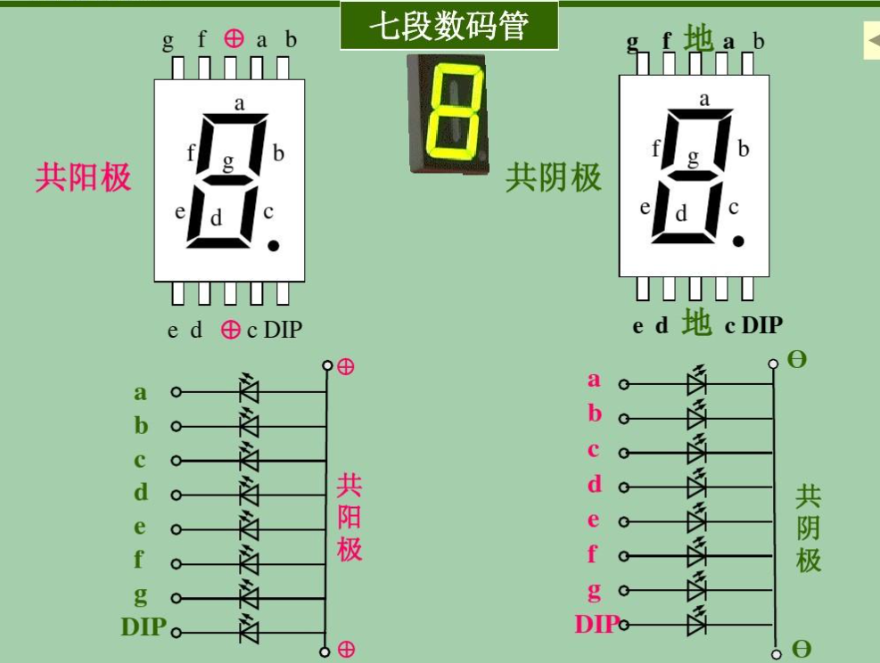
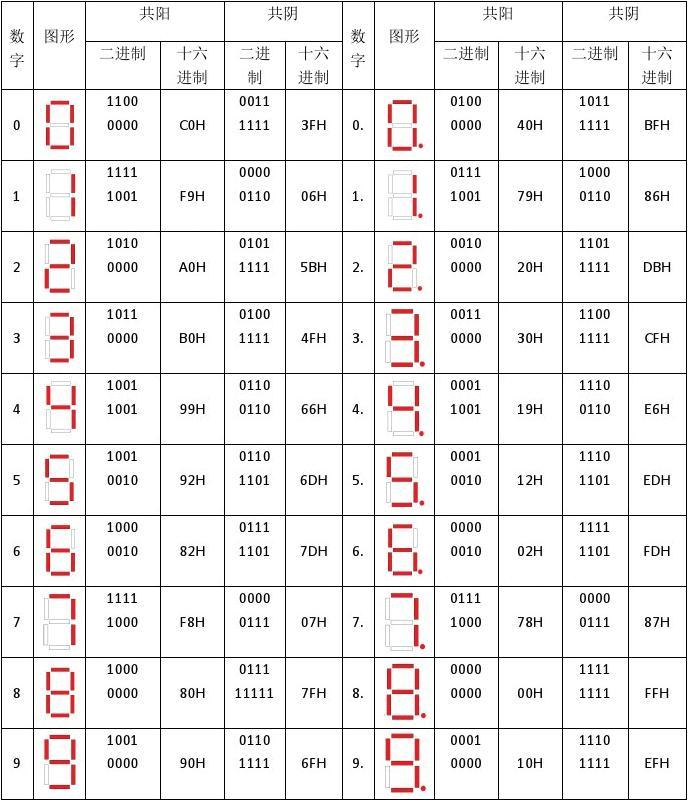
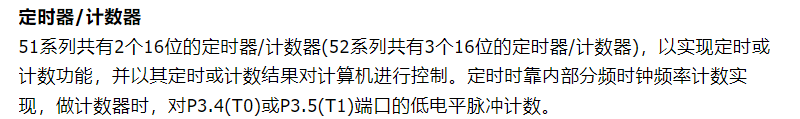
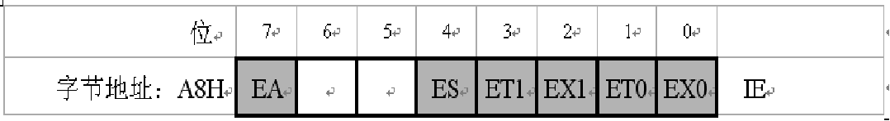
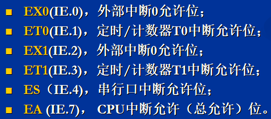
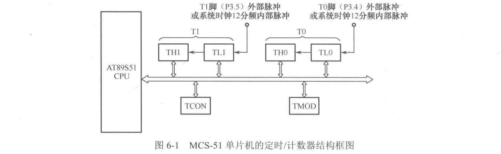
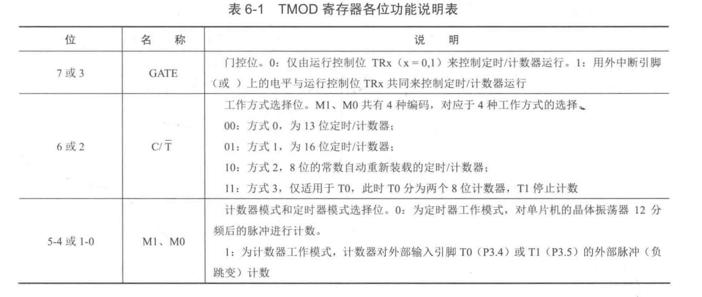

1. C语言中最简单的数据类型包括 : 整型 、实型、字符型
2. 51单片机时序单位从小到大是 拍节、状态、机器周期,指令周期

   - 2拍节—>1状态
   - 6状态—>1机器周期
   - 1—4机器周期—>1指令周期

3. 七段共阴极数码管显示字符‘P’、’H’,’L’，段码应为

   ```
   P:
   .gfedcba
   01110011 = 0x73
   H:
   .gfedcba
   01110110 = 0x76
   ```

   
   

4. 4、MCS-51单片机内部有2 个16位定时器/计数器。
   - 
5. 单片机程序存储器的寻址范围是由`程序计数器PC`的位数决定的，MCS-51的PC为16位，其寻址范围是`64K`。
   - $2^{16}=65536=2^{6+10}=2^{6}*a^{10}=64*1K=64K$
6. 控制串行口工作方式的寄存器是`SCON`
7. 定时器工作方式的寄存器是`TMOD`
8. 在51单片机单片机中 中断屏蔽位是

   ```
   开关  EA   中断总开关
   串口  ES   串口中断开启位
   INT0  EX0  外部中断0
   T0    ET0  内部定时器中断0
   INT1  EX1  外部中断1
   T1    ET1  内部定时器中断1
   ```

   - CPU对中断系统所有中断以及某个中断源的开放和屏蔽是由中断允许寄存器IE控制的。
   - 
   - 
   - 基本的 5 个中断：INT0、INT1、定时器 0/1，串口中断）
9. 定时器/计数器工作方式
   - 4种工作方式：
     - 0是13位计数结构
     - 1是16位计数结构。
     - 2是8位计数器结构
     - 3是2个8位计数器结构（定时器0）
   - 
   - 定时/计数器T0由特殊功能寄存器TH0、TL0构成，
   - 定时/计数器T1由特殊功能寄存器TH1、TL1构成。
   - 定时/计数器具有两种工作模式、4种工作方式(方式0、方式1、方式2和方式3)，属于增计数器。
   - TMOD用于选择定时/计数器T0、T1的工作模式和工作方式。
   - TCON用于控制T0、T1的启动和停止计数，同时包含了 T0、T1的状态。
   - T0、T1不论是工作在定时器模式还是计数器模式，都是对脉冲信号进行计数，只是计数信号的来源不同。
   - 
   - 
   - 方式0
     - M1、M0=00时，被设置为工作方式0
     - 方式0是13位计数器，由TLx （x=O,l）低5位和THx高8位构成。TLx低5位溢出则向THx进位，THx计数溢出则把TCON中的溢出标志位TFx置“ 1 ”。
   - 方式1
     - Ml、M0=01时，定时/计数器工作于方式1
     - 方式1和方式0的差别仅仅在于计数器的位数不同，方式1为16位计数器，由THx高8位和TLx低8位构成（x=0，1），方式0则为13位计数器，有关控制状态位的含义（GATE、C/〒、TFx、TRx）与方式0相同。
   - 方式2
     - 当Ml、M0为10时，定时/计数器处于工作方式2
   - 方式3
