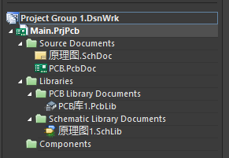
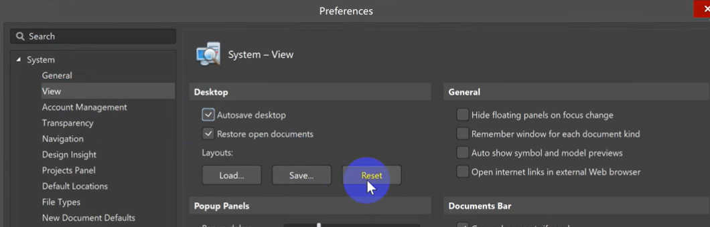
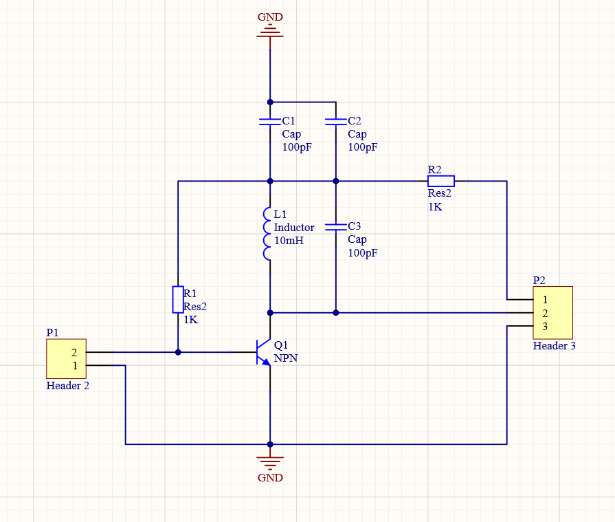
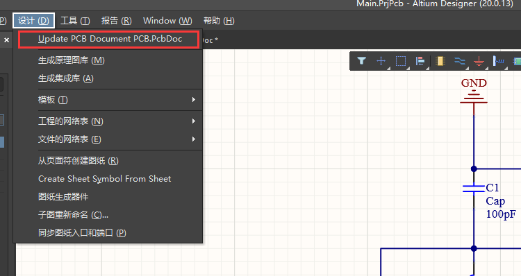
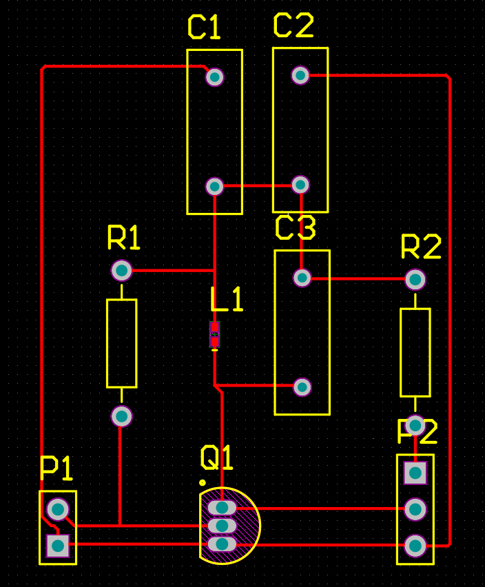

# Altium Designer学习笔记

> 发现就是些软件操作的讲解，看一遍就会了。

## 目录

- [Altium Designer学习笔记](#altium-designer学习笔记)
  - [目录](#目录)
  - [工程创建](#工程创建)
  - [原理图绘制测试](#原理图绘制测试)

## 工程创建

**项目的创建及文件后缀名的含义**

**恢复默认页面布局**

## 原理图绘制测试

