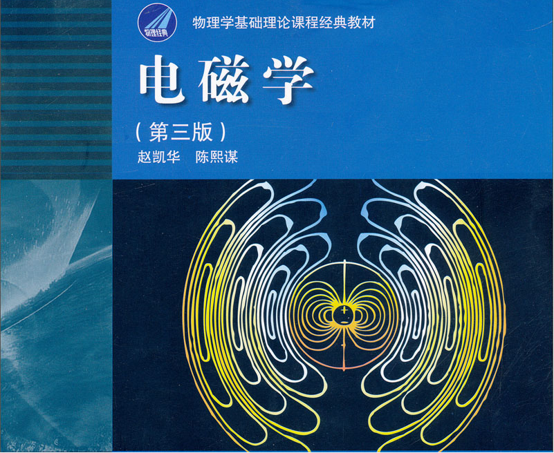

# 电磁学学习笔记

> 重点内容
>
> - 发现的过程-研究方法
> - 电磁场理论

## 目录

- [电磁学学习笔记](#电磁学学习笔记)
  - [目录](#目录)
  - [库仑定律](#库仑定律)
  - [场强叠加原理](#场强叠加原理)

## 库仑定律

> 以此为例了解一个物理定律内含和外延
>
> - 观察到一些重要的现象
> - 然后提出一系列重要的研究课题
> - 猜结果
> - 设计实验、测量
> - 发现规律
> - 定义新物理量
> - 给出公式（定量表述）
> - 成立条件

## 场强叠加原理

