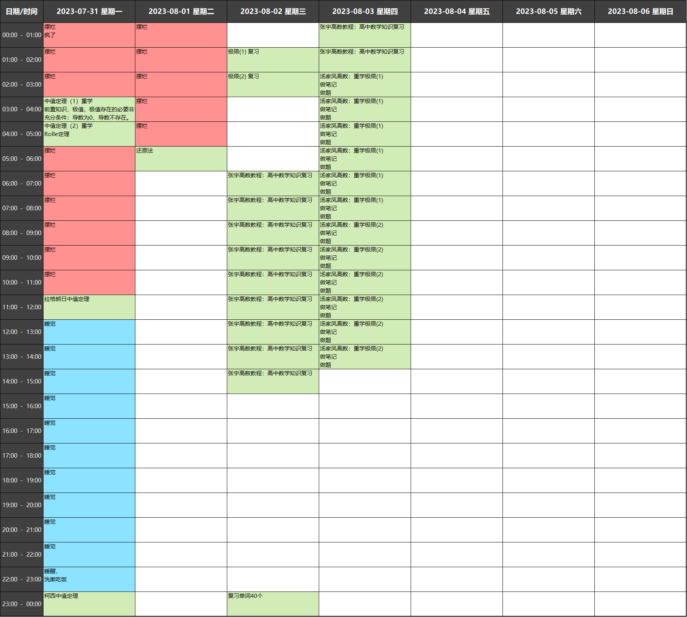
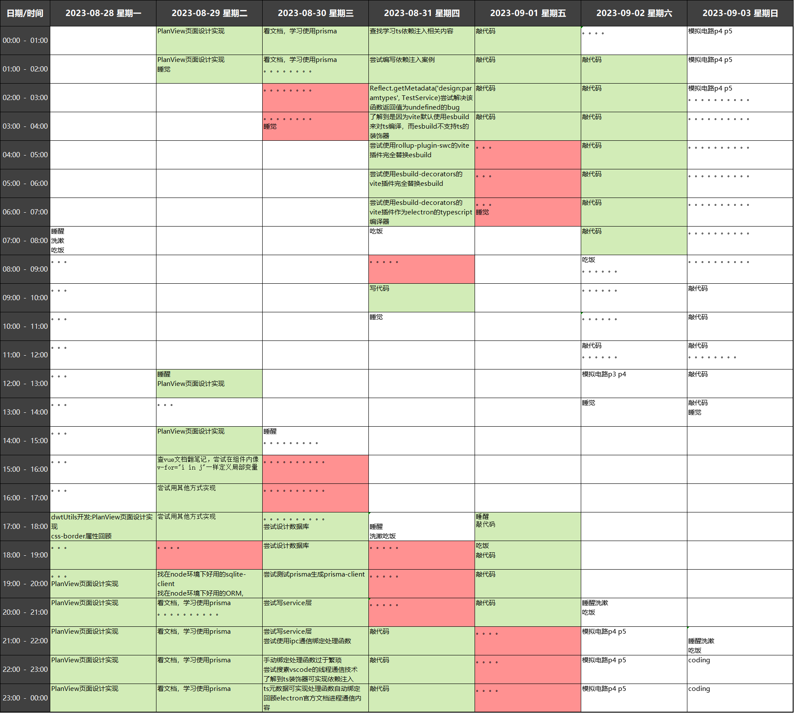
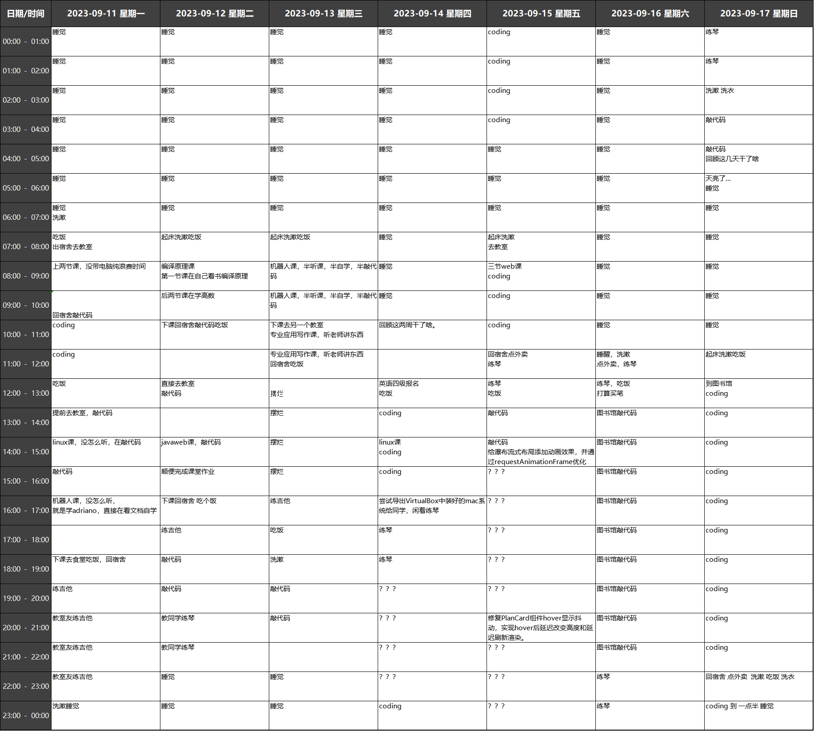
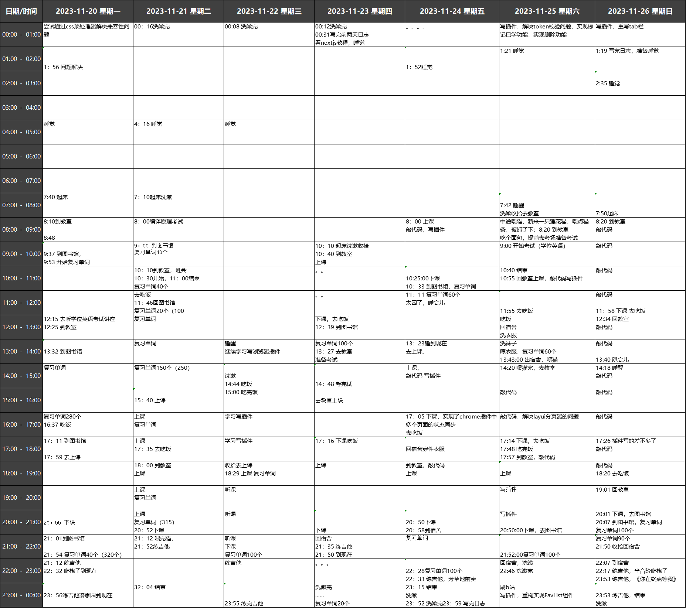

# 2023年日志

## 目录

- [2023年日志](#2023年日志)
  - [目录](#目录)
  - [一月](#一月)
  - [二月](#二月)
  - [三月](#三月)
  - [四月](#四月)
  - [五月](#五月)
  - [六月](#六月)
  - [七月](#七月)
  - [八月](#八月)
  - [九月](#九月)
  - [十月](#十月)
  - [十一月](#十一月)
  - [十二月](#十二月)

<!-- > 今天是 2023 年 2 月 11 日，开学在即，回顾开年来这过去的一个多月里做成的事，发现并不多，学习效率不高，浪费时间的情况也比较严重，还是决定继续用这种方式来约束自己，定月度目标，实事求是，记录自己每天做了什么，每天都应当反思自己有没有朝着目标前进，有没有浪费时间，有没有虚度。痛苦是逃不掉的，停在原地坦然接受这生活的摧残是痛苦的，向着理想生活奋斗的过程也注定是痛苦的，还是要选一种积极的方式，不要总是活成一副废物模样。 -->

**年度目标**

- ✅ 算法刷题 备战蓝桥杯
- ⬜ 背完四六级词汇过学位英语和四级英语
- ✅ 学习 Spring 等的相关技术
- ⬜ 学完高等数学
- ⬜ 学完电路原理
- ⬜ 学完线性代数
- ⬜ 学完数字电路

## 一月

- ✅ 前端 2D 游戏开发学习
- ✅ 23 种设计模式学习【java 版、typescript 版】
- ✅ 打砖块小游戏实现
- ✅ 你画我猜小游戏实现
- ✅ 帧同步相关知识学习
- ✅ 球球大作战 IO 小游戏实现

## 二月

- ✅ 算法基础知识复习完
- ❌ 算法基础提升课程学完
- ✅ 每天至少复习 50 个单词
- ❌ 汤家凤高数零基础领学课学完
- ❌ 每天至少学一节电子课

**日志**

- **11 号**
  - 图的迪杰斯特拉算法学习
  - 复习高数基础课 1 集
  - 同济教材章节习题刷题
- **12 号**
  - 补昨天应当复习的 50 个单词
  - 复习单词 50 个
  - 前缀树学习及编程实现
  - 贪心算法学习
- **13 号**
  - 复习单词 80 个
  - n 皇后问题理解
  - 计算机组成原理-强制转换、浮点数的表示
- **14 号**
  - 复习单词 60 个
  - 暴力递归概念学习
  - 蓝桥杯公开课学习：循环、集合、刷题
- **15 号**
  - 复习单词 60 个
  - 蓝桥杯公开课学习：求质数、冒泡排序、选择排序、插入排序、递归算法、排列组合、回溯法、邻里交换法、暴力解法、动态规划。
- **16 号**
  - 复习单词 100 个
  - 蓝桥杯 2013 年-java-B 组第 1、3、4、5 题刷题
- **17 号**
  - 复习单词 100 个
  - 蓝桥杯 2013 年-java-B 组第 2、6、7、8、9 题刷题
- **18 号**
  - 复习单词 100 个
  - 蓝桥杯 2013 年-java-B 组第 10 题刷题
  - 蓝桥杯 2014 年-java-B 组第 1、2、3、4、5、6、7 题刷题
- **19 号**
  - 收拾行李去学校
  - 复习单词 100 个
  - 蓝桥杯 2014 年-java-B 组第 8 题刷题
- **20 号**
  - 上午、下午 6 节课。
  - 复习单词 180 个
  - 蓝桥杯 2014 年-java-B 组第 9 题刷题
- **21 号**
  - 复习单词 126 个
  - 蓝桥杯 2014 年-java-B 组第 10 题【矩阵翻硬币】刷题
  - 蓝桥杯 2015 年-java-B 组第 1、2、3、5 题刷题
- **22 号**
  - 复习单词 254 个
  - ？？？
- **23 号**
  - 复习单词 100 个
  - 尝试配置 voscode tunnel
- **24 号**
  - 复习单词 0 个
  - 蓝桥杯 2015 年-java-B 组第 4、6、7、8 题刷题
- **25 号**
  - 复习单词 200 个
  - 打一下午羽毛球
- **26 号**
  - 复习单词 60 个
  - 周日，睡到中午，弄一下午手势识别项目，
  - 晚上改洛依的前端框架
- **27 号**
  - 复习单词 40 个
  - 周一，混一天课，弄一天翻页效果，重写手势识别源码。
- **28 号**
  - 复习单词 200 个
  - 周二，睡到中午，上一下午.net 课，顺便复习单词，晚上和周吹牛。
  - 蓝桥杯 2015 年-java-B 组第 9 题刷题
  - springBoot 学习，大概内容看了一遍

## 三月

- ⬜ 蓝桥杯历年真题全部刷完
- ⬜ 算法基础学完

**日志**

- **1 号**
  - 早上软件工程课，没座位，坐第一排，老师疯狂咳嗽，疑似甲流
  - 课上学 springBoot，大概内容看了一遍
  - 复习单词 200 个
  - 晚上开始学 SSM 框架
- **2 号**
  - 复习单词 100 个
  - 这天干啥了？？？
  - 晚上尝试在 SpringFramework 中使用容器来创建和管理对象
- **3 号**
  - 复习单词 120 个
  - 下午没课和室友出去玩儿，万象城吃饭，逛天德湖公园各种馆
- **4 号**
  - 复习单词 80 个
  - 凌晨两点找周抱怨没空比赛。
- **5 号**
  - 周日，早上 SYB 课，和周抱怨没空比赛。
  - 写手势识别翻页电子书的说明文档并整理源代码
  - 成功推脱掉比赛。
  - 我干啥了？？？
  - 摆烂一天？？？
  - 这几天我都在干嘛，效率这么低？？？？
- **6 号**
  - 早上的课停课，睡到 10 点去上操作系统课
  - 上课看王道操作系统视频课 p1~p2
  - 12 点下课，洗衣服，点外卖，吃午饭
  - 下午停课，打羽毛球【场地有人】，还实验室钥匙，帮学姐改毕设代码
  - 回宿舍 晾衣服
  - 蓝桥杯 2015 年-java-B 组第 10 题刷题
  - 去食堂吃饭，晚上 SYB 创业指导课。
  - 上课摆烂，继续蓝桥杯刷题
    - 蓝桥杯 2016 年-java-B 组第 1、2 题刷题
      - 第二题：两种方法，枚举起止日期、枚举天数
  - 8：30 左右下课，回宿舍洗漱，躺床上继续刷题
    - 蓝桥杯 2016 年-java-B 组第 3 题刷题
      - 尝试了三种可行的方法，卡在一个 bug 上两个小时
  - 现在，7 号，凌晨 2:00，回忆并记录前 7 天做了什么......
- **7 号**
  - 周二，上午人工智能基础，刷题
    - 蓝桥杯 2016 年-java-B 组第 4、5 题刷题
    - 电脑没电了，复习单词 40 个
  - 下午，python 课，刷题
    - 蓝桥杯 2016 年-java-B 组第 6、7 题刷题
      - 7：（写完一半有 bug）
  - 晚上，刷题
    - 蓝桥杯 2016 年-java-B 组第 7、8 题刷题
      - 7：修 bug
      - 8：勉强看懂题
  - 00:11 太困，睡觉。
- **8 号**
  - 上午
    - Android 课，摆烂
    - 蓝桥杯 2016 年-java-B 组第 8 题刷题
      - 编程实现第 8 题，
      - 然后改 bug
      - 笔记本没电了，听课，完成课堂作业，编程实现 Android 端计算器软件。
  - 中午
    - 第 8 题，优化为记忆型递归，
    - 吃饭，
    - 提前去教室找能给电脑充电的位置
  - 下午
    - 创业理论课，摆烂
    - 蓝桥杯 2016 年-java-B 组第 9 题刷题
    - 蓝桥杯 2016 年-java-B 组第 10 题刷题
      - 直观解法
  - 晚上
    - 看 蓝桥杯 2016 年-java-B 组第 10 题的题解，学习并尝试理解最优解法
    - 睡会觉
    - 学习并尝试实现线段树的
      - insert 方法，非递归版，
      - search 方法，非递归版，不能查询横跨中间节点的区间。
    - 凌晨 1：37 关电脑
- **9 号**
  - 上午
    - 软件工程课,摆烂
    - Android 开发课,摆烂
    - 蓝桥杯 2016 年-java-B 组第 10 题
      - 尝试实现最优解法
      - 尝试实现线段树的 query 的方法，没想通。
  - 中午：
    - 想通了....
      - 三种情况
      - 如果要查询的区间为 [targetLeft,targetRight]
      - 要查询的区间在左子树，则去左子树查询，
      - 要查询的区间在右子树则去右子树查询
      - 要查询的区间横跨当前区间的中点 mid，则分别查询左右子树的区间：[targetLeft,mid] [mid+1,targetRight]
  - 下午：
    - 操作系统课，浅听，做课堂作业
    - 实现线段树的 query 的方法，递归版，能查询横跨中间节点的区间。
    - 实现线段树 insert 操作，递归版
  - 晚上：
    - 蓝桥杯 2017 年-java-B 组第 1 题 [做过的题]
    - 蓝桥杯 2017 年-java-B 组第 2 题 [做过的题]
    - 蓝桥杯 2017 年-java-B 组第 3 题 [没做出来]
- **9 号**
  - 上午，
    - 睡到大概 10 点
    - 左程云的算法基础提升课，
      - hash 函数
  - 中午，吃饭
  - 下午，
    - hash 表的实现原理
    - 利用 HashTable 设计 RandomPool
    - 学不动了，学校溜达
    - 喂猫
    - 吃饭
    - 6 点，SYB 课，摆烂
      - bitMap 位图的简易实现
      - 电脑没电了...
      - 复习单词 140 个
      - 九点下课
  - 晚上
    - 洗漱
    - 和室友玩狼人杀到 11 点半
    - 理解并整理 BloomFilter(布隆姆过滤器)的原理
- **10 号**
  - 周五，无课，睡到几点？
  - 中午
    - ？？？？？
  - 下午
    - ？？？？？？？我在干吗？
    - 喂猫，本学期第一次见到橘子
  - 晚上
    - SYB 课，上到 9 点，上课我在干嘛？？？
      - 嫌电脑耗电太严重，
      - 开始清理电脑，
      - 关闭一切不用的服务，然后等电脑重启应用更新...
      - 复习单词 140 个
    - 洗漱
    - 清理电脑 C 盘 腾出 40 个 G
    - 卸载一切无用软件，微软的数据库、Adobe、Virtual Code
    - 清理 D 盘,腾出 40 多 G...
- **11 号**
  - 周六，无课，睡到中午？
  - 中午
    - 喂猫，没看到橘子，喂了教育技术楼对面的橘猫，怕人
    - 点外卖吃饭
  - 下午
    - ？？？？？？？我在干吗？
    - 尝试各种方法给电脑重装 iTnues、iCloud。
    - 尝试重新给手机越狱
    - 尝试配置 jitterbug 控制 ipad 开启 JIT
    - 安装 UTM 下载安装 Ubuntu14 server 并尝试配置
- **12 号**
  - 周日，无课，睡到中午几点？
  - 中午
    - ？？？我做什么了？？？
  - 下午
    - ？？？我做什么了？？？
    - 尝试在 ipad 的 UTM 上安装 Ubuntu14 并配置
    - 尝试在 ipad 的 UTM 上安装 Ubuntu22.04
  - 晚上
    - SYB 课，上到 9 点
      - 又没抢到有插座的位置
      - 尝试进 Linux 系统，省电，linux 的 java 环境没配置，烦死了，关电脑，放弃。
      - 继续尝试在 ipad 的 UTM 上安装 Ubuntu22.04、code-server、nodejs、jdk
    - 气死了 一晚上就这么过去了。
  - 气死了 一天就这么过去了。
- **13 号**
  - 周一，
  - 上午
  - 单片机课
    - 摆烂？？？？？，
    - 我干啥了？？？
    - 复习单词 80 个
  - 操作系统课，摆烂
    - 尝试编程实现 Bloom 过滤器。
- 中午
  - ？？？？？？
- 下午
  - .net 网页课，
    - 摆烂？？我干啥了？？？
    - 做课堂作业
  - 喂猫，第二次见橘子...
  - 点外卖吃饭
- 晚上
  - 补算法学习笔记：一致性 Hash 原理
  - 填入党积极分子培训登记表
  - 补算法学习笔记：一致性 Hash 的改进
  - 努力回忆这几天干了什么，这几天简直太浪费时间了。
  - 时间：00:49
  - 并查集原理学习。
- **14 号**
  - 周二
  - 上午，人工智能课，摆烂
    - 并查集的代码实现
  - 中午
    - ？？？？
  - 下午
    - Python 课
    - KMP 算法的理解...
  - 晚上
    - SYB 课
    - 累....
    - KMP 算法的理解...
    - 9:00 下课....
- **15-19号**
  - 5天....???
  - 想哭了，我在干嘛？
  - KMP算法的实现
  - ManACher算法的理解和实现
  - 复习单词140个
  - 滑动窗口、单调栈的痛苦理解....
  - 2017年蓝桥杯省赛JavaB组第3题的刷题
  - 2022年蓝桥杯省赛JavaB组第1题的刷题
  - 2022年蓝桥杯省赛JavaB组第2题的试错....
- **20日**
  - 复习单词200个
- **21日**
  - 复习单词142个
  - 【红客研习社】2021蓝桥杯JAVA算法特训课学习，递归与循环
    - 2023/3/21 22:19 *01*简单循环改递归.java
    - 2023/3/21 22:37 *02*递归求解数组元素和.java
    - 2023/3/21 23:06 *03*递归判断串相等1.java
    - 2023/3/21 23:06 *03*递归判断串相等2.java
    - 2023/3/21 23:49 \_04_N取M个有多少取法.java
    - 2023/3/22 00:13 *05*求N个元素的全排列.java
    - 2023/3/22 00:31 *06*求两个串的最长公共子序列.java
    - 2023/3/22 00:45 *07*递归求解反串.java
    - 2023/3/22 01:02 *08*杨辉三角形.java
    - 2023/3/22 01:29 *09*排列问题.java
    - 2023/3/22 02:41 *10*整数划分.java
- **22日**
  - 【红客研习社】2021蓝桥杯JAVA算法特训课学习，浮点数、整数
    - 2023/3/22 09:42 *11*漏掉的金额.java
    - 2023/3/22 10:05 *12*谨慎使用浮点数.java
    - 2023/3/22 10:07 *13*啤酒和饮料.java
    - 2023/3/22 11:55 *14*比酒量\_暴力法.java
    - 2023/3/22 11:50 *14*比酒量\_递归法.java
    - 2023/3/22 12:37 *15*有理分数的完整实现.java
    - 2023/3/22 13:23 *16*浮点数特殊值.java
    - 2023/3/22 13:45 *17*四舍六入五成双.java
    - 2023/3/22 14:54 *18*最大公约数.java
    - 2023/3/22 14:55 *19*最小公倍数.java
    - 2023/3/22 16:17 *20*求a的n次幂.java
    - 2023/3/22 18:16 *21*买不到的数目.java
    - 2023/3/23 01:17 *22*快速求第k位素数\_埃氏筛法.java
    - 2023/3/23 01:17 *22*快速求第k位素数\_欧拉筛.java
    - 2023/3/23 02:11 *23*不定方程的优化解法1.java
    - 2023/3/23 02:30 *23*不定方程的优化解法2.java
    - 2023/3/23 02:11 *23*不定方程的暴力枚举解法.java
    - 2023/3/23 03:42 *24*买不到的数\_不定方程.java
    - 2023/3/23 03:45 *24*买不到的数\_数组法.java
    - 2023/3/23 05:37 *25*花朵数.java
    - 2023/3/23 04:22 *25*花朵数\_错误暴力解法.java
    - 2023/3/23 05:44 【红客研习社】2021最新的 蓝桥杯JAVA算法特训课学习笔记.md
    - 凌晨六点睡觉
- **23日**
  - 早上七点半起床
  - 2023/3/23 14:22 *26*六角幻方.java
  - 2023/3/23 10:55 *27*概率模拟生日重复.java
  - 2023/3/23 16:12 *28*扑克点数24.java
  - 中途补觉睡到晚上十点
  - 2023/3/24 00:31 *29*高僧斗法.java
  - 2023/3/24 02:01 【红客研习社】2021最新的 蓝桥杯JAVA算法特训课学习笔记.md
  - 2023/3/24 02:41 *01*李白打酒.java
  - 2023/3/24 04:40 *02*大数阶乘.java
  - 2023/3/24 04:40 某年计算机编程大赛赛前培训学习笔记.md
  - 凌晨五点睡觉
- **24日**
  - 睡到下午三点
  - 2023/3/24 2:41 *01*李白打酒.java
  - 2023/3/24 4:40 *02*大数阶乘.java
  - 2023/3/25 8:28 *03*单词拼接.java
  - 2023/3/25 4:10 *04_ACM导弹拦截*依次得知高度信息.java
  - 2023/3/25 5:27 *05_ACM导弹拦截*错误解法求最长递减子序列.java
  - 2023/3/25 5:29 *06_ACM导弹拦截*动态规划求最长递减子序列.java
  - 2023/3/25 7:25 *07*括号配对问题\_双栈实现.java
  - 2023/3/25 7:31 *08*括号配对问题*单栈实现*最优解.java
  - 2023/3/25 8:58 *09*吝啬的国度.java
  - 次日早上九点睡觉
- **25日**
  - 睡到下午四点
  - 2023/3/25 19:59 *09*吝啬的国度*广度优先遍历bfs*非递归实现.java
  - 2023/3/25 19:54 *09*吝啬的国度*深度优先遍历dfs*递归实现.java
  - 2023/3/25 19:53 *09*吝啬的国度*深度度优先dfs*非递归实现.java
  - 摆烂到凌晨
  - 2023/3/26 3:48 *10_01背包问题*动态规划尝试.java
  - 2023/3/26 1:31 *10_01背包问题*贪心尝试.java
  - 次日八点睡觉
- **26日**
  - 睡到下午三点
  - 2023/3/26 16:27 *11*蛇形填数.java
  - 2023/3/26 16:49 *11*蛇形填数2.java
  - 2023/3/26 18:27 *11*蛇形填数3.java
  - 洗漱、无所事事、摆烂到凌晨一点
  - 尝试做了22年javaB组省赛题，崩溃。
  - 摆烂到天亮。
- **27号**
  - 周一，上课一天，由于摆烂式熬夜一晚上，睡不着，学不动，荒废一整天
  - 然后晚上回宿舍直接睡觉，睡到晚上12点，正好到第二天凌晨，继续刷题
- **28号**
  - 洛谷题单《能力全面提升综合题单》刷题笔记/src/*01*入门阶段/*01*从零开始
    - 2023/3/28 0:54 P1421小玉买文具
    - 2023/3/28 0:57 P1909买铅笔
    - 2023/3/28 1:21 P1089津津的储蓄计划
    - 2023/3/28 2:01 P1085不高兴的津津
    - 2023/3/28 2:13 P1980级数求和
    - 2023/3/28 3:28 P1980计数问题
    - 2023/3/28 3:41 P1014Cantor表
    - 2023/3/28 5:03 P1307数字反转
  - 洛谷题单《能力全面提升综合题单》刷题笔记/src/*01*入门阶段/*02*数组基础
    - 2023/3/28 5:17 P1046陶陶摘苹果
    - 2023/3/28 5:26 P1047校门外的树
    - 2023/3/28 5:41 P1427小鱼的数字游戏
    - 2023/3/28 5:52 P2141珠心算测验
    - 2023/3/28 7:09 P5594_XR_4模拟赛
  - 洛谷题单《能力全面提升综合题单》刷题笔记/src/*01*入门阶段/*03*字符串基础
    - 2023/3/28 8:42 P5015标题统计
    - 2023/3/28 8:57 P1055_ISBN号码
    - 2023/3/28 9:24 P1308统计单词数
    - 2023/3/28 12:14 P2010\_回文日期
    - 2023/3/28 14:36 P1012\_拼数
    - 2023/3/28 15:05 P5587\_打字练习
    - 从凌晨学到下午下课，然后回宿舍直接睡，大概睡到晚上八点，然后洗漱
- **29号**
  - 凌晨0点到6点我在干嘛？？？？
  - 洛谷题单《能力全面提升综合题单》刷题笔记/src/*01*入门阶段/*04*函数\_递归及递推
    - 2023/3/29 6:55 \_01_P1028数的计算
    - 2023/3/29 8:10 *02_P1036*选数
    - 2023/3/29 9:23 \_03_P1464_Function
    - 2023/3/29 11:54 *03_P5534_XR_3*等差数列
    - 2023/3/29 12:23 *04_P1192*台阶问题\_动态规划写法
    - 2023/3/29 12:05 *04_P1192*台阶问题\_递归写法
    - 2023/3/29 14:29 *05_P1025*数的划分
    - 2023/3/29 15:41 *06_P4994*终于结束的起点
  - 洛谷题单《能力全面提升综合题单》刷题笔记/src/*02*基础算法/*01*模拟
    - 2023/3/29 18:13 \_01_P1003铺地毯
    - 2023/3/29 20:49 *01_P1003铺地毯\_2*满分
    - 2023/3/29 21:11 *01_P1003铺地毯\_3*满分
    - 2023/3/29 21:42 *02_P1067*多项式输出
    - 买了台轻量级应用服务器，安装并配置nodejs npm yarn code-server jdk v2ray
    - 凌晨5点睡觉
- **30号**
  - 洛谷题单《能力全面提升综合题单》刷题笔记/src/*02*基础算法/*01*模拟
    - 2023/3/30 9:27 *03_P1328*生活大爆炸版石头剪刀布
    - 2023/3/30 10:46 *04*玩具谜题
- **31号**
  - 六点半起床赶上七点四十的出租车乘八点十五的火车去南京
  - 坐地铁古鸡鸣寺，
  - 南京城墙
  - 玄武湖
  - 玄武门
  - 总统府
  - 南京博物院
  - 秦淮老街
  - 夫子庙

## 四月

- ⬜ 垂死挣扎最后冲刺蓝桥杯
- ⬜ 比完赛后开始准备英语四级
- ⬜ 开始学高数
- ⬜ 开始学后端框架
- ⬜ 开始学电子

**日志**

- **1号**
  - 南京，睡到九点半
  - 去新街口，德基商场
  - 去紫金山中山陵
  - 音乐台喂鸽子
  - 赶火车回学校
- **2号**
  - 2023/4/2 13:11 *05_P1042*乒乓球
  - 2023/4/2 14:07 *06_P1179*数字统计
  - 2023/4/2 14:29 *07_P2615*神奇的幻方
- **3号**
  - > 快点比完赛吧，希望不大了，没有动力了，学不动了，撑不住了。
- **4号**
  - 2023/4/4 13:51 *01_P1177*模板\_快速排序
  - 2023/4/4 13:52 *02_P1059*明明的随机数
  - 2023/4/4 14:28 *03_P1068*分数线划定
  - 2023/4/4 15:03 *04_P1051*谁拿了最多奖学金
  - 2023/4/4 15:33 *05_P1309*瑞士轮\_暴力模拟
- **5号**
  - 2023/4/5 13:49 *05_P1309*瑞士轮
  - 2023/4/5 19:28 *02*基础算法
    - 2023/4/4 13:50 *01*模拟
    - 2023/4/5 14:21 *02*排序算法
    - 2023/4/5 21:03 *03*二分答案
  - SSM框架学习
    - xml标签属性：xmlns xmlns:xsi xsi:schemaLocation的学习和理解
    - IOC入门案例的实现
    - DI入门案例的实现
    - beans的配置总结
    - bean的别名
    - 单例实例化模式和原型实例化模式
    - Bean的实例化过程
- **6号**
  - 2023/4/6 8:16 \_03_Bean的别名name配置
  - 2023/4/6 8:23 \_04_Bean的单例实例化模式和原型实例化模式配置
  - 2023/4/6 9:08 \_05_Bean的实例化过程
    - 2023/4/6 8:33 *01*通过无参构造实例化Bean
    - 2023/4/6 8:39 *02*通过静态工厂实例化Bean
    - 2023/4/6 8:52 *03*通过实例工厂实例化Bean
    - 2023/4/6 9:08 *04*通过工厂Bean实例化Bean
  - 2023/4/6 9:32 \_06_Bean的生命周期控制\_xml配置方式
  - 2023/4/6 9:56 *07_Bean的生命周期控制*实现Spring接口方式
  - 2023/4/6 11:38 \_08\_\_依赖注入\_setter注入基本数据类型和引用数据类型
  - 2023/4/6 11:17 \_09\_\_依赖注入\_contructor注入基本数据类型和引用数据类
    型
  - 2023/4/6 14:19 *10\_\_依赖注入*自动装配
  - 2023/4/6 14:51 *11\_\_依赖注入*集合的注入
- **7号**
  - 睡到中午
  - 去认路：综合楼a221信工院会议室
  - 摆烂一下午
  - 下午SYB考试
  - 晚上复习算法笔记到凌晨两点
    - 所有算法相关笔记
    - 默写线段树和质数筛算法
- **8号**
  - 蓝桥杯比赛，上午九点到下午一点，
  - 做了5题，但可能没对几题，估计三等奖
  - 下午摆烂开始打游戏，《战争游戏：红龙》，
  - 因为directX缺少dll文件的原因游戏没声音，
  - 因为声卡驱动太新不稳定的原因扬声器啸叫
  - 弄了一下午，晚上玩到不知道几点，然后晕3D,
  - 睡到第二天中午，然后继续玩
- **9号**
  - 继续玩......
  - 玩到第二天凌晨1点，然后洗个澡，上网冲个浪到现在2:23。
- **10号**
  - spring 学习
    - 2023/4/10 8:44 *12*案例\_对Druid数据源对象进行依赖注入
    - 2023/4/10 14:17 *13*加载properties配置文件
    - 2023/4/10 15:48 \_14_BeanFactory的延迟加载
    - 2023/4/10 16:52 *15*使用注解定义Bean
    - 2023/4/10 20:19 *16*用java类代替xml配置文件
    - 2023/4/10 21:12 *17*注解开发Bean的实例化模式和生命周期控制
    - 2023/4/10 22:07 *18*注解开发Bean的依赖注入自动装配\_引用数据类型
    - 2023/4/10 22:35 *19*注解开发Bean的依赖注入自动装配\_基本数据类型
    - 2023/4/10 22:55 *20*用注解管理配置第三方库类\_基本写法
    - 2023/4/10 23:15 *21*用注解管理配置第三方库类\_规范写法
    - 2023/4/10 23:43 *22*用注解管理配置第三方库类\_依赖注入
  - 算法学习
    - 2023/4/10 11:37 算法学习/acwing2023春每日一题/\_01_3384二叉树遍历/Main.java
  - 然后大概玩游戏到凌晨三四点
- **11号**
  - 周二，上午人工智能课，
    - 2023/4/11 9:58 算法学习/acwing2023春每日一题/*02_4956*冶炼金属Main.java
    - 十点多下课
  - 复习mybatis笔记到中午
  - 睡到下午两三点
  - 用mybatis写一个增删改查user表的案例
  - 吃晚饭
  - 学习Spring结合myBatis的开发
  - 调试bug，各种试错......
    - java版本的问题
    - 少导入包：spring-jdbc的问题
    - myBatis版本和myBatis-spring版本不一致的问题
    - mysql-connector-java包的Driver应该写成`com.mysql.cj.jdbc.Driver`
  - 洗个澡，记个笔记，回顾一天，凌晨1:28
  - 打游戏到凌晨四点然后睡觉
- **12号**
  - 周三，早上八点上课
  - 2023/4/12 9:21 acwing2023春每日一题/*03_4957*飞机降落
  - 2023/4/12 23:39 SSM框架学习/projects/\_25_spring整合Junit
  - 中午吃个饭，睡到晚上八点，点个外卖，吃个饭，洗漱，
  - 继续完成spring对junit整合的案例，弄到一点多
    - 2023/4/12 23:38 config
      - 2023/4/12 1:10 937 DruidConfig.java
      - 2023/4/12 1:11 968 MyBatiesConfig.java
      - 2023/4/12 1:11 343 SpringConfig.java
    - 2023/4/12 23:38 dao
      - 2023/4/11 21:38 942 User.java
    - 2023/4/12 23:38 domain
    - 2023/4/12 23:38 service
      - 2023/4/12 23:38 impl
        - 2023/4/12 0:32 788 UserServiceImpl.java
      - 2023/4/11 21:38 243 UserService.java
  - 然后玩游戏到凌晨三四点
- **13号**
  - 周四，早上八点上课
  - spring学习
  - 2023/4/13 10:46 \_26_Spring_AOP_QuickStart
  - 下午五点半左右下课，喂个猫，吃个饭，睡个觉，到晚上11点
  - 2023/4/14 0:24 \_27_Spring_AOP_5种通知类型
  - 2023/4/14 1:37 \_28_spring事务管理案例：银行存钱
    - 2023/4/14 3:36 advice
    - 2023/4/14 2:11 config
    - 2023/4/14 1:41 dao
    - 2023/4/14 1:39 domain
    - 2023/4/14 1:57 service
    - 2023/4/14 4:14 883 App.java
    -
- **14号**
  - 周五，无课，睡到十一点半
  - 2023/4/14 14:19 973 acwing2023春每日一题/*02_4956*冶炼金属/Main\_二分法.java
  - 2023/4/14 12:06 2036 acwing2023春每日一题/*03_4957*飞机降落/Main*错2*贪心尝试.java
  - 2023/4/14 14:07 1712 acwing2023春每日一题/*03_4957*飞机降落/Main\_对\_dfs暴力搜索.java
  - 2023/4/14 15:22 2165 acwing2023春每日一题/*04_4958*接龙数列/Main*错*不是接龙全排列而是接龙子序列.java
  - 2023/4/14 17:17 2011 acwing2023春每日一题/*04_4958*接龙数列/Main*对*但超时.java
  - 2023/4/14 20:03 1081 acwing2023春每日一题/*04_4958*接龙数列/Main*对*动态规划.java
  - spring学习
    - 2023/4/14 1:37 \_28_spring事务管理案例：银行存钱
    - 2023/4/14 21:55 \_29_spring事务控制：rollbackFor
    - 2023/4/14 22:33 \_30_spring事务控制：propagation传播行为
    - 2023/4/15 1:43 \_31_SpringMVC入门案例
    - 凌晨四点睡觉
- **15号**
  - 睡到下午一点起床点外卖吃饭
    - SpringMVC学习并做笔记
    - 然后尝试实现案例
    - 2023/4/15 18:41 \_32_SpringMVC请求映射路径
    - 2023/4/15 19:30 \_33_SpringMVC请求参数传递
    - 2023/4/15 21:28 \_34_SpringMVC请求体JSON传递
    - 2023/4/15 23:33 \_35_SpringMVC不同格式的日期参数的接收
    - 2023/4/16 3:17 \_36_SpringMVC响应
    - 2023/4/16 3:36 \_37_SpringMVC_REST风格案例
    - SpringMVC响应
      - 响应页面
      - 响应数据
        - 文本数据
        - JSON数据
  - 早上6：36 睡觉
- **16号**
  - 睡到下午两点半
  - 洗漱洗衣吃饭，到四点
  - spring学习
    - Restful入门案例的简化
    - 设置对静态资源的访问放行
    - SSM整合总结
      - Spring整合MyBatis
      - Spring整合SpringMVC
      - 表现层返回格式的统一
      - SSM综合案例实现和测试
      - SSM异常处理器
      - 异常的分类和处理
  - Spring案例实现
    - 2023/4/16 20:00 \_38_SpringMVC_RESTful页面数据交互开发案例
    - 2023/4/16 22:24 *39_SSM整合*综合案例\_复习回顾之前所有内容
  - 学到4:03
  - 刷b站到六点然后睡觉
- **17号**
  - 七点半起床
  - 八点上单片机课，学spring
    - 异常的分类处理
    - 静态资源放行
    - 拦截器
    - 拦截器-参数
    - 拦截器-执行顺序
    - 案例实现
      - 2023/4/17 8:10 *42_SSM整合*异常的分类处理
      - 2023/4/17 9:32 *43_SSM整合*静态资源放行
      - 2023/4/17 14:59 *44_SSM整合*拦截器
      - 2023/4/17 13:32 *45_SSM整合*拦截器\_参数
      - 2023/4/17 15:00 *46_SSM整合*拦截器链\_执行顺序
    - 复习单词100个
    - 20:00洗漱完，睡觉
- **18号**
  - 周二
  - SSM学习
    - [Maven进阶]
      - [分模块开发]
      - [分模块或模块拆分的步骤]
      - [依赖传递]
      - [聚合]
      - [继承]
      - [聚合与继承]
      - [属性]
      - [资源文件引用]
      - [坐标命名规范]
      - [多环境开发]
      - [跳过测试]
      - [私有仓库服务器]
    - [SpringBoot]
      - [quickstart入门案例]
      - [简介]
      - [替换Tomcat服务器为jetty]
      - [端口配置]
      - [yaml]
        - [基本写法]
      - [基础配置]
        - [数据读取]
        - [多环境配置写法]
        - [Maven和SpringBoot配置兼容设置]
        - [config目录下的配置优先级更高]
      - [springboot整合junit]
      - [SpringBoot 整合Mybatis]
    - [myBatisPlus]
      - [概述]
      - [入门案例]
      - [特性]
      - [标准CURD]
      - [lombok]
      - [分页功能]
- **19号**
  - 周三
  - SSM学习
    - DQL编程控制
      - 条件查询
      - 非空判断
      - 投影查询
      - 条件查询
    - `字段<->表名`映射
      - 问题1:表字段与java对象属性不同名
      - 问题2：java对象中存在一个属性但其在表中不存在
      - 问题3：select \* 会查询出敏感字段
      - 问题4：表名和java类名不一致
    - 主键生成策略
    - DML编程控制
      - 多记录操作
    - 逻辑删除
    - 乐观锁
  - 代码生成器
  - SSM学完
- **20号**
  - SpringBoot学习
    - [基础篇]
      - [简介]
      - [手动创建项目]
      - [引导类]
      - [内置服务器]
      - [基础配置]
      - [yaml格式]
      - [读取配置]
      - [yaml引用变量]
      - [yaml转义字符]
      - [获取配置文件中的全部属性]
      - [将配置文件中的属性封装成对象]
      - [SpringBoot整合Junit]
      - [SpringBoot整合myBatis步骤]
      - [Mysql8的一些配置]
      - [SpringBoot整合myBatisPlus]
      - [SpringBoot整合Druid]
  - 2023/4/20 11:26 \_00_springBootQickStart_template
  - 2023/4/20 10:39 \_01_springBootQickStart
  - 2023/4/20 11:19 \_02_springBoot_jetty
  - 2023/4/21 0:58 *03_springBoot*基础配置
  - 2023/4/21 1:51 *04_springBoot*整合Junit
  - 复习单词41个
- **21号**
  - SpringBoot学习
    - [基础篇]
      - [SSMP整合案例]
  - 2023/4/21 14:45 \_05_springBoot_SSMplus综合案例
- **22号**
  - 周六
  - 下午去篮球场观望来校招聘企业
  - 晚上跑步5x400米。
  - 凌晨两点得知自己蓝桥杯拿了一等奖，激动到4：59睡不着觉
  - 然后打开电脑开始准备国赛
- **23号**
  - 周日，因五一调休而上课，
  - 这天几乎什么也没干。
- **24号**
  - 周一，例行升国旗，
  - ACwing蓝桥杯C++ AB组辅导课（试听课）学习
  - 上午单片机课，没带电脑，只能听课，做课堂作业。
  - 操作系统课，找acwing的盗版资源，基础课+提高课，10块钱，血赚。
  - 中午吃个饭，然后一点半去信工院会议室补拍比赛照片。
  - 下午asp.net课，去晚了，只能坐第一排，不敢带耳机听刚下载的课，也懒得听老师讲，纯浪费时间。
  - 晚上吃个饭，中途睡个觉
  - 学acwing算法基础课到凌晨四点，然后摆烂到五点。
    - 基础算法
      - 排序
        - 快速排序
        - 归并排序
      - 二分
        - 整数二分
        - 浮点数二分
      - 高精度
        - 高精度整数的加法
        - 高精度整数的减法
        - 高精度整数的乘法
        - 高精度整数的除法
    - 
- **25号**
  - 周二
  - 上午人工智能基础课，纯睡觉。
  - 摆烂到中午，然后理解了下高精度整数的除法的模板代码。到下午一点。
  - 下午python课
  - 学acwing算法基础课
    - 数组的前缀和
    - 矩阵的前缀和
      
- **26号**
  - 周三
  - 上午Android开发课，摆烂
  - 学acwing算法基础课
    - 差分
      - 数组的差分
      - 矩阵的差分
    - 双指针算法
    - 位运算
      - n的第 k bit
      - lowbit(x)操作
    - 
- **27号**
  - 周四
  - 上午软件工程课+Android课，摆烂
  - 重学离散化部分，尝试改Bug.
  - 中午12点回宿舍中途拿外卖最后吃个饭洗个头收拾一下准备回常州
  - 拼车遇两健谈的同学，隔壁学校的，同回常州。
  - 一点出发两点二十到。摆烂一下午,中途多次尝试debug。
  - 吃个饭继续尝试改离散化例题的bug，
  - 晚上八点半左右终于看出来了......
  - 继续学acwing算法基础课
    - 区间合并，笔记+理解例题代码。
- **28号**
  - 周五，睡到十点。
  - 学Acwing基础课第二章。
    - 静态链表
    - 默写
      - [2023-04-28]
        - [快速排序默写x3]
        - [归并排序默写x3]
        - [整数二分查找默写x3]
        - [浮点数二分查找默写x3]
        - [大整数运算加法默写x1]
        - [大整数运算减法默写x1]
        - [大整数运算乘法默写x3]
        - [一维前缀和默写x2]
        - [一维差分默写x2]
        - [二维前缀和默写x2]
        - [二维差分默写x1]
  - > 打起精神来，专注起来，留给你的时间不多了，这一个月就不要浪费时间了，要拿出曾经的那种置之死地而后生的精神来，要拿出那种不拿一等奖便不罢休的骨气来，补基础、学新知识、刷题、默写模板，习惯使用eclipse，不要浪费时间了！！！
  - 凌晨两点睡觉
- **29号**
  - 周六
  - 睡到中午11点。
  - 学Acwing基础课第二章:数据结构。
    - [链表]
      - [静态单链表]
      - [静态双链表]
    - [栈]
    - [队列]
    - [单调栈]
    - [单调队列]
  - 做题：ACwing春季每日一题
    - [AcWing_4964_子矩阵]
    - [AcWing_3431_skew数]
    - [AcWing_3446_整数奇偶排序]
  - 默写
    - [2023-04-29]
      - [快速排序x1]
      - [栈x2]
      - [队列x1]
      - [单调栈x1]
      - [单调队列x1]
  - 第二天早上8:50睡觉
- **30号**
  - 下午4点睡醒。
  - 周日
  - [Acwing算法基础课第一次习题课]
    - [快速排序扩展\_快速选择算法\_第k小数]
    - [归并排序扩展\_求逆序对数量]
    - [数的三次方根]
  - 学Acwing基础课第二章:数据结构。
    - kmp算法复习和理解及代码实现
    - Trie树复习和理解及代码实现
    - 并查集复习和理解及代码实现
  - 约凌晨一点睡觉

## 五月

- ⬜ 学完acwing基础课
- ⬜ 刷蓝桥杯历年国赛题

**日志**

- **1号**
  - 周一，五一假期第三天，睡到上午十点二十
  - 同学请客吃午饭，骑车去接同学。
  - 玩到下午三点。
  - 睡到八点半然后吃个饭。
  - 试着破解acSaber限制，成功了，但java的运行时间超时，无解。
  - 学Acwing基础课第二章:数据结构。
    - 堆的实现
  - 早上不知道几点睡觉
  - 睡到不知道几点...
- **2号**
  - 学Acwing基础课第二章:数据结构。
    - hash表的实现
      - 开放地址法
      - 拉链法
    - 字符串前缀hash法
    - c++ stl库数据结构
      - 尝试弄懂vscode的c++开发环境配置
- **3号**
  - 早上六点半睡觉，下午一点二十醒，收拾东西，洗漱吃饭，等两点的顺风车司机去学校。
  - 司机中途加油站停车熄火后发动机点不然，弄了很久才好，出高速后遇追尾，等交警认定责任。
  - 六点四十才到学校，中途复习单词120个。
  - 喂猫粮，点外卖吃饭，洗漱上床开电脑，
  - 至此晚上八点四十
  - 学Acwing基础课第三章:搜索与图论
    - 普通深度优先搜索
    - 宽度优先搜索
  - 凌晨一点到两点刷了一个小时的b站
  - 尝试在AC_Saber上提交代码并做笔记
    - 左程云教的快速排序算法一直无法通过
    - 尝试使用c++方式提交
    - 中途耗时在尝试安装配置mingW
    - 发现c++的快速排序代码还是无法通过，
    - y总讲的代码能过，左程云讲的代码依然过不了
  - 早上六点半睡觉
- **4号**
  - 早上七点半醒，
  - 上软件工程课，学算法，写对数器。
  - Android课，学算法
  - 下午操作系统课，摆烂
  - 尝试在AC_Saber上提交代码并做笔记
    - 尝试写对数器，比较发现左成云的快排代码和y总快排代码及java系统自带排序算法结果始终一致，
    - 最后发现问题是，左程云版本的代码耗时平均为y总所给版本代码的1.5倍，
    - 所以测试无法通过的原因在于测试平台的时间限制太高，
    - 耗时差异主要是因为，一个是从头到尾遍历，另一个是相当于双指针，循环中前后指针都至少移动一位，
    - 单次来说循环共移动两位，循环次数就是logN -[对数器的实现]
    - [\_01\_基础知识]
      - [\_01\_快速排序]
      - [\_01\_快速排序]
      - [\_02\_第k个数]
      - [\_03\_七夕祭] 题解多次没看懂，最后放弃。
  - 下午五点半睡觉，睡到七点起来点外卖吃饭洗漱
  - 七夕祭题解还是没看懂，九点半又睡着了，睡到凌晨零点。
  - 做了个太奇幻的梦，缓了缓，
  - 刷了两个小时的b站......,到凌晨两点
  - 尝试找 算法竞赛进阶指南 李煜东 pdf 找了半个小时，到凌晨两点半
  - 看了两章，发现内容和y总讲的基本一致，不如认真看视频，认真做笔记，多刷题。
  - 回顾这两天干了什么，写这个日志，到三点。
  - [acwing基础算法学习]
    - [搜索与图论]
      - [有向图的邻接表代码实现]
      - [图的dfs遍历递归实现]
      - [图的dfs遍历非递归实现]
      - [图的wfs遍历非递归实现]
  - 早上5:40睡觉，下午一点半醒
- **5号**
  - 周五，下午一点半醒，点外卖。
  - 两点到五点奔波于同学捡来的三花猫，最终让美院院长收养。
  - 吃个饭
  - 六点四十下楼喂猫
  - 七点半再次下楼喂猫
  - 然后，再去看了看三花猫，一直到八点回宿舍
  - 和室友聊天不知道到几点，然后洗漱一下到十点。
  - **..... 太浪费时间了！！！！！**
  - 01:53睡觉，不知道干啥了。
- **6号**
  - 周六，上周三的课，早八点Android课，学算法
  - [acwing基础算法学习]
    - [搜索与图论]
      - [有向图的拓扑排序]
        - 听课，笔记
        - 代码实现
        - debug
  - 下午
    - [最短路]
      - 听课，笔记
  - 六点点外卖，然后去喂猫
  - 六点四十回宿舍吃饭
  - 八点睡到九点半，
  - 刷个b站到0点，
  - 洗个澡到0:30.
  - **..... 太浪费时间了！！！！！**
  - [最短路]
    - [朴素Dijkstra算法]
      - [题目：Dijkstra求最短路]
        - [邻接矩阵写法]
        - [邻接表写法]
        - [图的模板写法]
    - [堆优化版的Dijkstra算法]
      - [邻接表Dijkstra算法堆优化版写法]
      - [图的通用模板写法]
- **7号**
  - 周日
  - [最短路]
    - [Bellman-Ford算法]
    - [SPFA算法]
    - [SPFA判断负环]
- **8号**
  - 周一
  - 复习单词90个
  - 算法学习
    - 欧拉环和欧拉路的充要条件
    - Floyd算法学习
  - 整理笔记，更新博客网站
  - 3:30睡觉
- **9号**
  - 最小生成树
    - Prim普利姆算法
    - Kruskal克鲁斯卡尔算法
  - 4:11睡觉
- **10号**
  - [二分图]
    - [染色法]
- **11号**
  - 算法学习
    - [匈牙利算法求最大匹配]
    - 图的章节学完
  - 刷AC_Saber
    - ***01*基础知识**
      - [\_02\_归并排序]
        - [\_01\_归并排序]
        - [\_02\_逆序对数量]
        - [\_03\_超快速排序]
      - [\_03\_二分查找]
        - [\_01\_数的范围]
        - [\_02\_数的三次方根]
        - [\_03\_最佳牛围栏\_暴力解\_超时]
        - [\_03\_最佳牛围栏\_二分\_AC]
  - 2：56睡觉
- **12号**
  - 刷AC_Saber
    - ***01*基础知识**
      - [\_06\_前缀和与差分]
        - [\_01\_前缀和]
        - [\_02\_差分]
        - [\_03\_二维前缀和]
        - [\_04\_二维差分]
      - [\_07\_双指针]
        - [\_01\_最长不重复连续子序列]
- **13号**
  - 刷AC_Saber
    - ***01*基础知识**
      - [\_07\_双指针]
        - [\_02\_数组元素目标和]
      - [\_08\_位运算]
        - [\_01\_二进制中一的个数]
        - [\_02\_64位整数乘法]
- **14号**
  - 下午两点：中党开班课
  - 尝试题目：离散化
- **15号**
  - 刷AC_Saber
    - ***01*基础知识**
      - 离散化，终于找到bug了。
      - 区间合并
  - 1:52睡觉
- **16号**
  - 刷AC_Saber
    - ***03*数据结构**
      - `_01_单链表.java`
      - `_02_双链表.java`
      - `_03_栈.java`
      - `_04_队列.java`
      - `_05_单调栈.java`
      - `_06_单调队列.java`
      - `_07_KMP.java`
      - `_08_Trie.java`
      - `_09_并查集/`
      - `_10_堆排序/`
  - 1：52睡觉
- 17号
  - 刷AC_Saber
    - ***03*数据结构**
      - `_11_hash表/`
        - `_01_模拟散列表`
        - `_02_字符串hash`
    - ***04*图论**
      - `_01_单源最短路`
        - *01_Dijkstra*朴素版\_邻接表法.java
        - *01_Dijkstra*朴素版\_邻接矩阵实现.java
        - *02_Dijkstra*堆优化版\_邻接矩阵实现.java
        - *02_Dijkstra*堆优化版\_邻接表法.java
        - \_03_Bellman_Ford算法.java
        - \_04_SPFA算法.java
      - `_06_Floyd算法`
        - \_01_Floyd算法.java
  - 0：44睡觉
- **18号**
  - 上午睡两节课
  - 下午操作系统考试。
  - 刷AC_Saber
    - ***04*图论**
    - `_06_Floyd算法`
      - \_01_Floyd算法.java
  - 晚上和室友打羽毛球到十点回宿舍
  - 喂新来的猫到十二点，
  - 洗漱一下到一点，1：49睡觉
- **19号**
  - 周五，无课
  - 早上十点出门找猫
  - 下午尝试刷AC_Saber的Prim算法
  - 然后补中党党课笔记
  - 晚上打羽毛球到十点。
  - 1：52睡觉
- **20号**
  - 周六，八点到十一点，中党党课。
  - 摆烂到两点
  - **刷AC_Saber**
    - ***04*图论**
      - `15:00 _07_最小生成树初级/`
        - `14:45 _01_Prim算法求最小生成树.java`
        - `16:31 _02_Kurskal算法求最小生成树.java`
      - `16:06 _10_拓扑排序/`
        - `16:50 _01_top排序.java`
- **21号**
  - 周日，上午九点到十一点，下午两点到三点半，中党党课
  - 补党课剩余笔记，录视频，写党课小结
  - **刷AC_Saber**
    - ***04*图论**
      - `2023/5/22 0:42 _14_染色法判断二分`
        - `2023/5/22 13:10 _01_染色法判断二分图.java`
  - 两点睡觉
- **22号**
  - **刷AC_Saber**
    - ***04*图论**
      - [\_15\_匈牙利算法]
        - [\_01\_二分图最大匹配]
  - **acwing算法基础课学习**
    - 质数判断
    - 质因数分解
  - 0:42睡觉
- **23号**
  - 周二
  - **acwing算法基础课学习**
    - 质数筛
      - 朴素筛
      - 埃氏筛
      - 线性筛
- **24号**
  - 周三
  - 尝试通过LANDrop把平板上的录像拷贝到电脑上
  - **acwing算法基础课学习**
    - 约数
      - 试除法求约数
      - 约数个数
      - 约数之和
      - 辗转相除法
    - 欧拉函数
    - 看睡着了，到下午六点，点个外卖，喂个猫粮...
  - 看中党复习课录像，整理考点，大概到凌晨一点
  - 失眠到大概三点
- **25号**
  - 周四
  - 重看党课复习录像，从新整理笔记和重点，形成最终复习资料
  - 尝试背考点，但背不动，浑浑噩噩，一天莫名其妙快要结束了
  - 两点睡觉，这一天，死的很彻底。
- **26号**
  - 周五，上午十点半操作系统课，尝试直接默写党课复习资料
  - 下午，复习党课笔记，一边默写一边背
  - 六点半考试，简简单单，第三个交卷
  - 太累了，瘫坐一晚上，然后刷b站到凌晨三点。
- **27号**
  - 学不动了.......
- **28号**
  - **acwing算法基础课学习**
    - 求1~N中每个数的欧拉函数
    - 欧拉定理
    - 费马定理
    - 快速幂
    - 快速幂求逆元
    - 扩展欧几里得算法
    - 扩展欧几里得算法的应用：线性同余方程
    - 中国剩余定理
- **29号**
  - 最近来的三花猫g了,哭死,崩溃一整天。
- **30号**
  - 崩溃
- **31号**
  - 高斯消元法

## 六月

**日志**

- **1号**
  - **acwing算法基础课学习**
    - 弄懂高斯消元法
  - **AC_SABER刷题**
    - 质数
      - \_01\_试除法判断质数
      - \_02\_分解质因数
      - \_03\_质数筛
- **2号**
  - 周五，无课
  - 睡到中午
  - **AC_SABER刷题**
    - \_02\_约数
      - \_01\_试除法求约数
      - \_02\_求约数个数
      - \_03\_约数之和
      - \_04\_欧几里得算法求最大公约数
    - \_03\_快速幂
      - \_01\_快速幂
      - \_02\_快速幂求逆元
    - \_04\_欧拉函数
      - \_01\_朴素求欧拉函数
      - \_02\_筛法求1\[1,n\]中每个数的欧拉函数
  - 3:07睡觉
  - 最近希望调整作息，回归正常生活，但发现依然是一两点睡觉，到了白天也是无心学习。感觉浪费了太多时间，反而变得更焦虑了。从此决定放弃任何早睡早起的计划,还是熬夜学习效率高,注意力集中,无人打扰,白天的世界纷纷扰扰,嘈杂喧闹，适合睡觉。怀念一觉睡到晚上十一点，然后起床学到第二天中午的充实的日子。
- **3号**
  - **AC_SABER复习**
    - \_05\_数学知识
      - \_05\_同余
        - \_01\_扩展欧几里得算法
        - \_02\_扩展欧几里得算法解线性同余方程
      - \_06\_中国剩余定理
        - \_01\_曹冲养猪：中国剩余定理模板题
      - \_08\_高斯消元
        - \_01\_高斯消元法求线性方程组
  - 这种痛苦会持久吗。
  - 这种失落会持久吗。
  - 这种孤独会持久吗。
- **4号**
  - **AC_SABER复习**
    - 单源最短路
      - *01_dijkstra*朴素版
      - *02_dijkstra*堆优化版
      - *03_bellman_ford算法*有边数限制的最短路
      - \_04_SPFA算法
  - **AC_SABER刷题**
    - *05*热浪
    - *06*最小花费
    - *07*香甜的黄油
    - *08*信使
  - 凌晨五点睡觉
- **5号**
  - 周一，上午无课，睡到中午
  - 下午asp.net考试
  - **AC_SABER刷题**
    - *09*最优乘车
    - Floyd算法
      - *01_Floyd算法*邻接矩阵实现\_复习
  - 学不动
- **6号**
  - 周二，上午人工智能考试，下午python考试
  - 睡到0点半，洗澡到凌晨1点
  - **AC_SABER刷题**
    - AcWing 343. 排序，
      - 看题解
      - 写代码
      - 有Bug Wrong Answer WA
  - 4:11睡觉
- **7号**
  - 周三，上午，Android考试
  - **AC_SABER刷题**
    - AcWing 343. 排序，
      - 改Bug：addEdge时，如果ab间已经存在边，不要更新入度和出度
      - 提交通过
    - *03_AcWing_344*观光之旅\_无向图，无向图最小环问题
  - 凌晨6点睡觉
- **8号**
  - 上午软件工程课
  - 下午睡觉到晚上八点半
  - 维护blog网站笔记，准备复习
  - 复习acwing算法基础课笔记
  - AC_SABER复习
    - *01_Prim算法求最小生成树*复习
    - *02_Kurskal算法求最小生成树*复习
    - *01*拓扑排序\_复习
- **9号**
  - 去南京
  - AC_SABER复习
    - *01*前缀和
    - *02*差分
    - *03*二维前缀和
    - *04*二维差分
    - *05*单调栈
    - *06*单调队列
    - \_08_trie
    - *09*并查集
- **10号**
  - 周六，比赛
  - 下午回学校
- **11号**
  - 周日，摆烂
- **12号**
  - 周一，摆烂
- **13号**
  - 摆烂
  - 操作系统考试......
- **14号**
  - 复习51单片机
- **15号**
  - 单片机考试
  - 回家
  - 收拾房间
- **16号**
  - 复习单词170个
  - 复习springboot2
  - 安装调试DBavor
- **17号**
  - 重写SSMP案例实现增删改查接口
  - 继续学习SpringBoot
    - 高级配置
    - 多环境开发
    - 按功能拆分配置文件
    - Maven控制boot环境配置
    - 日志
    - 热部署
- **18号**
  - 睡到下午两点
  - 打羽毛球
  - 配置高级
  - 测试高级
- **19号**
  - 数据层解决方案
- **20号**
  - 打羽毛球
  - redis

## 七月

## 八月

## 九月

## 十月

## 十一月

## 十二月

**日志**

`2023-12-13 04:52`

> 太浪费时间了，这半年，完全就是被英语四级折磨的半年。这种折磨是一种心理上的折磨，并且导致了极其严重的内耗，比方来说，暑假的时候想把高数补一下，但学的时候总想着要不要先把英语学一学，可是实际内心里又是十分的抗拒学英语，不明白学英语有什么意义，只想做自己想做的事情，而且那个时候，学位英语还没过，这就总是有种被人拿刀架在脖子上的感觉，很难受，很纠结。七八月份的时候，开始在写一个小工具，打算拿来当毕设，一直写到九月份，甚至其实一直持续到了十月份初，这四个月的时间里，状态和想补学高数的那段日子是一样的，原本来说，敲代码本身于我来说应是像小时候玩积木一样，是件可以沉浸其中感到快乐的事，但是因为总是会想起还有英语没学，这种快乐便始终不够纯粹。大概是从十月份才开始让自己彻底的停止敲代码，开始把所有时间都用来复习单词。其实学英语对我来说就是最浪费时间的事情，或者说，是效率最低的事情，因为不喜欢，一个单词反反复复看了几遍，就是记不住，因为根本没有兴趣，甚至可能已经完全走神，脑子里想的是之前写的项目应该如何优化之类的问题。在这整个下半年里，不止一次的尝试过从头开始去复习或者去学一些新的东西，比如说学计算机八股文，算法，计算机网路，操作系统，比如说游戏制作这些，每次刚开始学了看了几章，很快就意识到，这样在这个方向学下去是要花很多时间的，但我还有英语没学，而且已经到了再不学就来不及学的那种程度了，于是很多学习计划刚刚开始没多久，就又被搁置了。还是老话说的好，人无远虑必有近忧，那些我真正想学的东西就是我的远虑，英语就是我的近忧，我不得不把时间花在近忧上，因为不学英语，四级过不了，学位英语过不了（前段时间过了），学位证拿不到，或者说投递某些对英语成绩有要求的岗位时简历上就没办法写自己的英语水平。这些近忧，真的是忧的莫名其妙，一忧未平，新忧起。反过来，这些我的原本的远虑，又接着成了我新的近忧，因为学英语，导致无心准备秋招，因为学英语，导致计算机八股文的学习计划被往后推迟，到了现在，不仅是把秋招错过了，感觉连社招都没什么机会了，因为实际上，错过了秋招，就应该在十月份到十二月份这段时间里面把基础知识好好补一补，常见面试题好好背一背，现在的感觉就是，时间都浪费掉了，机会错过了，该学的东西没有学，该背的东西没有背。现在脑子里蹦出一个词来，满盘皆输。我看我还是不要这样跟英语死磕了，反正学位英语肯定考过了，学位证书肯定是能拿到的，明年六月份还有一次英语四级的考试机会，不能这样浪费时间下去了，这半年真的是输的彻底，赶紧学点别的东西吧，必须要把英语学习放到次要位置。

**2023年十二月中旬往后学习计划**

**学习大纲**

- 英语
  - 熬过四级考试，大概率是没办法一次考过的，急不得。
  - 单词要继续坚持复习、坚持背，但学习精力必须要减少。
  - 要抽空复习新概念课文，每周至少新学一篇
- 计算机基础知识
  - 重学，或者说复习数据结构与算法
    - 入门教程: 《大话数据结构》
    - 正式课程：《浙江大学的数据结构》
    - 刷题
      - 刷两遍剑指Offer <https://www.nowcoder.com/ta/coding-interviews>
      - 刷Leetcode,刷弱项题，刷熟前三百题 <https://leetcode-cn.com/problemset/algorithms/>
      - 刷牛客面试常考题：<https://www.nowcoder.com/activity/oj>
  - 学习C++
  - 学习操作系统
    - 学习顺序: 内存管理、进程管理、文件系统管理、输入输出设备管理
    - 入门课：
      - 精炼：《操作系统 - 清华大学》，向勇、陈渝，教材：《现代操作系统》
      - 细节：《操作系统 - 哈工大》李治军老师 （用 Linux 内核代码的角度带你进一步理解操作系统）
    - 深入：
      - 《操作系统导论》
      - 《现代操作系统-原理与实现》
      - 《深入理解计算机系统》
  - 学习计算机网络
    - 入门
      - 《图解 HTTP》
      - 《图解 TCP/IP》
      - 《网络是怎样连接的》
      - B 站《计算机网络微课堂》视频
    - 深入：
      - 《计算机网络 - 自顶向下方法》
      - 《TCP/IP 详解 卷一：协议》
      - 《The TCP/IP GUIDE》<http://www.tcpipguide.com/free/t_TCPSlidingWindowAcknowledgmentSystemForDataTranspo-6.htm>
  - 学习Linux
    - 《鸟哥的 Linux 私房菜》
    - 《Linux 系统编程》
    - 《Linux高性能服务器编程》
    - 《Linux设计与实现》
    - 《深入理解Linux内核》
- 实用技术方面
  - 学习Mysql
    - 基本语法：《SQL必知必会》
    - 重点知识
      - 基本语法：select/delete/insert/update、limit、join等
      - 索引：B+树，聚族索引，二级索引，组合索引，最左匹配原则，索引失效、慢查询
      - 事务：事务四大特性ACID，事务隔离级别，MVCC
      - 锁：全局锁、表级锁、行级锁、快照读、当前读、乐观锁、悲观锁、死锁
      - 日志：重做日志(redo log)、回滚日志(undo log)、二进制日志(binlog)
      - 架构：读写分离、主从架构、分库分表、数据库和缓存双写一致性
    - 底层知识：《MySQL 是怎么运行的》
    - InnoDB引擎：《MySQL技术内幕》
    - 经典: 《高性能 MySQL 》
  - 学习Redis
    - 基本入门：尚硅谷Redis视频课
    - 命令详解：doc.redisfans.com
    - 源码实现：《Redis设计与实现》
    - 实战运用：《Redis实战》
- 其他
  - 学习游戏开发设计模式
  - 学完电路原理
  - 学习数字电路
  - 学习模拟电路
  - 学习高数
  - 学习线性代数
  - 学习概率论与数理统计

**学习计划**

- ⬜ 学完新概念三
- ⬜ 背完四级核心词汇
- ⬜ 学习《大话数据结构》
- ⬜ 学习《浙江大学的数据结构》
- ⬜ 刷两遍剑指Offer
- ⬜ 刷Leetcode,刷弱项题，刷熟前三百题
- ⬜ 刷牛客面试常考题：
- ⬜ 学习C++
- ⬜ 学习《操作系统 - 清华大学》（向勇、陈渝）
- ⬜ 学习《图解系统》（小林coding）
- ⬜ 学习《图解网络》（小林coding）
- ⬜ 学习《图解Mysql》（小林coding）
- ⬜ 学习《图解Redis》（小林coding）
- ⬜ 学习游戏开发设计模式
- ⬜ 学完电路原理
- ⬜ 学习数字电路
- ⬜ 学习模拟电路
- ⬜ 学习高数
- ⬜ 学习线性代数
- ⬜ 学习概率论与数理统计

`2024-03-31 00:05`
由于太快找到工作(2023年12月底)，并且工资还不错（13k起），上面很多针对面试，准备春招的学习计划已经早就放弃了，现在的想法是学习硬件和人工智能，所以上面关于电路和高数的学习计划可以保留，现在准备重新列一个待办清单。