# 前端八股文

- [前端八股文](#前端八股文)
  - [CSS](#css)
    - [CSS盒子模型](#css盒子模型)
    - [CSS选择器优先级](#css选择器优先级)
    - [隐藏元素的方法？](#隐藏元素的方法)
    - [px和rem的区别？](#px和rem的区别)
    - [重排和重绘的区别？](#重排和重绘的区别)
    - [让一个元素水平垂直居中的方式？](#让一个元素水平垂直居中的方式)
    - [CSS属性哪些可以继承？](#css属性哪些可以继承)
    - [预处理器?](#预处理器)
  - [JS](#js)
    - [JS由那三部分组成?](#js由那三部分组成)
    - [JS内置对象？](#js内置对象)
    - [操作数组的方法有哪些？](#操作数组的方法有哪些)
    - [类型检测？](#类型检测)
    - [什么是闭包?特点？](#什么是闭包特点)
    - [内存泄露？](#内存泄露)
    - [事件委托？](#事件委托)
    - [基本数据类型和引用数据类型的区别？](#基本数据类型和引用数据类型的区别)
    - [原型链？](#原型链)
    - [call\\apply的区别](#callapply的区别)
    - [new操作符号具体做了什么？](#new操作符号具体做了什么)
    - [js如何实现继承？](#js如何实现继承)
    - [js设计原理](#js设计原理)
    - [Js中的this指向？](#js中的this指向)
    - [js中this的指向（第二版）](#js中this的指向第二版)
  - [手写实现 apply call bind](#手写实现-apply-call-bind)
  - [script标签async和defer的区别？](#script标签async和defer的区别)
  - [setTimeout最小执行间隔？](#settimeout最小执行间隔)
  - [ES5和ES6的区别？](#es5和es6的区别)
  - [ES6新特性？](#es6新特性)

## CSS

### CSS盒子模型

- HTML所有元素都可以看成是一个盒子
- 盒子的组成（由外到内）：margin border padding content
- 盒子模型的类型
  - 标准盒子模型：
    - 设置宽高时，影响的是content的宽高
    - width == contentWidth
  - IE盒子模型
    - 设置宽高时，影响的是border+padding+content的总宽高
    - width == border+padding+content
- 控制盒子模型的模式：
  - box-sizing:content-box(默认模式，标准盒子模型)
  - box-sizing:border-box(IE盒子模型)

### CSS选择器优先级

- CSS的特性：
  - 继承性：子标签继承父标签的属性
  - 层叠性：相同的CSS选择器样式冲突时，后写的生效
  - 优先级：不同的选择器，作用于同一个元素上时，对于冲突的属性，选择器权重高的生效
- 优先级（由高到低）：
  - `!important`
  - 行内样式(写在标签上的`<div style='height=20px'/>`)
  - `#id{}`选择器
  - `.name{}`类 `:hover{}`伪类 `[lang='en']{}`属性选择器 (三个同级)
  - `p{}`标签选择器
  - `*{}`全局选择器

### 隐藏元素的方法？

- `display:none;` 元素消失，不占空间
- `opacity:0;` 元素透明的为0，占用空间
- `visibility:hidden;` 元素状态为不可见，占用空间
- `position:absolute;` 脱离文档流，不占空间，仍然可见
- `clip-path` 剪切掉

### px和rem的区别？

- px:像素，
  - 显示器呈现的画面像素（显示器的分辨率不同，能呈现的像素数不同），
  - 每个像素的大小是一样的
  - 绝对单位长度。
- rem:
  - 相对单位，
  - 相对于`html{font-size:??px}`的值
    - 若： `html{font-size:62.5%}` 则 1rem=16px\*62.5%=10px
      - font-size:百分比，百分比是相对于父元素的字体大小
      - html设置font-size是相对于浏览器默认字体大小。（IE8默认12px）

### 重排和重绘的区别？

- 重排（回流）：布局引擎会根据所有样式计算出盒子模型在页面上的位置和大小
- 重绘：计算好盒子模型的位置大小和其他属性后，浏览器会根据每个盒子模型的特性进行绘制
- 浏览器渲染机制
  - 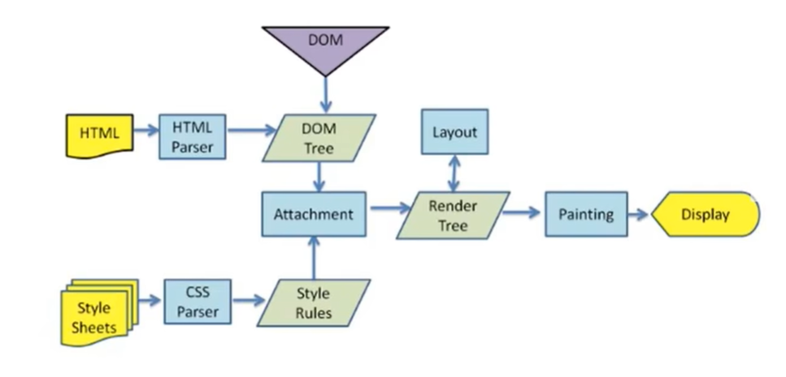
- 对DOM的大小、位置修改后、浏览器要重新计算元素的这些几何属性，就叫重排
- 对DOM的color、background-color、浏览器不需要重排，只需要重绘
- 如何触发重排？
  - 修改DOM、删除添加元素、js修改元素的位置大小，内容发生改变导致宽度发生改变
- 如何触发重绘？
  - 颜色、阴影、背景色的修改

### 让一个元素水平垂直居中的方式？

- 定位+margin
  - 定位：父相对/绝对定位，子元素绝对定位，同时top:0,bottom:0,left:0,right:0,
  - margin: 子元素margin:auto;
  - 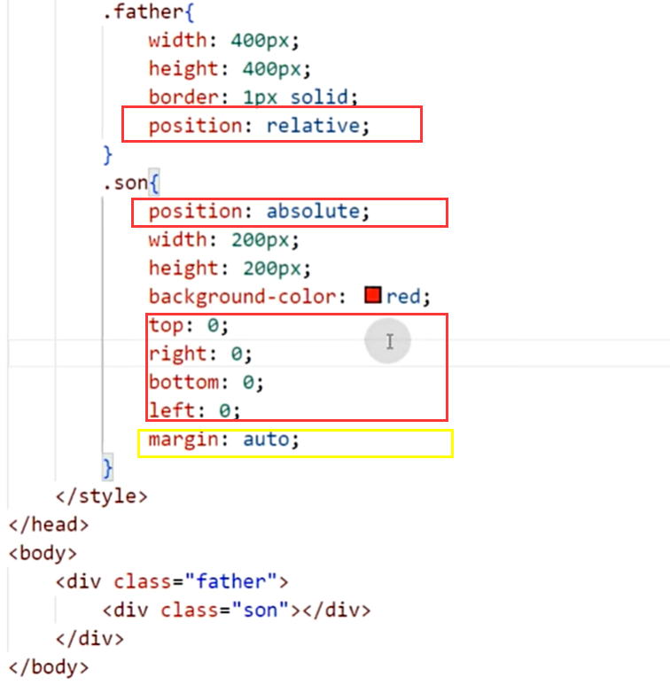
- 定位+transform
  - 
- flex布局
  - 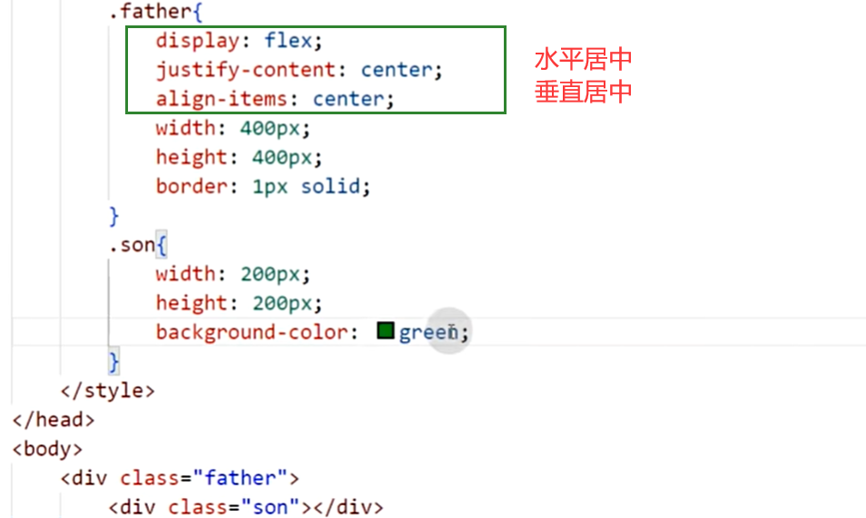
- grid布局

  ```css
  // 方法1:
  .container {
      display: grid;
      place-items: center;
  }
  //方法2
  .container {
      display: grid;
      justify-content: center; //水平
      align-items: center; //垂直
  }
  ```

- table布局

  - 将父元素设置为 display:table，子元素设置为 display:table-cell 以及 vertical-align: middle，可以实现子元素的垂直居中。

  ```css
  .parent {
    display: table;
  }
  .child {
    display: table-cell;
    vertical-align: middle; /* 垂直居中 */
    text-align: center; /* 可选，子盒子内容水平居中 */
  }
  ```

### CSS属性哪些可以继承？

- css三大特性：继承、层叠、优先级
- 继承：子元素继承父元素的属性
- 可继承的属性：
  - 字体的属性：font
  - 文本的属性：line-height、color
  - 元素的属性: visibility:hidden
  - 表格的属性：border-spacing、...
  - 列表的属性：list-style
  - 页面样式属性：page
  - 声音的样式属性

### 预处理器?

- css是一门标记语言，存在一些弊端，不方便阅读，不方便重复利用某些样式
- 预处理器增加了嵌套、变量、函数、混入等的功能

## JS

### JS由那三部分组成?

- ECMAScript(JS核心内容)
  - 描述了语言的基础语法
  - var for 类型（[],"string"）
- DOM(文档对象模型)
  - DOM把整个HTML页面规划为元素构成的文档
- BOM(浏览器对象模型)
  - 对浏览器窗口进行访问和操作

### JS内置对象？

- 内置对象：
  - String、Boolean Number
  - Array Object Function
  - Math Date RegExp
  - .....
- 常用
  - Math
    - abs sqrt max min
  - Date
    - new Date()
    - getYear getFullYear
  - Array
    - 常用方法？？？
  - String
    - concat() length slice() split()

### 操作数组的方法有哪些？

- 有哪些?
  - `push`,`pop`,`sort`,`splice`,`shift`,`unshift`,`reverse`,`concat`,`join`,`map`,`filter`,`every`,`some`,`reduce`,`isArray`,`findIndex`
- 添加返回长度、删除返回元素
  - pop\shift 末尾弹出、开头弹出
  - push\unshift 末尾添加、开头添加
- 哪些方法会改变原数组？
  - `push` `pop`
  - `shift` `unshift`
  - `sort` `reverse`
  - `splice`
- sort的排序
  - `sort默认为升序排序func(a,b)(return a-b)`

<details>

文心一言生成：

```md
当涉及到操作数组时，以下是按功能分类的一些常用方法：

1. **添加/删除元素**

   - `push()`: 在数组末尾添加一个或多个元素，并返回新长度。
   - `pop()`: 删除并返回数组的最后一个元素。
   - `shift()`: 删除并返回数组的第一个元素。
   - `unshift()`: 在数组开头添加一个或多个元素，并返回新长度。

2. **连接数组**

   - `concat()`: 连接两个或更多的数组，不更改现有数组，返回包含连接后的新数组。

3. **获取子数组**

   - `slice()`: 返回一个新的数组，包含从 start 到 end（不包括 end）的数组元素。

4. **修改数组**

   - `splice()`: 通过删除或替换现有元素或添加新元素来修改数组，并返回被修改的元素。

5. **迭代方法**

   - `forEach()`: 对数组的每个元素执行一次提供的函数。
   - `map()`: 创建一个新数组，其结果是该数组中的每个元素都调用一个提供的函数后的返回值。
   - `filter()`: 创建一个新数组, 其包含通过所提供函数实现的测试的所有元素。
   - `reduce() / reduceRight()`: 将数组中的所有元素减少到一个值（从左到右/从右到左）。

6. **搜索和排序**

   - `find() / findIndex()`: 返回数组中满足提供的测试函数的第一个元素的值/它的索引，否则返回-1。
   - `indexOf() / lastIndexOf()`: 返回在数组中可以找到给定元素的第一个/最后一个索引，如果不存在，则返回-1。
   - `includes()`: 判断一个数组是否包含一个指定的值，根据情况，如果需要返回 true 或 false。

7. **创建新数组**

   - `Array.from()`: 创建一个新的 Array 实例，其元素来自某个可迭代对象（如数组，字符串等）。
   - `Array.of()`: 创建一个由给定元素组成的新 Array 实例。

8. **其他**

   - `join()`: 把数组的所有元素放入一个字符串。元素通过指定的分隔符进行分隔。
   - `isArray()`: 判断对象是否为数组。
   - `fill()`: 用一个固定值填充一个数组中从 start 到 end（不包括 end）的索引位置。
   - `flat() / flatMap()`: 用于将嵌套的数组"拉平"，变成一维的数组。其中 flatMap 是 map 和 flat 的结合体。

9. **ES6新特性**

   - `Array.from()`：创建一个新的 Array 实例，其元素来自某个可迭代对象（如数组，字符串等）。也可以接收一个映射函数作为参数，对每个元素进行转换后再创建新的数组。例如：`let nums = Array.from({length: 5}, (_, i) => i+1); // nums now holds the array [1, 2, 3, 4, 5]`
```

```
问：

解释（功能描述，参数类型，返回值，是否影响原数组）下js中操作数组的方法：`push`,`pop`,`sort`,`splice`,`shift`,`unshift`,`reverse`,`concat`,`join`,`map`,`filter`,`every`,`some`,`reduce`,`isArray`

答:

以下是JavaScript中操作数组的方法的功能描述、参数类型、返回值以及对原数组的影响：

push：
功能描述：将一个或多个元素添加到数组的末尾，并返回新的长度。
参数类型：元素参数。
返回值：新数组的长度。
是否影响原数组：是。
pop：
功能描述：删除并返回数组的最后一个元素。
参数类型：无参数。
返回值：被删除的元素。
是否影响原数组：是。
sort：
功能描述：对数组的元素进行排序，并返回排序后的数组。
参数类型：一个可选的比较函数作为参数。该函数接受两个参数，返回一个负数、零或正数表示第一个参数应该排在第二个参数的前面、两者相等或第一个参数应该排在第二个参数的后面。
返回值：排序后的数组。
是否影响原数组：否。
splice：
功能描述：通过删除或替换现有元素或添加新元素来修改数组，并返回被修改的元素。
参数类型：两个参数，第一个参数指定要开始修改的元素的索引，第二个参数指定要删除的元素的数量。
返回值：被修改的元素。
是否影响原数组：是。
shift：
功能描述：删除并返回数组的第一个元素。
参数类型：无参数。
返回值：被删除的元素。
是否影响原数组：是。
unshift：
功能描述：在数组的开头添加一个或多个元素，并返回新的长度。
参数类型：元素参数。
返回值：新数组的长度。
是否影响原数组：是。
reverse：
功能描述：反转数组的顺序，并返回反转后的数组。
参数类型：无参数。
返回值：反转后的数组。
是否影响原数组：否。
concat：
功能描述：用于合并两个或多个数组。
参数类型：多个数组作为参数。
返回值：一个新数组，包含第一个数组和所有后续数组的所有元素。
是否影响原数组：否。
join：
功能描述：将数组的所有元素连接成一个字符串。
参数类型：一个可选的字符串作为分隔符。
返回值：连接后的字符串。
是否影响原数组：否。
map：
功能描述：创建一个新数组, 其结果是该数组中的每个元素都调用一个提供的函数后返回的结果。
参数类型：一个回调函数作为参数，该函数对数组的每个元素执行一次，并返回一个结果数组。
返回值：新数组。
是否影响原数组：否。
filter：
功能描述：创建一个新数组, 其包含通过所提供函数实现的测试的所有元素。
参数类型：一个回调函数作为参数，该函数对数组的每个元素执行一次，并返回一个布尔值来确定该元素是否应包含在新数组中。
返回值：新数组。
是否影响原数组：否。
every：
功能描述：检测数组所有元素是否都符合条件。
参数类型：一个回调函数作为参数，该函数对数组的每个元素执行一次，并返回一个布尔值来确定所有元素是否都满足条件。
返回值：一个布尔值，表示所有元素是否都满足条件。
是否影响原数组：否。
some：
功能描述：检测数组中是否至少有一个元素符合条件。
参数类型：一个回调函数作为参数，该函数对数组的每个元素执行一次，并返回一个布尔值来确定是否有元素满足条件。
返回值：一个布尔值，表示是否有元素满足条件。
```

```md
问：
splice 同时删除 和添加元素的案例?

答：
splice() 方法可以同时删除和添加元素。以下是一个例子：

javascript
let fruits = ["Banana", "Orange", "Apple", "Mango"];

let removed = fruits.splice(2, 2, "Lemon", "Kiwi"); // 从第2个位置开始，删除2个元素，并插入"Lemon"和"Kiwi"  
console.log(fruits); // ["Banana", "Orange", "Lemon", "Kiwi"]  
console.log(removed); // ["Apple", "Mango"] 因为这两个元素被删除。
在这个例子中，splice() 方法的第一个参数是开始更改数组的索引（起始为2），第二个参数是要删除的元素数量（为2），之后的参数是要添加到数组中的元素（为"Lemon"和"Kiwi"）。

问：
是先删除还是先添加？

答：
splice() 方法的执行顺序是先删除元素，然后再添加元素。在上面的例子中，我们首先从数组的第2个位置开始删除2个元素，然后再添加"Lemon"和"Kiwi"。所以，先删除元素，然后再添加元素。
```

</details>

### 类型检测？

- typeof xx；
  - 判断基本数据类型，引用数据类型不管用
  - `typeof 666` // 结果：'number'
  - `typeof [1,2]` // 结果：'object'
- xx instanceof
  - 只能判断引用数据类型，不能判断基本数据类型
  - `[1,2,3] instanceof Array` // 结果：true
  - `"1,2,3" instanceof String` // 结果：false
- constructor
  - 几乎可以判断基本数据类型和引用数据类型
  - `("1,2,3").constructor===String` // 结果：true
  - 弊端：如果声明了一个构造函数，并把其原型指向Array，就无法识别了
- `Object.prototype.toString.call()`
  - `var opt = Object.prototype.toString`
  - `opt.call(1)` // '[object Number]'
  - `opt.call(true)` // '[object Boolean]'
  - `opt.call("1,2,3")` // '[object String]'
  - `opt.call([])` // '[object Array]'
  - `opt.call({})` // '[object Object]'

### 什么是闭包?特点？

- 什么是？： 函数A嵌套函数B，函数A返回函数B，调用函数A()并把结果保存下来就会产生闭包
- 特点：重复利用变量，变量不会污染全局、变量保存在内存中，不会被垃圾回收
- 缺点，闭包多时消耗内存，页面性能下降，在IE中导致内存下降
- 使用场景：防抖、节流、函数嵌套函数避免全局污染时

### 内存泄露？

- js里已经分配内存的对象，由于长时间没有释放或没办法清除，造成长期占用内存、内存资源浪费、影响运行速度、导致崩溃的情况。
- 垃圾回收机制失效
- 原因：未声明直接赋值的变量、未清空的定时器、过度闭包、引用元素未清除

### 事件委托？

- 也叫事件代理，原理是利用事件冒泡的机制来实现，
- 就是把子元素的事件处理函数绑定到父元素上，
- 好处：提高性能、减少事件绑定，减少内存占用
- 阻止事件代理：
  - 子元素可以阻止事件冒泡来阻止事件代理 event.stopPropagation()
  - addEventListener(事件名,处理函数,true(事件捕获，不冒泡)/false(默认值事件冒泡))

### 基本数据类型和引用数据类型的区别？

- 基本数据类型(5个)：Number Boolean String undefined null
  - 保存在栈内存当中，
  - 声明时，保存的是具体的值
- 引用数据类型：Object Array Function ...
  - 保存在堆内存中，
  - 声明引用类型变量时，保存的时引用数据类型的地址
  - 声明两个引用类型时，让他们指向同一个地址，那么修改其中一个，另一个也会发生改变
    - 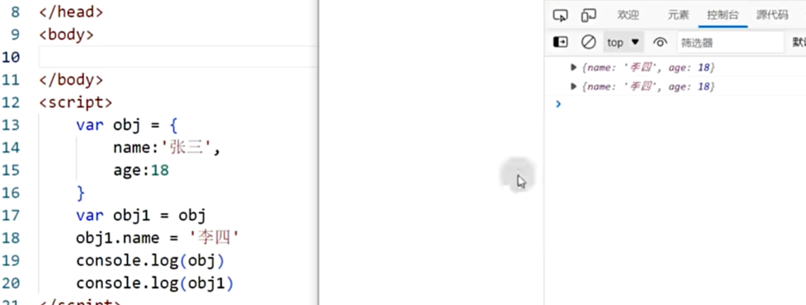

### 原型链？

- 原型prototype：就是一个普通的对象、为构造函数的实例共享属性和方法，所有实例中的引用的原型都是同一个对象
- 解决的问题：
  - say方法在内存中，有几个实例对象，say方法就有几份
  - look方法在内存中只有一份
  - 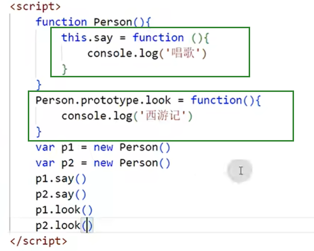
- 原型链：
  - 在实例对象上有一个属性：`this._proto_`
  - 指向了构造函数上的原型对象prototype
  - `this._proto_ === Person.prototype` // true
  - 原型链就是，当一个实例对象要调用一个方法时，会依次从实例本身、构造函数原型、原型的原型上去寻找...
  - 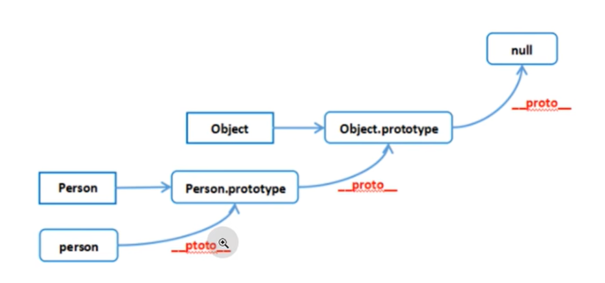

### call\apply的区别

```js
var func = function (arg1, arg2) {};
// call 需要把参数按顺序传递进去，而 apply 则是把参数放在数组里
func.call(this, arg1, arg2);
func.apply(this, [arg1, arg2]);

// 案例1
function A(name, age) {
  func.call(this, name, age);
}
// 案例2
function B(...args) {
  func.apply(this, args);
}
```

### new操作符号具体做了什么？

- 先创建空对象
- 把空对象和构造函数通过原型链进行链接（空对象的prop type=在构造函数的prop type）
- 把构造函数的this绑定到新的空对象身上
- 根据构造函数返回的类型判断（一般是undefined），
  - 如果是引用类型，返回引用对象
    - (isntanceof Object)
  - 如果是值类型，返回对象
    - (not isntanceof Object) 基本类型（字符串、数值、...）、函数、null、undefined
- 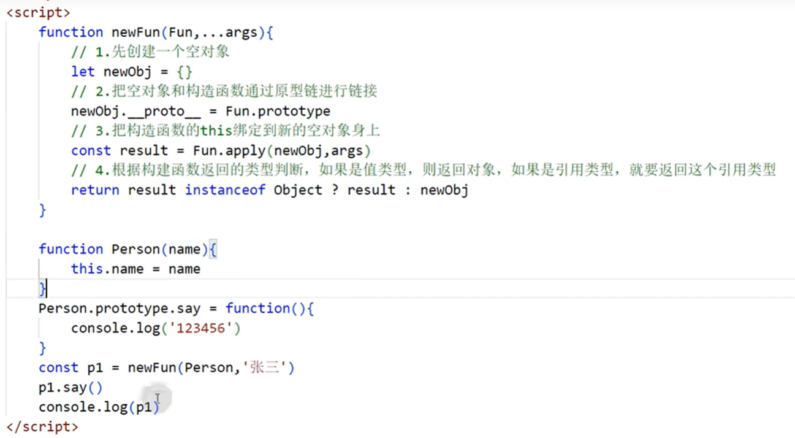

```ts
function myNew(constructor,...args){
  let obj = {}
  obj.__proto__ = constructor.prototype
  let result = constructor.apply(obj,args);
  return result
}
```

### js如何实现继承？

- 原型链继承

  - 直接让一个构造函数的原型指向父类实例
  - 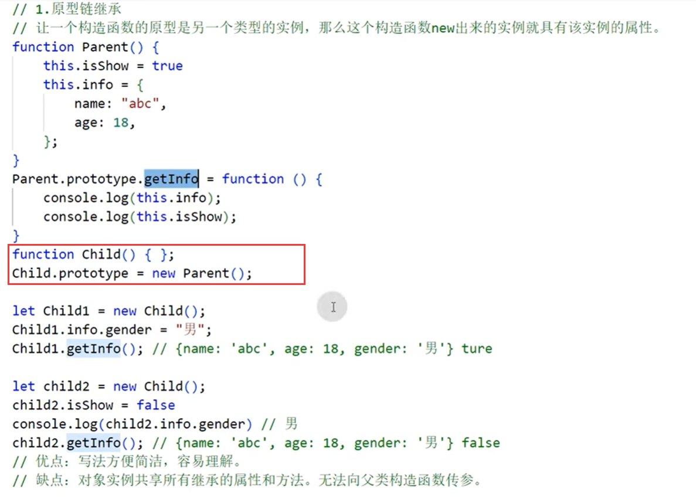
  - 优点：写法方便
  - 缺点：
    - 多个子类的实例对象共用同一个父类实例对象的属性（类似于子类的静态属性），
    - 无法通过子类构造函数向父类构造函数传递参数

- 借用构造函数
  - 其实就是用子类的this对象去调用父类的构造函数。
  - 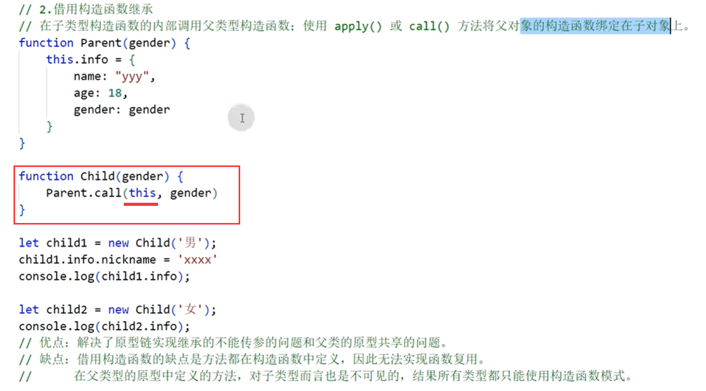
  - 优点：解决了原型链不能传递参数的问题
  - 缺点：
    - 子类只能访问到父类构造函数中`this.say = func(){}`定义的方法和属性
    - 方法都定义在构造函数中，无法实现函数的复用
    - 在父类的原型上定义的方法，子类无法调用，因为子类的原型并不指向父类的原型
- 组合继承
  - 就是把原型链继承和借用构造函数这两种方法相结合
  - 用this去调用父类的构造函数
  - 调用父类构造函数获得实例对象，绑定到子类的原型上，这样子类可以调用父类原型上的方法
  - 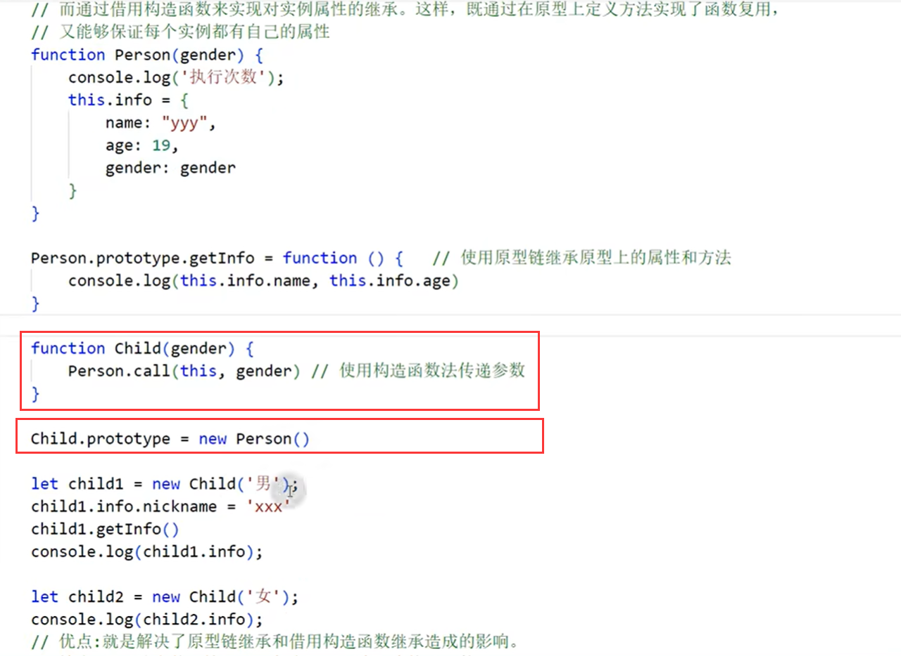
  - 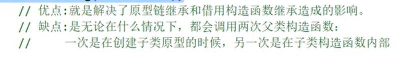
- ES6 class 继承
  - 
  - 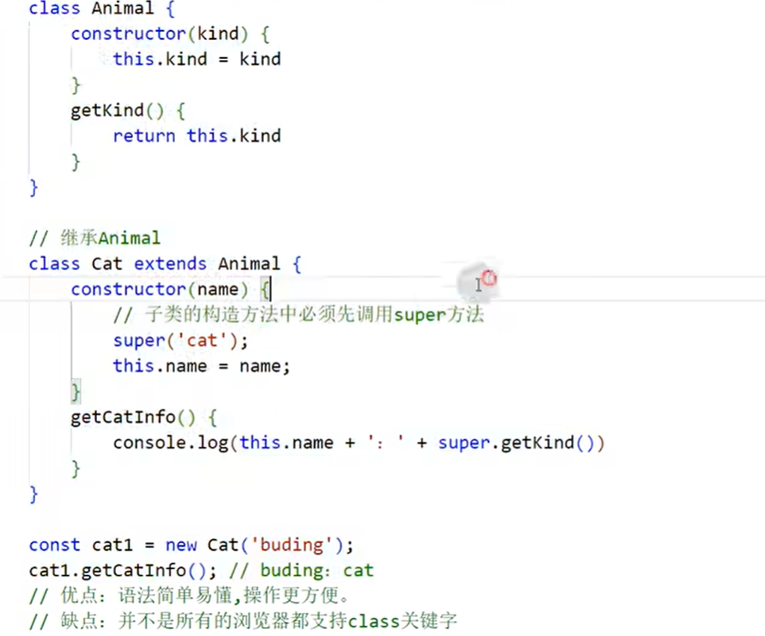

### js设计原理

- js引擎：js代码语法解析、编译成可执行机器码、让电脑执行、目前流行v8引擎
- 运行上下文：浏览器中可以调用的API,window document (BOM DOM)
  - 事件循环、任务队列
- 调用栈：单线程、js要操作DOM,如果是多线程需要考虑同步问题
- 事件循环：调用栈空了之后，就把任务队列中的任务放入调用栈中去执行，循环执行
- 回调函数

### Js中的this指向？

- 全局对象中的this指向window
- 全局作用域或普通函数中的this -> window
- 普通函数的this永远指向最后调用她的对象（箭头函数除外）
-
- new 关键字会改变this的指向
- apply call bind 三个方法都可以改变this指向（箭头函数除外）
- 箭头函数的this
  - 其指向在定义时就已经确定
  - 箭头函数没有this,要看他的外层函数的this是谁，有就是外层函数的this,没有就是window
- 匿名函数的this永远指向window,
  - 匿名函数的执行环境具有全局性质

### js中this的指向（第二版）

来源：

[https://juejin.cn/post/6844904083707396109](https://juejin.cn/post/6844904083707396109)

**this的5种绑定方式：**

- 默认绑定(非严格模式下this指向全局对象, 严格模式下this会绑定到undefined)
- 隐式绑定(当函数引用有上下文对象时, 如 obj.foo()的调用方式, foo内的this指向obj)
- 显示绑定(通过call()或者apply()方法直接指定this的绑定对象, 如foo.call(obj))
- new绑定
- 箭头函数绑定(this的指向由外层作用域决定的)

<details>

**默认绑定**

- 通过`let`、`const`声明的变量不会挂载到window上
- 非严格模式下，

  - 通过`var`关键字在全局声明的变量`var a;`和`function outer(){return this==win}`会被挂载到window上(win.a win.outer)
  - 且在函数内，this指向window;因为是window调用的`outer();`
  - 嵌套函数的this指向还是window
    - 如果有函数`function outer(){  function inner(){}   inner()  }`
    - 则函数inner中的this也是指向window,不是因为inner函数是window调用的`（window.inner==undefined）`，
    - 而是因为在outer函数的局部作用域下可以访问到outer的this

- 严格模式下（`"use strict";`），
  - `var`全局变量和函数同样会被挂载到window上
  - 但在函数内，this指向undefined

案例：嵌套函数的this指向

```js
var a = 1;
function outer() {
  let a = 2;
  function inner() {
    console.log(a);
    console.log(this.a);
  }
  inner();
}
outer();
// 输出
2;
1;
```

**隐式绑定**

- **函数内的 this 永远指向最后调用它的那个对象**（不考虑箭头函数）
  - （函数内的 this ，默认为window，即使外层函数的this不是window）
- 如下，虽然foo定义在win下，但是foo是由obj调用的。
- 而且也是最后被obj调用的，`win.obj.foo()`

```js
function foo() {
  console.log(this.a);
}
var obj = { a: 1, foo };
var a = 2;
obj.foo();
```

**隐式绑定的隐式丢失问题**

- 使用另一个变量来给函数取别名
- 将函数作为参数传递时会被隐式赋值，回调函数丢失this绑定

**作为变量赋值**

```js
function foo() {
  console.log(this.a);
}
var obj = { a: 1, foo };
var a = 2;

// 这里其实等效为 foo2 = foo，
// 只是复制了函数，没有复制函数的调用者是谁这样的信息
var foo2 = obj.foo;

obj.foo();
foo2(); // 所以这里等效为foo() , 也就是由window调用的
```

**作为参数传递**

```js
function foo() {
  console.log(this.a);
}
function doFoo(fn) {
  console.log(this);
  fn();
}
var obj = { a: 1, foo };
var a = 2;

// 作为参数赋值时，也是只会复制函数本身，不会复制调用者是谁这样的信息
// 所以等效为 doFoo(foo)
doFoo(obj.foo);
```

**显式绑定**

- 通过call()、apply()或者bind()方法直接指定this的绑定对象, 如foo.call(obj)。
- 使用.call()或者.apply()的函数会直接执行
  - `let res = fun.call(调用者，参数1,参数2)`
  - `let res = fun.apply(调用者，[参数1，参数2])`
- 使用bind()是创建一个新的函数，需要手动调用
  - `let f = fun.bind(调用者)`
  - `let res = f()`
- 如果call、apply、bind接收到的第一个参数是空或者null、undefined的话，则会忽略这个参数,不会改变其this指向

**解决的问题：setTimeout回调的this指向window**

```js
var obj1 = {
  a: 1,
};
var obj2 = {
  a: 2,
  foo1: function () {
    console.log(this.a);
  },
  foo2: function () {
    setTimeout(function () {
      // 这里将一个函数作为参数传递给setTimeout，而作为参数传递会丢失其this绑定信息
      // 最终其this会指向window
      console.log(this);
      console.log(this.a);
    }, 0);
  },
};
var a = 3;

obj2.foo1();
obj2.foo2();
```

**使用显示绑定来解决setTimeout的问题**

```js
var obj1 = {
  a: 1,
};
var obj2 = {
  a: 2,
  foo1: function () {
    console.log(this.a);
  },
  foo2: function () {
    let self = this;
    setTimeout(function () {
      let f = function () {
        console.log(this);
        console.log(this.a);
      };
      f.call(self);
    }, 1000);
  },
};
var a = 3;
obj2.foo1();
obj2.foo2();
```

```js
var obj1 = {
  a: 1,
};
var obj2 = {
  a: 2,
  foo1: function () {
    console.log(this.a);
  },
  foo2: function () {
    let f = function () {
      console.log(this);
      console.log(this.a);
    }.bind(this);
    setTimeout(f, 1000);
  },
};
var a = 3;
obj2.foo1();
obj2.foo2();
```

**使用显示绑定来解决嵌套函数this始终指向win的问题**

```js
var obj1 = {
  a: 1,
};
var obj2 = {
  a: 2,
  foo1: function () {
    console.log(this.a);
  },
  foo2: function () {
    function inner() {
      console.log(this);
      console.log(this.a);
    }
    inner(); // 这种写法inner的this指向win！！！！！！！！
    inner.call(this); // 这种写法inner的this指向foo2的调用者
  },
};
var a = 3;
obj2.foo1();
obj2.foo2();
```

**使用显示绑定修改函数调用者为对象**

```js
function foo() {
  console.log(this.a);
}
var obj = { a: 1 };
var a = 2;

foo();
foo.call(obj);
foo().call(obj); // 报错
```

内层函数它的this到底是谁?

- 和外层函数的this指向无关，内层函数的this始终指向其调用者

```js
function foo() {
  console.log(this.a);
  return function () {
    console.log(this.a);
  };
}
var obj = { a: 1 };
var a = 2;

foo.call(obj)(); // 输出：1 2
```

**综合题**

```js
var obj = {
  a: 1,
  foo: function (b) {
    b = b || this.a;
    return function (c) {
      console.log(this.a + b + c);
    };
  },
};
var a = 2;
var obj2 = { a: 3 };

obj.foo(a).call(obj2, 1);
obj.foo.call(obj2)(1);

// 输出

6;
6;
```

**new绑定**

- 另一种this的绑定形式
- 使用new来调用一个函数，会构造一个新对象并把这个新对象绑定到调用函数中的this。

```js
function Person(name) {
  this.name = name;
}
var name = "window";
var person1 = new Person("xxxxx");
console.log(person1.name);
```

```js
function Person(name) {
  this.name = name;
  this.foo1 = function () {
    console.log(this.name);
  };
  this.foo2 = function () {
    return function () {
      console.log(this.name);
    };
  };
}
var person1 = new Person("person1");
person1.foo1();
person1.foo2()();
```

字面量对象和new创建的对象，如果属性不是箭头函数的话，没有区别

```js
var name = "window";
function Person(name) {
  this.name = name;
  this.foo = function () {
    console.log(this.name);
    return function () {
      console.log(this.name);
    };
  };
}
var person2 = {
  name: "person2",
  foo: function () {
    console.log(this.name);
    return function () {
      console.log(this.name);
    };
  },
};

var person1 = new Person("person1");
person1.foo()();
person2.foo()();
```

**箭头函数**

- 箭头函数中没有 this 绑定，必须通过查找作用域链来决定其值，如果箭头函数被非箭头函数包含，则 this 绑定的是最近一层非箭头函数的 this，否则，this 为 undefined。
- 箭头函数的this无法通过bind、call、apply来直接修改，但是可以通过改变作用域中this的指向来间接修改。

```js
var obj = {
  name: "obj",
  foo1: () => {
    console.log(this.name);
  },
  foo2: function () {
    console.log(this.name);
    return () => {
      console.log(this.name);
    };
  },
};
var name = "window";
obj.foo1(); // win
obj.foo2()(); // obj obj
```

```js
var name = "window";
var obj1 = {
  name: "obj1",
  foo: function () {
    console.log(this.name);
  },
};

var obj2 = {
  name: "obj2",
  foo: () => {
    console.log(this.name);
  },
};

obj1.foo(); // obj1
obj2.foo(); // window
```

**箭头函数总结**

- 它里面的this是由外层作用域来决定的

避免使用箭头函数的场景

```js
// 定义对象的方法
let obj = {
  value: "xxxxx",
  getValue: () => console.log(this.value),
};
obj.getValue(); // undefined
```

```js
// 定义原型方法
function Foo(value) {
  this.value = value;
}
Foo.prototype.getValue = () => console.log(this.value);

const foo1 = new Foo(1);
foo1.getValue(); // undefined
```

```js
// 构造函数使用箭头函数
const Foo = (value) => {
  this.value = value;
};
const foo1 = new Foo(1);
// 事实上直接就报错了 Uncaught TypeError: Foo is not a constructor
console.log(foo1);
```

</details>

## 手写实现 apply call bind

**实现apply**

```js
Function.prototype.myApply = function (context, args) {
    //这里默认不传就是给window,也可以用es6给参数设置默认参数
    context = context || window
    args = args ? args : []
    //给context新增一个独一无二的属性以免覆盖原有属性
    const key = Symbol()
    context[key] = this
    //通过隐式绑定的方式调用函数
    const result = context[key](...args)
    //删除添加的属性
    delete context[key]
    //返回函数调用的返回值
    return result
}

作者：土豪码农
链接：https://juejin.cn/post/6844903891092389901
来源：稀土掘金
著作权归作者所有。商业转载请联系作者获得授权，非商业转载请注明出处。
```

**实现call**

```js
//传递参数从一个数组变成逐个传参了,不用...扩展运算符的也可以用arguments代替
Function.prototype.myCall = function (context, ...args) {
    //这里默认不传就是给window,也可以用es6给参数设置默认参数
    context = context || window
    args = args ? args : []
    //给context新增一个独一无二的属性以免覆盖原有属性
    const key = Symbol()
    context[key] = this
    //通过隐式绑定的方式调用函数
    const result = context[key](...args)
    //删除添加的属性
    delete context[key]
    //返回函数调用的返回值
    return result
}

作者：土豪码农
链接：https://juejin.cn/post/6844903891092389901
来源：稀土掘金
著作权归作者所有。商业转载请联系作者获得授权，非商业转载请注明出处。
```

**实现bind**

```js
Function.prototype.myBind = function (context, ...args) {
    const fn = this
    args = args ? args : []
    return function newFn(...newFnArgs) {
        if (this instanceof newFn) {
            return new fn(...args, ...newFnArgs)
        }
        return fn.apply(context, [...args,...newFnArgs])
    }
}

作者：土豪码农
链接：https://juejin.cn/post/6844903891092389901
来源：稀土掘金
著作权归作者所有。商业转载请联系作者获得授权，非商业转载请注明出处。
```

## script标签async和defer的区别？

- 默认情况：
  - 浏览器会立即加载执行script标签内的js代码，不需要加载后续的html标签
  - 浏览器会下载script的src所指向的文件，中断后续html元素的加载和渲染，造成空白页面
- 有defer属性：
  - 浏览器会立即加载js（比如下载src所指向文件）然后再加载后续html元素，
  - 但是其js脚本执行时间是在所有dom元素解析完成之后
  - 相当于把script标签放到了body标签的最后
  - 会保证多个script标签的执行顺序和书写顺序一致
- 有async属性：
  - h5新增属性
  - 异步操作，浏览器会不仅会立即加载执行js，同时也会加载渲染script标签的后续html标签,这是并行的。
  - 不能保证多个script标签执行顺序一致

## setTimeout最小执行间隔？

- h5规定：
  - setTimeout 4ms
  - setInterval 10ms

## ES5和ES6的区别？

- js组成：ECMAScript、DOM、BOM
- ES5: ECMAScript5、ECMAScript2009、2009年对ECMAScript的第五次修订版
- ES6: ECMAScript6、ECMAScript2015、2015年对ECMAScript的第六次修订版

## ES6新特性？

- 新增块级作用域：let,const
  - var存在变量提升，可重复声明,可在声明前使用，值为undefined
  - let,const不存在变量提升，不能重复声明，不能在声明前使用，
  - let,const存在暂时性死区的问题
- 新增定义类的语法糖：class
- 新增一种基本数据类型: symbol
- 新增解构赋值
- 新增函数参数默认值
- 给数组新增了api
- 对象和数组都新增了扩展运算符
- Promise
  - 解决了回调地狱的问题，实现了异步操作的队列化
  - 静态方法：all、reject、resolve、race
  - 原型方法：then、catch
  - 三种状态：pending初始状态、fulfilled操作成功、rejected操作失败
  - 状态的改变：
    - pendig->fulfilled
    - pendig->rejected
    - 状态只会改变一次
  - async await
    - new Promise 和 then 的语法糖
    - 经过async修饰的函数会将返回值用Promise包装
    - await关键字可以从Promise中获取到结果
      - await后如果不是Promise，那么直接得到其值
      - await如果得到reject，则后续代码都会被中断
- 新增模块化，Import export
- 新增set map
- 新增generator
- 新增箭头函数
  - 不能作为构造函数使用,不能用new关键字
  - 箭头函数没有原型，没有原型链
  - 箭头函数没有arguments
  - 箭头函数自己没有this,不能用call apply bind来改变其this指向
  - 箭头函数的this要看其外部的this是什么
