## Go语言原理与实践 | 字节跳动青训营学习笔记

## 目录

- [Go语言原理与实践 | 字节跳动青训营学习笔记](#go语言原理与实践--字节跳动青训营学习笔记)
- [目录](#目录)
- [什么是go语言](#什么是go语言)
- [安装和环境配置](#安装和环境配置)
- [基础语法](#基础语法)
  - [hello world](#hello-world)
  - [类型](#类型)
  - [if](#if)
  - [for](#for)
  - [switch](#switch)
  - [数组](#数组)
  - [切片](#切片)
  - [map](#map)
  - [range](#range)
  - [函数](#函数)
  - [指针](#指针)
  - [结构体](#结构体)
  - [结构体方法](#结构体方法)
  - [错误处理](#错误处理)
  - [字符串的工具函数](#字符串的工具函数)
  - [格式化输出](#格式化输出)
  - [json](#json)
  - [时间](#时间)
  - [数字解析](#数字解析)
  - [进程信息](#进程信息)
- [小项目实践](#小项目实践)
  - [猜数字实现](#猜数字实现)
  - [在线字典实现](#在线字典实现)
  - [简易echoServer实现](#简易echoserver实现)
  - [socket5代理服务器实现](#socket5代理服务器实现)
- [并发编程视角下的go语言](#并发编程视角下的go语言)
  - [并发与并行](#并发与并行)
  - [go语言并发的运行机制Goroutine](#go语言并发的运行机制goroutine)
  - [go语言创建协程实现并发的案例](#go语言创建协程实现并发的案例)
  - [协程间的通信](#协程间的通信)
    - [通过通信通道实现协程间通信](#通过通信通道实现协程间通信)
    - [通过共享内存实现协程间通信](#通过共享内存实现协程间通信)
  - [Go语言的并发控制:WaitGroup](#go语言的并发控制waitgroup)
- [依赖管理](#依赖管理)
  - [GOPATH](#gopath)
  - [GO Vendor](#go-vendor)
  - [GO Module](#go-module)
    - [go.mod文件](#gomod文件)
    - [GOPROXY](#goproxy)
    - [go get/mod工具](#go-getmod工具)
- [测试](#测试)
  - [单元测试](#单元测试)
  - [mock测试](#mock测试)
  - [基准测试](#基准测试)
- [项目实战](#项目实战)
  - [数据层实现](#数据层实现)
  - [业务逻辑层实现](#业务逻辑层实现)
  - [视图层实现](#视图层实现)
  - [主函数](#主函数)
- [高质量编程](#高质量编程)
  - [编程原则](#编程原则)
  - [编码规范](#编码规范)
    - [代码格式](#代码格式)
    - [注释](#注释)
    - [命名规范](#命名规范)
    - [控制流程](#控制流程)
    - [错误和异常处理](#错误和异常处理)
- [高质量编程](#高质量编程-1)
  - [简介](#简介)
  - [常见编码规范](#常见编码规范)
    - [代码格式](#代码格式-1)
    - [注释](#注释-1)
    - [命名规范](#命名规范-1)
    - [控制流程](#控制流程-1)
    - [错误和异常处理](#错误和异常处理-1)
  - [性能优化建议](#性能优化建议)
    - [总结](#总结)
- [性能调优实战](#性能调优实战)
  - [性能调优简介](#性能调优简介)
- [database/mysql](#databasemysql)
  - [\_01\_hello\_mysql案例](#_01_hello_mysql案例)
  - [sql的连接接口](#sql的连接接口)
  - [sql的操作接口](#sql的操作接口)
  - [ORM-第三方的数据层实现库](#orm-第三方的数据层实现库)

## 什么是go语言

- 高性能
- 语法简单、学习曲线平缓
- 丰富的标准库
- 完善的工具链
- 静态链接
- 快速编译
- 跨平台
- 垃圾回收

## 安装和环境配置

**安装**

- 下载go然后解压
- PATH配置为 `go/bin/`

**环境变量**

- GOROOT:表示Go的安装目录
- GOPATH:表示工作空间,第三方工具会安装在这个目录下

vscode的go插件报错提示工具链安装失败的解决:

- 执行：`go env -w GOPROXY=https://goproxy.cn,direct`

**Go语言圣经（中文版） 《The Go Programming Language》**

- 在线阅读：<https://gopl-zh.github.io>
- 在线阅读：<https://golang-china.github.io/gopl-zh>
- 项目主页：<https://github.com/gopl-zh>
- 项目主页(旧)：<http://github.com/golang-china/gopl-zh>
- 原版官网：<http://gopl.io>

## 基础语法

> 这部分内容因为看一眼就会了，笔记的话主要以注释为主，对在其他语言中没见过的特性解释一下。

### hello world

`go.mod`文件

```mod
module main //指定当前这个模块的名字为main 
go 1.20 //go 版本为1.2
```

`main.go`文件

```go
package main // 表示该文件属于名为main的包的一部分

import (
 "fmt" // 导入标准库的format包
)

func main()  {
 fmt.Println("hello world!")
 // 运行： go run ./helloworld.go
 // 编译： go build ./helloworld.go
}
```

### 类型
>
> var 是变量 const是常量 都可以自动推断类型

```go
package main

import (
 "fmt"
 "math"
)

func main() {
 // var 是变量 const是常量 都可以自动推断类型
 var a = "aaaa"      // 字符串 自动推导类型
 var b, c int = 1, 2 // 数值
 var d = true
 var e float64 = 0.5
 f := float64(e) // := 可以实现不声明f而直接赋值
 g := a + "bbb"
 const pi float64 = 3.14    // 常量声明
 fmt.Println(a, b, c, d, e) // aaaa 1 2 true 0.5
 fmt.Println(f)             // 0.5
 fmt.Println(g)             // aaaabbb
 fmt.Println(math.Cos(pi))  // -0.9999987317275396
}
```

### if
>
> if 不用写() 但必须写{}

```go
package main

import (
 "fmt"
)

func main() {
 // if 不用写() 但必须写{}
 if 1+1 == 2 {
  fmt.Println("1+1=2") // 1+1=2
 } else {
  fmt.Println("1+1!=2")
 }

 if flag := true; flag == true {
  fmt.Println("flag==true")
 }
}
```

### for

```go
package main

import (
 "fmt"
)

func main() {
 // go没有while循环
 for {
  fmt.Println("这是死循环")
  break // 跳出循环
 }
 for i := 0; i < 10; i++ { // 经典for循环，可以其中三个语句都可以省略
  fmt.Println(i)
  continue // 进入下一个循环
 }
 i := 0
 for i < 10 { // 退化为while循环
  fmt.Println(i)
  i++
 }
}
```

### switch

```go
package main

import (
 "fmt"
 "time"
)

func main() {
 // switch会自动break！！！
 i := 1
 switch i {
 case 1:
  fmt.Println("1")
 case 2:
  fmt.Println("2")
 default:
  fmt.Println("default")
 }

 t := time.Now()
 // Switch支持任意类型，字符串、结构体
 switch {
 case t.Hour() < 12:
  fmt.Println("现在是上午")
 default:
  fmt.Println("现在是下午")
 }
}
```

### 数组

```go
package main

import (
 "fmt"
)

func main() {
 var a [5]int
 a[0] = 1
 fmt.Println(a[0])

 var b [5][5]int
 b[0][0] = 1
 fmt.Println(b[0][0])

 c := [3]int{1, 2, 3} // c是数组
 fmt.Println(c)       // [1 2 3]
 // c=append(c,4) // 报错，c不是切片，是数组
}
```

### 切片

```go
package main

import "fmt"

func main() {
 a := make([]int, 4)
 a[0] = 1
 a[1] = 2
 a[2] = 3
 a = append(a, 5) // 必须把结果赋值
 fmt.Println(a)   // [1 2 3 0 5]

 // 和python类似，支持切片操作但不支持负数
 fmt.Println(a[1:3]) // [2 3]
 fmt.Println(a[1:])  // [2 3 0 5]
 fmt.Println(a[:3])  // [1 2 3]

 b := make([]int, len(a))
 copy(b, a)
 fmt.Println(b) //[1 2 3 0 5]

 c := []int{1, 2, 3} // c是切片
 c = append(c, 4)
 fmt.Println(c[0:4]) // [1 2 3 4]

 var d []int // d 是切片
 d = append(d, 1)
 fmt.Println(d) // [1]
}
```

### map

```go
package main

import "fmt"

func main() {
 // 类似于其他语言的hash、字典
 // map是无序的
 a := make(map[string]int)
 a["A"] = 10
 fmt.Println(a)
 fmt.Println(a["A"]) //map[A:10]
 fmt.Println(len(a)) // 1
 val, exist := a["A"]
 if exist {
  fmt.Println(val) // 10
  delete(a, "A")
 }
 b := map[string]int{"B": 20}
 fmt.Println(b) // map[B:20]
}
```

### range

```go
package main

import "fmt"

func main() {
 // range可以遍历slice和map

 a := []int{1, 2, 3}
 for idx, val := range a {
  fmt.Println(idx, val)
 }

 b := map[string]int{"aaa": 1, "bbb": 2}
 for key, val := range b {
  fmt.Println(key, val)
 }
}
```

### 函数

```go
package main

import "fmt"

func divsionA(a int, b int) int {
 return a / b
}

// 可以省略类型
func divsionB(a, b int) int {
 return a / b
}

// 可以返回多个值
func divsionC(a, b int) (res int, ok bool) {
 if b != 0 {
  res = a / b
  ok = true
 }
 return res, ok
}

func main() {
 fmt.Println(divsionA(4, 2)) // 2
 fmt.Println(divsionB(4, 2)) // 2
 fmt.Println(divsionC(4, 0)) // 0 false
}
```

### 指针

```go
package main

import "fmt"

func add(n int) {
 n++
}
func padd(n *int) {
 *n += 1
}

func main() {
 n := 1
 add(n)
 fmt.Println(n)
 padd(&n)
 fmt.Println(n)
}
```

### 结构体

```go
package main

import "fmt"

type user struct {
 uuid string
 name string
 pswd string
}

func setPswd(u *user, pswd string) {
 u.pswd = pswd
}
func checkPswd(u user, pswd string) bool {
 return u.pswd == pswd
}

func main() {
 a := user{uuid: "001", name: "dyg", pswd: "111"}
 b := user{"001", "dyg", "111"}
 fmt.Println(a)
 fmt.Println(b)

 setPswd(&a, "123")
 fmt.Println(checkPswd(a, "123"))
}
```

### 结构体方法

```go
package main

import "fmt"

type user struct {
 uuid string
 name string
 pswd string
}

// 带指针才能对结构体修改
func (u *user) setPswd(pswd string) {
 u.pswd = pswd
}
func (u user) checkPswd(pswd string) bool {
 return u.pswd == pswd
}

func main() {

 a := user{uuid: "001", name: "dyg", pswd: "111"}
 a.setPswd("222")
 fmt.Println(a.checkPswd("222")) // true
}
```

### 错误处理

```go
package main

import (
 "errors"
 "fmt"
)

type user struct {
 uuid string
 name string
 pswd string
}

func findUser(users []user, name string) (res *user, err error) {
 for _, usr := range users { // _可以用来占位，这样不会报错："变量声明但未使用"
  if usr.name == name {
   return &usr, nil
  }
 }
 return nil, errors.New("not fond")
}

func main() {
 users := []user{{name: "dyg"}}

 user, err := findUser(users, "hhh")
 if err != err {
  fmt.Println(user)
 } else {
  fmt.Println(err)
 }
}
```

### 字符串的工具函数

```go
package main

import (
 "fmt"
 "strings"
)

func main() {
 a := "123"
 fmt.Println(strings.Contains(a, "12"))                 //true
 fmt.Println(strings.Count(a, "1"))                     //1
 fmt.Println(strings.HasPrefix(a, "1"))                 //1
 fmt.Println(strings.HasSuffix(a, "23"))                //true
 fmt.Println(strings.Index(a, "23"))                    //true
 fmt.Println(strings.Join([]string{"aaa", "bbb"}, "-")) //aaa-bbb
 fmt.Println(strings.Repeat(a, 2))                      //123123
 fmt.Println(strings.Replace(a, "23", "00", -1))        //100
 fmt.Println(strings.ReplaceAll(a, "23", "00"))         //100
 fmt.Println(strings.Split("a-b-c-d", "-"))             //[a b c d]
 fmt.Println(strings.ToLower(a))                        //123
 fmt.Println(strings.ToUpper(a))                        //123
 fmt.Println(len(a))                                    //3
 fmt.Println(len("中文"))                                 //6
}
```

### 格式化输出

```go
package main

import (
 "fmt"
)

type point struct {
 x int
 y int
}

func main() {
 fmt.Printf("a=%.3f\n", 3.1415)
 a := point{1, 2}
 fmt.Printf("a=%v\n", a)  // %v 可以输出任何类型
 fmt.Printf("a=%+v\n", a) // %+v 输出字段详细信息
 fmt.Printf("a=%#v\n", a) // %#v 输出类型详细信息
 // 输出：
 //a=3.142
 //a={1 2}
 //a={x:1 y:2}
 //a=main.point{x:1, y:2}
}
```

### json

```go
package main

import (
 "encoding/json"
 "fmt"
)

type user struct {
 // 字段名称为大写为公开字段，json可对这些字段序列化
 Name string
 pswd string
 Age  int `json:"age"` // 可以自定义json字段名
}

func main() {
 u1 := user{"dyg", "pswd", 10}
 buf, _ := json.Marshal(u1)
 fmt.Println(string(buf)) //{"Name":"dyg","age":10}
 var u2 user
 err := json.Unmarshal(buf, &u2)
 if err != nil {
  fmt.Println(err)
 }
 fmt.Printf("%+v\n", u2) // {Name:dyg pswd: Age:10}

}
```

### 时间

```go
package main

import (
 "fmt"
 "time"
)

func main() {
 now := time.Now()
 fmt.Println(now) // 2023-07-25 16:13:24.4809153 +0800 CST m=+0.007581401

 t1 := time.Date(2023, 7, 25, 16, 05, 31, 0, time.UTC)
 fmt.Println(t1)                                                                                    //2023-07-25 16:05:31 +0000 UTC
 fmt.Println(t1.Year(), t1.Month(), t1.Day(), t1.Hour(), t1.Minute(), t1.Second(), t1.Nanosecond()) //2023 July 25 16 5 31 0

 t2 := time.Date(2023, 7, 25, 16, 10, 31, 0, time.UTC)
 fmt.Println(t2.Format("2006-01-02 15:04:05")) // 2023-07-25 16:10:31

 differ := t2.Sub(t1)
 fmt.Println(differ)                             // 5m0s
 fmt.Println(differ.Minutes(), differ.Seconds()) //5 300

 t3, err := time.Parse("2006-01-02 15:04:05", "2023-07-25 16:05:31")
 fmt.Println(t3, err) // 2023-07-25 16:05:31 +0000 UTC <nil>
}
```

### 数字解析

```go
package main

import (
 "fmt"
 "strconv"
)

func main() {
 num1, err := strconv.ParseInt("123", 10, 64) // 123 10进制 返回64bit精度数值
 fmt.Println(num1, err)                       //123 <nil>

 num2, err := strconv.ParseInt("ff", 16, 64) // 16进制不能写0x 否则会报错
 fmt.Println(num2, err)                      //255 <nil>

 num3, err := strconv.ParseInt("0xff", 0, 64) // 0进制表示自动根据前缀判断进制
 fmt.Println(num3, err)                       //255 <nil>

 num4, err := strconv.Atoi("123") // 10进制转换
 fmt.Println(num4, err)           //123 <nil>

 num5_str := strconv.Itoa(123) // 10进制转换
 fmt.Println(num5_str)         //123
}
```

### 进程信息

```go
package main

import (
 "fmt"
 "os"
 "os/exec"
)

func main() {
 fmt.Println(os.Args) // 参数列表

 // 读取和设置环境
 fmt.Println(os.Getenv("GOROOT")) // D:\app\go1.20.6.windows-amd64\go
 fmt.Println(os.Getenv("GOPATH")) // D:\app\go1.20.6.windows-amd64\gopath
 err := os.Setenv("AAA", "BBB")
 fmt.Println(err) // <nil>

 // 执行子进程并获取输出
 res, err := exec.Command("go", "version").CombinedOutput()
 fmt.Println(string(res), err) // go version go1.20.6 windows/amd64   <nil>
}
```

## 小项目实践

### 猜数字实现

```go
package main

import (
 "bufio"
 "fmt"
 "math/rand"
 "os"
 "strconv"
 "strings"
 "time"
)

func main() {
 r := rand.New(rand.NewSource(time.Now().UnixMilli())) // 用时间戳创建随机种子源，用随机源创建rand实例对象
 res := r.Intn(100)
 fmt.Println("随机数已生成，快来猜一猜！")
 bufReader := bufio.NewReader(os.Stdin)
 for {
  str, err := bufReader.ReadString('\n')
  if err != nil {
   fmt.Println("输入有误，请重新输入,err:", str, err)
   continue
  }
  str = strings.TrimSpace(str)
  num, err := strconv.Atoi(str)
  if err != nil {
   fmt.Println("输入有误，请重新输入,err:", err)
   continue
  }
  if num < res {
   fmt.Println("猜小了！")
  } else if num > res {
   fmt.Println("猜大了！")
  } else {
   fmt.Println("猜对了！")
   break
  }
 }
}
```

### 在线字典实现

> **好用的工具：**
>
> - json代码转go结构体：<https://oktools.net/json2go>
> - 将curl代码转换成go或其他语言：<https://curlconverter.com/>

```go
package main

import (
 "encoding/json"
 "fmt"
 "io"
 "log"
 "net/http"
 "os"
 "strings"
)

func main() {
 if len(os.Args) == 1 {
  fmt.Println("usage:go run ./main.go [word]")
  return
 }
 qwery(os.Args[1])
 /*
  运行结果：
  > go run .\main.go hello
  int.喂;哈罗
  n.引人注意的呼声
  v.向人呼(喂)
 */
}

func qwery(word string) {
 directReq := reqBody{TransType: "en2zh", Source: word}
 buf, err := json.Marshal(directReq)
 client := &http.Client{}
 if err != nil {
  log.Fatal(err)
 }
 var data = strings.NewReader(string(buf))
 req, err := http.NewRequest("POST", "https://api.interpreter.caiyunai.com/v1/dict", data)
 if err != nil {
  log.Fatal(err)
 }
 req.Header.Set("authority", "api.interpreter.caiyunai.com")
 req.Header.Set("accept", "application/json, text/plain, */*")
 req.Header.Set("accept-language", "zh-CN,zh;q=0.9")
 req.Header.Set("app-name", "xy")
 req.Header.Set("content-type", "application/json;charset=UTF-8")
 req.Header.Set("device-id", "1b1672e7e5e580803a8e002f594e0306")
 req.Header.Set("origin", "https://fanyi.caiyunapp.com")
 req.Header.Set("os-type", "web")
 req.Header.Set("os-version", "")
 req.Header.Set("referer", "https://fanyi.caiyunapp.com/")
 req.Header.Set("sec-ch-ua", `"Not.A/Brand";v="8", "Chromium";v="114", "Google Chrome";v="114"`)
 req.Header.Set("sec-ch-ua-mobile", "?0")
 req.Header.Set("sec-ch-ua-platform", `"Windows"`)
 req.Header.Set("sec-fetch-dest", "empty")
 req.Header.Set("sec-fetch-mode", "cors")
 req.Header.Set("sec-fetch-site", "cross-site")
 req.Header.Set("user-agent", "Mozilla/5.0 (Windows NT 10.0; Win64; x64) AppleWebKit/537.36 (KHTML, like Gecko) Chrome/114.0.0.0 Safari/537.36")
 req.Header.Set("x-authorization", "token:qgemv4jr1y38jyq6vhvi")
 resp, err := client.Do(req)
 if err != nil {
  log.Fatal(err)
 }
 defer resp.Body.Close()
 bodyText, err := io.ReadAll(resp.Body)
 if err != nil {
  log.Fatal(err)
 }
 var res resBody
 json.Unmarshal(bodyText, &res)
 for _, exp := range res.Dictionary.Explanations {
  fmt.Println(exp)
 }
}

type reqBody struct {
 TransType string `json:"trans_type"`
 Source    string `json:"source"`
}
type resBody struct {
 Rc   int `json:"rc"`
 Wiki struct {
 } `json:"wiki"`
 Dictionary struct {
  Prons struct {
   EnUs string `json:"en-us"`
   En   string `json:"en"`
  } `json:"prons"`
  Explanations []string      `json:"explanations"`
  Synonym      []string      `json:"synonym"`
  Antonym      []interface{} `json:"antonym"`
  WqxExample   [][]string    `json:"wqx_example"`
  Entry        string        `json:"entry"`
  Type         string        `json:"type"`
  Related      []interface{} `json:"related"`
  Source       string        `json:"source"`
 } `json:"dictionary"`
}
```

### 简易echoServer实现

```go
package main

import (
 "bufio"
 "fmt"
 "net"
)

func main() {
 listener, err := net.Listen("tcp", "0.0.0.0:1080") // 创建服务器
 if err != nil {
  fmt.Println(err)
  return
 }
 fmt.Println("tcp server is running at 0.0.0.0:1080")
 for {
  connection, err := listener.Accept() // 接受到客户端请求
  if err != nil {
   fmt.Println(err)
   continue
  }
  go process(connection) // 处理客户端请求
 }
}
func process(conn net.Conn) {
 defer conn.Close()                 // 在函数执行完毕后调用关闭连接
 bufReader := bufio.NewReader(conn) // 创建缓冲读取流
 for {
  bit, err := bufReader.ReadByte() // 读取一个字节的数据
  if err != nil {
   fmt.Println(err)
   return
  }
  _, err = conn.Write([]byte{bit}) // 发送一个字节的数据
  if err != nil {
   fmt.Println(err)
   return
  }
 }
}
```

### socket5代理服务器实现

使用curl测试
`curl --socks5 代理服务器地址:端口 访问地址 -v`

socket5原理

- 先是客户端(如浏览器)和代理服务建立连接
- 然后是代理服务器和待访问地址服务器建立连接
- 然后才是发送数据和响应数据的阶段
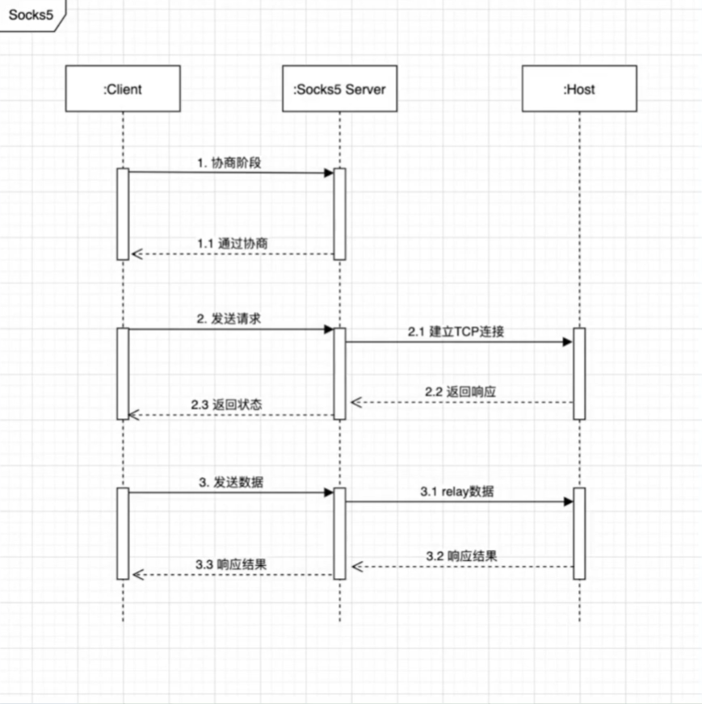

**socket5代理服务器实现**

```go
package main

import (
 "bufio"
 "context"
 "encoding/binary"
 "fmt"
 "io"
 "log"
 "net"

 "golang.org/x/exp/slices"
)

func main() {
 listener, err := net.Listen("tcp", "0.0.0.0:1080") // 创建服务器
 if err != nil {
  fmt.Println(err)
  return
 }
 fmt.Println("tcp server is running at 0.0.0.0:1080")
 for {
  connection, err := listener.Accept() // 接受到客户端请求
  if err != nil {
   fmt.Println(err)
   continue
  }
  go process(connection) // 处理客户端请求
 }
}

const VersionCode_Socket5 = 0x05
const MethodsCode_Not_Require_Authority = 0x00
const CmdCode_Connect = 0x01
const AddrTypeCode_ipv4 = 0x01
const AddrTypeCode_domain = 0x03
const AddrTypeCode_ipv6 = 0x04

func authority(reader *bufio.Reader, conn net.Conn) (err error) {
 // 1.这里实际上就是浏览器将告诉代理服务器它支持的协议版本和鉴权方式
 // 浏览器发来的报文格式：
 // +-------+-----------+------------+
 // | ver   | N-method  | methods  |
 // +-------+-----------+------------+
 // | 1Byte | 1Byte     | 1-255Bytes |
 // +-------+-----------+------------+
 // version:协议版本，socket5为0x05
 // N-method 鉴权方式的个数
 // methods 含支持的每个鉴权方式的编码
 // - 0x00 不需要鉴权
 // - 0x02 需要用户名密码鉴权
 version, err := reader.ReadByte()
 if err != nil {
  return fmt.Errorf("read version fail,error:%v", err)
 }
 if version != VersionCode_Socket5 {
  return fmt.Errorf("unsupport version:%v", version)
 }
 n, err := reader.ReadByte()
 if err != nil {
  return fmt.Errorf("read n fail error:%v", err)
 }
 methods := make([]byte, n)            // 创建一个长度为n的切片
 _, err = io.ReadFull(reader, methods) // 填充切片
 if err != nil {
  return fmt.Errorf("read methods fail error:%v", err)
 }
 if !slices.Contains(methods, MethodsCode_Not_Require_Authority) { // 如果浏览器支持的鉴权方式中没有服务器所需的方式
  return fmt.Errorf("unsupport method:%v", MethodsCode_Not_Require_Authority)
 }
 log.Println("version:", version, "methods:", methods)

 // 2.现在，代理服务器要告诉浏览器选择了什么协议
 // 发给浏览器的报文格式：
 // +-------+------------+
 // | ver   | method  |
 // +-------+------------+
 // | 1Byte | 1Byte      |
 // +-------+------------+
 _, err = conn.Write([]byte{VersionCode_Socket5, MethodsCode_Not_Require_Authority})
 if err != nil {
  return fmt.Errorf("write fail error:%v", err)
 }
 return nil
}
func connect(bufReader *bufio.Reader, clientConn net.Conn) (err error) {
 // 浏览器会发来报文信息，含要访问的目标地址信息，代理服务器要通过报文信息和目标地址建立连接，报文格式：
 // +-----+-----+------+------+-----------+-----------+
 // | VER | CMD | RSV  | ATYP | Dist.Addr | Dist.Port |
 // +-----+-----+------+------+-----------+-----------+
 // |  1  |  1  | 0x00 |  1   | varable   |    2      |
 // +-----+-----+------+------+-----------+-----------+
 // Ver 版本号 0x05 为socket5
 // CMD 命令  0x01 表示连接请求
 // Atyp 目标地址类型：
 // - 0x01  ipv4地址  Dist.Addr为四字节
 // - 0x03   域名      Dist.Addr为可变长值
 // Dist.Addr 目标地址，可变长值
 // Dist.Port 目标端口，2字节
 buf := make([]byte, 4)
 _, err = io.ReadFull(bufReader, buf)
 if err != nil {
  return fmt.Errorf("read dialgram fail: %v", err)
 }
 ver, cmd, atyp := buf[0], buf[1], buf[3]
 if ver != VersionCode_Socket5 {
  return fmt.Errorf("unsupport version: %v", ver)
 }
 if cmd != CmdCode_Connect {
  return fmt.Errorf("unsupport cmd: %v", cmd)
 }
 addr := ""
 switch atyp {
 case AddrTypeCode_ipv4:
  _, err := io.ReadFull(bufReader, buf)
  if err != nil {
   return fmt.Errorf("read addr fail: %v", err)
  }
  addr = fmt.Sprintf("%d.%d.%d.%d", buf[0], buf[1], buf[2], buf[3])
 case AddrTypeCode_domain:
  n, err := bufReader.ReadByte()
  if err != nil {
   return fmt.Errorf("read domain fail: %v", err)
  }
  domain := make([]byte, n)
  _, err = io.ReadFull(bufReader, domain)
  if err != nil {
   return fmt.Errorf("read domain fail: %v", err)
  }
  addr = string(domain)
 case AddrTypeCode_ipv6:
  return fmt.Errorf("unsupport ipv6")
 default:
  return fmt.Errorf("unknow ATYP")
 }
 _, err = io.ReadFull(bufReader, buf[:2]) // 只读取两个字节，cun到buf中
 if err != nil {
  return fmt.Errorf("read port fail:%v", err)
 }
 port := binary.BigEndian.Uint16(buf[:2])
 fmt.Println("dial:", addr, port)

 // 现在通过浏览器发来的报文，得到了浏览器想要访问的目标主机的地址。
 // 现在，让代理服务器和和目标主机建立TCP连接
 destConn, err := net.Dial("tcp", fmt.Sprintf("%v:%v", addr, port))
 if err != nil {
  return fmt.Errorf("dial fail:%v", err)
 }
 defer destConn.Close()
 fmt.Println("dial success")

 // 现在给浏览器一个响应，让浏览器发实际的请求，报文格式：
 // +-----+-----+------+------+-----------+-----------+
 // | VER | REP | RSV  | ATYP | Dist.Addr | Dist.Port |
 // +-----+-----+------+------+-----------+-----------+
 // |  1  |  1  | 0x00 |  1   | varable   |    2      |
 // +-----+-----+------+------+-----------+-----------+
 // VER socks版本 这里为0x05
 // REP Relay Field 填0x00 表示成功
 // RSV 保留字段
 // Atyp 目标地址类型：
 // - 0x01  ipv4地址  Dist.Addr为四字节
 // - 0x03   域名      Dist.Addr为可变长值
 // Dist.Addr 目标地址，可变长值
 // Dist.Port 目标端口，2字节
 _, err = clientConn.Write([]byte{VersionCode_Socket5, 0x00, 0x00, 0x01, 0, 0, 0, 0, 0, 0}) // socks5协议不需要填地址，所以填0
 if err != nil {
  return fmt.Errorf("write fail:%v", err)
 }

 ctx, cancel := context.WithCancel(context.Background())
 defer cancel()
 // 这里相当于是开了两个子进程
 go func() {
  // copy实现是用死循环把 "源"拷贝到"目标"
  io.Copy(destConn, clientConn) // 把浏览器的请求数据发给目标主机
  cancel()                      // 出错后将导致cancel被调用
 }()
 go func() {
  io.Copy(clientConn, destConn) // 把目标主机的响应发给浏览器
  cancel()
 }()
 <-ctx.Done() // 等待ctx被执行完成，也就是cancel()被调用，否则会直接return，导致建立的连接被断开
 return nil
}
func process(conn net.Conn) {
 defer conn.Close()                 // 在函数执行完毕后调用关闭连接
 bufReader := bufio.NewReader(conn) // 创建缓冲读取流
 err := authority(bufReader, conn)  // 鉴权
 if err != nil {
  log.Println("client %v,authorty fail:%v", conn.RemoteAddr(), err)
 }
 err = connect(bufReader, conn)
 if err != nil {
  log.Println("client %v,connect fail:%v", conn.RemoteAddr(), err)
 }
}
```

**启动测试结果**

```bash
> go run .\main.go
tcp server is running at 0.0.0.0:1080
2023/07/26 00:32:57 version: 5 methods: [0 1]
dial: 36.152.44.96 80
dial success
```

```bash
> curl --socks5 172.30.64.1:1080 http://www.baidu.com -v
*   Trying 172.30.64.1:1080...
* SOCKS5 connect to IPv4 36.152.44.96:80 (locally resolved)
* SOCKS5 request granted.
* Connected to (nil) (172.30.64.1) port 1080 (#0)
> GET / HTTP/1.1
> Host: www.baidu.com
> User-Agent: curl/7.81.0
> Accept: */*
>
* Mark bundle as not supporting multiuse
< HTTP/1.1 200 OK
< Accept-Ranges: bytes
< Cache-Control: private, no-cache, no-store, proxy-revalidate, no-transform
< Connection: keep-alive
< Content-Length: 2381
< Content-Type: text/html
< Date: Tue, 25 Jul 2023 16:33:00 GMT
< Etag: "588604f0-94d"
< Last-Modified: Mon, 23 Jan 2017 13:28:16 GMT
< Pragma: no-cache
< Server: bfe/1.0.8.18
< Set-Cookie: BDORZ=27315; max-age=86400; domain=.baidu.com; path=/
<
<!DOCTYPE html>
<!--STATUS OK--><html> <head><meta http-equiv=content-type content=text/html;charset=utf-8><meta http-equiv=X-UA-Compatible content=IE=Edge><meta content=always name=referrer><link rel=stylesheet type=text/css href=http://s1.bdstatic.com/r/www/cache/bdorz/baidu.min.css><title>百度一下，你就知道</title></head> <body link=#0000cc> <div id=wrapper> <div id=head> <div class=head_wrapper> <div class=s_form> <div class=s_form_wrapper> <div id=lg>  </div> <form id=form name=f action=//www.baidu.com/s class=fm> <input type=hidden name=bdorz_come value=1> <input type=hidden name=ie value=utf-8> <input type=hidden name=f value=8> <input type=hidden name=rsv_bp value=1> <input type=hidden name=rsv_idx value=1> <input type=hidden name=tn value=baidu><span class="bg s_ipt_wr"><input id=kw name=wd class=s_ipt value maxlength=255 autocomplete=off autofocus></span><span class="bg s_btn_wr"><input type=submit id=su value=百度一下 class="bg s_btn"></span> </form> </div> </div> <div id=u1> <a href=http://news.baidu.com name=tj_trnews class=mnav>新闻</a> <a href=http://www.hao123.com name=tj_trhao123 class=mnav>hao123</a> <a href=http://map.baidu.com name=tj_trmap class=mnav>地图</a> <a href=http://v.baidu.com name=tj_trvideo class=mnav>视频</a> <a href=http://tieba.baidu.com name=tj_trtieba class=mnav>贴吧</a> <noscript> <a href=http://www.baidu.com/bdorz/login.gif?login&amp;tpl=mn&amp;u=http%3A%2F%2Fwww.baidu.com%2f%3fbdorz_come%3d1 name=tj_login class=lb>登录</a> </noscript> <script>document.write('<a href="http://www.baidu.com/bdorz/login.gif?login&tpl=mn&u='+ encodeURIComponent(window.location.href+ (window.location.search === "" ? "?" : "&")+ "bdorz_come=1")+ '" name="tj_login" class="lb">登录</a>');</script> <a href=//www.baidu.com/more/ name=tj_briicon class=bri style="display: block;">更多产品</a> </div> </div> </div> <div id=ftCon> <div id=ftConw> <p id=lh> <a href=http://home.baidu.com>关于百度</a> <a href=http://ir.baidu.com>About Baidu</a> </p> <p id=cp>&copy;2017&nbsp;Baidu&nbsp;<a href=http://www.baidu.com/duty/>使用百度前必读</a>&nbsp; <a href=http://jianyi.baidu.com/ class=cp-feedback>意见反馈</a>&nbsp;京ICP证030173号&nbsp;  </p> </div> </div> </div> </body> </html>
* Connection #0 to host (nil) left intact
```

## 并发编程视角下的go语言

### 并发与并行

**狭义的并发与并行**

- 并发主要是指多线程程序在一个核心的cpu上运行，主要通过时间片的切换来实现
- 并行主要是指多线程程序在多个核心的cpu上运行，主要通过一个核心负责一个程序来实现
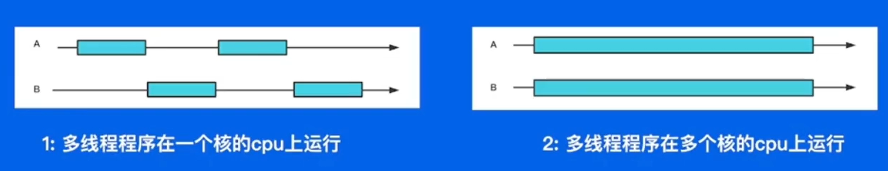

**广义的并发与并行**  

- 广义的并发是指系统对外的一种特征和能力
- 并行可以理解是实现并发的一种手段

**go语言的并发**

- 实现了并发性能极高的调度模型
- 可以最大限度发挥多核cpu的性能

### go语言并发的运行机制Goroutine

**协程与线程**

- 协程是用户态，轻量级线程，栈大小KB级别，是go实现并发的重要概念
- 线程是系统态，线程中运行多个协程，栈大小MB级别
- 线程的调度：创建、切换、停止，操作比较消耗系统资源的
- 线程的调度：是由go语言本身来完成，一次可以创建上万个协程
- 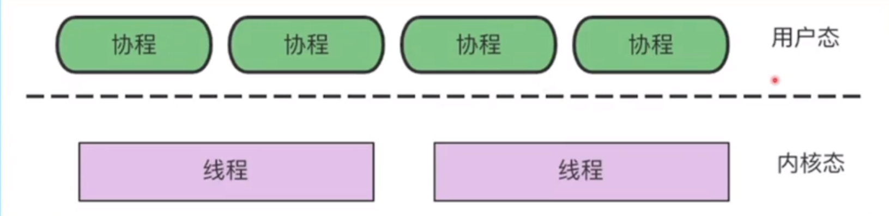

### go语言创建协程实现并发的案例

**使用协程的案例：快速打印`hello goruntine`**

```go
package main

import (
 "fmt"
 "time"
)

func main() {
 for i := 0; i < 10; i++ {
  go fmt.Println("hello goruntine", i) // 创建协程来执行
 }
 time.Sleep(2 * time.Second) // 防止线程提前结束（后续可以用更好的方式来实现）
}

/*
运行结果
hello goruntine 9
hello goruntine 0
hello goruntine 1
hello goruntine 2
hello goruntine 3
hello goruntine 4
hello goruntine 5
hello goruntine 6
hello goruntine 7
hello goruntine 8
*/
```

### 协程间的通信

**两种通信方式**

- 协程间通信可以通过通信通道（CSP-Communicating Sequential Processes）来实现，类似一个消息队列
- 也可以通过内存的临界区来实现，就是一片共享的内存，需要对它加锁
- go提倡通过通信通道（CSP）来实现通信,而不是通过共享内存来实现
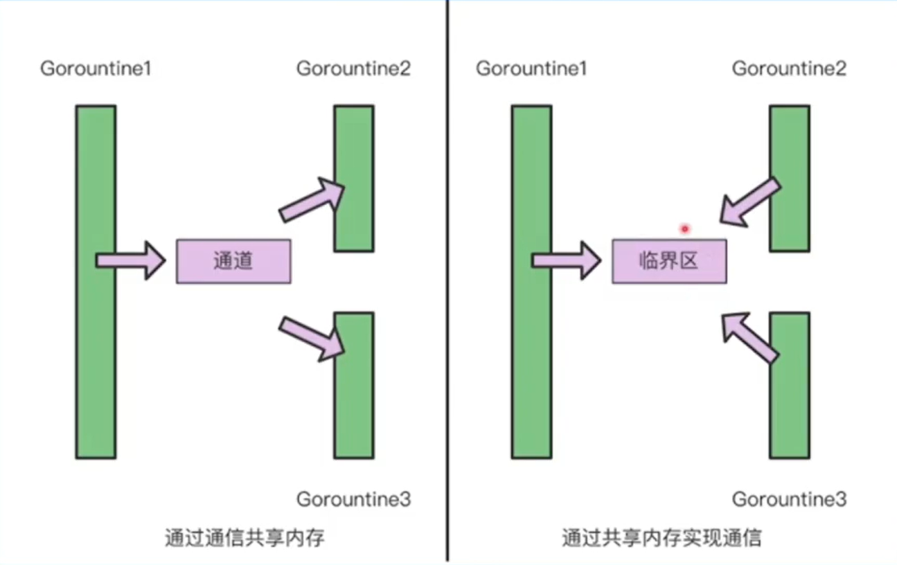

#### 通过通信通道实现协程间通信

**通信通道Channel**

- 使用channel能保证传递的顺序，是并发安全的
- 分类：
  - 无缓冲通道（也叫同步通道）
    - 只有等消费数据方消费完数据，生产数据方才能把数据放入缓存区
  - 有缓冲通道
    - 如果生产数据比较快，消费数据比较慢，生产者就可以直接把数据放入缓冲队列，不必等待消费者消费完数据
- 创建语法

  ```go
  channel := make(chan 类型[,缓存区大小])
  channelA := make(chan int)
  channelB := make(chan int,2)
  ```

- 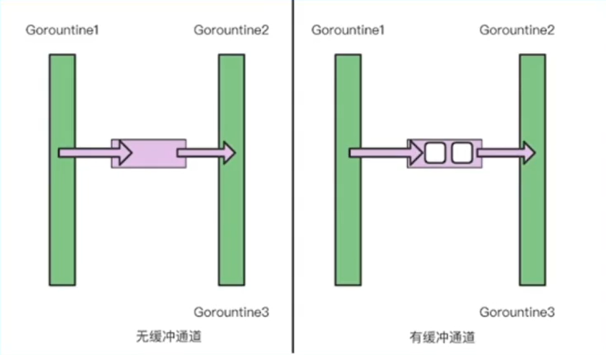

**channel多线程通信案例**

```go
package main

import "fmt"

func main() {
 srcA := make(chan int)    // 无缓冲的通道
 resB := make(chan int, 3) // 有缓冲的通道

 // 协程A 生成数据
 go func() {
  defer close(srcA) // 函数执行完后关闭通道A
  for i := 1; i < 10; i++ {
   srcA <- i // 向通道A中写入数据
  }
 }()

 // 协程B 处理数据
 go func() {
  defer close(resB)     // 函数执行完后关闭通道B
  for i := range srcA { // 从通道A中读取数据，直到通道被关闭
   resB <- i * i // 将结果写入通道B
  }
 }()

 // 主协程 消费数据
 for k := range resB { // 从通道B中读取数据，直到通道关闭
  fmt.Println(k)
 }
}
```

#### 通过共享内存实现协程间通信

**线程通信：**  
多线程的两个程序要操作同一块内存必须保证线程安全，需要通过锁来实现
**go语言协程通信**  
在go语言的协程通信中，同样支持共享内存来实现协程通信，也存在锁的概念

```go
package main

import (
 "fmt"
 "sync"
 "time"
)

var x int64 = 0        // x
var xLocker sync.Mutex // x的锁

func addWithLock() { // 带锁的自增
 xLocker.Lock() // 上锁
 x++
 xLocker.Unlock() // 解锁
}
func addWithOutLock() { // 不带锁的自增
 x++
}

func main() {
 x = 0
 for i := 0; i < 10000; i++ {
  go addWithLock()
 }
 time.Sleep(2 * time.Second)
 fmt.Println(x) // 10000

 x = 0
 for i := 0; i < 10000; i++ {
  go addWithOutLock()
 }
 time.Sleep(2 * time.Second)
 fmt.Println(x) // 9748
}
```

### Go语言的并发控制:WaitGroup

> 目测WaitGroup本质应该就是带锁的线程安全的计数器  
>
> - Add(x) 就是带锁的`cnt+=x`
> - Done() 就是带锁的`cnt--`
> - Wait() 就是`while(cnt!=0);`

**WaitGroup的三个公开方法**

- `.Add(10) // 设置其内部计数器为10`
- `.Done() // 每执行一次，计数器都自减`
- `.Wait() // 阻塞，直到计数器为0`

```go
package main

import (
 "fmt"
 "sync"
)

func main() {
 var flag sync.WaitGroup
 flag.Add(10) // 设置其内部计数器为10
 for i := 0; i < 10; i++ {
  go func(idx int) { // 创建协程来执行
   fmt.Println("hello goruntine", idx)
   flag.Done() // 每执行一次，计数器都自减
  }(i)
 }
 flag.Wait() // 阻塞，直到计数器为0
}

/*
运行结果
hello goruntine 9
hello goruntine 3
hello goruntine 1
hello goruntine 0
hello goruntine 2
hello goruntine 6
hello goruntine 7
hello goruntine 4
hello goruntine 8
hello goruntine 5
*/
```

## 依赖管理

**背景**

- 如果一个项目是根据go的标准库从0到1来开发的，那么其不需要依赖管理
- 实际的工程项目中，存在依赖第三方项目的情况，那么就要对这些依赖管理
- 

**Go的依赖管理方案**


### GOPATH

**什么是GOPATH**

- GOPATH是Go语言支持的环境变量 是一个目录
- 使用`go get A`下载的第三方库的源代码（不区分版本）将存放在`$GOPATH\src`目录下
- 开发者使用 `import "A"`引入第三方依赖时，会到`$GOPATH\src`中去寻找
- 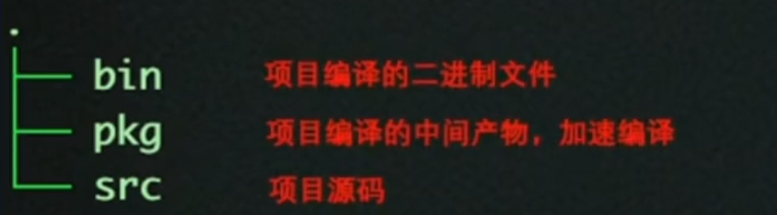

**GOPATH缺点**  

- 无法控制依赖项的版本，因为开发者的项目可能要依赖某个第三方包的特定版本
- 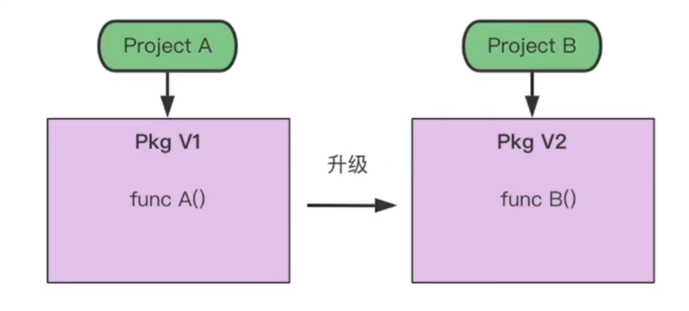

### GO Vendor

**什么是GO Vendor**

- GO vendor是项目目录下的一个文件夹，存放项目依赖的包的副本，类似于`node_modules`文件夹
- go语言寻找依赖的顺序为 vendor => GOPATH
- 解决了要依赖第三方包特定版本的问题
- 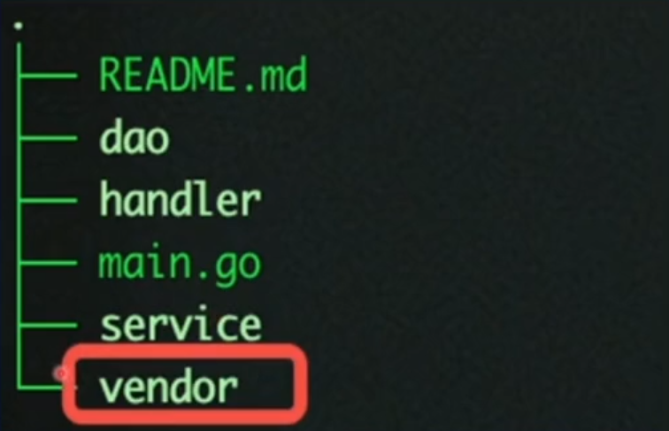

**GO Vendor缺点**

- 无法解决依赖项所依赖包的版本冲突问题（间接依赖项的冲突）
- 原因就是vendor文件夹里的项目文件依然是不区分版本的
- 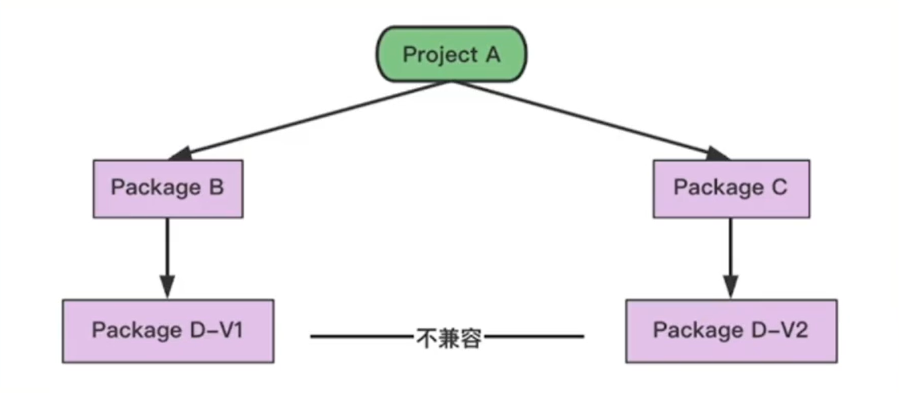

### GO Module

**什么是GO Module**

- go官方从1.1开始实验性引入的依赖管理系统，从1.6开始作为默认依赖管理工具
- 通过go.mod文件来管理依赖包的版本
- 通过go get/go mod命令管理依赖
- 实现了定义版本规则和依赖关系的管理

**依赖管理三要素**

- 配置文件，描述依赖 go.mod
- 中心仓库，保存依赖 proxy.cn
- 本地工具，管理依赖 go get/mod

#### go.mod文件

- 用于描述项目的依赖
- 依赖项的版本描述
  - 语义化版本描述`${大版本,前后不保证兼容}.${小版本,保证大版本下前后兼容}.${补丁版本}`
  - 基于git-commit的伪版本描述 `v0.0.0 yyyymmddhhmmss-hashhashhashhash`
  - `// indirect` 表示间接依赖
  - 如果依赖项的主版本号是2以上，会在模块路径下增加`/vN`后缀
  - 如果依赖项的主版本号是2以上，且没有`go.mod`文件，会增加 `+incompatible` 表示可能不兼容
- 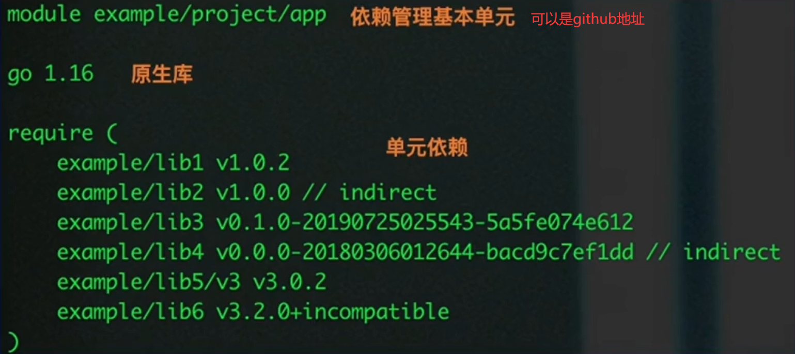

**题目**
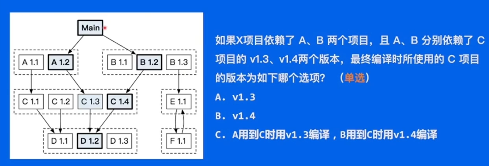

<details>
<summary>解析：</summary>
B,因为go的算法会选择大家都兼容的最低版本
</details>

#### GOPROXY

- go的第三方库一般是存放在代码托管平台的，但是代码托管平台的代码是不稳定的，第三方库的作者拥有随意增删改其代码的权利，将导致依赖项的代码的不稳定。
- goProxy服务器会缓存这些第三方库，能保证第三方库的代码的稳定性，即使第三方库作者将源代码被删除
- GOPROXY是一个环境变量，保存的是URL的列表
- 配置GOPROXY:`go env -w GOPROXY=https://goproxy.cn,https://url1.cn,https://url2.cn,direct`
  - direct表示如果无法从前面的proxy服务器地址获取，就直接访问源站
- 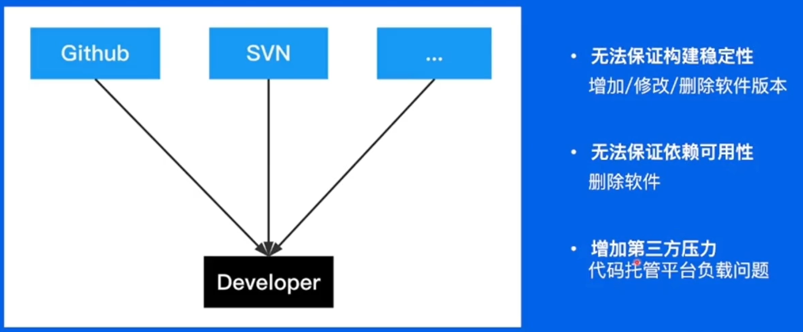 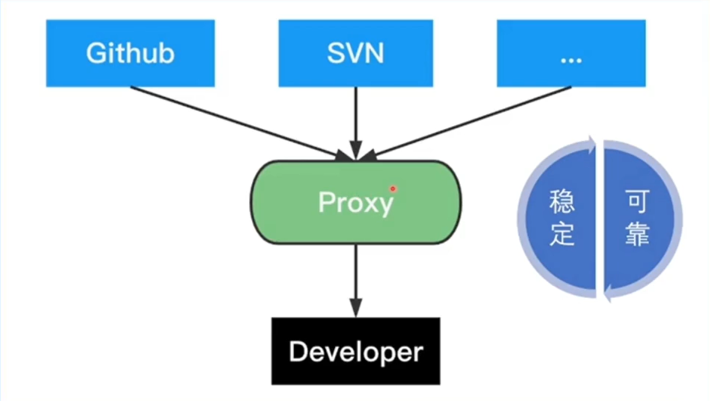

#### go get/mod工具

- 
- 

## 测试

- 单元测试：
- mock测试
- 基准测试

回归测试：回归测试是指修改了旧代码后，重复以前的全部或部分的相同测试以确认修改没有引入新的错误或导致其他代码产生错误

### 单元测试

**什么是单元测试**

- 最小设计单元（模块）的验证，确保模块被正确编码，对重要控制路径进行测试以发现模块内错误
- 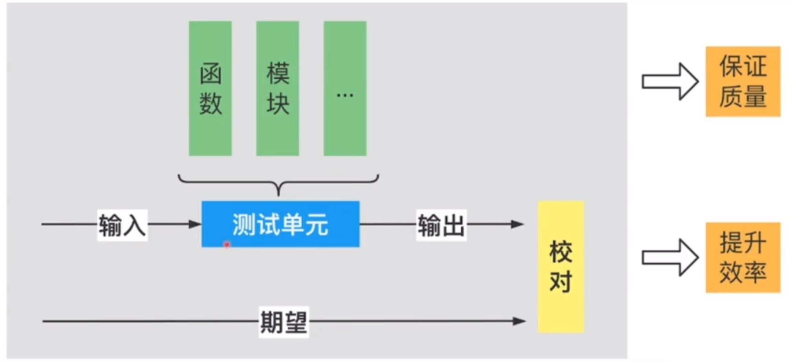

**go单元测试的编写规则**

- 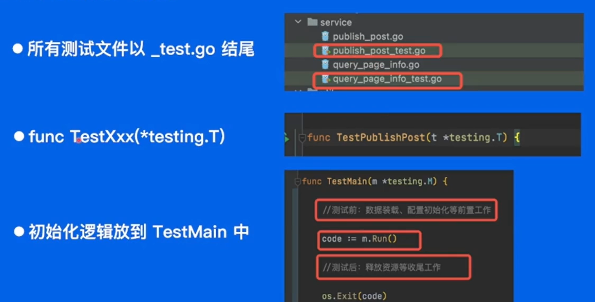

**go测试案例：**

`hello.go`

```go
package main

func hello() string {
 return "hello test"
}
```

`hello_test.go`

```go
package main

import (
 "fmt"
 "os"
 "testing"

 "github.com/stretchr/testify/assert" // go get github.com/stretchr/testify/assert
)

func TestMain(m *testing.M) {
 fmt.Println("测试开始") // 测试前：初始化阶段
 code := m.Run()     // 执行测试阶段
 fmt.Println("测试结束") // 测试后：释放资源等收尾操作
 os.Exit(code)
}
func TestHello_Version1(t *testing.T) {
 res := hello()
 exp := "hello test"
 if res != exp {
  t.Errorf("期待值为：%v,实际值为：%v,测试未通过", exp, res)
 }
}
func TestHello_Version2(t *testing.T) {
 res := hello()
 exp := "hello test"
 assert.Equal(t, res, exp)
}
```

**执行测试**

```bash
> go.exe test -timeout 30s -run ^(TestHello_Version1|TestHello_Version2)$ main/_04_Test/_01_unitTest
测试开始
=== RUN   TestHello_Version1
--- PASS: TestHello_Version1 (0.00s)
=== RUN   TestHello_Version2
--- PASS: TestHello_Version2 (0.00s)
PASS
测试结束
```

**测试覆盖率**

- 可以认为是代码被测试的程度的一个指标
- 一般覆盖率为：50~60%
- 80%+为较高覆盖率
- 提高测试覆盖率的技巧
  - 对函数的分支分别测试
  - 保证单元测试的粒度小，一个单元测试只测试一个函数
    - 也就要求一个函数的职责足够小

**案例**

- 未充分测试：
- 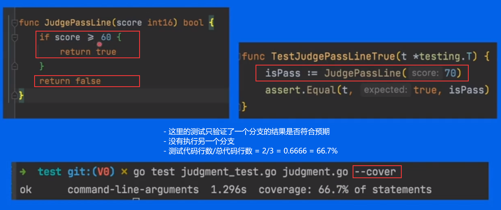
- 充分测试：
- 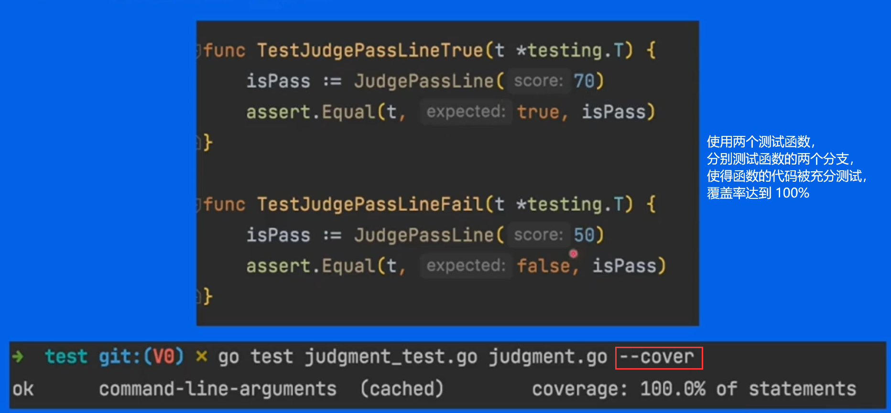

### mock测试

**测试的要求**

- 幂等：重复运行同一个测试，结果应该是一致的。
- 稳定：不同的测试间不应该相互影响。
- 如果单元测试依赖外部资源，就有可能破坏这两个要求
  - 比如：
  - 如果测试删除了一条数据库的数据，第二次测试再次执行删除操作就会失败，这就破坏了幂等，因为重复测试，但结果却不一样
  - 如果测试执行了数据库添加操作，那么另一个测试查询数据库数据条数就将破坏预期，这就会破坏稳定性，因为两个测试相互影响了
- 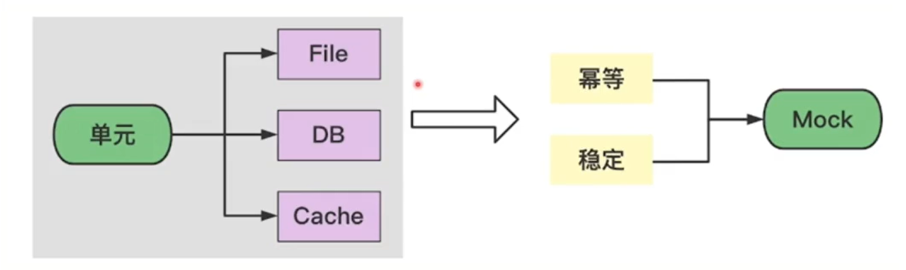

**monkey**

- monkey的Patch() 可以实现将一个函数替换为另一个函数
- 可以用来Mock函数
- 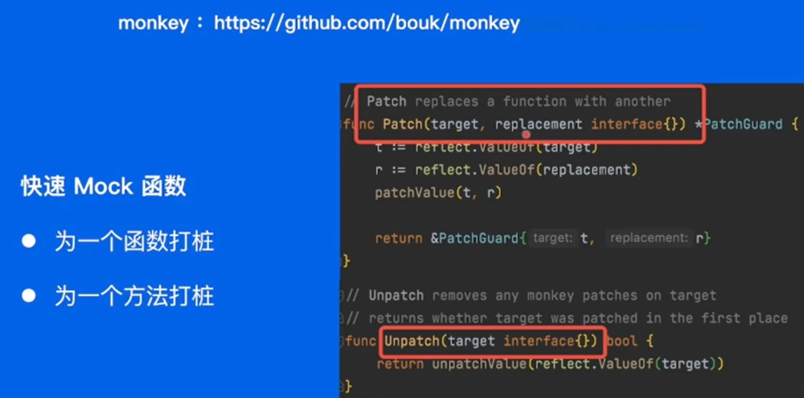

**Mock函数的案例**

- 案例中待测试函数A依赖另一个函数B
- 而函数B依赖外部文件的内容，而外部文件的内容可能是变化的
- 这就导致待测试函数A的结果是依赖函数B,从而也是变化的
- 可以通过mock这个函数B,使其返回值是可控的
- 这样函数A的返回值就也是可以确定的了

```go
package main

import (
 "bufio"
 "os"
 "strings"
)

// 获取外部文件的第一行
func getFileFirstLine() string {
 file, err := os.Open("./file.txt")
 if err != nil {
  return ""
 }
 defer file.Close()
 bufScanner := bufio.NewScanner(file)
 for bufScanner.Scan() {
  return bufScanner.Text()
 }
 return ""
}

// 函数的功能是把外部文件第一行的中的0 替换为 1
// 函数的执行结果依赖getLogFirstLine(),而该函数又依赖外部文件
func replaceAll0To1() string {
 firstLine := getFileFirstLine()
 result := strings.ReplaceAll(firstLine, "0", "1")
 return result
}
```

```go
package main

import (
 "fmt"
 "os"
 "testing"

 "bou.ke/monkey" // go get bou.ke/monkey
)

func TestMain(m *testing.M) {
 code := m.Run()
 os.Exit(code)
}
func TestA(t *testing.T) {
 firstLine := getFileFirstLine() // 获取外部文件的第一行
 fmt.Println(firstLine)
}
func TestB(t *testing.T) {
 result := replaceAll0To1() // 函数的执行结果依赖getLogFirstLine(),而该函数又依赖外部文件，预期将是不定的
 fmt.Println(result)
}

func TestC(t *testing.T) {
 monkey.Patch(getFileFirstLine, func() string { // patch 就是将函数替换为另一个函数，让其不再依赖外部文件，使其拥有确定值
  return "000111"
 })
 defer monkey.Unpatch(getFileFirstLine) // unpatch,恢复这个函数

 result := replaceAll0To1() // 函数的测试结果不再依赖getFileFirstLine函数，也就不再外部文件，结果是确定的
 expect := "111111"
 if result != expect {
  t.Errorf("测试未通过，预期：%v，结果：%v", expect, result)
 }
}
```

### 基准测试

基准测试（benchmarking）是一种测量和评估软件性能指标的活动。

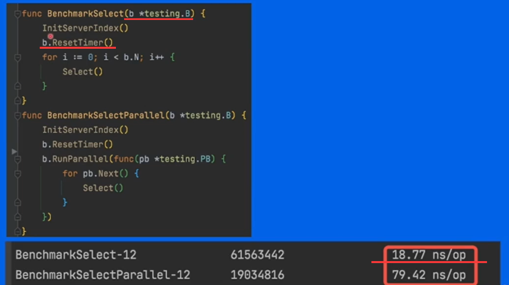

**案例**

- 该案例是对实现随机选择服务器实现负载均衡的函数进行基准测试
- 通过基准测试可以发现，在并发和并行的环境下，函数的执行时间极大的增加了
- 原因是原因是因为随机数生成函数为了保证全局的随机性和并发安全使用了一把全局锁，这就降低了并发的性能
- fastrand一定程度上缓解了这一问题，通过测试可以发现在并行测试条件下，基准测试结果明显变好

```go
package main

import (
 "math/rand"

 "github.com/bytedance/gopkg/lang/fastrand"
)

type Service struct {
}

const maxSize = 10

var serviceIdxMap [maxSize]*Service

// 初始化服务器列表
func initServiceIdxMap() {
 for i := 0; i < maxSize; i++ {
  serviceIdxMap[i] = &Service{}
 }
}

// 随机选择服务器实现负载均衡
func randomSelectService() *Service {
 return serviceIdxMap[rand.Intn(maxSize)]
}

// fastrand随机选择服务器实现负载均衡
func fastRandomSelectService() *Service {
 return serviceIdxMap[fastrand.Intn(maxSize)]
}

```

```go
package main

import (
 "os"
 "sync"
 "testing"
)

func TestMain(m *testing.M) {
 code := m.Run()
 os.Exit(code)
}
func BenchmarkTestA(b *testing.B) {
 // fmt.Println("N:", b.N) // 执行次数
 initServiceIdxMap()
 b.ResetTimer() // 重置计时器
 // b.N // B 是传递给基准测试函数以管理基准的类型 计时并指定要运行的迭代次数。
 for i := 0; i < b.N; i++ {
  randomSelectService() // 顺序执行N次，统计耗时
 }
}
func BenchmarkTestB(b *testing.B) {
 // fmt.Println("N:", b.N) // 执行次数
 initServiceIdxMap()
 var flag sync.WaitGroup
 flag.Add(b.N)
 b.ResetTimer()             // 重置计时器
 for i := 0; i < b.N; i++ { // 并发执行N次，统计耗时
  go func() {
   defer flag.Done()
   randomSelectService()
  }()
 }
 flag.Wait()
}

func BenchmarkTestC(b *testing.B) {
 // fmt.Println("N:", b.N) // 执行次数
 initServiceIdxMap()
 b.ResetTimer()                       // 重置计时器
 b.RunParallel(func(pb *testing.PB) { // 并行执行N次，统计耗时 （并行是通过并发来模拟实现的）
  for pb.Next() {
   randomSelectService()
  }
 })
}

func BenchmarkTestD(b *testing.B) {
 // fmt.Println("N:", b.N) // 执行次数
 initServiceIdxMap()
 b.ResetTimer() // 重置计时器
 // b.N // B 是传递给基准测试函数以管理基准的类型 计时并指定要运行的迭代次数。
 for i := 0; i < b.N; i++ {
  fastRandomSelectService() // 顺序执行N次，统计耗时
 }
}
func BenchmarkTestE(b *testing.B) {
 // fmt.Println("N:", b.N) // 执行次数
 initServiceIdxMap()
 var flag sync.WaitGroup
 flag.Add(b.N)
 b.ResetTimer()             // 重置计时器
 for i := 0; i < b.N; i++ { // 并发执行N次，统计耗时
  go func() {
   defer flag.Done()
   fastRandomSelectService()
  }()
 }
 flag.Wait()
}

func BenchmarkTestF(b *testing.B) {
 // fmt.Println("N:", b.N) // 执行次数
 initServiceIdxMap()
 b.ResetTimer()                       // 重置计时器
 b.RunParallel(func(pb *testing.PB) { // 并行执行N次，统计耗时 （并行是通过并发来模拟实现的）
  for pb.Next() {
   fastRandomSelectService()
  }
 })
}
```

```go
go.exe test -benchmem -run=^$ -bench ^(BenchmarkTestA|BenchmarkTestB|BenchmarkTestC|BenchmarkTestD|BenchmarkTestE|BenchmarkTestF)$ main/_04_Test/_03_benchmark

goos: windows
goarch: amd64
pkg: main/_04_Test/_03_benchmark
cpu: Intel(R) Core(TM) i5-7300HQ CPU @ 2.50GHz
=== RUN   BenchmarkTestA
BenchmarkTestA
BenchmarkTestA-4
38534160                29.49 ns/op            0 B/op          0 allocs/op
=== RUN   BenchmarkTestB
BenchmarkTestB
BenchmarkTestB-4
 3252032               367.7 ns/op            16 B/op          1 allocs/op
=== RUN   BenchmarkTestC
BenchmarkTestC
BenchmarkTestC-4
20863542                57.32 ns/op            0 B/op          0 allocs/op
=== RUN   BenchmarkTestD
BenchmarkTestD
BenchmarkTestD-4
174119311                6.879 ns/op           0 B/op          0 allocs/op
=== RUN   BenchmarkTestE
BenchmarkTestE
BenchmarkTestE-4
 3189530               334.8 ns/op            16 B/op          1 allocs/op
=== RUN   BenchmarkTestF
BenchmarkTestF
BenchmarkTestF-4
708608461                1.736 ns/op           0 B/op          0 allocs/op
PASS
ok      main/_04_Test/_03_benchmark     10.862s
```

## 项目实战

**需求描述**

- 展示话题(标题+内容)和回复列表
- 暂时不考虑前端页面，只需要实现接口
- 话题和回复只需要使用文件存储


**需求分析**

- 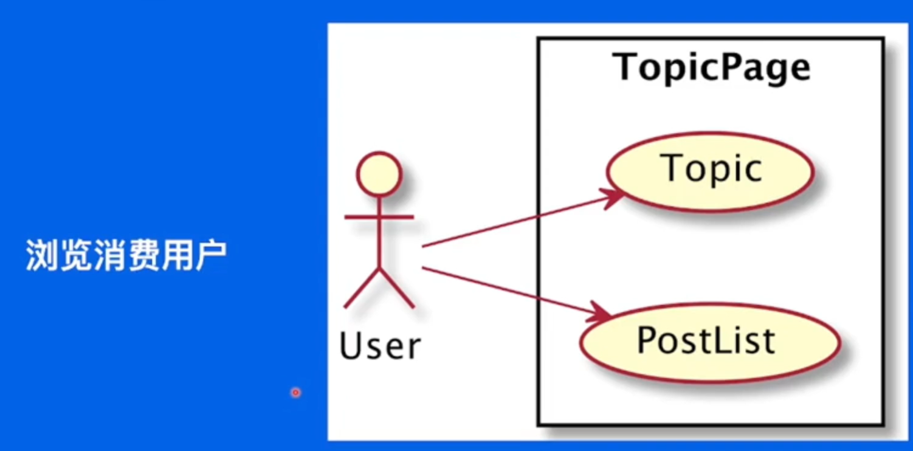
- E-R图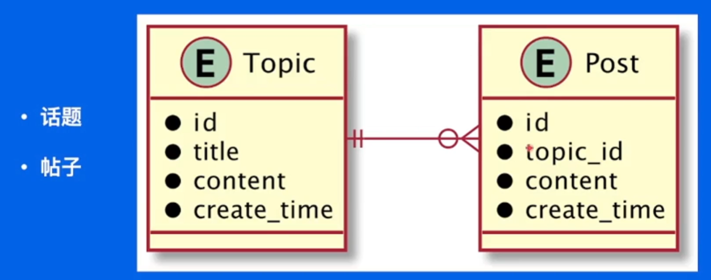
- 分层模型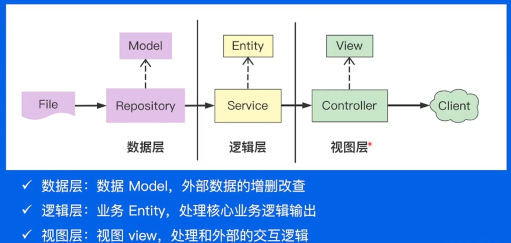

**技术选型**

- Gin-go的高性能开源web框架
- Go Mod-go的项目管理工具

**工程创建**

- 初始化项目： `go mod init`
- 安装依赖：`go get gopkg.in/gin-gonic/gin.v1 1.3.0`

### 数据层实现

```go
package repository

import (
 "bufio"
 "encoding/json"
 "fmt"
 "os"
 "path"
 "sync"
)

type Topic struct {
 Id          int32  `json:"id"`
 Title       string `json:"title"`
 Content     string `json:"content"`
 Create_time int32  `json:"create_time"`
}
type TopicDao struct {
}

var TopicMap map[int32]*Topic

var topicDaoSingleInstance *TopicDao // 单例模式，dao的实例对象
var topicOnc sync.Once               // 保证执行的锁

// 用于初始化 TopicMap 对象， 该对象可以通过id快速获取topic
func initIdx2TopicMap() error {
 workDir, _ := os.Getwd()                          // 获取工作目录
 filePath := path.Join(workDir, "./data/Topic.db") // 拼接路径
 file, err := os.Open(filePath)                    // 打开文件
 if err != nil {
  fmt.Println(err)
  os.Exit(-1) // 文件不存在就直接报错然后退出
 }
 bufScaner := bufio.NewScanner(file)
 temp := make(map[int32]*Topic)
 for bufScaner.Scan() { // Scan会扫描到下一个token，默认的token分割函数是按照行分割，所以每次会读取一行
  topic := Topic{}                                       // 创建topic对象
  err = json.Unmarshal([]byte(bufScaner.Text()), &topic) // 扫描一行数据，反序列化，存到topic
  if err != nil {
   return err
  }
  temp[topic.Id] = &topic // 存入
 }
 TopicMap = temp
 return nil
}

func NewTopicDaoInstance() *TopicDao { // 单例模式创建TopicDao
 topicOnc.Do(func() {
  initIdx2TopicMap()
  topicDaoSingleInstance = &TopicDao{}
 })
 return topicDaoSingleInstance
}

// 根据id获取一个Topic
func (*TopicDao) SelectTopicById(id int32) *Topic {
 return TopicMap[id]
}
```

```go
package repository

import (
 "bufio"
 "encoding/json"
 "fmt"
 "os"
 "path"
 "sync"
)

type Post struct {
 Id          int32  `json:"id"`
 Parent_id   int32  `json:"parent_id"`
 Content     string `json:"content"`
 Create_time int32  `json:"create_time"`
}
type PostDao struct {
}

var PostListMap map[int32](map[int32]*Post)
var postDao *PostDao
var psotOnc sync.Once

func initIdx2PostMap() error {
 workDir, _ := os.Getwd() // 获取工作目录
 filePath := path.Join(workDir, "./data/Post.db")
 file, err := os.Open(filePath)
 if err != nil {
  fmt.Println(err)
  os.Exit(-1)
  return err
 }
 bufScaner := bufio.NewScanner(file)
 temp := make(map[int32](map[int32]*Post)) // 类型是两层map
 for bufScaner.Scan() {                    // 每次读取一行
  post := Post{}
  err = json.Unmarshal([]byte(bufScaner.Text()), &post)
  if err != nil {
   return err
  }
  if temp[post.Parent_id] == nil { // 初始化第二层map
   temp[post.Parent_id] = make(map[int32]*Post)
  }
  temp[post.Parent_id][post.Id] = &post
 }
 PostListMap = temp
 return nil
}

func NewPostDaoInstance() *PostDao {
 psotOnc.Do(func() { // 懒汉单例
  initIdx2PostMap() // 初始化
  postDao = &PostDao{}
 })
 return postDao
}

// 根据父id获取回复列表
func (*PostDao) SelectPostListByFatherId(fatherId int32) []*Post {
 postMap := PostListMap[fatherId]
 postList := make([]*Post, 0)
 for _, post := range postMap {
  postList = append(postList, post)
 }
 return postList
}
```

### 业务逻辑层实现

```go
package service

import (
 "errors"
 "main/repository"
 "sync"
)

type PageInfo struct {
 Topic    *repository.Topic
 PostList []*repository.Post
}
type PageInfoService struct {
}

// 查询页面信息
func QueryPageInfo(topicId int32) (*PageInfo, error) {
 flow := QueryPageInfoFLow{topicId: topicId} // 创建一个查询页面信息的流程
 pageInfo, err := flow.Do()                  // 执行这个流程，得到结果
 if err != nil {
  return nil, err
 }
 return pageInfo, nil
}

// 查询页面数据操作流程所需的数据结构
type QueryPageInfoFLow struct {
 topicId  int32
 topic    *repository.Topic
 postList []*repository.Post
 pageInfo *PageInfo
}

func (flow *QueryPageInfoFLow) Do() (*PageInfo, error) {
 err := flow.checkParam() // 检查参数
 if err != nil {
  return nil, err
 }
 err = flow.prepareInfo() // 准备数据
 if err != nil {
  return nil, err
 }
 err = flow.packPageInfo() // 组装数据
 if err != nil {
  return nil, err
 }
 return flow.pageInfo, nil // 返回数据
}

// 检查参数，id不能为负
func (flow *QueryPageInfoFLow) checkParam() error {
 if flow.topicId < 0 {
  return errors.New("topicId coludn't be negative")
 }
 return nil
}

// 准备数据，使用两个协程来分别取获取topic和postlist
func (flow *QueryPageInfoFLow) prepareInfo() error {
 var wg sync.WaitGroup
 wg.Add(2)
 go func() {
  topicDao := repository.NewTopicDaoInstance()
  flow.topic = topicDao.SelectTopicById(flow.topicId)
  wg.Done()
 }()
 go func() {
  postDao := repository.NewPostDaoInstance()
  flow.postList = postDao.SelectPostListByFatherId(flow.topicId)
  wg.Done()
 }()
 wg.Wait()
 return nil
}

// 组装数据
func (flow *QueryPageInfoFLow) packPageInfo() error {
 flow.pageInfo = &PageInfo{}
 flow.pageInfo.Topic = flow.topic
 flow.pageInfo.PostList = flow.postList
 return nil
}
```

### 视图层实现

```go
package controller

import (
 "main/service"
 "strconv"
)

// 定义页面数据
type PageData struct {
 Code int32       `json:"code"`
 Msg  string      `json:"msg"`
 Data interface{} `json:"data"`
}

func QueryPageInfo(topicIdStr string) *PageData {
 topicId, err := strconv.Atoi(topicIdStr) // 获取id
 if err != nil {
  return &PageData{
   Code: 501,
   Msg:  err.Error(),
  }
 }
 pageInfo, err := service.QueryPageInfo(int32(topicId))
 if err != nil {
  return &PageData{
   Code: 502,
   Msg:  err.Error(),
  }
 }
 return &PageData{ // 返回数据
  Code: 0,
  Msg:  "查询成功",
  Data: &pageInfo,
 }
}
```

### 主函数

```go
package main

import (
 "fmt"
 "main/controller"

 "github.com/gin-gonic/gin"
)

func main() {
 g := gin.Default()
 g.GET("/community/topic/:id", func(ctx *gin.Context) {
  topicId := ctx.Param("id")
  data := controller.QueryPageInfo(topicId)
  ctx.JSON(200, data)
 })
 err := g.Run("0.0.0.0:8080")
 if err != nil {
  fmt.Println(err)
 }
}
```

<details>
<summary>旧版笔记：</summary>

## 高质量编程

> **高质量：** 正确、可靠、简洁、清晰
>
> - 正确：是否考虑到各种边界条件，对错误调用、预期外的输出能否正确处理，
> - 可靠：服务出现异常是否有明确的处理策略
> - 简洁：逻辑尽可能简单，保证易读易维护
> - 清晰：保证其他人能清楚明白代码的含义，便于其理解后重构、优化、附加功能

### 编程原则

**高质量编程-go语言开发者队伍的观点**

- 简单性
  - 消除多余的复杂性，以简单清晰的逻辑编写代码
  - 因为难以理解的代码无法修复改进
- 可读性
  - 代码是写个人看的，其次才是机器
  - 编写可维护的代码就要确保代码的可读性
- 生产力
  - 团队整体工作效率非常重要

### 编码规范

- 代码格式
- 注释
- 命名规范
- 控制流程
- 错误和异常处理

#### 代码格式

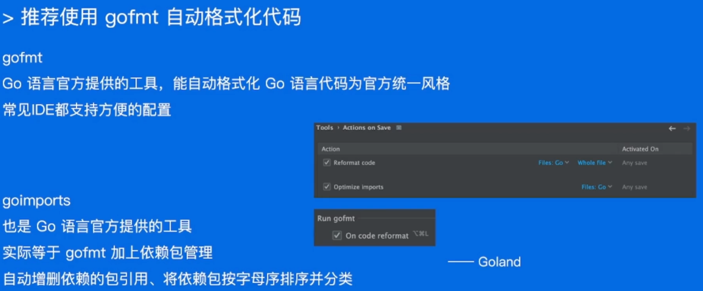

#### 注释


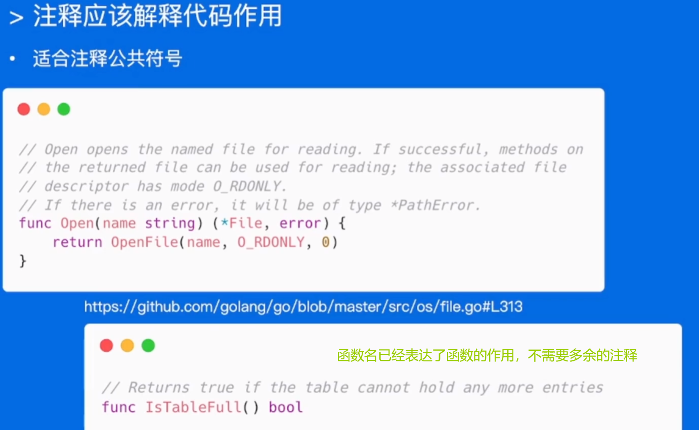
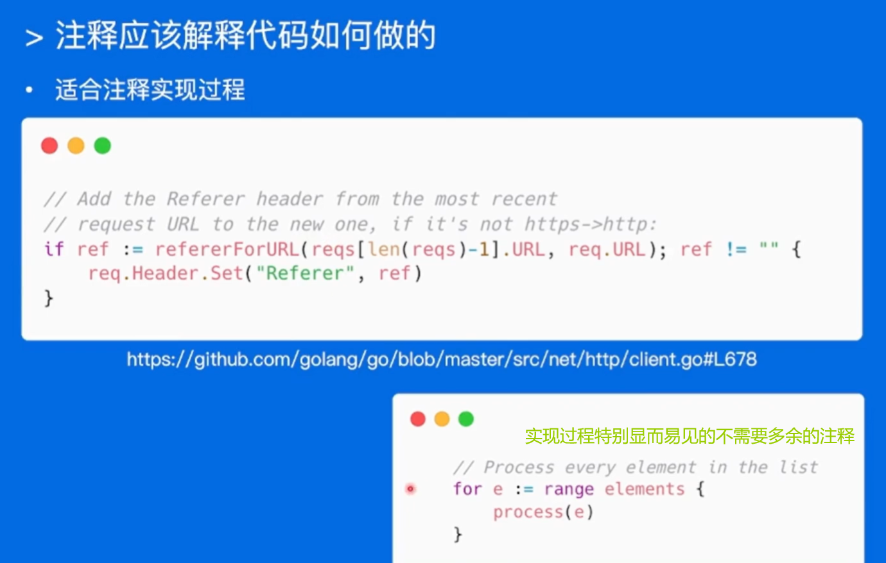
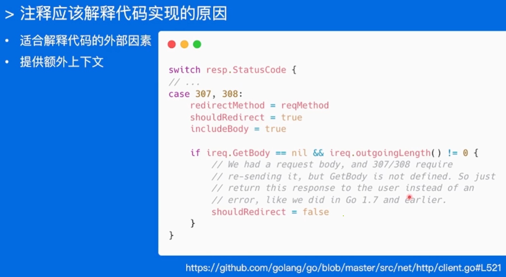
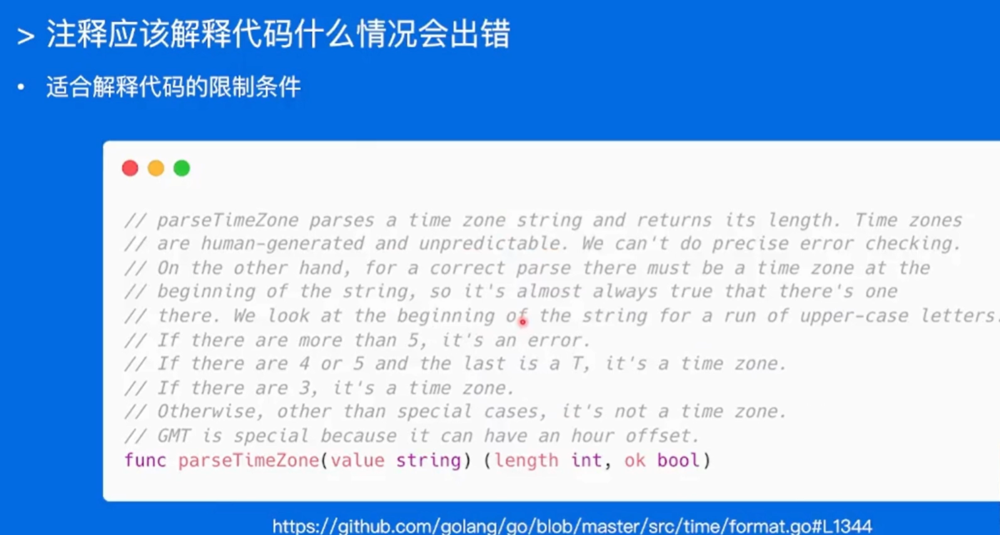

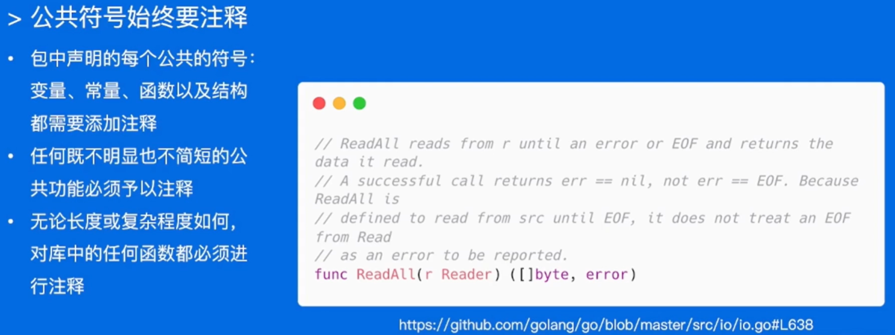
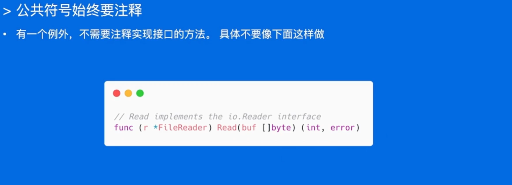


#### 命名规范

**变量的命名**

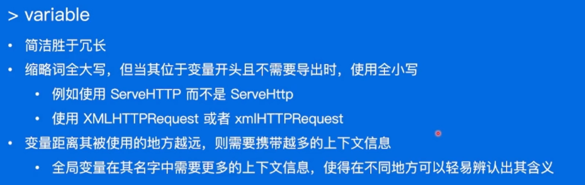
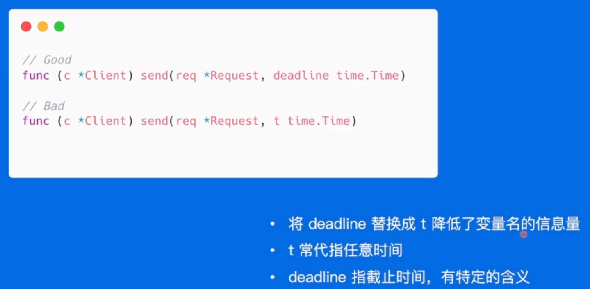

**函数的命名**
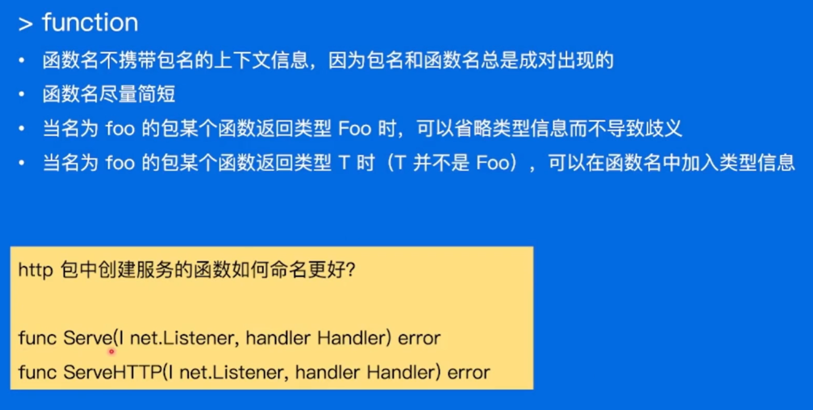

**包的命名**
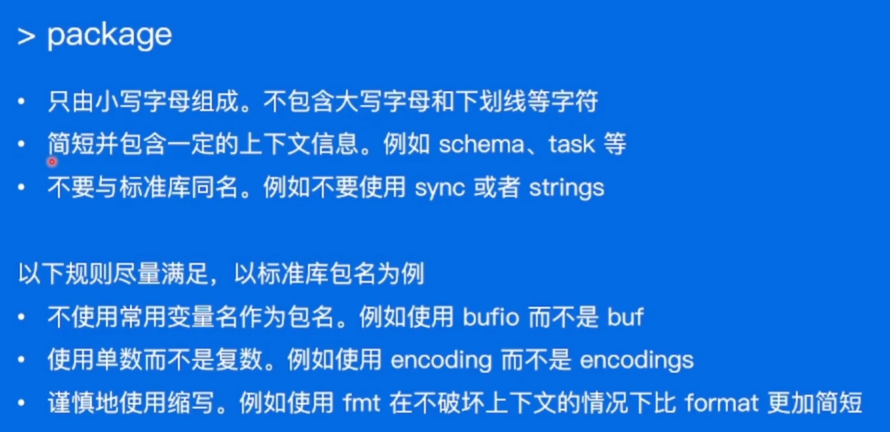

**小结**


#### 控制流程

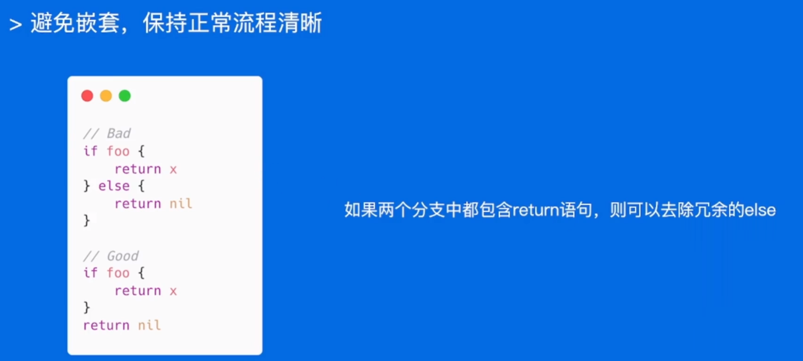
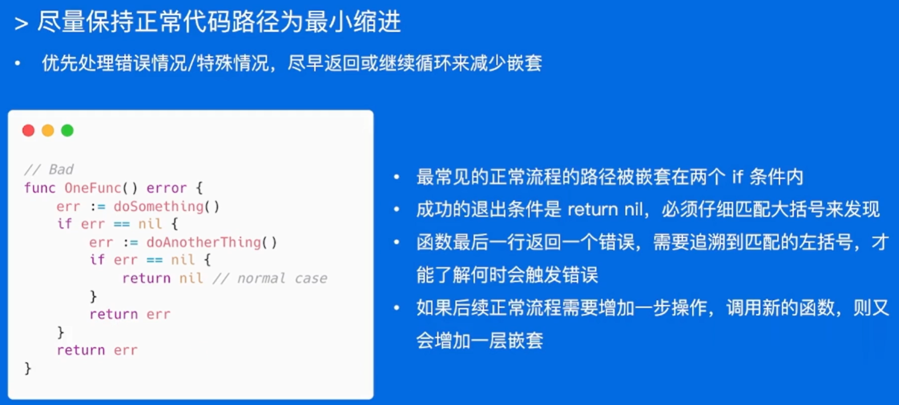
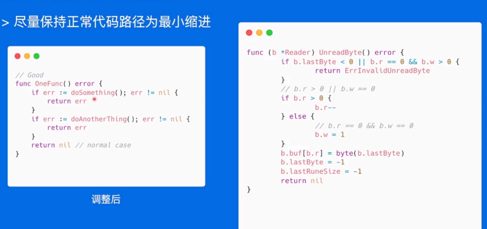


#### 错误和异常处理

**简单错误**
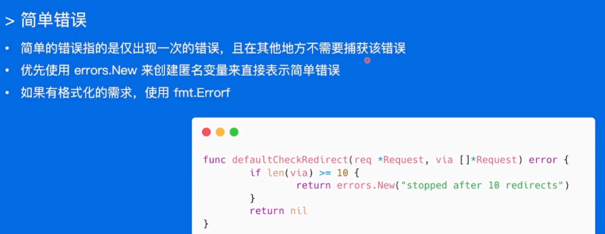

**嵌套错误**


**错误判断：特定错误**
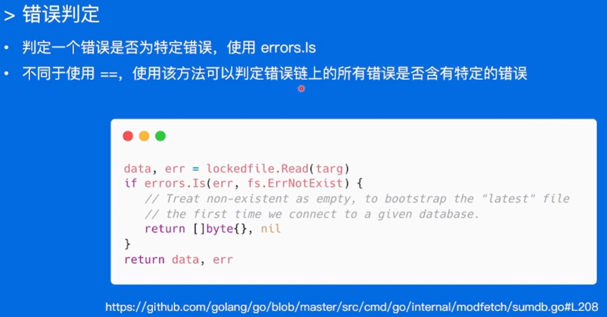

**错误判断：错误链存在的特定错误**
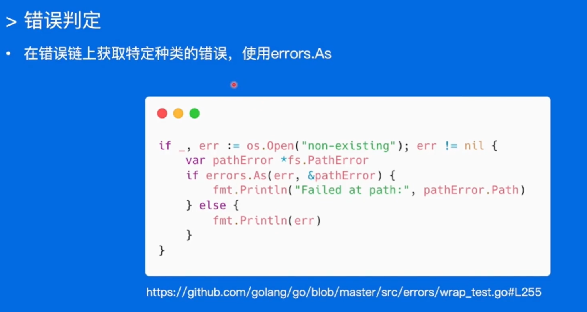

**panic**
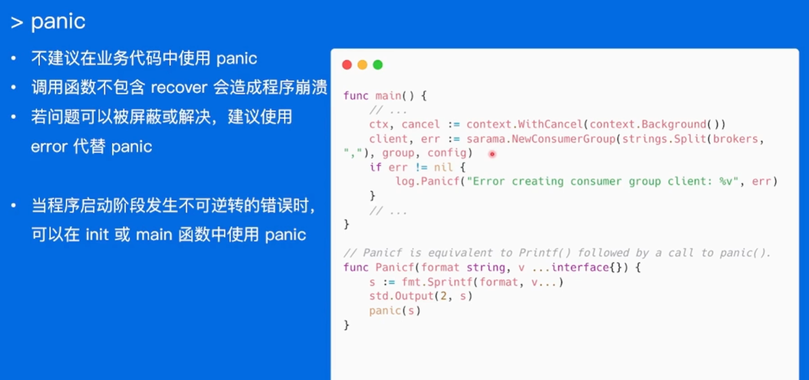

**recover**
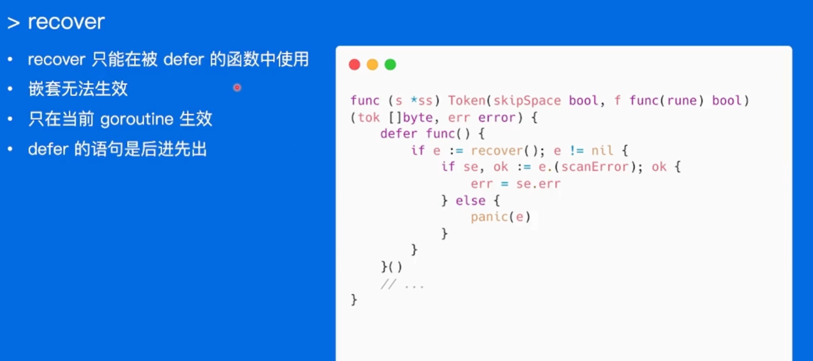
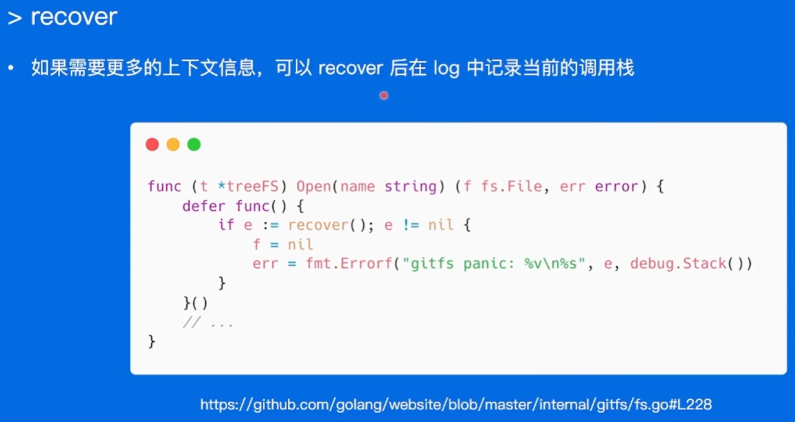

**小结**


</details>

官方总结参考资料：

## 高质量编程

### 简介

- 编写的代码能够达到正确可靠、简洁清晰、无性能隐患的目标就能称之为高质量代码
- 实际应用场景千变万化，各种语言的特性和语法各不相同，但是高质量编程遵循的原则是相通的
- 高质量的编程需要注意以下原则：简单性、可读性、生产力

### 常见编码规范

#### 代码格式

- 使用 gofmt 自动格式化代码，保证所有的 Go 代码与官方推荐格式保持一致

**总结**

- 提升可读性，风格一致的代码更容易维护、需要更少的学习成本、团队合作成本，同时可以降低 Review 成本

#### 注释

- 注释应该解释代码作用

  - 适合注释公共符号，[github.com/golang/go/b…](https://github.com/golang/go/blob/master/src/os/file.go#L313)

<!---->

- 注释应该解释代码如何做的

  - 适合注释方法，[github.com/golang/go/b…](https://github.com/golang/go/blob/master/src/net/http/client.go#L678)

<!---->

- 注释应该解释代码实现的原因

  - 解释代码的外部因素，[github.com/golang/go/b…](https://github.com/golang/go/blob/master/src/net/http/client.go#L521)

<!---->

- 注释应该解释代码什么情况会出错

<!---->

- 公共符号始终要注释

  - 包中声明的每个公共的符号：变量、常量、函数以及结构都需要添加注释
  - [github.com/golang/go/b…](https://github.com/golang/go/blob/master/src/io/io.go#L638)
  - [github.com/golang/go/b…](https://github.com/golang/go/blob/master/src/io/io.go#L455)

**总结**

- 代码是最好的注释

<!---->

- 注释应该提供代码未表达出的上下文信息

#### 命名规范

- variable

  - 简洁胜于冗长
  - 缩略词全大写，但当其位于变量开头且不需要导出时，使用全小写
  - 变量距离其被使用的地方越远，则需要携带越多的上下文信息
  - 全局变量在其名字中需要更多的上下文信息，使得在不同地方可以轻易辨认出其含义

<!---->

- function

  - 函数名不携带包名的上下文信息，因为包名和函数名总是成对出现的
  - 函数名尽量简短
  - 当名为 foo 的包某个函数返回类型 Foo 时，可以省略类型信息而不导致歧义
  - 当名为 foo 的包某个函数返回类型 T 时（T 并不是 Foo），可以在函数名中加入类型信息

<!---->

- package

  - 只由小写字母组成。不包含大写字母和下划线等字符
  - 简短并包含一定的上下文信息。例如 schema、task 等
  - 不要与标准库同名。例如不要使用 sync 或者 strings

**总结**

- 关于命名的大多数规范核心在于考虑上下文

<!---->

- 人们在阅读理解代码的时候也可以看成是计算机运行程序，好的命名能让人把关注点留在主流程上，清晰地理解程序的功能，避免频繁切换到分支细节，增加理解成本

#### 控制流程

- 避免嵌套，保持正常流程清晰

<!---->

- 如果两个分支中都包含 return 语句，则可以去除冗余的 else

<!---->

- 尽量保持正常代码路径为最小缩进，优先处理错误情况/特殊情况，并尽早返回或继续循环来减少嵌套，增加可读性

  - Go 公共库的代码
  - [github.com/golang/go/b…](https://github.com/golang/go/blob/master/src/bufio/bufio.go#L277)

**总结**

- 线性原理，处理逻辑尽量走直线，避免复杂的嵌套分支

<!---->

- 提高代码的可读性

#### 错误和异常处理

- 简单错误处理

  - 优先使用 errors.New 来创建匿名变量来直接表示该错误。有格式化需求时使用 fmt.Errorf
  - [github.com/golang/go/b…](https://github.com/golang/go/blob/master/src/net/http/client.go#L802)

<!---->

- 错误的 Wrap 和 Unwrap

  - 在 fmt.Errorf 中使用 %w 关键字来将一个错误 wrap 至其错误链中
  - [github.com/golang/go/b…](https://github.com/golang/go/blob/master/src/cmd/go/internal/work/exec.go#L983)
  - > Go1.13 在 errors 中新增了三个新 API 和一个新的 format 关键字，分别是 errors.Is、errors.As 、errors.Unwrap 以及 fmt.Errorf 的 %w。如果项目运行在小于 Go1.13 的版本中，导入 golang.org/x/xerrors 来使用。以下语法均已 Go1.13 作为标准。

<!---->

- 错误判定

  - 使用 errors.Is 可以判定错误链上的所有错误是否含有特定的错误。
  - [github.com/golang/go/b…](https://github.com/golang/go/blob/master/src/cmd/go/internal/modfetch/sumdb.go#L208)
  - 在错误链上获取特定种类的错误，使用 errors.As
  - [github.com/golang/go/b…](https://github.com/golang/go/blob/master/src/errors/wrap_test.go#L255)

<!---->

- panic

  - 不建议在业务代码中使用 panic
  - 如果当前 goroutine 中所有 deferred 函数都不包含 recover 就会造成整个程序崩溃
  - 当程序启动阶段发生不可逆转的错误时，可以在 init 或 main 函数中使用 panic
  - [github.com/Shopify/sar…](https://github.com/Shopify/sarama/blob/main/examples/consumergroup/main.go#L94)

<!---->

- recover

  - recover 只能在被 defer 的函数中使用，嵌套无法生效，只在当前 goroutine 生效
  - [github.com/golang/go/b…](https://github.com/golang/go/blob/master/src/fmt/scan.go#L247)
  - 如果需要更多的上下文信息，可以 recover 后在 log 中记录当前的调用栈。
  - [github.com/golang/webs…](https://github.com/golang/website/blob/master/internal/gitfs/fs.go#L228)

**总结**

- panic 用于真正异常的情况

<!---->

- error 尽可能提供简明的上下文信息，方便定位问题

<!---->

- recover 生效范围，在当前 goroutine 的被 defer 的函数中生效

### 性能优化建议

- 在满足正确性、可靠性、健壮性、可读性等质量因素的前提下，设法提高程序的效率
- 性能对比测试代码，可参考 [github.com/RaymondCode…](https://github.com/RaymondCode/go-practice)

- ##### slice 预分配内存

  - 在尽可能的情况下，在使用 make() 初始化切片时提供容量信息，特别是在追加切片时

  - 原理

    - [ueokande.github.io/go-slice-tr…](https://ueokande.github.io/go-slice-tricks/)

    - 切片本质是一个数组片段的描述，包括了数组的指针，这个片段的长度和容量(不改变内存分配情况下的最大长度)

    - 切片操作并不复制切片指向的元素，创建一个新的切片会复用原来切片的底层数组，因此切片操作是非常高效的

    - 切片有三个属性，指针(ptr)、长度(len) 和容量(cap)。append 时有两种场景：

      - 当 append 之后的长度小于等于 cap，将会直接利用原底层数组剩余的空间
      - 当 append 后的长度大于 cap 时，则会分配一块更大的区域来容纳新的底层数组

    - 因此，为了避免内存发生拷贝，如果能够知道最终的切片的大小，预先设置 cap 的值能够获得最好的性能

  - 另一个陷阱：大内存得不到释放

    - 在已有切片的基础上进行切片，不会创建新的底层数组。因为原来的底层数组没有发生变化，内存会一直占用，直到没有变量引用该数组
    - 因此很可能出现这么一种情况，原切片由大量的元素构成，但是我们在原切片的基础上切片，虽然只使用了很小一段，但底层数组在内存中仍然占据了大量空间，得不到释放
    - 推荐的做法，使用 copy 替代 re-slice

<!---->

- ##### map 预分配内存

  - 原理

    - 不断向 map 中添加元素的操作会触发 map 的扩容
    - 根据实际需求提前预估好需要的空间
    - 提前分配好空间可以减少内存拷贝和 Rehash 的消耗

<!---->

- ##### 使用 strings.Builder

  - 常见的字符串拼接方式

      - +
    - strings.Builder
    - bytes.Buffer

  - strings.Builder 最快，bytes.Buffer 较快，+ 最慢

  - 原理

    - 字符串在 Go 语言中是不可变类型，占用内存大小是固定的，当使用 + 拼接 2 个字符串时，生成一个新的字符串，那么就需要开辟一段新的空间，新空间的大小是原来两个字符串的大小之和
    - strings.Builder，bytes.Buffer 的内存是以倍数申请的
    - strings.Builder 和 bytes.Buffer 底层都是 []byte 数组，bytes.Buffer 转化为字符串时重新申请了一块空间，存放生成的字符串变量，而 strings.Builder 直接将底层的 []byte 转换成了字符串类型返回

<!---->

- ##### 使用空结构体节省内存

  - 空结构体不占据内存空间，可作为占位符使用

  - 比如实现简单的 Set

    - Go 语言标准库没有提供 Set 的实现，通常使用 map 来代替。对于集合场景，只需要用到 map 的键而不需要值

- ##### 使用 atomic 包

  - 原理

    - 锁的实现是通过操作系统来实现，属于系统调用，atomic 操作是通过硬件实现的，效率比锁高很多
    - sync.Mutex 应该用来保护一段逻辑，不仅仅用于保护一个变量
    - 对于非数值系列，可以使用 atomic.Value，atomic.Value 能承载一个 interface{}

#### 总结

- 避免常见的性能陷阱可以保证大部分程序的性能

<!---->

- 针对普通应用代码，不要一味地追求程序的性能，应当在满足正确可靠、简洁清晰等质量要求的前提下提高程序性能

## 性能调优实战

### 性能调优简介

- 性能调优原则
  - 要依靠数据不是猜测
  - 要定位最大瓶颈而不是细枝末节
  - 不要过早优化
  - 不要过度优化

## database/mysql

### _01_hello_mysql案例

```go
package main

import (
 "database/sql" // 官方sql接口
 "fmt"

 _ "github.com/go-sql-driver/mysql" // mysqlDriver驱动，实现了官方sql接口
)

/*
create table users(

 id INTEGER primary key,
 name VARCHAR(10),
 tel VARCHAR(15)

)
*/
type User struct {
 id   int
 name string
 tel  string
}

func main() {
 db, err := sql.Open("mysql", "root:root@tcp(127.0.0.1:3306)/go_db1")
 fmt.Println(db, err)
 // res, err := db.Exec("insert into users(id,name,tel) values(?,?,?);", 1, "测试Name", "111111")
 // fmt.Println(res, err)
 rows, err := db.Query("select id,name,tel from users where id = ?;", 1)
 fmt.Println(rows, err)
 defer func() {
  // 尽管在遍历完毕后 rows.Next() 会自动将其关闭，但是要防止在scan的过程中出现错误导致提前return
  // 处理完返回数据后要close关闭rows，防止造成资源泄露
  err := rows.Close()
  fmt.Println(err)
 }()

 var users []User
 for rows.Next() {
  var user User
  err := rows.Scan(&user.id, &user.name, &user.tel)
  if err != nil {
   continue
  }
  users = append(users, user)
 }
 fmt.Println(users)

 err = rows.Err() // 非数据相关的错误
 if err != nil {
  fmt.Println(err)
 }
}
```

### sql的连接接口

```go
package main

import (
 "database/sql" // 官方sql接口
 "fmt"

 "github.com/go-sql-driver/mysql" // mysqlDriver驱动，实现了官方sql接口
)

func main() {
 // 新版的写法
 mysqlConnector, _ := mysql.NewConnector(&mysql.Config{
  User:      "root",
  Passwd:    "root",
  Net:       "tcp",
  Addr:      "127.0.0.1:3306",
  DBName:    "go_db1",
  ParseTime: true,
 })
 db := sql.OpenDB(mysqlConnector)
 defer db.Close() // 必要的
 fmt.Println(db)
}
```

### sql的操作接口

**操作的分类**

- 直接连接
- 预编译
  - 对于同样的sql查询操作语句，只需要发送语句id
- 事务

**操作的返回类型**

- Exec -> Result 适用于只感兴趣操作的结果的场景
- Query -> Rows 适用于只感兴趣操作的返回数据的场景
- QueryRow -> Row 适用于只感兴趣操作只返回一行数据的场景

### ORM-第三方的数据层实现库

> 官方文档：<https://gorm.io/docs/>

**基本用法**

```go
package main

import (
 "fmt"

 "gorm.io/driver/mysql"
 "gorm.io/gorm"
)

func main() {
 db, err := gorm.Open(mysql.Open("root:root@tcp(127.0.0.1:3306)/go_db1"))
 fmt.Println(db, err)
 var users []User
 err = db.Select("id", "name", "tel").Find(&users, 1).Error
 fmt.Println(users, err)
}

/*
create table users(

 id INTEGER primary key,
 name VARCHAR(10),
 tel VARCHAR(15)

)
*/
type User struct {
 Id   int
 Name string
 Tel  string
}
```

**基本操作**

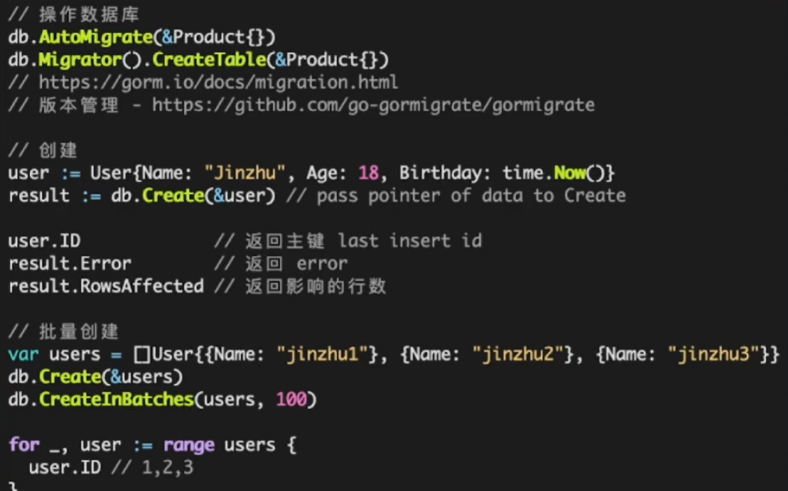
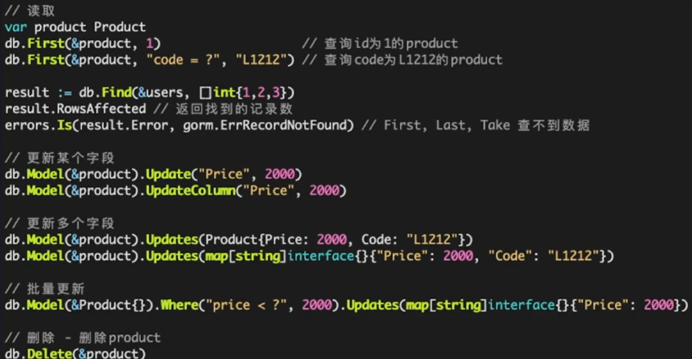

**模型定义**
> 左右两边等价

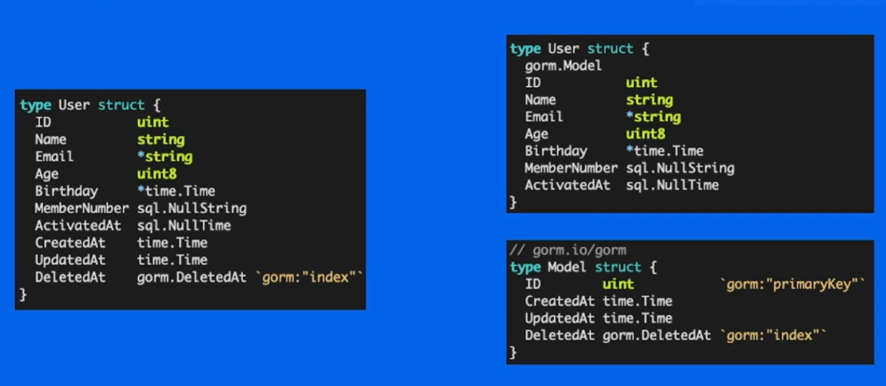

**惯例约定**
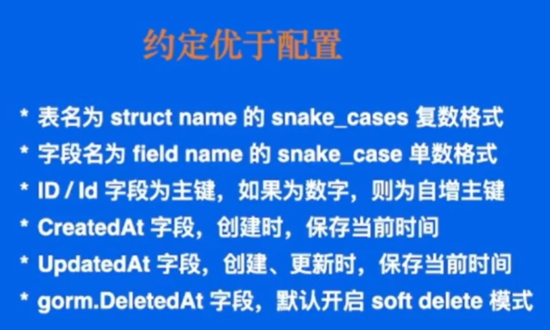

**关联操作**
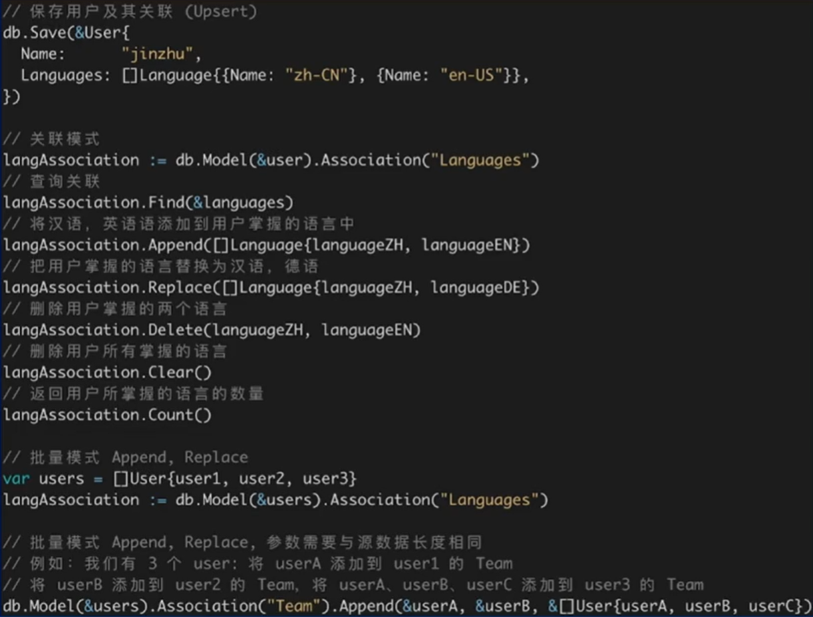
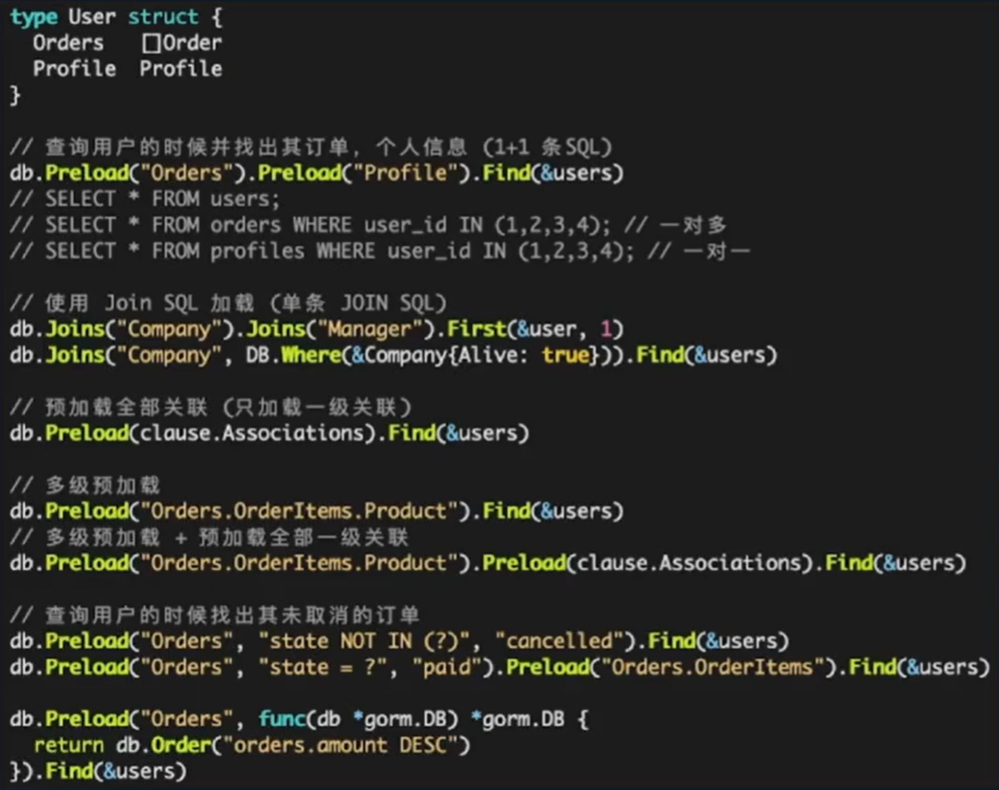

**级联操作**
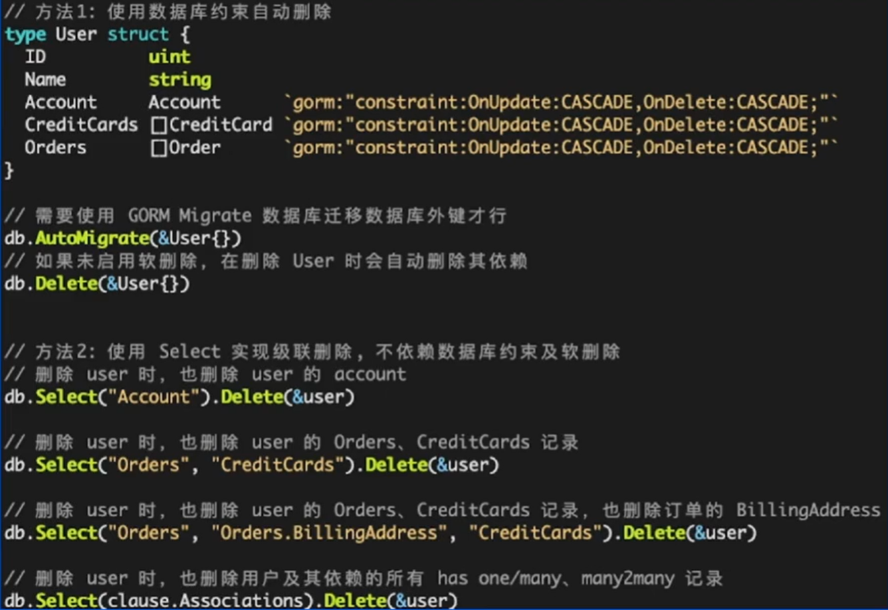
