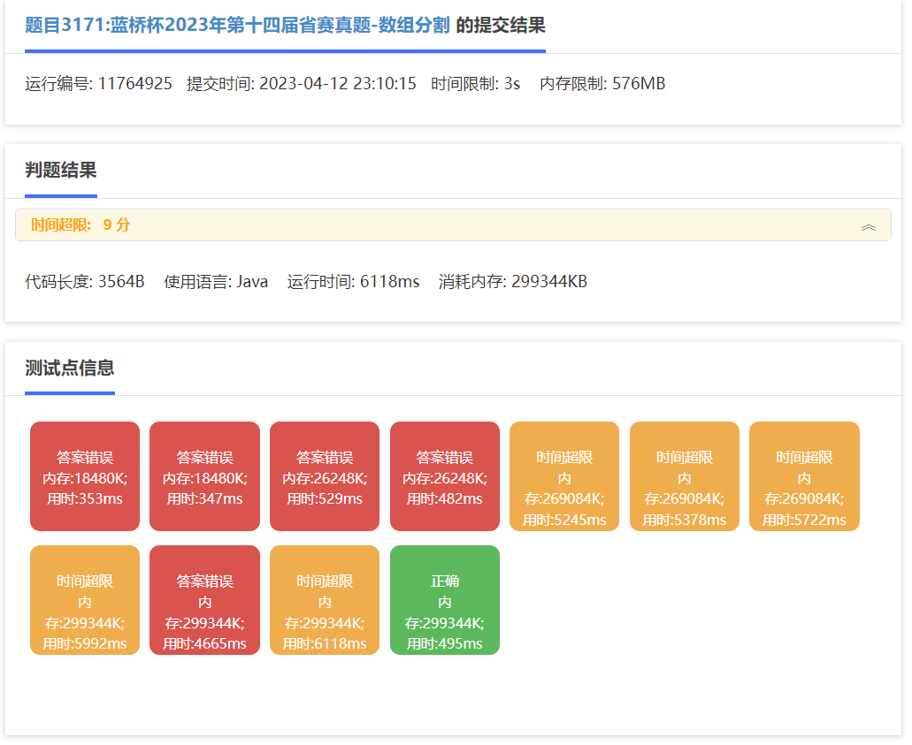
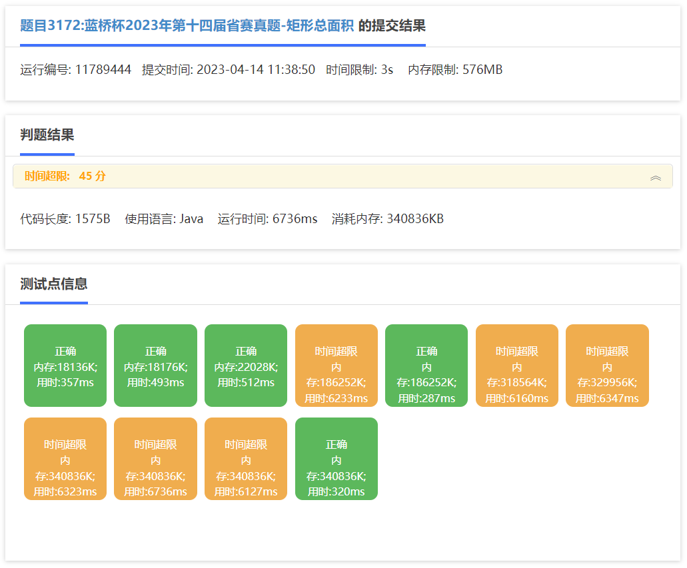
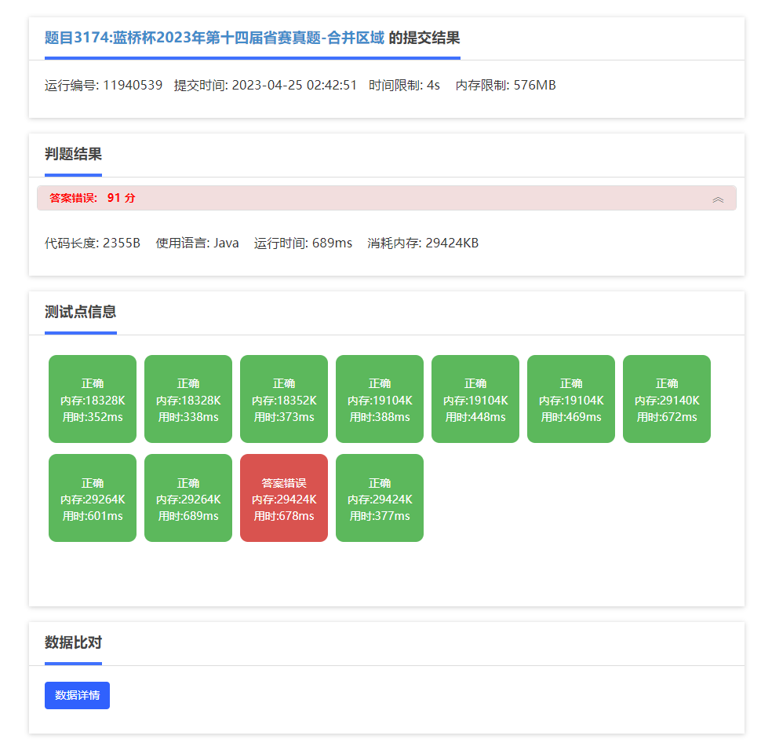
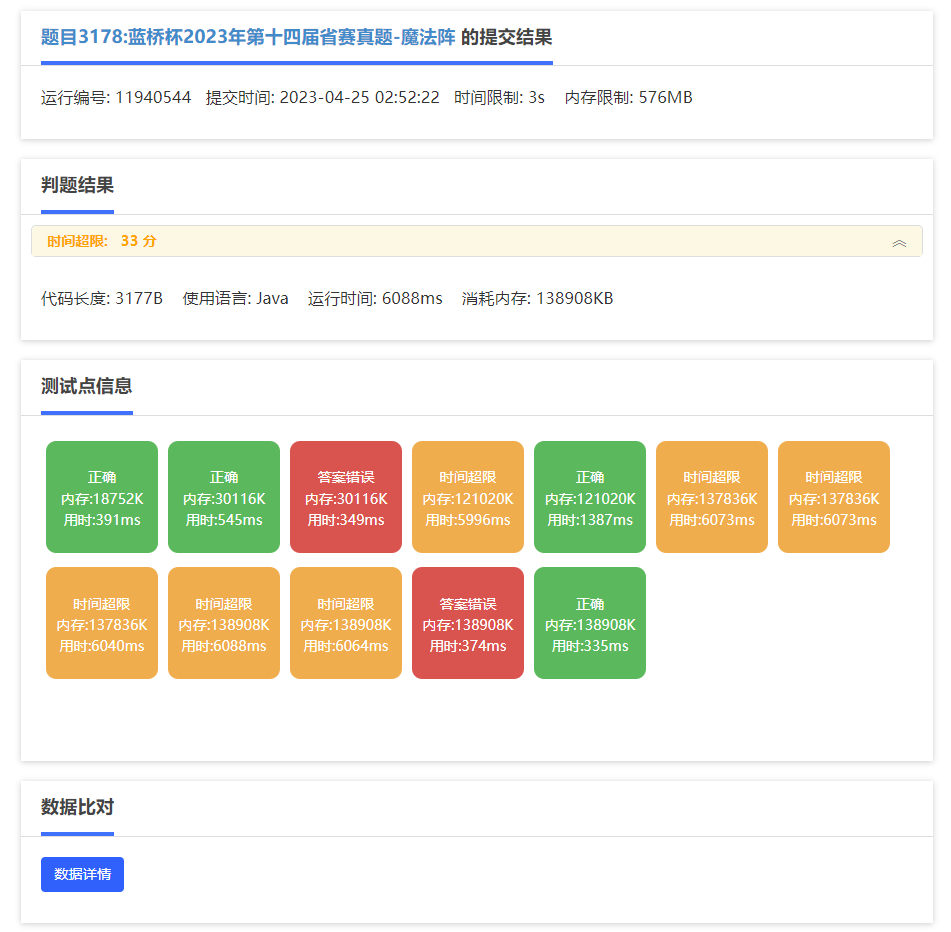

## _02_

> 填空题：215040  
> 答案：215040

## _03_

## _04_

## _07_

## _10_

## 总分估计
>
> 第十题用的暴力枚举，应该只能拿百分之30的分，25\*0.3=7.5  
> 第七题：通过10/11的测试，15 \*（10/11）=13.63  
> 第四题：用的暴力，10\*0.45 = 4.5  
> 第三题：用的暴力，忘记取模，10\*0.1=1分  
> 第二题：填空题，5分
> 总分大概：31.5分
