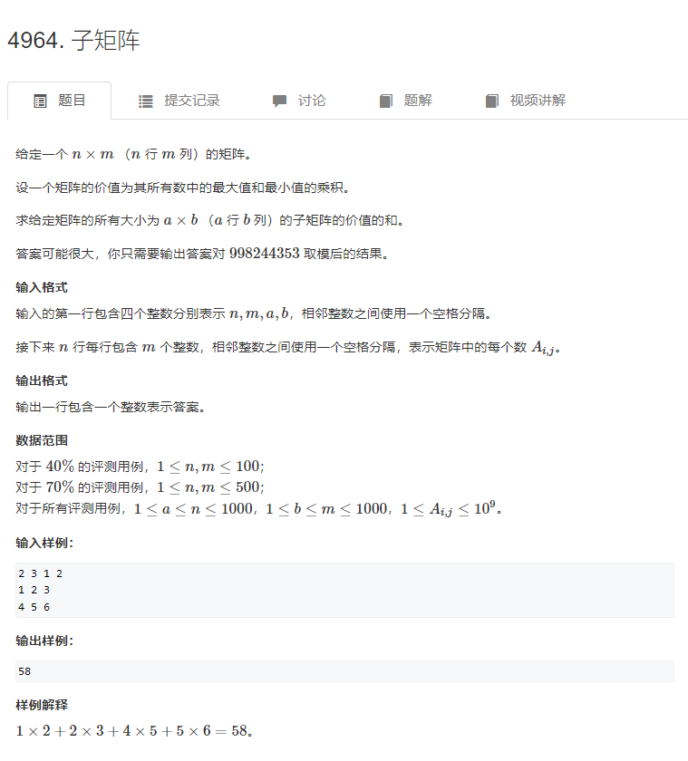
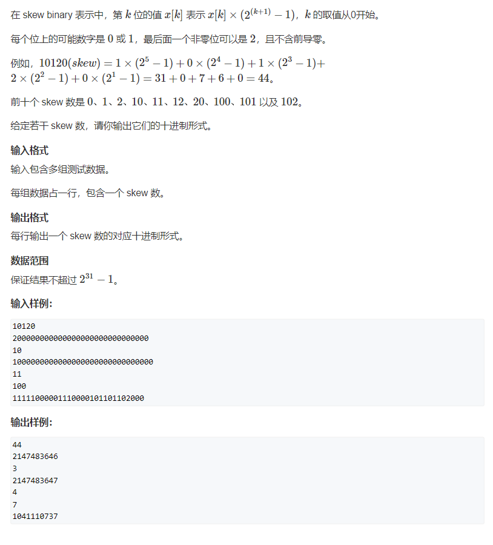
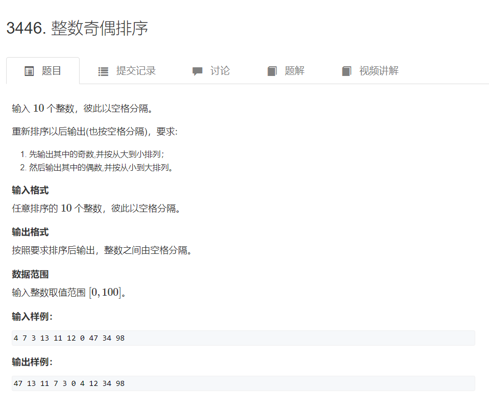

# acwing2023春每日一题

## _01_3384二叉树遍历

```markdown
编写一个程序，读入用户输入的一串先序遍历字符串，根据此字符串建立一个二叉树（以指针方式存储）。

例如如下的先序遍历字符串： abc##de#g##f### 其中 # 表示的是空格，空格字符代表空树。

建立起此二叉树以后，再对二叉树进行中序遍历，输出遍历结果。

输入格式
共一行，包含一个字符串，表示先序遍历字符串。

输出格式
共一行，输出将输入字符串建立二叉树后中序遍历的序列，字符之间用空格隔开。

注意，输出中不用包含 #。

数据范围
输入字符串长度不超过 100，且只包含小写字母和 #。

输入样例：
abc##de#g##f###
输出样例：
c b e g d f a
```

```java
package _01_3384二叉树遍历;

import java.util.LinkedList;
import java.util.Queue;
import java.util.Scanner;

public class Main {
    public static void main(String[] args) {
        Scanner sc = new Scanner(System.in);
        Queue<Character> queue = new LinkedList<>();
        String str = sc.nextLine();
        char[] chs = str.toCharArray();
        for (char ch : chs) {
            if (ch == '#')
                queue.add(null);
            else
                queue.add(ch);
        }
        Tree tree = new Tree(queue);
        System.out.println(tree.midRootPrint(new StringBuilder()));
    }
}


class Tree {
    Character ch;
    Tree left, right;

    Tree(Queue<Character> queue) {
        ch = queue.poll();
        if (ch != null) {
            left = new Tree(queue);
            right = new Tree(queue);
        }
    }

    StringBuilder midRootPrint(StringBuilder sb) {
        if (ch != null) {
            if (left != null) {
                left.midRootPrint(sb);
            }
            sb.append(ch);
            if (right != null) {
                sb.append(' ');
                right.midRootPrint(sb);
            }
        }
        return sb;
    }
}
```

## _02_4956_冶炼金属

```markdown
小蓝有一个神奇的炉子用于将普通金属 O 冶炼成为一种特殊金属 X。

这个炉子有一个称作转换率的属性 V，V 是一个正整数，这意味着消耗 V 个普通金属 O 恰好可以冶炼出一个特殊金属 X，当普通金属 O 的数目不足 V 时，无法继续冶炼。

现在给出了 N 条冶炼记录，每条记录中包含两个整数 A 和 B，这表示本次投入了 A 个普通金属 O，最终冶炼出了 B 个特殊金属 X。

每条记录都是独立的，这意味着上一次没消耗完的普通金属 O 不会累加到下一次的冶炼当中。

根据这 N 条冶炼记录，请你推测出转换率 V 的最小值和最大值分别可能是多少，题目保证评测数据不存在无解的情况。

输入格式
第一行一个整数 N，表示冶炼记录的数目。

接下来输入 N 行，每行两个整数 A、B，含义如题目所述。

输出格式
输出两个整数，分别表示 V 可能的最小值和最大值，中间用空格分开。

数据范围
对于 30% 的评测用例，1≤N≤102。
对于 60% 的评测用例，1≤N≤103。
对于 100% 的评测用例，1≤N≤104，1≤B≤A≤109。

输入样例：
3
75 3
53 2
59 2
输出样例：
20 25
样例解释
当 V=20 时，有：⌊7520⌋=3，⌊5320⌋=2，⌊5920⌋=2，可以看到符合所有冶炼记录。

当 V=25 时，有：⌊7525⌋=3，⌊5325⌋=2，⌊5925⌋=2，可以看到符合所有冶炼记录。

且再也找不到比 20 更小或者比 25 更大的符合条件的 V 值了。
```

```java
import java.util.Scanner;
public class Main {

    public static void main(String[] args) {
        Scanner sc = new Scanner(System.in);
        int N = sc.nextInt();
        int preLeft = Integer.MIN_VALUE;
        int preRigh = Integer.MAX_VALUE;
        for (int i = 0; i < N; i++) {
            int A = sc.nextInt();
            int B = sc.nextInt();
            int left = A / (B + 1);
            int right = A / B;
            // (left,right]
            left += 1;
            if (left > preLeft)
                preLeft = left;
            if (right < preRigh)
                preRigh = right;

        }
        System.out.println(preLeft + " " + preRigh);
    }
}

// 100/max = floor(3/1)
// 100/min = floor(3/1)

// 100/3 == 33.3333333
// ceil(100/3) == 34
// floor(100/3) == 33
// 100/34 == 2.94
// 100/33 == 3.03

// 100/4 = 25
// 100/25 = 4.0;

// (min,max] => (25,33]

```

```java
import java.util.Scanner;

public class Main_二分法 {

    public static void main(String[] args) {
        Scanner sc = new Scanner(System.in);
        int N = sc.nextInt();
        int preLeft = Integer.MIN_VALUE;
        int preRigh = Integer.MAX_VALUE;
        for (int i = 0; i < N; i++) {
            int A = sc.nextInt();
            int B = sc.nextInt();
            preLeft = Math.max(preLeft, findMinV(A, B));
            preRigh = Math.min(preRigh, findMinV(A, B - 1) - 1);
        }
        System.out.println(preLeft + " " + preRigh);
    }

    static int findMinV(int A, int B) {
        int left = 1, right = 1000000000+1;
        int mid = -1;
        while (left < right) {
            mid = left + (right - left) / 2;
            if (A / mid <= B) // floor(A/V)<=B 则 mid>=V
                right = mid;
            else // floor(A/V>B) 则 mid<V
                left = mid + 1;
        }
        return right;
    }
}

```

## _03_4957_飞机降落

```markdown
有 N 架飞机准备降落到某个只有一条跑道的机场。

其中第 i 架飞机在 Ti 时刻到达机场上空，到达时它的剩余油料还可以继续盘旋 Di 个单位时间，即它最早可以于 Ti 时刻开始降落，最晚可以于 Ti+Di 时刻开始降落。

降落过程需要 Li 个单位时间。

一架飞机降落完毕时，另一架飞机可以立即在同一时刻开始降落，但是不能在前一架飞机完成降落前开始降落。

请你判断 N 架飞机是否可以全部安全降落。

输入格式
输入包含多组数据。

第一行包含一个整数 T，代表测试数据的组数。

对于每组数据，第一行包含一个整数 N。

以下 N 行，每行包含三个整数：Ti，Di 和 Li。

输出格式
对于每组数据，输出 YES 或者 NO，代表是否可以全部安全降落。

数据范围
对于 30% 的数据，N≤2。
对于 100% 的数据，1≤T≤10，1≤N≤10，0≤Ti,Di,Li≤105。

输入样例：
2
3
0 100 10
10 10 10
0 2 20
3
0 10 20
10 10 20
20 10 20
输出样例：
YES
NO
样例解释
对于第一组数据，可以安排第 3 架飞机于 0 时刻开始降落，20 时刻完成降落。安排第 2 架飞机于 20 时刻开始降落，30 时刻完成降落。安排第 1 架飞机于 30 时刻开始降落，40 时刻完成降落。

对于第二组数据，无论如何安排，都会有飞机不能及时降落。
```

```java
import java.io.BufferedInputStream;
import java.util.Scanner;

public class Main {
    public static void main(String[] args) {
        Scanner sc = new Scanner(new BufferedInputStream(System.in));
        int T = sc.nextInt();
        for (int t = 0; t < T; t++) {
            int N = sc.nextInt();
            Item[] items = new Item[N];

            for (int i = 0; i < N; i++) {
                items[i] = new Item(sc.nextInt(), sc.nextInt(), sc.nextInt());
            }
            System.out.println(dfs(items, 0, 0)?"YES":"NO");
        }
    }

    static boolean dfs(Item[] items, int curIdx, int lastTime/*前一架飞机降落结束时间 */) {
        if (curIdx == items.length) {
            return true;
        } else {
            for (int idx = curIdx; idx < items.length; idx++) {
                swap(items, curIdx, idx);
                if (lastTime <= items[curIdx].T + items[curIdx].D && /*当前飞机到来时间+最长盘旋时间=最晚开始降落时间>=前一架飞机降落结束 */
                        dfs(items, curIdx + 1, Math.max(lastTime, items[curIdx].T)/*当前开始降落时间 */ + items[curIdx].L/*降落耗时 */)) {
                    return true;
                }
                swap(items, curIdx, idx);
            }
        }
        return false;
    }

    private static void swap(Item[] items, int idxA, int idxB) {
        if (idxA != idxB) {
            Item temp = items[idxA];
            items[idxA] = items[idxB];
            items[idxB] = temp;
        }
    }
}

class Item {
    public int T, D, L;

    public Item(int t, int d, int l) {
        T = t;
        D = d;
        L = l;
    }
}
```

## _04_4958_接龙数列

**动态规划**

```java
// package _04_4958_接龙数列;

import java.io.BufferedInputStream;
import java.util.Scanner;

public class Main {
    private static int N;
    private static int[] Len_PreEndWith;

    public static void main(String[] args) {
        // 本质就是求最长接龙子序列
        Scanner sc = new Scanner(new BufferedInputStream(System.in));
        N = sc.nextInt();
        Len_PreEndWith = new int[10];
        int maxLen = 0;
        for (int idx = 0; idx < N; idx++) {
            Item item = new Item(sc.nextInt());
            Len_PreEndWith[item.ended] = Math.max(Len_PreEndWith[item.front] + 1, Len_PreEndWith[item.ended]);
            maxLen = Math.max(maxLen, Len_PreEndWith[item.ended]);
        }
        System.out.println(N - maxLen);
    }
}

class Item {
    int front, ended;

    public Item(int num) {
        this.front = getLeftFirstNum(num);
        this.ended = num % 10;
    }

    static int getLeftFirstNum(int num) {
        while (num / 10 > 0) {
            num /= 10;
        }
        return num;
    }
}
```

**dfs+缓存**
> 超时

```java
// package _04_4958_接龙数列;

import java.io.BufferedInputStream;
import java.util.HashSet;
import java.util.Scanner;

public class Main_对_但超时 {
    private static int N;
    private static Item[] items;
    private static boolean[] computed;
    private static Integer[] cache;
    private static HashSet<Item>[] startWith = new HashSet[10];
    static {
        for (int i = 0; i < 10; i++) {
            startWith[i] = new HashSet<>();
        }
    }

    public static void main(String[] args) {
        Scanner sc = new Scanner(new BufferedInputStream(System.in));
        N = sc.nextInt();
        items = new Item[N];
        computed = new boolean[N];
        cache = new Integer[N];

        for (int idx = 0; idx < N; idx++) {
            items[idx] = new Item(sc.nextInt());
            startWith[items[idx].front].add(items[idx]);
        }
        int maxLen = 0;
        for (int idx = 0; idx < N; idx++) {
            maxLen = Math.max(maxLen, dfs(idx));
        }
        System.out.println(N - maxLen);
    }

    static int dfs(int curIdx) {
        if (curIdx == N - 1/* 最后一个数本身就能构成一个接龙数列，长度为1 */)
            return 1;
        if (computed[curIdx]/* 缓存 */)
            return cache[curIdx];
        int maxLen = 0;
        for (int nextIdx = curIdx + 1; nextIdx < N; nextIdx++) {
            if (startWith[items[curIdx].ended].contains(items[nextIdx])/* 当前数的结尾是下一个数的开头 */)
                maxLen = Math.max(maxLen, dfs(nextIdx));
        }
        computed[curIdx] = true;// 缓存
        return cache[curIdx] = 1 + maxLen;// 自己本身就是一个
    }
}

class Item {
    int front, ended;

    public Item(int num) {
        this.front = getLeftFirstNum(num);
        this.ended = num % 10;
    }

    static int getLeftFirstNum(int num) {
        while (num / 10 > 0) {
            num /= 10;
        }
        return num;
    }
}
```

## _05_4964_子矩阵



```
输入样例：
2 3 1 2
1 2 3
4 5 6
输出样例：
58
```

```java
package _05_4964_子矩阵;

import java.io.BufferedInputStream;
import java.util.Scanner;

public class Main {
    public static void main(String[] args) {
        Scanner sc = new Scanner(new BufferedInputStream(System.in));
        int n, m, a, b;
        long res = 0, MOD = 998244353;
        n = sc.nextInt();
        m = sc.nextInt();
        a = sc.nextInt();
        b = sc.nextInt();
        Queue queue = new Queue(m*n);
        int[][] matrix = new int[n][m];
        int[][] rMax = new int[n][m];
        int[][] rMin = new int[n][m];
        for (int row = 0; row < n; row++) {
            for (int col = 0; col < m; col++) {
                matrix[row][col] = sc.nextInt();
            }
        }
        for (int row = 0; row < n; row++) {
            queue.getMaxArray(matrix[row], rMax[row], b);
            queue.getMinArray(matrix[row], rMin[row], b);
        }
        int[] tempCol = new int[n];
        int[] colMax = new int[n];
        int[] colMin = new int[n];
        for (int col = b - 1; col < m; col++) {
            for (int row = 0; row < n; row++)
                tempCol[row] = rMax[row][col];
            queue.getMaxArray(tempCol, colMax, a);
            for (int row = 0; row < n; row++)
                tempCol[row] = rMin[row][col];
            queue.getMinArray(tempCol, colMin, a);
            for (int row = a - 1; row < n; row++) {
                res = (res + (long)colMax[row] * colMin[row]) % MOD;
            }
        }
        System.out.println(res);
    }

    static class Queue {
        int[] data;
        int front, tail, size, MAX_SIZE;

        Queue() {
        }

        Queue(int capacity) {
            init(capacity);
        }

        void init(int capacity) {
            MAX_SIZE = capacity;
            data = new int[MAX_SIZE];
            clear();
        }

        void clear() {
            front = 0;
            tail = -1;
            size = 0;
        }

        void EnQueue(int val) {
            tail = ++tail % MAX_SIZE;
            data[tail] = val;
            size++;
        }

        int DeQueue() {
            int t = data[front];
            front = ++front % MAX_SIZE;
            size--;
            return t;
        }

        int DeQueueLast() {
            int t = data[tail];
            tail = (tail + MAX_SIZE - 1) % MAX_SIZE;
            size--;
            return t;
        }

        int getFront() {
            return data[front];
        }

        int getTail() {
            return data[tail];
        }

        boolean isEmpty() {
            return size == 0;
        }

        boolean isFull() {
            return size == MAX_SIZE;
        }

        void getMinArray(int[] arr, int[] res, int range) {
            clear();
            for (int i = 0; i < arr.length; i++) {
                while (!isEmpty() && arr[getTail()] >= arr[i])
                    DeQueueLast();
                while (!isEmpty() && getFront() <= i - range)
                    DeQueue();
                EnQueue(i);
                res[i] = arr[getFront()];
            }
        }

        void getMaxArray(int[] arr, int[] res, int range) {
            clear();
            for (int i = 0; i < arr.length; i++) {
                while (!isEmpty() && arr[getTail()] <= arr[i])
                    DeQueueLast();
                while (!isEmpty() && getFront() <= i - range)
                    DeQueue();
                EnQueue(i);
                res[i] = arr[getFront()];
            }
        }
    }

    static class Stack {
        int[] data;
        int pos, MAX_SIZE;

        Stack(int capacity) {
            init(capacity);
        }

        void init(int capacity) {
            MAX_SIZE = capacity;
            data = new int[MAX_SIZE];
            pos = 0;
        }

        void push(int val) {
            data[pos++] = val;
        }

        int pop() {
            return data[--pos];
        }

        boolean isEmpty() {
            return pos == 0;
        }

        boolean isFull() {
            return pos == MAX_SIZE;
        }
    }
}
```

## _06_3431_skew数



```java
package _06_3431_skew数;

import java.io.BufferedInputStream;
import java.util.Scanner;

public class Main {
    public static void main(String[] args) {
        Scanner sc = new Scanner(new BufferedInputStream(System.in));
        while (sc.hasNextLine()) {
            System.out.println(toNum(sc.nextLine()));
        }
    }

    static long toNum(String skew) {
        long res = 0;
        for (int i = skew.length() - 1,k=1; 0 <= i; i--,k++)
            res += (skew.charAt(i) - '0') * (Math.pow(2, k) - 1);
        return res;
    }
}
```

## _07_3446_整数奇偶排序



```java
package _07_3446_整数奇偶排序;

import java.io.BufferedInputStream;
import java.util.Scanner;

public class Main {
    public static void main(String[] args) {
        Scanner sc = new Scanner(new BufferedInputStream(System.in));
        Stack stack1 = new Stack(10);
        Stack stack2 = new Stack(10);
        for (int i = 0; i < 10; i++) {
            int n=sc.nextInt();
            if(n%2==1) stack1.push(n);
            else stack2.push(n);
        }
        stack1.sort();
        stack2.sort();
        stack2.reverse();
        while(!stack1.isEmpty()){
            System.out.printf("%d ",stack1.pop());
        }
        while(!stack2.isEmpty()){
            System.out.printf("%d ",stack2.pop());
        }
    }

    static class Stack {
        int[] data;
        int pos, MAX_SIZE;

        Stack(int size) {
            init(size);
        }

        void init(int size) {
            MAX_SIZE = size;
            data = new int[MAX_SIZE];
            pos = 0;
        }

        void push(int val) {
            data[pos++] = val;
        }

        int pop() {
            return data[--pos];
        }

        boolean isEmpty() {
            return pos == 0;
        }

        boolean isFull() {
            return pos == MAX_SIZE;
        }

        void sort() {
            quickSort(data, 0, pos - 1);
        }

        void reverse() {
            for (int i = 0, j = pos - 1; i < j; i++, j--) {
                swap(data, i, j);
            }
        }
    }

    static void quickSort(int[] arr, int left, int right) {
        if (left >= right)
            return;
        int x = arr[left], i = left, L = left - 1, R = right + 1;
        while (i < R) {
            if (arr[i] < x)
                swap(arr, i++, ++L);
            else if (arr[i] > x)
                swap(arr, i, --R);
            else
                i++;
        }
        quickSort(arr, left, L);
        quickSort(arr, R, right);
    }

    static void swap(int[] arr, int i, int j) {
        if (i != j) {
            arr[i] = arr[i] ^ arr[j];
            arr[j] = arr[i] ^ arr[j];
            arr[i] = arr[i] ^ arr[j];
        }
    }
}

```
