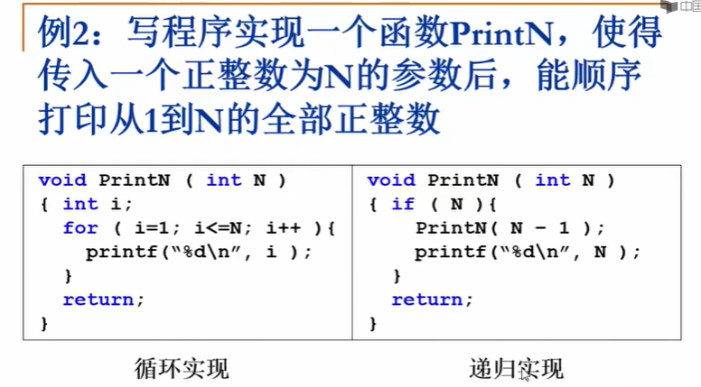
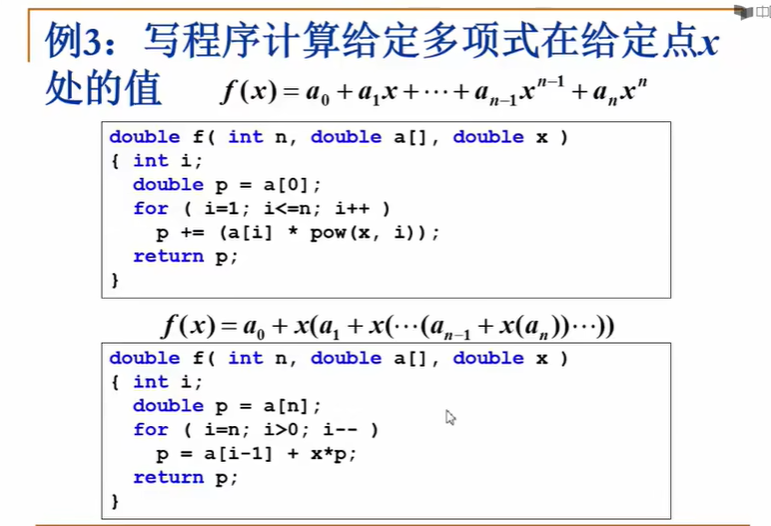
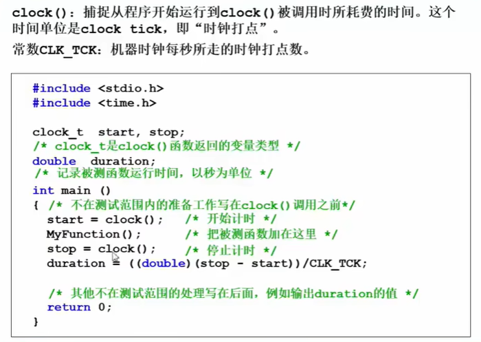
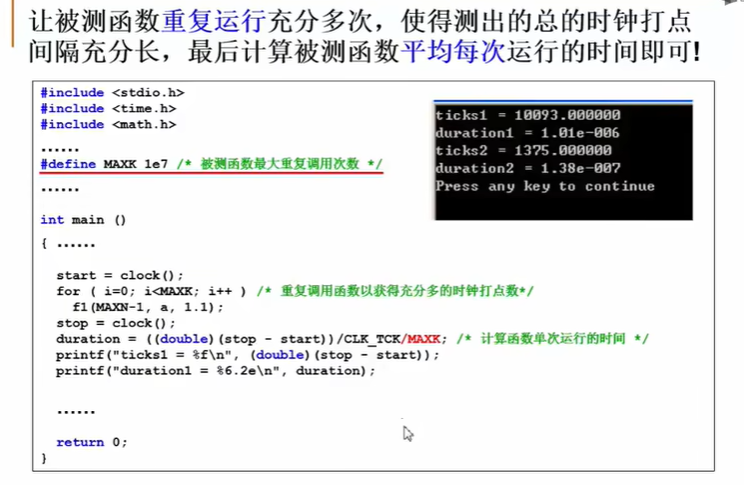

# 算法重学笔记----浙江大学数据结构

## - [算法重学笔记----浙江大学数据结构](#算法重学笔记----浙江大学数据结构)

- 

## p1-关于空间使用-例_PrintN函数实现

**如何在书架上摆书？**

- 方法一：
  - 操作1：新书插入->随便放
  - 操作2：查找某书->一本一本找
    - 存在问题：当数据量很大时，时间复杂度也剧增
- 方法二：
  - 操作1：新书插入->按拼音字母顺序排放
    - 存在问题：在第一个位置插入一本书需要挪动所有书
  - 操作2：查找某书->二分查找
- 方法三：
  - 把书架/图书馆划分按类别划分为不同的区域，
    - 使得在插入一本书时，要挪动的旧书变少，
    - 在查找一本书时，查找的数据量变少
  - 操作1：新书插入->先确定类别，再按拼音字母顺序排放
  - 操作2：查找某书->先确定类别，再二分查找
  - 存在问题:
    - 分多少个类别？(分类太粗等于没分，分类太细可能导致无法确定一本书到底属于哪一类)
    - 每个分类分配多大的空间/书架？(分配太小导致后续要添加书架，分配太多导致空间浪费)

> 说明问题：解决问题的方法的效率，**和数据的组织方式有关**

## p2-关于空间使用-例_PrintN函数实现

> 上面两种算法，在N极大时，递归函数的空间开销是巨大的
>
> 说明问题：解决问题的方法的效率，**和空间的利用率有关**

## p3-关于算法效率-例_计算多项式值

**如何两个算法的运行时间的比较**

- 

> 说明问题：解决问题的方法的效率，**和算法的巧妙程度有关**

## p4 什么是数据结构？

**数据结构**

- **数据对象**在计算机中的组织方式
  - 逻辑结构
  - 物理结构
- 数据对象的相关**操作**
- 完成操作的**算法**

**抽象数据类型（ADT）**

- 用来描述一种数据结构
- “数据类型”：
  - 数据对象的集合
  - 操作集合
- “抽象”：不关心其具体实现是什么
  