# 记录水下设备的上位机实现

> 该项目从界面设计到底层程序均为独立完成。

## 整体使用效果

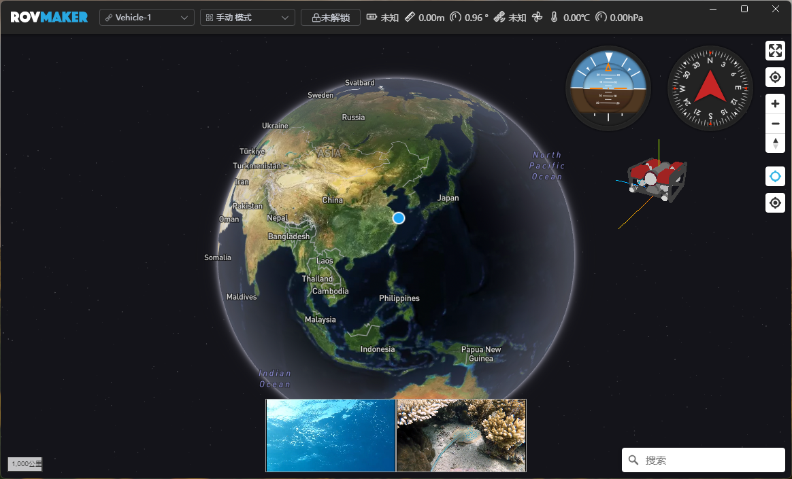
<!-- 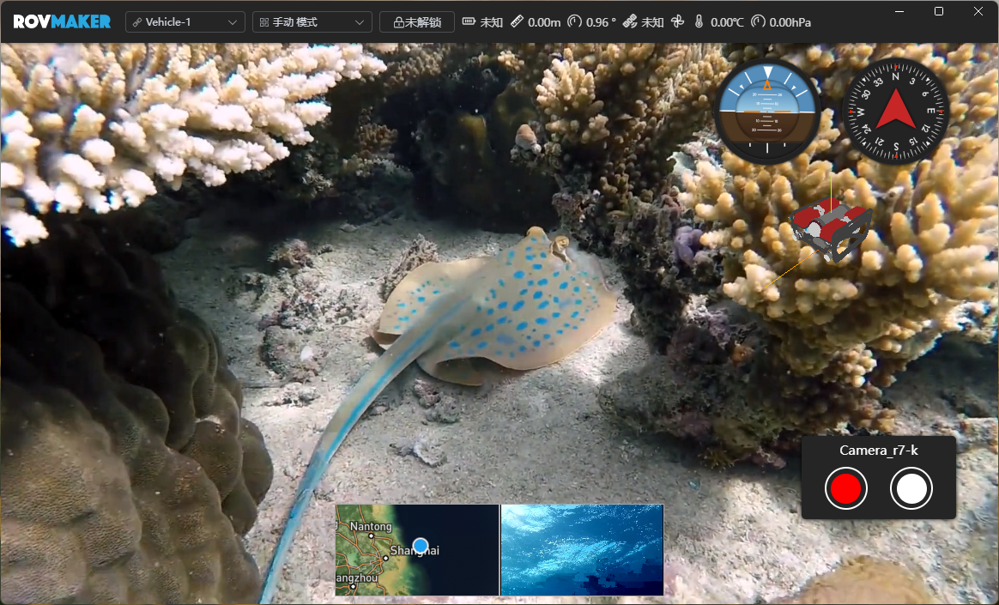 -->
<!--  -->
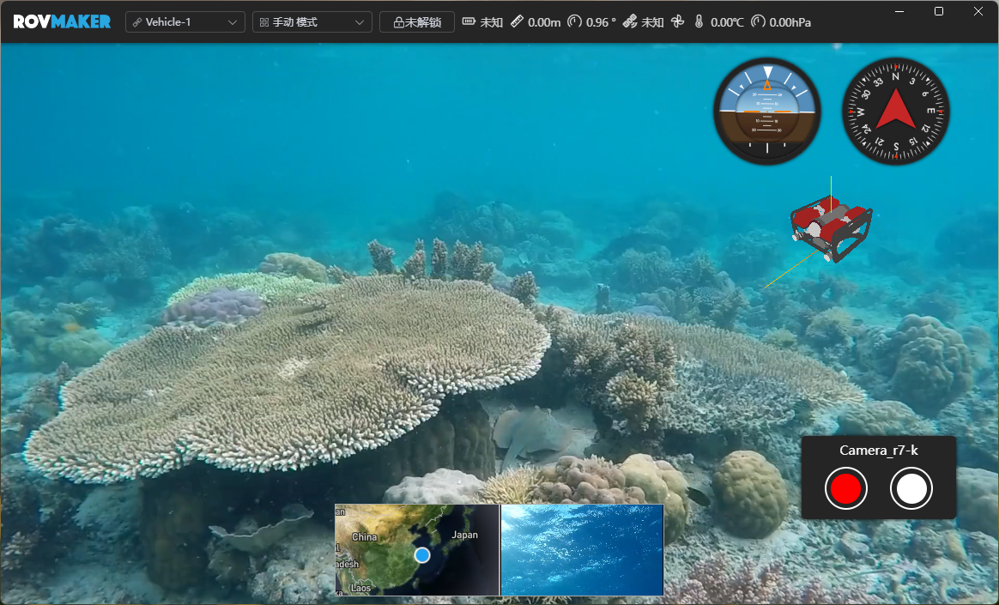

<!-- **GIF图** -->
<!--  -->
<!-- <video src="assets/2025-12-03 17-25-54.mp4" /> -->

## 侧边栏 和 导航栏效果

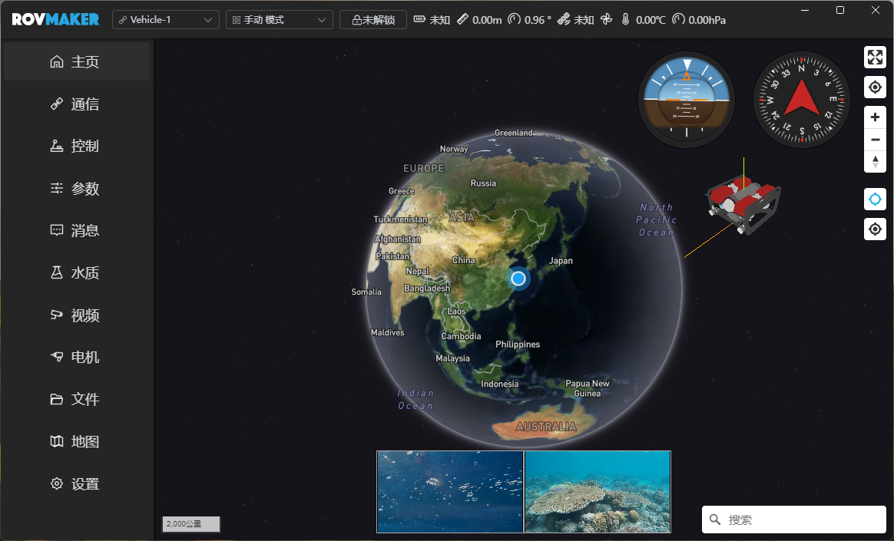

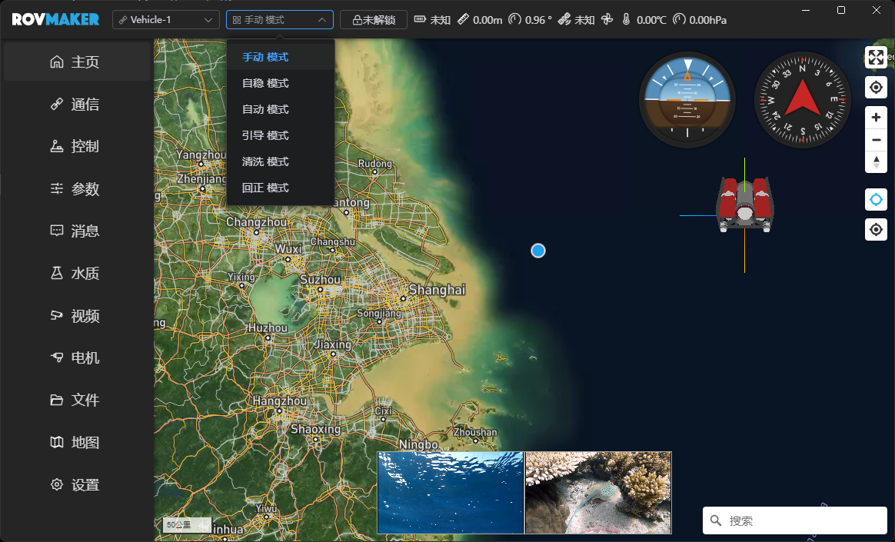
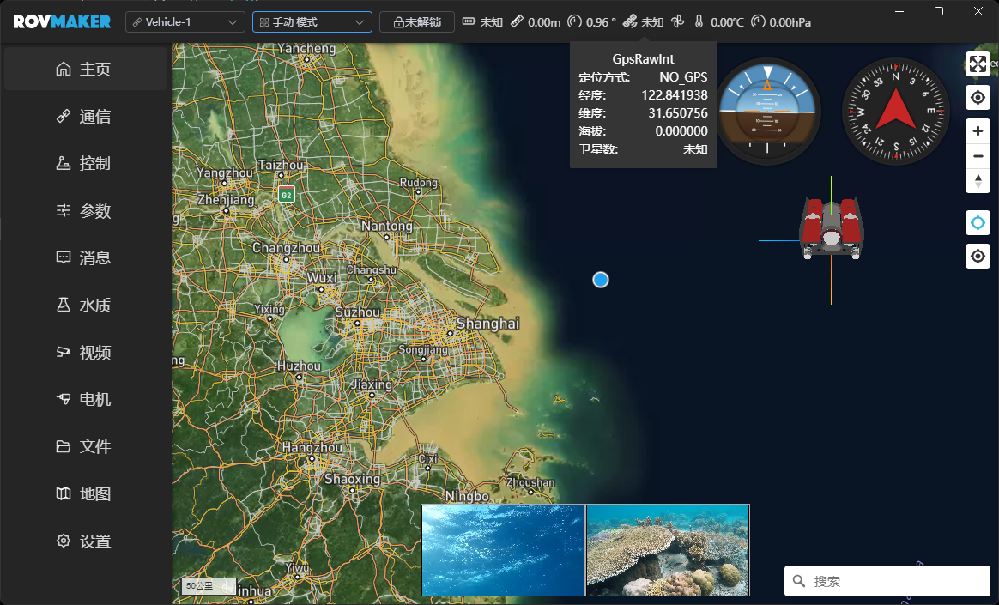

## 路径规划

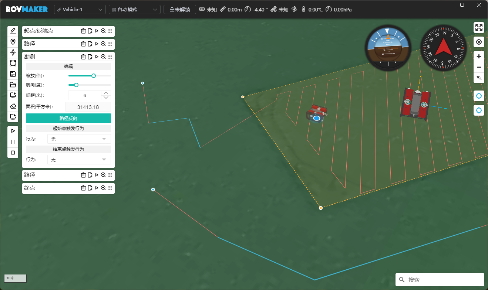
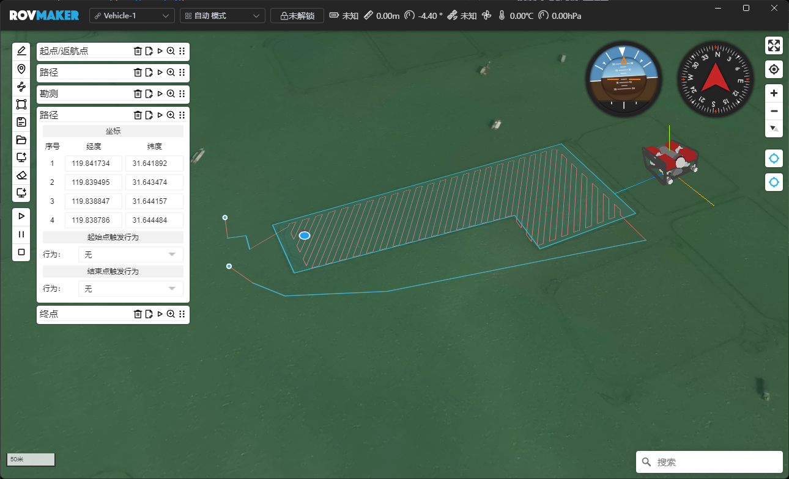

<!-- **GIF图** -->
<!--  -->
<!-- <video src="assets/2025-12-03 15-53-58.mp4" /> -->

## 通讯链接

## 手柄配置

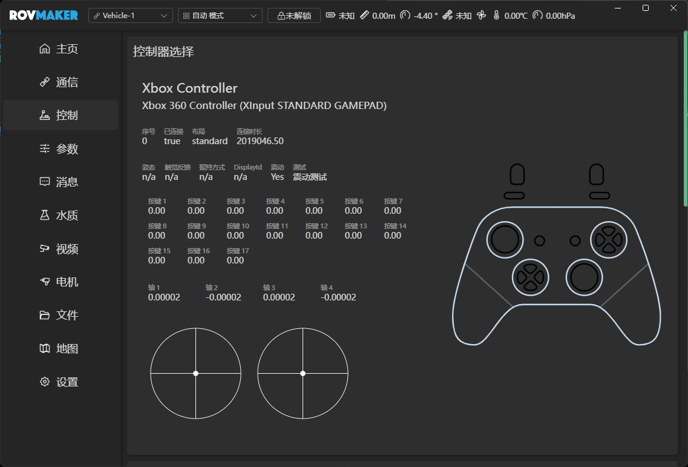

<!-- **GIF图** -->
<!--  -->
<!-- <video src="assets/2025-12-03 16-01-06.mp4" /> -->

## 视频流配置

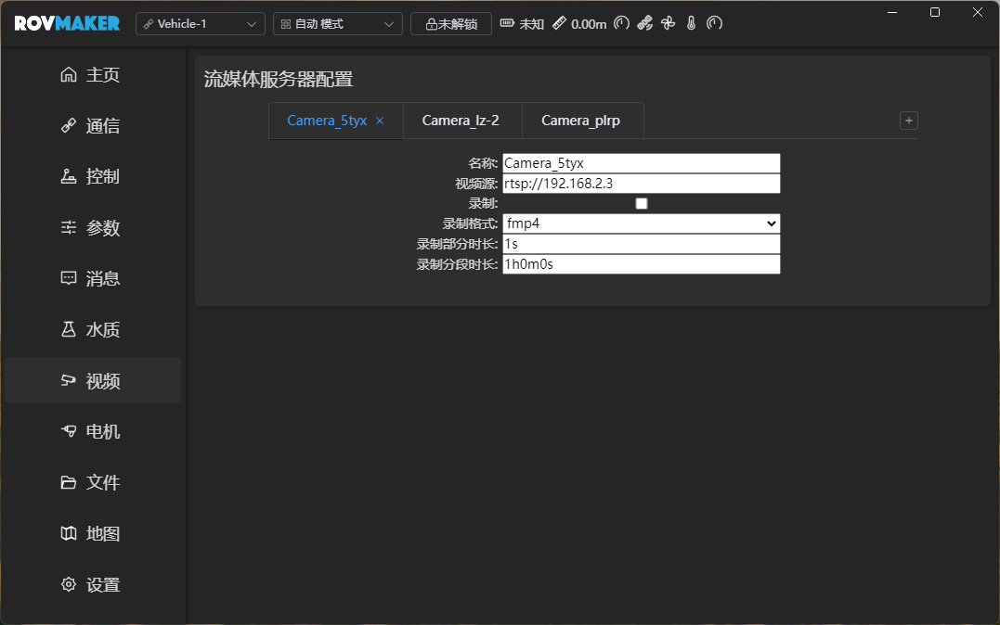

## 地图源配置

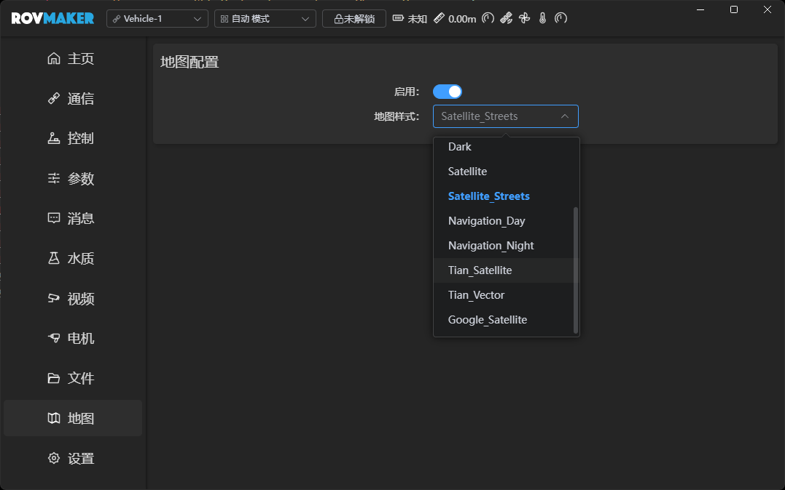

## 主题色配置

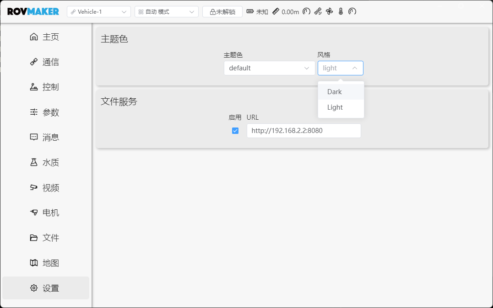
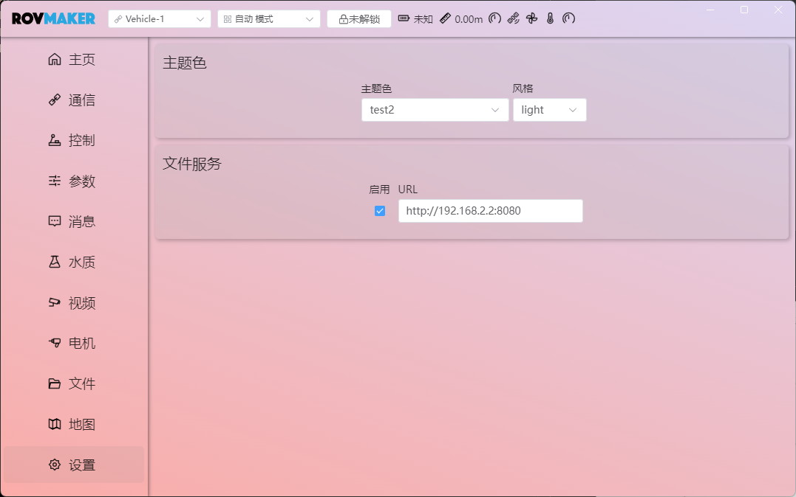

## 文件服务

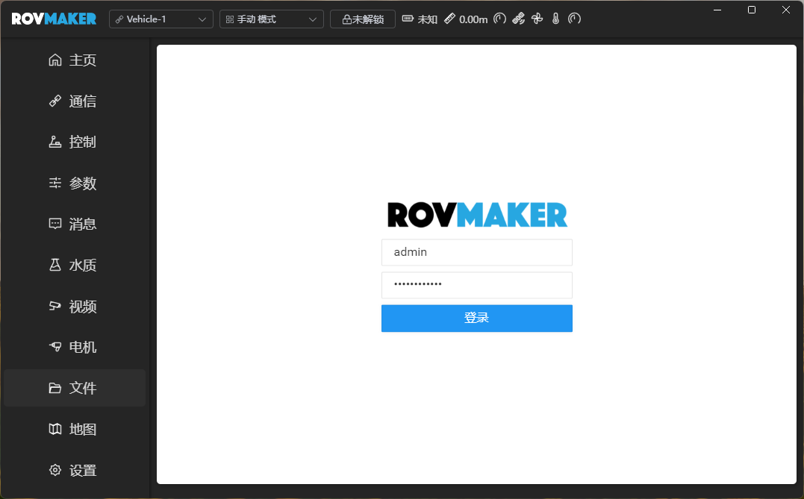
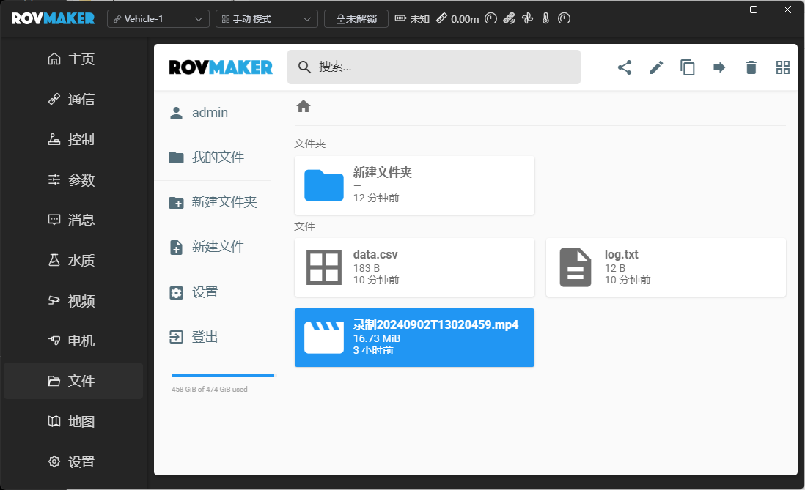
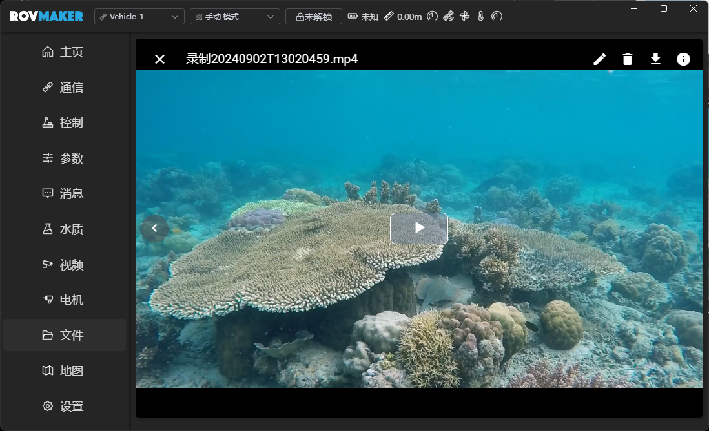

