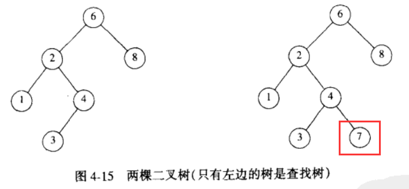

# 第4章_4.二叉查找树

## 二叉树的应用
* 表达式树
* 查找
* 编译器设计

## 查找树ADT————二叉查找树binary search tree
* **二叉查找树binary search tree**
* 查找是二叉树的重要应用
* 使二叉树成为查找树的性质是：
  + 树中每个节点X的**左子树**中的**所有(包括子树的子树)** 关键字**小于**节点X的关键字
  + 树中每个节点X的**右子树**中的**所有(包括子树的子树)** 关键字**大于**节点X的关键字
  + 

## 二叉查找树ADT
  + 由于树的递归定义，其例程通常也是递归编写的
  + 由于二叉树的平均深度是O(log N),也不必担心栈空间耗尽
  + 其删除操作可能导致树的不平衡，因为在处理**被删除的节点有两个子节点的情况**时，其删除策略总是从左或右子树中挑选一个最大或最小的元素删除。
    + 解决办法：通过随机决定

### 几个需要简略讨论一下的操作
* **MakeEmpty**操作
  + 用于初始化
  + 根据树的递归定义，该操作倾向于认为树没有头节点，所以其操作过程为，先递归为左右两子树释放内存，然后再释放当前节点的内存。
* **Find**操作
  + 返回树种具有某关键字的节点的指针
  + 如果该节点不存在则返回NULL
  + 需要首先对当前所在树的指针进行测试，判断是否为一个空树
  + 其余测试应该安排最不可能的情况最后进行
* **FindMin**和**FindMax**操作
  + 为了与**Find**操作相统一,其返回值是元素的地址而不是元素的值
* **Insert**操作
  + 插入过程是递归进行的；
  + 若插入的元素已经存在，可以什么都不做，也可以提前使节点记录中保留一个域用于记录插入的次数。
  + 若插入的元素不存在，找到了合适的位置就为新树分配内存，初始化该树，赋值
  + 返回值时新树的地址
  + 返回值为树地址意味着可以用该函数创建一棵树
* **Delete**操作
  + 书中delete函数的写法`SearchTree Delete(ElementType X,SearchTree T);`
  + 我的delete函数的写法`SearchTree Delete(ElementType X,SearchTree T,Position Parent);`
    + 主要是考虑到父节的指针域需要修改
  + 需要谨慎考虑返回值，因为如果删除了根节点，整颗树的地址将丢失，所以定义返回值被删除后所在位置元素的地址
  + 和许多数据结构一样，删除操作是最难的。需要考虑多种情况
  + **如果被删除的节点是一个树叶**
    1. 查找值为9的节点
    1. 发现没有子节点，所以直接删除该节点
    1. 同时将其父节点相应的指针域设置NULL
    1. 返回值：NULL
  
  + **如果被删除的节点有一个子节点**
    1. 查找值为7的节点
    1. 发现有一个子节点，所以记录下其子节点的指针，然后删除当前所在节点
    1. 同时将其父节点相应的指针域设置为当前所在节点的子节点的指针
    1. 返回值为：子节点地址
  
  + **如果被删除的节点有两个子节点**
    1. 查找值为7的节点
    1. 发现有两个子节点，所以找到其继承人，将继承人的值复制到当前位置，然后通过递归调用删除继承人节点
        + 寻找继承人就是在左子树中寻找最大值也就是4，或者就是在右子树中寻找最小值也就是8
        + 递归调用删除元素8的过程，会按照**如果被删除的节点有一个子节点的情况**处理，总之元素8会被删除，元素10的左树指针域将会指向元素9
    1. 返回值为：当前所在节点的地址
  

### 二叉查找树ADT实现
```c
//SearchTree.h
#ifndef _Tree_H_
#define _Tree_H_
typedef int ElementType;
struct TreeNode;
typedef struct TreeNode* Position;
typedef struct TreeNode* SearchTree;

SearchTree MakeEmpty(SearchTree T);
Position Find(ElementType X,SearchTree T);
Position FindMin(SearchTree T);
Position FindMax(SearchTree T);
SearchTree Insert(ElementType X,SearchTree T);
SearchTree Delete(ElementType X,SearchTree T,Position Parent);
ElementType Retrieve(Position P);
#endif

```

```c
//SearchTree.c
#include "SearchTree.h"
#include<stdlib.h>
struct TreeNode
{
    ElementType Element;
    SearchTree Left;
    SearchTree Right;
};

SearchTree MakeEmpty(SearchTree T)
{
    if (T!=NULL)
    {
        MakeEmpty(T->Left);
        MakeEmpty(T->Right);
        free(T);
    }
}
Position Find(ElementType X,SearchTree T)
{
    if (T==NULL)
    {
        return NULL;
    }

    if (X < T->Element)
    {
        return Find(X,T->Left);
    }else
    if (X > T->Element)
    {
        return Find(X,T->Right);
    }
    else
        return T;
}
Position FindMin(SearchTree T)//递归实现
{
    if(T==NULL)
        return NULL;

    if (T->Left==NULL)//没有左子树，说明已经到达该树的最深处
        return T;
    else
        return FindMin(T->Left);
}
Position FindMax(SearchTree T)//非递归方式实现
{
    if (T==NULL)
        return NULL;

    while (T->Right!=NULL)
        T=T->Right;
    return T;
}
SearchTree Insert(ElementType X,SearchTree T)
{
    if (T==NULL)
    {
        T = malloc(sizeof(struct TreeNode));
        if (T == NULL)
            Error("out of memory");
        T->Element = X;
        T->Left = NULL;
        T->Right = NULL;
        return T;
    }

    if (X < T->Element)
        return Insert(X,T->Left);
    else
    if (X > T->Element)
        return Insert(X,T->Right);
    else//X==T->Element
        ;//T->Element.Count++

    return T;
}
SearchTree Delete(ElementType X,SearchTree T,Position Parent)
{
    if (T==NULL)
    {
        return NULL;
    }

    if (X < T->Element)
    {
        return Delete(X,T->Left,T);
    }else
    if(X > T->Element)
    {
        return Delete(X,T->Right,T);
    }else//查找到该节点
    {
        if (T->Left && T->Right)//如果该节点有两个子节点
        {
            Position successor;//继承人
            successor=FindMin(T->Right);//继承人就是左子树中最大值，或者就是右子树中最小值
            T->Element=successor->Element;//替换值
            Delete(successor->Element,T->Right,T);//查找并删除继承人原先的所在的位置(递归调用)
            return T;//想象删除的是整颗树的根节点，返回值应该是什么？不管是什么，一定不会是其父节点的地址
        }
        else//如果该节点有0个子节点,那么使当前父节点相应的指针域为NULL,同时释放当前节点的内存
        if(T->Left==NULL && T->Right==NULL)
        {
            if (Parent!=NULL)//重新指定父节点指针
            {
                if(Parent->Left==T)
                    Parent->Left=NULL;
                else
                    Parent->Right=NULL;
            }
            free(T);
            T=NULL;
            return T;
        }else//否则就是只有一个子节点,那么找出当前节点的唯一子节点，使当前节点的父节点的相应的指针域指向当前所在节点的子节点，然后删除当前所在子节点
        {
            Position onlyChild=T->Left==NULL? T->Right:T->Left;
            if (Parent!=NULL)//重新指定父节点指针
            {
                if(Parent->Left==T)
                    Parent->Left=onlyChild;
                else
                    Parent->Right=onlyChild;
            }
            free(T);
            T=onlyChild;
            return T;
        }
    }
}
ElementType Retrieve(Position P)
{
    if (P!=NULL)
    {
        return P->Element;
    }
    return 0;
}
```

### 我写的Delete例程
```c
SearchTree Delete(ElementType X,SearchTree T,Position Parent)
{
    if (T==NULL)
    {
        return NULL;
    }

    if (X < T->Element)
    {
        return Delete(X,T->Left,T);
    }else
    if(X > T->Element)
    {
        return Delete(X,T->Right,T);
    }else//查找到该节点
    {
        if (T->Left && T->Right)//如果该节点有两个子节点
        {
            Position successor;//继承人
            successor=FindMin(T->Right);//继承人就是左子树中最大值，或者就是右子树中最小值
            T->Element=successor->Element;//替换值
            Delete(successor->Element,T->Right,T);//查找并删除继承人原先的所在的位置(递归调用)
            return T;//想象删除的是整颗树的根节点，返回值应该是什么？不管是什么，一定不会是其父节点的地址
        }
        else//如果该节点有0个子节点,那么使当前父节点相应的指针域为NULL,同时释放当前节点的内存
        if(T->Left==NULL && T->Right==NULL)
        {
            if (Parent!=NULL)//重新指定父节点指针
            {
                if(Parent->Left==T)
                    Parent->Left=NULL;
                else
                    Parent->Right=NULL;
            }
            free(T);
            T=NULL;
            return T;
        }else//否则就是只有一个子节点,那么找出当前节点的唯一子节点，使当前节点的父节点的相应的指针域指向当前所在节点的子节点，然后删除当前所在子节点
        {
            Position onlyChild=T->Left==NULL? T->Right:T->Left;
            if (Parent!=NULL)//重新指定父节点指针
            {
                if(Parent->Left==T)
                    Parent->Left=onlyChild;
                else
                    Parent->Right=onlyChild;
            }
            free(T);
            T=onlyChild;
            return T;
        }
    }
}

```

### 书中给出的Delete例程(难以理解)
```c
        SearchTree
        Delete( ElementType X, SearchTree T )
        {
            Position TmpCell;

            if( T == NULL )
                Error( "Element not found" );
            else
            if( X < T->Element )  /* Go left */
                T->Left = Delete( X, T->Left );
            else
            if( X > T->Element )  /* Go right */
                T->Right = Delete( X, T->Right );
            else  /* Found element to be deleted */
            if( T->Left && T->Right )  /* Two children */
            {
                /* Replace with smallest in right subtree */
                TmpCell = FindMin( T->Right );
                T->Element = TmpCell->Element;
                T->Right = Delete( T->Element, T->Right );//？？？？？？难以理解？？？？？？
            }
            else  /* One or zero children */
            {
                TmpCell = T;
                if( T->Left == NULL ) 
                    T = T->Right;
                else if( T->Right == NULL )
                    T = T->Left;
                //上述两个if将会使得T的值被修改，如果T没有子树，T的值为NULL,如果T有一个子树，T的值为子树的地址
                free( TmpCell );
            }

            return T;
        }
```

