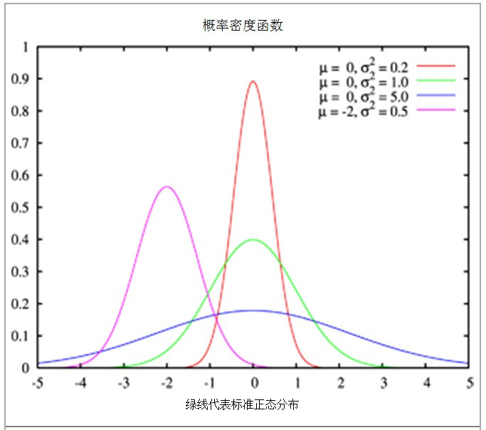

# 2.1. 数据操作

## 张量（tensor）
* 零阶张量为标量 （Scalar）如 0、1、2、3 等
* 一阶张量为向量 （Vector）如 [0,1]、[0,1,2]、[0,1,2,3] 等
* 二阶张量为矩阵 （Matrix）如 [[0,1],[0,1]]、[[0,1,2],[0,1,2],[0,1,2]] 等
* 三阶张量 如 [[[0,1],[0,1]],[[0,1],[0,1]]]
* 二阶以上的张量没有特殊的数学名称。

* 这里的维度不是数据的维度，而是指数据存储结构的维度(阶数)(我的理解是深度)

## 我的理解
* 0阶张量就是 0个数组
* 1阶张量就是 1个数组 数组元素个数和张量阶数无关
* 2阶张量就是 1个数组嵌套1个数组 就是2阶
* 3阶张量就是 1个数组嵌套1个数组再嵌套1个数组 就是3阶

## torch知识点汇总
* torch.arange(12)
* x.reshape(h,w)
* 。。。

# 2.1.1. torch入门


```python
import torch #导入机器学习库
x=torch.arange(12)#使用 arange 创建一个行向量
x
```


    tensor([ 0,  1,  2,  3,  4,  5,  6,  7,  8,  9, 10, 11])


```python
x=x.reshape(3,4)
x.shape #张量的shape属性来访问张量（沿每个轴的长度）的形状 。
```


    torch.Size([3, 4])


```python
x.numel() #张量中元素的总数
```


    12


```python
x.reshape(3,4) #改变一个张量的形状
```


    tensor([[ 0,  1,  2,  3],
            [ 4,  5,  6,  7],
            [ 8,  9, 10, 11]])


```python
#可以通过-1来调用此自动计算出维度的功能
#知道宽度后，高度会被自动计算得出
x.reshape(4,-1)
```


    tensor([[ 0,  1,  2],
            [ 3,  4,  5],
            [ 6,  7,  8],
            [ 9, 10, 11]])


```python
# 生成所有元素都初始化为0的张量
torch.zeros((2, 3, 4))
```


    tensor([[[0., 0., 0., 0.],
             [0., 0., 0., 0.],
             [0., 0., 0., 0.]],
    
            [[0., 0., 0., 0.],
             [0., 0., 0., 0.],
             [0., 0., 0., 0.]]])


```python
# 生成所有元素都初始化为1的张量
torch.ones((2, 3, 4))
```


    tensor([[[1., 1., 1., 1.],
             [1., 1., 1., 1.],
             [1., 1., 1., 1.]],
    
            [[1., 1., 1., 1.],
             [1., 1., 1., 1.],
             [1., 1., 1., 1.]]])


```python
# 生成所有元素都初始化为[均值为0、标准差为1的标准高斯分布]的张量
torch.randn((2, 3, 4))
```


    tensor([[[-0.4581, -0.6990,  0.8545, -0.5366],
             [-0.0118,  0.4723, -2.2845,  1.0469],
             [ 0.6131,  0.5386, -1.1553, -0.5951]],
    
            [[-0.0737,  0.8287, -1.2786,  1.3525],
             [-2.4166,  0.5448,  0.9710,  1.0138],
             [-1.4307, -0.2825, -1.5756, -1.6291]]])


# 关于上述高斯分布（正态分布）
* 均值为0、标准差为1的高斯分布是标准高斯分布
* 标准差σ决定了分布的幅度。其数值越大，高斯分布越均匀。
* 均值μ决定了高斯分布函数图像在x轴上的位置。是高斯分布的数学期望值。
* 标准高斯分布中99.7%数值分布在距离平均值有3个标准差之内即【-3，3】



```python
 # 用Python列表变量 初始化一个张量tensor
listA=[[1,2],[3,4],[5,6]]
torch.tensor(listA)
```


    tensor([[1, 2],
            [3, 4],
            [5, 6]])


# 2.1.2. torch运算符


```python
# 按元素运算
x=torch.tensor([[1,2],[3,4]])
y=torch.tensor([[1,2],[3,4]])

print(x)
print(y)

print()

print(x+y)
print(x-y)
print(x*y)
print(x/y)

print()

torch.exp(x)
```

    tensor([[1, 2],
            [3, 4]])
    tensor([[1, 2],
            [3, 4]])
    
    tensor([[2, 4],
            [6, 8]])
    tensor([[0, 0],
            [0, 0]])
    tensor([[ 1,  4],
            [ 9, 16]])
    tensor([[1., 1.],
            [1., 1.]])
    
    


    tensor([[ 2.7183,  7.3891],
            [20.0855, 54.5981]])


```python
# 多个张量连结（concatenate）在一起， 把它们端对端地叠起来形成一个更大的张量
X=torch.arange(12,dtype=torch.float32)
X=X.reshape(3,4)
print(X)

Y=torch.tensor([[9.0,8,7,6],[5,4,3,2],[1,1,0,0]])
print(Y)

Z=torch.cat((X,Y),dim=0)#需要提供张量列表，并给出沿哪个轴连结 dim应该是指维度 0就是↓轴 1就是→轴
print(Z)

Z=torch.cat((X,Y),dim=1)
print(Z)
```

    tensor([[ 0.,  1.,  2.,  3.],
            [ 4.,  5.,  6.,  7.],
            [ 8.,  9., 10., 11.]])
    tensor([[9., 8., 7., 6.],
            [5., 4., 3., 2.],
            [1., 1., 0., 0.]])
    tensor([[ 0.,  1.,  2.,  3.],
            [ 4.,  5.,  6.,  7.],
            [ 8.,  9., 10., 11.],
            [ 9.,  8.,  7.,  6.],
            [ 5.,  4.,  3.,  2.],
            [ 1.,  1.,  0.,  0.]])
    tensor([[ 0.,  1.,  2.,  3.,  9.,  8.,  7.,  6.],
            [ 4.,  5.,  6.,  7.,  5.,  4.,  3.,  2.],
            [ 8.,  9., 10., 11.,  1.,  1.,  0.,  0.]])
    


```python
#通过逻辑运算符构建二元张量
X=torch.tensor([1,2,3])
Y=torch.tensor([1,2,4])
Z= X==Y
Z
```


    tensor([ True,  True, False])


```python
# 对张量中的所有元素进行求和，会产生一个单元素张量。
X=torch.tensor([1,2,3])
Y=torch.tensor([1,2,4])
Z= X==Y

print(Z)
Z.sum()

```

    tensor([ True,  True, False])
    


    tensor(2)


# 2.1.3. 广播机制
* 广播机制（broadcasting mechanism）
* 是形状不同的张量按元素相加的一种机制
* 如
    + 3X1的张量与1X2的张量是无法直接按元素相加的
    + 广播机制会把3x1的张量转换为3X2的张量，转换方法为沿着数组中长度为1的轴进行广播（复制）
    + 把1x2的张量转换为3X2的张量
    + 此时他们都是3x2的张量了
* 2x3和4x6的张量按元素运算时如何广播？
    + 测试结果为运行报错提示：
    + 张量 a (3) 的大小必须与非单维张量 b (6) 的大小相匹配
    + RuntimeError: The size of tensor a (3) must match the size of tensor b (6) at non-singleton dimension 1


```python
#3X1的张量与1X2的张量是无法按元素相加的 广播机制会把3x1的张量转换为3X2的张量 把1x2的张量转换为3X2的张量 此时他们都是3x2的张量了
a=torch.arange(3).reshape(3,1)
b=torch.arange(2).reshape(1,2)

print(a)
print(b)

a+b 
```

    tensor([[0],
            [1],
            [2]])
    tensor([[0, 1]])
    


    tensor([[0, 1],
            [1, 2],
            [2, 3]])


```python
#测试广播机制 2x3 4x6
a=torch.arange(6).reshape(2,3)
b=torch.arange(24).reshape(4,6)

print(a)
print(b)

a+b
```

    tensor([[0, 1, 2],
            [3, 4, 5]])
    tensor([[ 0,  1,  2,  3,  4,  5],
            [ 6,  7,  8,  9, 10, 11],
            [12, 13, 14, 15, 16, 17],
            [18, 19, 20, 21, 22, 23]])
    


    ---------------------------------------------------------------------------

    RuntimeError                              Traceback (most recent call last)

    Input In [15], in <module>
          5 print(a)
          6 print(b)
    ----> 8 a+b
    

    RuntimeError: The size of tensor a (3) must match the size of tensor b (6) at non-singleton dimension 1


# 2.1.4. 索引和切片
* 张量中的元素可以通过索引访问。 
* 访问方法同Python数组相同：
    + 第一个元素的索引是0，
    + 最后一个元素索引是-1；
    + 用[-1]选择最后一个元素，
    + 用[1:3]选择第二个和第三个元素


```python
X=torch.arange(16).reshape(4,-1) #-1表示自动计算宽

print(X)

print()

print(X[0,0])#选中第一个元素
print(X[-1,-1])#选中最后一个元素

print()

print(X[:,:])#选中所有行和列
print(X[-1,:])#选中最后一行所有元素
print(X[:,-1])#选中最后一列所有元素

print()

print(X[1:3,1:])#选中一片区域 其中1:3表示[1,3) 【左闭右开的区间】
                #             其中1: 表示[1,最后]

print()

print(X[::3,::3])#选中分布在四个角落的四个元素 其中::3表示从0开始隔3元素选1元素
```

# 2.1.5. 节省内存（原地操作）
* Y = X + Y 
* Python首先计算Y + X，为结果分配新的内存，然后使Y指向内存中的这个新位置


```python
a=1
b=2
beforeId=id(a)
a=a+b
currentId=id(a)

print(beforeId==currentId)
```


```python
X = torch.arange(16).reshape(4,-1)
Y = torch.zeros_like(X) #初始化一个形状与X相同值为0的张量

beforeId=id(Y)
Y += Y + X #原地操作
Y[:] = Y+X #原地操作
currentId=id(Y)

print(beforeId==currentId)
```

# 2.1.6. 转换为其他Python对象


```python
import torch #torch深度学习库
import numpy #numpy深度学习库

X=torch.tensor([1,2])

B=X.numpy() #torch类型张量转换为numpy类型张量
A=torch.tensor(B) #numpy类型张量转换为torch类型张量

print(A)
print(B)

print(type(A))
print(type(B))

```


```python
#将大小为1的张量转换为Python标量
X=torch.tensor([1.5])

print(X)
print(X.item()) # 调用item函数
print(float(X)) # 调用Python的内置函数
print(int(X))

```

    tensor([1.5000])
    1.5
    1.5
    1
    

# 2.1.7. 小结
* 深度学习存储和操作数据的主要接口是张量（ n 维数组）。
* 它提供了各种功能，
* 包括基本数学运算、广播、索引、切片、内存节省和转换其他Python对象。

# 2.1.8. 练习
* 运行本节中的代码。将本节中的条件语句X == Y更改为X < Y或X > Y，然后看看你可以得到什么样的张量。
* 用其他形状（例如三维张量）替换广播机制中按元素操作的两个张量。结果是否与预期相同？


```python
#练习1
A=torch.arange(12).reshape(3,-1)
B=torch.arange(12).reshape(3,-1)

print(A==B)

B[:]=1
print(A==B)
print(A>B)
```

    tensor([[True, True, True, True],
            [True, True, True, True],
            [True, True, True, True]])
    tensor([[False,  True, False, False],
            [False, False, False, False],
            [False, False, False, False]])
    tensor([[False, False,  True,  True],
            [ True,  True,  True,  True],
            [ True,  True,  True,  True]])
    


```python
# 一层加两层的广播机制测试
A=torch.arange(6).reshape(1,2,3) # 一层 两行 三列
B=torch.arange(12).reshape(2,2,3)# 两层 两行 三列

print(A)
print()
print(B)
print()
print(A+B)

```

    tensor([[[0, 1, 2],
             [3, 4, 5]]])
    
    tensor([[[ 0,  1,  2],
             [ 3,  4,  5]],
    
            [[ 6,  7,  8],
             [ 9, 10, 11]]])
    
    tensor([[[ 0,  2,  4],
             [ 6,  8, 10]],
    
            [[ 6,  8, 10],
             [12, 14, 16]]])
    


```python
# 两层加三层的广播机制测试（按照预期报错）
A=torch.arange(12).reshape(2,2,3) # 两层 两行 三列
B=torch.arange(18).reshape(3,2,3)# 三层 两行 三列

print(A)
print()
print(B)
print()
print(A+B)
```

    tensor([[[ 0,  1,  2],
             [ 3,  4,  5]],
    
            [[ 6,  7,  8],
             [ 9, 10, 11]]])
    
    tensor([[[ 0,  1,  2],
             [ 3,  4,  5]],
    
            [[ 6,  7,  8],
             [ 9, 10, 11]],
    
            [[12, 13, 14],
             [15, 16, 17]]])
    
    


    ---------------------------------------------------------------------------

    RuntimeError                              Traceback (most recent call last)

    Input In [43], in <module>
          7 print(B)
          8 print()
    ----> 9 print(A+B)
    

    RuntimeError: The size of tensor a (2) must match the size of tensor b (3) at non-singleton dimension 0

